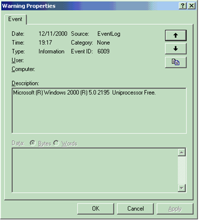
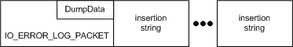

# Writing to the System Event Log

Errors are specified by their NTSTATUS value. The system predefines particular NTSTATUS values that can be used by drivers, and driver writers can define additional errors. Note that only certain NTSTATUS values can be used when logging errors.

Each NTSTATUS value that can be used when logging errors has an associated error message. For example, the parallel port driver uses the NTSTATUS value PAR\_INTERRUPT\_CONFLICT to represent hardware interrupt conflicts, with message text "Interrupt conflict detected for %1".

The Event Viewer displays the message text in the **Description** text box on the log entry's property sheet. If the message text string contains "%1", the Event Viewer replaces it with the name of the device that logged the entry. The message text can contain additional parameters of the form "%2", "%3", and so on. When the driver logs the error, it can provide string values for those parameters. These string values are known as *insertion strings*. The Event Viewer will automatically insert them in place of the percent values.

The driver can also include binary data in the log entry, known as *dump data*. The Event Viewer displays the dump data in the **Data** text box of the log entry's property sheet.

You can bring up the property sheet for a log entry by double-clicking the entry in the Event Viewer. The following screen shot shows a sample log entry property sheet.

Drivers use the [**IoAllocateErrorLogEntry**](https://msdn.microsoft.com/library/windows/hardware/ff548245) routine to allocate an error log entry. Log entries consist of a variable-length [**IO\_ERROR\_LOG\_PACKET**](https://msdn.microsoft.com/library/windows/hardware/ff550571) header, followed by insertion strings.

The following diagram shows the layout of an error log entry in memory.

The **ErrorCode** member of **IO\_ERROR\_LOG\_PACKET** specifies the NTSTATUS value of the error. The **DumpData** member specifies any dump data for the log entry. **DumpData** is a variable-sized array, whose size is specified by the **DumpDataSize** member. Drivers specify the beginning of the first insertion string with the **StringOffset** member, and the number of strings in the **NumberOfStrings** member. Each insertion string itself is a null-terminated Unicode string.

Once the driver fills out the allocated error log entry, it writes the entry to the error log by using [**IoWriteErrorLogEntry**](https://msdn.microsoft.com/library/windows/hardware/ff550527). **IoWriteErrorLogEntry** automatically frees the memory allocated for the log entry. Drivers can use [**IoFreeErrorLogEntry**](https://msdn.microsoft.com/library/windows/hardware/ff549107) to free any unused log entries.

Predefined error codes (of the form IO\_ERR\_*XXX*) are defined in the ntiologc.h header file that is included with the Windows Driver Kit (WDK). The error message associated with each error code can be found in the comments for ntiologc.h, next to the error code's declaration. To use a predefined error code, the driver must register the system file, iologmsg.dll, as the source of the associated error messages. For further information, see [Registering as a Source of Error Messages](registering-as-a-source-of-error-messages.md).

Drivers can also define their own custom error types, and associated error messages. For further information, see [Defining Custom Error Types](defining-custom-error-types.md).

 

 

