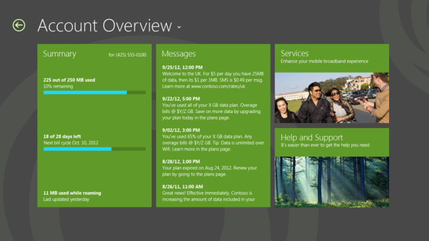

# Account management

After users have purchased a subscription, they can perform following tasks:

-   **View current data usage** Users can view their current data usage and understand their billing cycle (or session end date) to make an appropriate decision on their data usage.

-   **Manage account settings** Users can view and securely manage their payment and account details (such as password, email address, and automatic payment information).

-   **Pay a bill** Users can pay their recurring or one-time bill by using your UWP app.

Account management functionality presents a subscriber’s relationship with an operator. You can use this to create a branded experience that can distinguish your service from competitors’ services.

Design considerations include the following:

-   **Make data usage a combination of local and back-end information** To reduce the load on the back-end servers as much as possible, Windows provides a local Data Usage API that you can use to combine back-end data usage. You can periodically get the usage information from the back-end and correlate that with local data usage.

-   **Periodically update Windows with data usage** Windows 10 is designed to behave intelligently on metered networks. This can save significant network capacity because Windows and UWP apps can use your mobile broadband network for essential traffic. To be more accurate and to include more information for applications (for example, data limits and usage), Windows relies on you to periodically provide correct information. Your app can set this information by using Data Usage APIs.

    

## Related topics

[Mobile broadband app scenarios](mobile-broadband-app-scenarios.md)

 

 

