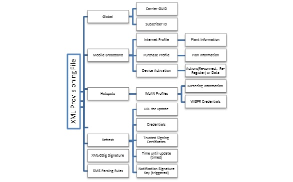

# Account provisioning


Provisioning refers to configuring a Windows computer with the information that is required to connect to an operator network. Provisioning is usually performed after a mobile broadband subscription purchase. Windows accepts an XML-based provisioning file from the operator. The Provisioning API applies a provisioning XML file from the operator, either by using a mobile broadband app or through a purchase web site.

The following diagram illustrates the contents and hierarchy of the provisioning XML file.



For more info about the provisioning schema, see [CarrierControlSchema schema](https://msdn.microsoft.com/library/windows/apps/hh868312).

## <span id="Updating_the_provisioning_metadata"></span><span id="updating_the_provisioning_metadata"></span><span id="UPDATING_THE_PROVISIONING_METADATA"></span>Updating the provisioning metadata

There are several ways you can update the provisioning metadata on a computer.

### <span id="Mobile_broadband_app"></span><span id="mobile_broadband_app"></span><span id="MOBILE_BROADBAND_APP"></span>Mobile broadband app

After the mobile broadband app is installed on the computer, it can retrieve or generate an updated provisioning file based on any trigger that you implement in the app.

Mobile broadband apps can apply provisioning files by using the [**Windows.Networking.NetworkOperator.ProvisioningAgent**](https://msdn.microsoft.com/library/windows/apps/br207397) APIs. If the app is associated with a Network Account ID, it can use [**CreateFromNetworkAccountId**](https://msdn.microsoft.com/library/windows/apps/br207398) to provide unsigned metadata. If the app is not associated with a Network Account ID, it must use the default constructor for **ProvisioningAgent** and sign the XML.

A mobile broadband app can use the following triggers to update the provisioning metadata:

-   **Usage** After the data limit is initially configured, you can tell Windows to notify the app at every 5% usage increment. This ensures that the app retrieves the most up-to-date usage information.

-   **Timers** A timer can update the provisioning metadata at appropriate time intervals.

-   **Incoming SMS** You can send SMS messages that your app understands. This might define a message that initiates a refresh, or automatically checks for updated usage upon receiving a threshold notification.

-   **Windows Notification Service** Any UWP app can register for push notifications and take actions based on their content. You can use this as a notification channel for provisioning updates.

-   **Large location changes** If different parameters apply to users who are in different locales, a change in location might trigger an app to apply updated settings for the user’s new location.

-   **Time zone changes** For large region sizes, a change in the system time zone can be used as a proxy for location changes. This can be of particular interest on computers that do not have GPS or Mobile Broadband.

### <span id="Web-based_provisioning"></span><span id="web-based_provisioning"></span><span id="WEB-BASED_PROVISIONING"></span>Web-based provisioning

A web site can supply provisioning data by using the [**window.external.msProvisionNetworks**](https://msdn.microsoft.com/library/hh848316) API. Provisioning files that are supplied to this API must be signed by using an X.509 certificate and XML-DSig.

Certificates can be pre-supplied to the computer by using the APN database, service metadata, or a previous account provisioning metadata file. If the certificate is already trusted, there is no user interaction. If the certificate is not previously known to the computer, it must be an EV certificate, and the user is prompted for consent before the certificate is accepted.

### <span id="Automatic_provisioning_refresh"></span><span id="automatic_provisioning_refresh"></span><span id="AUTOMATIC_PROVISIONING_REFRESH"></span>Automatic provisioning refresh

A provisioning file can include a directive for Windows to automatically retrieve an updated provisioning file at a scheduled interval or in response to a specific SMS message. This method does not require that a mobile broadband app be installed on the local computer.

## <span id="apmdcon"></span><span id="APMDCON"></span>Provisioning metadata contents


The provisioning metadata includes the following sections:

-   [Global](#global)

-   [Activation](#activation)

-   [Mobile broadband information](#mobile-broadband-information)

-   [Wi-Fi information](#wi-fi-information)

-   [Plan information](#plan-information)

-   [Refresh](#refresh)

-   [Signature](#signature)

-   [Permitted combinations](#permitted-combinations)

For more info about these sections, see [CarrierControlSchema schema](https://msdn.microsoft.com/library/windows/apps/hh868312).

### Global

The global section is required in every provisioning file. Required elements in this section are as follows:

- [**CarrierId**](https://msdn.microsoft.com/library/windows/apps/hh868288) A GUID that uniquely identifies the organization that authored the file. If you are building a mobile broadband app, you must use the GUID that you specified in the [Service Number](https://msdn.microsoft.com/library/windows/hardware/dn236413) field of **ServiceInfo.xml** in the service metadata package. For info about the service metadata package schema, see [Service metadata package schema reference](service-metadata-package-schema-reference.md).

  > [!NOTE]
  > This is the same service number that you provided in the **Create a mobile broadband experience wizard** on the Windows Dev Center Dashboard – Hardware.
  > If you are not creating a mobile broadband app, you can generate a GUID for your organization’s use. In either case, you should always use the same GUID on all provisioning files that your organization issues.

- [**SubscriberId**](https://msdn.microsoft.com/library/windows/apps/hh868305) A string that uniquely identifies the customer in your organization. If you are a mobile operator, this should be the IMSI or ICCID ranges for GSM operators or the provider ID or provider name for CDMA operators. If you are not a mobile operator, you can choose any sufficiently unique string.

### Activation

Device activation occurs after the activation process is complete on the back end. The PC might need to follow certain instructions before connecting to the network. The provisioning engine uses the activation instructions received in the device activation element. If no value is specified, then no client action is required. Available actions include:

-   **Re-connect** Disconnect and connect to the operator network.

    **Re-register** Disconnect and register to the operator network.

-   **Data** Data or instructions that you want to send to the device to activate the connection. The Provisioning Engine passes this data as is to the device. For CDMA, this can include instructions such as **\*228** to start an OTA Programming Session and reconnect to the network.

### Mobile broadband information

Mobile broadband information contains several elements:

[**MBNProfiles**](https://msdn.microsoft.com/library/windows/apps/hh868295)

Defines subscriber information on the mobile operator network. There are two different profiles that can be used:

-   [**PurchaseProfile**](https://msdn.microsoft.com/library/windows/apps/hh868301): Information that is needed to connect to the operator’s network to purchase a new subscription.

-   [**DefaultProfile**](https://msdn.microsoft.com/library/windows/apps/hh868290) Every mobile broadband subscription can have one default profile that is used to connect to the home network operator. Windows Connection Manager uses this profile for auto-connecting to the network.

    ```xml
    <MBNProfiles>
        <DefaultProfile xmlns="http://www.microsoft.com/networking/CarrierControl/WWAN/v1">
          <Name>Contoso MBN</Name>
          <Description>Contoso Mobile Broadband</Description>
          <HomeProviderName>Contoso MBN</HomeProviderName>
          <Context>
            <AccessString>contoso.com</AccessString>
            <UserLogonCred>
              <UserName>mbuser</UserName>
              <Password>mbpass</Password>
            </UserLogonCred>
          </Context>
        </DefaultProfile>
      </MBNProfiles>
    ```

[**Branding**](https://msdn.microsoft.com/library/windows/apps/hh868446)

> [!IMPORTANT]
> Starting in Windows 10, version 1709, branding fields provisioned by the ProvisioningAgent API have been replaced by branding fields in the COSA database. **Logo** has been replaced by **Branding Icon** in COSA, and **Name** has been replaced by **Branding Name** in COSA.
>
> **Logo** and **Name** will no longer be considered when provisioning in Windows 10, version 1709 and later. The ProvisioningAgent API will not throw an error if they are used, but you should change **Branding Icon** and **Branding Name** in COSA instead.  
>
> For more information about **Branding Icon** and **Branding Name**, see [Desktop COSA/APN database settings (Desktop COSA only settings)](desktop-cosa-apn-database-settings.md#desktop-cosa-only-settings).

Branding lets you specify how Windows displays your mobile broadband networks. This information overrides any service metadata, if present. If no information is provided, the contents of the service metadata package are used. The branding elements are as follows:

-   [**Logo**](https://msdn.microsoft.com/library/windows/apps/hh868460) A Base64-encoded .PNG or.BMP file that is embedded in the XML. This logo is applied to your mobile broadband profiles for display in the Network List.

-   [**Name**](https://msdn.microsoft.com/library/windows/apps/hh868463) Sets the carrier’s display name for the mobile broadband profiles.

**SMS Parsing**

You can provision the rules to identify a text message and extract information as part of the provisioning XML file. You can use SMS messages to update data usage statistics or to initiate a refresh of provisioning information. These messages can be identified by a combination of the following:

-   Bearer type (SMS/USSD)

-   Sender (SMS only)

-   Regular expression

For more information on SMS notifications, see [Enabling mobile operator notifications and system events](enabling-mobile-operator-notifications-and-system-events.md).

Each rule contains the following information:

- **Silent** If this value is true, the message results in a [MobileOperatorNotification](mobile-operator-notification-event-technical-details.md) event only. If this value is false, the message results in an **SmsMessageReceived** event.

- **Allowed sender** Specifies the reserved sender address from which the notification is permitted to arrive. This number must exactly match the sender number that is received in the SMS message, including the international format.

- **Pattern** The regular expression to identify and optionally extract data fields from the text message. This pattern will match all messages from a sender: `[^]*`

- **RuleId** An identifier for this rule, which is passed to the mobile broadband app as part of the [MobileOperatorNotification](mobile-operator-notification-event-technical-details.md) event. This identifier enables the app to know which rule caused the SMS to trigger a MobileOperatorNotification event, and can reduce the app’s need to parse the message again.

- **Fields and groups** Each capturing group in the regular expression pattern is tied to a named field. This is used to extract and transform the data into a set of usable values. For example, the first match-group can be tied to the **Usage** field and the second match-group can be tied to the **UsageDataLimit** field. This association indicates that the first value is the current usage information, and the second value is the maximum allowed usage.

  - **Usage, UsagePercentage, UsageOverage, UsageOveragePercentage**: Expresses the current usage as an absolute number, as a percentage of the data limit, as a number in excess of the data limit, or as a percentage in excess of the data limit. Absolute values can reference a group that specifies the unit in which the value is expressed.

  - **UsageTimestamp**: The date and time at which the usage field is calculated. This information must be included if any **Usage\\*** field is included. The format string contains the following identifiers to express how the substring should be interpreted:

    <table>
    <colgroup>
    <col width="50%" />
    <col width="50%" />
    </colgroup>
    <thead>
    <tr class="header">
    <th>Identifier</th>
    <th>Description</th>
    </tr>
    </thead>
    <tbody>
    <tr class="odd">
    <td><p>%d</p></td>
    <td><p>Day of month as decimal number (01 – 31)</p></td>
    </tr>
    <tr class="even">
    <td><p>%H</p></td>
    <td><p>Hour in 24-hour format (00 – 23)</p></td>
    </tr>
    <tr class="odd">
    <td><p>%I</p></td>
    <td><p>Hour in 12-hour format (01 – 12)</p></td>
    </tr>
    <tr class="even">
    <td><p>%m</p></td>
    <td><p>Month as decimal number (01 – 12)</p></td>
    </tr>
    <tr class="odd">
    <td><p>%M</p></td>
    <td><p>Minute as decimal number (00 – 59)</p></td>
    </tr>
    <tr class="even">
    <td><p>%S</p></td>
    <td><p>Second as decimal number (00 – 59)</p></td>
    </tr>
    <tr class="odd">
    <td><p>%y</p></td>
    <td><p>Year without century, as decimal number (00 – 99)</p></td>
    </tr>
    <tr class="even">
    <td><p>%Y</p></td>
    <td><p>Year with century, as decimal number (0000-9999)</p></td>
    </tr>
    <tr class="odd">
    <td><p>%p</p></td>
    <td><p>AM/PM indicator</p></td>
    </tr>
    <tr class="even">
    <td><p>%#d, %#H, %#I, %#m, %#M, %#S, %#y, %#Y</p></td>
    <td><p>Same as above but with no leading zeros</p></td>
    </tr>
    </tbody>
    </table>

         

  - **DataLimit**: The absolute number of bytes that the user is allowed to use; this includes a group that specifies the unit in which the value is expressed.

  - **OverDataLimit, Congested**: Modifies flags that are reported to apps to indicate that the user has exceeded their data limit or that the network is under heavy load.

  - **InboundBandwidth, OutboundBandwidth**: If a maximum bandwidth is being imposed by the network, this specifies the groups that represent the value and the units.

  - **PlanType**: Specifies how the user is charged for future usage.

**Caution**  
Because SMS messages influence Windows behavior, only trusted SMS messages can be consumed. Security is maintained by restricting the sender address. This security method assumes that your network’s SMS Gateway ensures that messages from restricted senders cannot be spoofed.

 

### Wi-Fi information

This section lets you provide any number of Wi-Fi network profiles for Windows to use. The format of the section is similar to the XML schema that is used by the Windows native WLAN API.

**Note**  
One profile can contain multiple SSIDs, if all other settings are the same. If different networks vary in other ways (authentication method, encryption settings, plan, and so on), you must create additional profiles.

 

When you specify the WLAN section, you must also specify all profiles that should be configured on the computer. If those profiles reference a data plan, the plans section must also be included. The behavior that occurs when this section is processed is as follows:

-   If the computer has a profile that is no longer specified, it is deleted.

-   If you specify a profile, it is updated or created.

-   An empty WLAN section deletes all profiles.

-   Omitting the WLAN section leaves the WLAN profiles on the machine unchanged.

An additional node in this section is the associated plan. This node enables Windows to associate the WLAN profile with a plan that is described in the plans section. The plan lets you inform Windows of the metering state of the network and influence the behavior of Windows during the time that the computer is connected to the network.

**Unencrypted network, no automatic authentication**

This profile configures Windows to connect to an open network.

-   If this network contains a captive portal, the browser is opened upon connection to the network.

-   If the network does not contain a captive portal, the user is connected with no further action.

``` syntax
<WLANProfile xmlns="http://www.microsoft.com/networking/CarrierControl/WLAN/v1">
  <name>Contoso Wi-Fi</name>
  <SSIDConfig>
    <SSID>
      <name>Contoso Wi-Fi</name>
    </SSID>
  </SSIDConfig>
  <MSM>
    <security>
      <authEncryption>
        <authentication>open</authentication>
        <encryption>none</encryption>
        <useOneX>false</useOneX>
      </authEncryption>
    </security>
  </MSM>
</WLANProfile>
```

**Unencrypted network, WISPr authentication**

This profile configures Windows to connect to an open network and uses Wireless Internet Service Provider roaming (WISPr) authentication:

-   If the network contains a WISPr-capable captive portal, the specified user name and password is submitted to the specified authentication server.

-   If the captive portal is not capable of WISPr, the browser is opened upon connection to the network.

-   If the network does not contain a captive portal, the user is connected with no further action.

``` syntax
<WLANProfile xmlns="http://www.microsoft.com/networking/CarrierControl/WLAN/v1">
  <name>Contoso Wi-Fi</name>
  <SSIDConfig>
    <SSID>
      <name>Contoso Wi-Fi</name>
    </SSID>
  </SSIDConfig>
  <MSM>
    <security>
      <authEncryption>
        <authentication>open</authentication>
        <encryption>none</encryption>
        <useOneX>false</useOneX>
      </authEncryption>
      <HotspotProfile xmlns="http://www.microsoft.com/networking/WLAN/HotspotProfile/v1">
        <UserName>WisprUser1</UserName>
        <Password>password1</Password>
        <TrustedDomains>
          <TrustedDomain>www.contosoportal.com</TrustedDomain>
        </TrustedDomains>
      </HotspotProfile>
    </security>
  </MSM>
</WLANProfile>
```

**Encrypted network, EAP-SIM authentication**

This profile configures Windows to connect to an encrypted network by using a SIM as the authentication type, such as a Hotspot 2.0 network. Hotspot 2.0 defines such a network to use WPA2-Enterprise with EAP-SIM authentication.

``` syntax
<WLANProfile xmlns="http://www.microsoft.com/networking/CarrierControl/WLAN/v1">
  <name>Contoso Wi-Fi</name>
  <SSIDConfig>
    <SSID>
      <name>Contoso Wi-Fi</name>
    </SSID>
  </SSIDConfig>
  <MSM>
    <security>
      <authEncryption>
        <authentication>WPA2</authentication>
        <encryption>AES</encryption>
        <useOneX>true</useOneX>
      </authEncryption>
      <OneX xmlns="http://www.microsoft.com/networking/OneX/v1">
        <EAcomputeronfig>
          <!-- The config XML for all EA methods can be found at: https://msdn.microsoft.com/library/cc232996(v=prot.10).aspx -->
          <EapHostConfig xmlns="http://www.microsoft.com/provisioning/EapHostConfig">
            <EapMethod>
              <Type>18</Type>
              <VendorId>0</VendorId>
              <VendorType>0</VendorType>
              <AuthorId>311</AuthorId>
            </EapMethod>
            <Config xmlns="http://www.microsoft.com/provisioning/EapHostConfig">
              <EapSim xmlns="http://www.microsoft.com/provisioning/EapSimConnectionPropertiesV1">
                <Realm Enabled="true"></Realm>
              </EapSim>
            </Config>
          </EapHostConfig>
        </EAcomputeronfig>
      </OneX>
    </security>
  </MSM>
</WLANProfile>
```

**Unencrypted network, app-based authentication**

This profile configures Windows to connect to an open network and use WISPr authentication in cooperation with your mobile broadband app.

-   If the network contains a captive portal, your app is opened in the background to provide WISPr credentials. The credentials are then submitted to the specified authentication server.

-   If the captive portal is not capable of WISPr, the browser is opened upon connection to the network.

-   If the network does not contain a captive portal, the user is connected with no further action.

``` syntax
<WLANProfile xmlns="http://www.microsoft.com/networking/CarrierControl/WLAN/v1">
  <name>Contoso WiFi</name>
  <SSIDConfig>
    <SSID>
      <name>Contoso Wi-Fi</name>
    </SSID>
  </SSIDConfig>
  <MSM>
    <security>
      <authEncryption>
        <authentication>open</authentication>
        <encryption>none</encryption>
        <useOneX>false</useOneX>
      </authEncryption>
      <HotspotProfile xmlns="http://www.microsoft.com/networking/WLAN/HotspotProfile/v1">
        <ExtAuth>
          <ExtensionId>YourAppIdGoesHere</ExtensionId>
        </ExtAuth>
        <TrustedDomains>
          <TrustedDomain>www.contosoportal.com</TrustedDomain>
        </TrustedDomains>
      </HotspotProfile>
    </security>
  </MSM>
</WLANProfile>
```

### Plan information

Each mobile broadband and hotspot profile references a plan. Multiple profiles can reference the same plan. Plans are described in a separate top-level section.

The Plan is divided into two sections—*Description* and *Usage*. This allows you to initially provide profiles and descriptions in a larger provisioning file, and then subsequently provide smaller provisioning files that contain only the customer’s current usage.

This information is used to directly affect the behavior of Windows, and is provided to applications to tailor their behavior to the network. This information can be made available to third-party applications through network information APIs.

### Description

The elements that generally change with low frequency over a customer’s subscription period, including:

-   [**PlanType**](https://msdn.microsoft.com/library/windows/apps/hh868468) The type of billing relationship the customer has with the operator:

    -   **Unrestricted** Usage does not incur additional cost.

    -   **Fixed** The user is allotted a certain amount of usage for a fixed cost.

    -   **Variable** The user pays based on usage.

-   [**SecurityUpdatesExempt**](https://msdn.microsoft.com/library/windows/apps/hh868374) A Boolean value that specifies whether security updates count toward the customer’s usage.

-   [**DataLimitInMegabytes**](https://msdn.microsoft.com/library/windows/apps/hh868367) The user’s allotted usage, if [**PlanType**](https://msdn.microsoft.com/library/windows/apps/hh868468) is **Fixed**.

-   [**BillingCycle**](https://msdn.microsoft.com/library/windows/apps/hh868366) Defines the plan's starting date and time, its duration, and what happens at the end of the billing cycle.

-   [**BandwidthInKbps**](https://msdn.microsoft.com/library/windows/apps/hh868343) The user’s connection speed as allowed by the network; this can reflect the norm for their plan, or reflect a lower rate that is currently imposed by the carrier due to congestion or excessive use (maximum of 2 Gbps).

-   [**MaxTransferSizeInMegabytes**](https://msdn.microsoft.com/library/windows/apps/hh868371) An integer that expresses the size of an individual download that a compliant application should permit over a metered connection, without explicit user approval of the connection being used.

-   [**UserSMSEnabled**](https://msdn.microsoft.com/library/windows/apps/hh868376) Indicates whether the plan includes user-to-user SMS support. If true, Windows will keep the device attached to the network in Connected Standby even when the mobile broadband interface is not being used. If false, Windows can power down the mobile broadband interface to conserve power, thereby resulting in the device not being addressable by the network when the computer is idle.

### Usage

The following elements can change with higher frequency:

-   [**UsageInMegabytes**](https://msdn.microsoft.com/library/windows/apps/hh868350) The user’s most recent data usage.

-   [**OverDataLimit**](https://msdn.microsoft.com/library/windows/apps/hh868465) A Boolean value that indicates whether the user has passed the allotted usage, if [**PlanType**](https://msdn.microsoft.com/library/windows/apps/hh868468) is **Fixed**.

-   [**Congested**](https://msdn.microsoft.com/library/windows/apps/hh868449) A Boolean value that indicates whether a lower connection speed than usual is being imposed due to excessive usage. The Congested flag indicates that the network is currently experiencing (or expects to experience) heavy load, and lower-priority transfers should be deferred until another time, if possible. You can use this flag to indicate concepts such as peak hours, or to respond to an overloaded hotspot.

### Refresh

You can push updated settings to the computer as required because of network changes or for technical support. Windows attempts periodic refreshes by using information that is provided by you or by the provisioning API. A refresh can be triggered by SMS notifications from the operator. To enable Refresh, you must provide the following information in the provisioning XML:

-   [**TrustedCertificates**](https://msdn.microsoft.com/library/windows/apps/hh868307) A list of certificate thumbprints that have trusted signatures on future provisioning files.

-   [**DelayInDays**](https://msdn.microsoft.com/library/windows/apps/hh868291) The (integer) number of days before which a refresh is not attempted.

-   [**RefreshURL**](https://msdn.microsoft.com/library/windows/apps/hh868303) The HTTPS URL to get the latest copy of the user’s provisioning file.

-   [**UserName**](https://msdn.microsoft.com/library/windows/apps/hh868308) & [**Password**](https://msdn.microsoft.com/library/windows/apps/hh868297) Optional credentials that are to be presented by using HTTP-Auth when retrieving the re-provisioning file. This information must be encrypted when stored.

-   

Alternatively, the mobile broadband app can provide a new provisioning file at any time, based on communication between the app and the operator’s backend.

``` syntax
<RefreshParameters>
      <DelayInDays>30</DelayInDays>
      <RefreshURL>https://www.contoso.com/refresh</RefreshURL>
      <Username>foo</Username>
      <Password>bar</Password>
    </RefreshParameters>
```

### Signature

Because provisioning modifies system settings that persist after the user has exited or uninstalled the app, a stricter measure of verification is required than for most APIs. This verification is provided by a combination of operator-specific hardware (the SIM), cryptographic signatures, and user confirmation.

Provisioning requirements:

<table>
<colgroup>
<col width="25%" />
<col width="25%" />
<col width="25%" />
<col width="25%" />
</colgroup>
<thead>
<tr class="header">
<th>SIM present?</th>
<th>Source of provisioning</th>
<th>Signature requirement</th>
<th>User confirmation requirement</th>
</tr>
</thead>
<tbody>
<tr class="odd">
<td><p>Yes, MB provider</p></td>
<td><p>Mobile broadband app</p></td>
<td><p>None</p></td>
<td><p>None</p></td>
</tr>
<tr class="even">
<td><p>Yes, MB provider</p></td>
<td><p>Operator web site</p></td>
<td><p>Certificate must:</p>
<ul>
<li><p>Chain back to trusted root CA..</p></li>
<li><p>Be associated with mobile broadband hardware in APN database or experience metadata.</p></li>
</ul></td>
<td><p>None</p></td>
</tr>
<tr class="odd">
<td><p>No, Wi-Fi provider</p></td>
<td><p>Mobile broadband appor web site</p></td>
<td><p>Certificate must:</p>
<ul>
<li><p>Chain back to trusted root CA.</p></li>
<li><p>Be marked for Extended Validation.</p></li>
</ul></td>
<td><p>User is prompted to confirm the first time the certificate is used; no confirmation is required thereafter.</p></td>
</tr>
</tbody>
</table>

 

### Permitted combinations

Although [**Global**](https://msdn.microsoft.com/library/windows/apps/hh868294) is the only first-level node that is required by the schema, certain combinations of other nodes are typical. This section discusses these typical combinations:

-   **Profiles (WLANProfiles, MBNProfiles) + Plans including Description and Usage** Creates or updates the full set of profiles, and applies plan information and current usage to each. An error is returned if a profile references a Plan that is not specified in the same provisioning file, and a warning is returned if no profile in the provisioning file references a specified Plan.

-   **Plans including Description and (optionally) Usage** Updates Plan information for existing profiles on the computer, but does not modify the profiles on the computer. A warning is returned if no profile on the computer references a specified Plan.

-   **Plans including Usage only** Updates usage information in existing profiles on the computer, but does not modify the profiles or the description of the Plan that is associated with each profile.

## <span id="Common_Scenarios"></span><span id="common_scenarios"></span><span id="COMMON_SCENARIOS"></span>Common Scenarios


Here are some common scenarios that you may need as you create provisioning metadata:

-   [Find the account provisioning schema](#find-the-account-provisioning-schema)

-   [Apply provisioning XML to the device](#apply-provisioning-xml-to-the-device)

-   [Provision the device to connect automatically to a mobile broadband network](#provision-the-device-to-connect-automatically-to-a-mobile-broadband-network)

-   [Provision the device to connect automatically to a Wi-Fi network](#provision-the-device-to-connect-automatically-to-a-wi-fi-network)

-   [Provision the device to connect automatically to a WISPr-enabled hotspot](#provision-the-device-to-connect-automatically-to-a-wispr-enabled-hotspot)

-   [Sending activation to the mobile broadband device](#sending-activation-to-the-mobile-broadband-device)

-   [Force the mobile broadband device to reconnect to the network after provisioning completes](#force-the-mobile-broadband-device-to-reconnect-to-the-network-after-provisioning-completes)

-   [Updating data usage statistics for a connection profile](#updating-data-usage-statistics-for-a-connection-profile)

-   [Update data usage by using an SMS message](#update-data-usage-by-using-an-sms-message)

### Find the account provisioning schema

XSD schemas are available under **%SYSTEMROOT%\\schemas\\provisioning** on any computer that is running Windows 8, Windows 8.1, or Windows 10.

### Apply provisioning XML to the device

You can apply a provisioning XML file to a device by using a mobile broadband app, a UWP app, or from a web site.

To provision from a mobile broadband app:

1.  Instantiate a [**ProvisioningAgent**](https://msdn.microsoft.com/library/windows/apps/br207397) instance (by using [**Windows.Networking.NetworkOperators.ProvisioningAgent.CreateFromNetworkAccountId**](https://msdn.microsoft.com/library/windows/apps/br207398)).

2.  Call [**ProvisionFromXmlDocumentAsync**](https://msdn.microsoft.com/library/windows/apps/br207400), passing in the unsigned provisioning XML document.

The asynchronous operation complete and the results of the provisioning operation are returned.

To provision from a UWP app other than the mobile broadband app:

1.  Generate a signed Account Provisioning XML document.

2.  Instantiate a [**ProvisioningAgent**](https://msdn.microsoft.com/library/windows/apps/br207397) instance (by using the default constructor).

3.  Call [**ProvisionFromXmlDocumentAsync**](https://msdn.microsoft.com/library/windows/apps/br207400), passing in the signed XML document.

The asynchronous operation completes and the results of the provisioning operation are returned.

From a web site:

1.  Generate a signed Account Provisioning XML document.

2.  Call [**window.external.msProvisionNetworks**](https://msdn.microsoft.com/library/hh848316), passing in the signed XML document.

The operation completes and the results of the provisioning operation are returned.

### Provision the device to connect automatically to a mobile broadband network

You can define a provisioning XML document by using an **MBNProfile** section.

``` syntax
<?xml version="1.0"?>
<CarrierProvisioning xmlns="http://www.microsoft.com/networking/CarrierControl/v1">
    <Global>
        <CarrierId>{00000000-1111-2222-3333-444444444444}</CarrierId>
        <SubscriberId>1234567890</SubscriberId>
    </Global>
    <MBNProfiles>
      <DefaultProfile xmlns="http://www.microsoft.com/networking/CarrierControl/WWAN/v1">
          <Name>Profile Name</Name>
          <Description>The Description</Description>
          <HomeProviderName>Contoso</HomeProviderName>
          <Context>
              <AccessString>apn</AccessString>
              <UserLogonCred>
                  <UserName>username</UserName>
                  <Password>password</Password>
              </UserLogonCred>
          </Context>
      </DefaultProfile>
    </MBNProfiles>
</CarrierProvisioning>
```

**Note**  
The child elements of **DefaultProfile** are required. See the provisioning XML schema reference for more details.

 

### Provision the device to connect automatically to a Wi-Fi network

You can define a provisioning XML document by using a **WlanProfiles** section.

``` syntax
<?xml version="1.0"?>
<CarrierProvisioning xmlns="http://www.microsoft.com/networking/CarrierControl/v1">
  <Global>
    <CarrierId>{00000000-1111-2222-3333-444444444444}</CarrierId>
    <SubscriberId>1234567890</SubscriberId>
  </Global>
  <WLANProfiles>
    <WLANProfile xmlns="http://www.microsoft.com/networking/CarrierControl/WLAN/v1">
      <name>My Wi-Fi Hotspot</name>
      <SSIDConfig>
        <SSID>
          <name>wifihotspot1</name>
        </SSID>
      </SSIDConfig>
      <MSM>
        <security>
          <authEncryption>
            <authentication>open</authentication>
            <encryption>none</encryption>
            <useOneX>false</useOneX>
          </authEncryption>
        </security>
      </MSM>
    </WLANProfile>
  </WLANProfiles>
</CarrierProvisioning>
```

The child elements of **MSM** define how to connect to the network. This includes any necessary EAP configuration. All child elements of the MSM element in the [WLAN\_profile Schema](https://msdn.microsoft.com/library/windows/desktop/ms707341) are supported. See the provisioning XML schema reference for more details.

### Provision the device to connect automatically to a WISPr-enabled hotspot

You can use either of the following two ways to enable hotspot authentication:

1.  Directly declare credentials by using the **BasicAuth** directive:

    ``` syntax
    <?xml version="1.0"?>
    <CarrierProvisioning xmlns="http://www.microsoft.com/networking/CarrierControl/v1">
      <WLANProfiles>
        <WLANProfile xmlns="http://www.microsoft.com/networking/CarrierControl/WLAN/v1">
          <name>Contoso Wi-Fi</name>
          <SSIDConfig>
            <SSID>
              <name>Contoso Wi-Fi</name>
            </SSID>
          </SSIDConfig>
          <MSM>
            <security>
              <authEncryption>
                <authentication>open</authentication>
                <encryption>none</encryption>
                <useOneX>false</useOneX>
              </authEncryption>
              <HotspotProfile xmlns="http://www.microsoft.com/networking/WLAN/HotspotProfile/v1">
                <BasicAuth>
                  <UserName>Alice</UserName>
                  <Password>secret</Password>
                </BasicAuth>
                <TrustedDomains>
                  <TrustedDomain>hotspot.contoso.com</TrustedDomain>
                </TrustedDomains>
              </HotspotProfile>
            </security>
          </MSM>
        </WLANProfile>
      </WLANProfiles>
    </CarrierProvisioning>
    ```

2.  Redirect to an app for authentication by using the **ExtAuth** directive:

    ``` syntax
    <?xml version="1.0"?>
    <CarrierProvisioning xmlns="http://www.microsoft.com/networking/CarrierControl/v1">
      <WLANProfiles>
        <WLANProfile xmlns="http://www.microsoft.com/networking/CarrierControl/WLAN/v1">
          <name>Contoso Wi-Fi</name>
          <SSIDConfig>
            <SSID>
              <name>Contoso Wi-Fi</name>
            </SSID>
          </SSIDConfig>
          <MSM>
            <security>
              <authEncryption>
                <authentication>open</authentication>
                <encryption>none</encryption>
                <useOneX>false</useOneX>
              </authEncryption>
              <HotspotProfile xmlns="http://www.microsoft.com/networking/WLAN/HotspotProfile/v1">
                <ExtAuth>
                  <ExtensionId>Alice</ExtensionId>
                </ExtAuth>
                <TrustedDomains>
                  <TrustedDomain>hotspot.contoso.com</TrustedDomain>
                </TrustedDomains>
              </HotspotProfile>
            </security>
          </MSM>
        </WLANProfile>
      </WLANProfiles>
    </CarrierProvisioning>
    ```

You should directly define credentials when possible. Redirecting to another app has power and complexity implications.

### Sending activation to the mobile broadband device

An arbitrary binary large object (BLOB) that is contained inside the [**CarrierSpecificData**](https://msdn.microsoft.com/library/windows/apps/hh868447) element can be Base64-encoded and sent to the device by using the ProvisioningAgent. You can do this by using the **Activation&lt;ServiceActivatation&gt;** directive in the provisioning XML:

``` syntax
<?xml version="1.0"?>
<CarrierProvisioning xmlns="http://www.microsoft.com/networking/CarrierControl/v1">
  <Global>
    <CarrierId>{00000000-1111-2222-3333-444444444444}</CarrierId>
    <SubscriberId>1234567890</SubscriberId>
  </Global>
  <Activation>
    <ServiceActivation xmlns="http://www.microsoft.com/networking/CarrierControl/WWAN/v1">
      <CarrierSpecificData>YXJiaXRyYXJ5ZGF0YQ==</CarrierSpecificData>
    </ServiceActivation>
  </Activation>
</CarrierProvisioning>
```

This method is equivalent to invoking the [**IMbnVendorSpecificOperation::SetVendorSpecific**](https://msdn.microsoft.com/library/windows/desktop/dd323208) method of the Mobile Broadband API, and passing a SAFEARRAY together with the BLOB contents.

### Force the mobile broadband device to reconnect to the network after provisioning completes

There are two ways you can force the mobile broadband device to reconnect to the network after provisioning: **ReregisterToNetwork** and **ReconnectToNetwork**.

You can use the **ReregisterToNetwork** directive to force re-registration to the mobile broadband network by turning the mobile broadband radio off and then back on. After the radio comes back on, the adapter is connected by using the default profile. You should use this directive sparingly, and only if it is necessary to deregister from the network after account activation.

You can use the **ReconnectToNetwork** directive when context activation must apply any new security or policy settings after account activation has completed. This is done by deactivating the PDP context and reactivating based on the default profile settings for the mobile broadband adapter. If the default profile is updated in the same provisioning XML, the new profile settings will be used.

Optionally, you can specify these directives by using retry counts/intervals and delayed execution times.

**Note**  
If the radio is successfully cycled on in a **ReregisterToNetwork** but the automatic connection back to the network using the default profile fails, then subsequent retries do not cycle the radio again.

 

``` syntax
<?xml version="1.0"?>
<CarrierProvisioning xmlns="http://www.microsoft.com/networking/CarrierControl/v1">
  <Global>
    <CarrierId>{00000000-1111-2222-3333-444444444444}</CarrierId>
    <SubscriberId>1234567890</SubscriberId>
  </Global>
  <Activation>
      <!-- Cycle the radio and reconnect to the default profile with an 
           initial execution delay of 30 seconds and retries every 1 minute 
           up to 3 times.
           -->
      <ReregisterToNetwork 
          xmlns="http://www.microsoft.com/networking/CarrierControl/WWAN/v1"
          Delay="PT30S"
          RetryCount="3"
          RetryInterval="PT1M"
          />
  </Activation>
</CarrierProvisioning>
```

### Updating data usage statistics for a connection profile

You can only update usage for profiles that were provisioned by using the [**ProvisioningAgent**](https://msdn.microsoft.com/library/windows/apps/br207397) by applying a new account provisioning file that has updated plan information. You can provide a provisioning file that contains only usage information, or only plan information. Depending on how much of the system configuration you want to change, the new provisioning file can include the following:

-   Profiles, plan descriptions, and usage

-   Plan descriptions and usage (updates existing profiles)

-   Plan usage (updates existing profiles and plans)

If you apply new profiles and reference plans that are not defined in the XML, the provisioning results include a warning.

### Update data usage by using an SMS message

This is accomplished in one of the following ways:

-   Specify an operator message, receive an operator notification message, read the message by using the SMS API, parse the message in the app, and then set the usage by using **IProvisionedProfile**.

-   Specify an operator message rule that has a valid combination of usage fields and directly provide the updated usage in the SMS.

## <span id="tblshtprov"></span><span id="TBLSHTPROV"></span>Troubleshooting


If you run into provisioning problems, you can use the following sections to help you figure it out.

### <span id="Provisioning_API_results"></span><span id="provisioning_api_results"></span><span id="PROVISIONING_API_RESULTS"></span>Provisioning API results

If provisioning fails, you will receive an exception when you try to perform the provisioning action. Failures that can cause exceptions include the following:

-   The provisioning XML does not conform to the [CarrierControlSchema schema](https://msdn.microsoft.com/library/windows/apps/hh868312).

-   The provisioning XML requires a signature, but is not appropriately signed.

### <span id="Partial_provisioning_failures"></span><span id="partial_provisioning_failures"></span><span id="PARTIAL_PROVISIONING_FAILURES"></span>Partial provisioning failures

Portions of the provisioning operation might not succeed because of a variety of reasons. For example, you might have a reference to Wi-Fi hardware that is not present at the time of provisioning. The provisioning agent does a best effort attempt to provision everything in the file. When something fails, it is noted in the provisioning results that are asynchronously returned by using [**ProvisionFromXmlDocumentAsync**](https://msdn.microsoft.com/library/windows/apps/br207400).

The results are returned as XML and can be parsed to discover the failure. Elements provide structure to show what failed, and **ErrorCode** attributes indicate the reason for the failure as a standard HRESULT.

For example, the following error code indicates that no WLAN profiles were provisioned because the WLAN service was not active:

``` syntax
<CarrierProvisioningResult>
    <WLANProfiles ErrorCode=”80070426”/>
</CarrierProvisioningResult>
```

If an individual profile could not be applied, it will appear as follows:

``` syntax
<CarrierProvisioningResult>
    <WLANProfiles>
        <WLANProfile Name=”MyProfile” ErrorCode=”80070005”/>
    </WLANProfiles>
</CarrierProvisioningResult>
```

### <span id="Event_Logs"></span><span id="event_logs"></span><span id="EVENT_LOGS"></span>Event Logs

Events in the **Applications and Services Logs\\Microsoft\\Windows\\NetworkProvisioning\\Operational** channel can provide detailed feedback about provisioning failures.

### <span id="PowerShell_ProvisioningTestHelper_module"></span><span id="powershell_provisioningtesthelper_module"></span><span id="POWERSHELL_PROVISIONINGTESTHELPER_MODULE"></span>PowerShell ProvisioningTestHelper module

You can import the **ProvisioningTestHelper** module from the Windows 8, Windows 8.1, and Windows 10 SDKs. By using this module, you can generate and install EV certificates, sign an XML file by using the installed certificate, and validate the XML against the provisioning schema. To import the module into a PowerShell session, type the following command:

``` syntax
Import-Module "<path_to_sdk>\bin\<arch>\ProvisioningTestHelper.psd1"
```

Where &lt;*path\_to\_sdk\\bin\\&lt;arch&gt;*&gt; is the install location of the Windows 8, Windows 8.1, or Windows 10 SDK that corresponds to the architecture of the computer.

After you import this module, the following four PowerShell cmdlets are available:

-   **Install-TestEVCert** Generates a new CA certificate, registers it on your test computer as a trusted EV SSL provider, and uses it to generate and install an EV certificate for use in signing. You must run this cmdlet only one time to install the certificates. You can sign any number of files by using the certificates.

    ``` syntax
    Install-TestEVCert -CertName <Certificate Name> -RootCertOutputPath <complete path to the folder to which the root certificate is to be exported>
    ```

    The client certificate has the name that is specified in the command and the root certificate has “Root” appended to it together with the client certificate name. The *-CertName* parameter is optional. If the –CertName parameter is not specified, **MBAPTestCert** is used.

    The *-RootCertOutputPath* parameter is also optional. It should be used if you want to export the root certificate to be installed on another computer by using the Install-RootCertFromFile cmdlet.

-   **Install-RootCertFromFile** Applies the test root certificate on a different computer, to test the client experience on a computer other than the development computer.

    ``` syntax
    Install-RootCertFromFile -CertFile <complete path to the root certificate>
    ```

-   **ConvertTo-SignedXml** Uses an EV certificate (generated for test, or issued by a third-party provider) to apply an XML-DSig signature to a provisioning XML file. This signature from a trusted certificate causes Windows to accept the provisioning file as valid from a mobile broadband app with no affiliated hardware.

    ``` syntax
    ConvertTo-SignedXml -InputFile <complete path to the input XML file> -OutputFile <complete path to the output XML file> -CertName <name of the certificate used to sign the xml>
    ```

    This command will sign the input XML file, put the signature in the XML, and save it to the output XML file.

-   **Test-ValidProvisioningXml** Validates the Provisioning XML (signed or unsigned) against the provisioning schema.

    ``` syntax
    Test-ValidProvisioningXml -InputFile <complete path to the input XML file>
    ```

 

 


