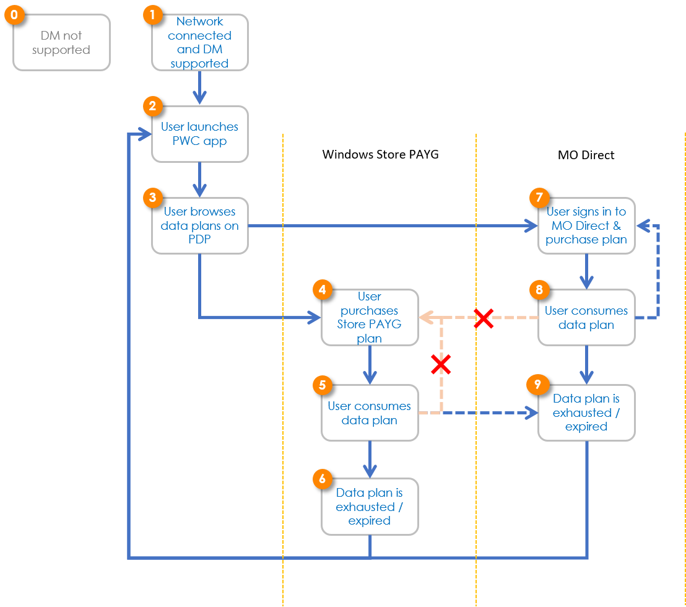

# Appendix A: Data Marketplace UX for cell

In Windows 10, version 1703, Data Marketplace supports both Windows Store pay-as-you-go (PAYG) scenarios and Mobile Operator Direct (MO Direct) scenarios for a mobile broadband (MBB) device with a physical SIM card (activated/ in warm state), an eSIM device with an active profile, or an MBB device with a Wi-Fi or Ethernet connection.

In Windows 10, version 1703, Data Marketplace does not support any eSIM profile operations within the Data Marketplace Paid Wi-Fi &amp; Cellular app. However, it does support eSIM profile operations through Windows Settings. Please contact the Data Marketplace team for more information about Windows eSIM UX in Windows 10, version 1703.

Starting with Windows 10, version 1709, Data Marketplace will support eSIM devices in general for both Windows Store PAYG scenarios and MO Direct scenarios. eSIM profile downloading and activating will be supported through Paid Wi-Fi &amp; Cellular app as well.

For customers to see the Data Marketplace experience and purchase any data plan from Data Marketplace, there are two prerequisites:
  1. The device must have connectivity to access the necessary resources (such as Walled Garden or Purchase Intent Connectivity/microbalance).
  2. The customer must have a physical SIM card that is onboarded in DM ICCID range, or a device that supports eSIM/eUICC.

The following table summarizes the initial connectivity state that Data Marketplace supports in Windows 10, version 1703, and Windows 10, version 1709:

| Connectivity | Windows 10, version 1703 | Windows 10, version 1709 |
| --- | --- | --- |
| Wi-Fi | Yes | Yes |
| Cellular w/ physical SIM card | Yes | Yes |
| Cellular w/ eSIM, w/ active profile | Yes | Yes |
| Cellular w/ eSIM, w/o active profile | No | Yes |

## Data Marketplace User Journey

Data Marketplace enables Windows-basseed device customers to browse, purchase, and consume cellular data plans offered by onboarded mobile operators. The diagram below depicts the customer journey with Data Marketplace:

The table below explains each step of the customer journey:

| # | Description | Balance Type returned in GetBalance API |
| --- | --- | --- |
| 0 | If SIM ICCID is not in DM range, or the device has no network connectivity, you will not receive a Get Balance call. If SIM ICCID is in COSA and DM range, you will receive a Get Balance call but you can return 'NotSupported' to turn off DM experience for specific use cases, such as Enterprise SIMs. This gives you flexibility when you can’t identify a consecutive ICCID range for which DM experience simply will not work. For 'NotSupported' case:   • When MBAE App onboarded or Account Management Experience (AMX) URL onboarded in COSA.   • 'View my account' link will launch MBAE app or AMX URL in web browser. No parameter is passed when launching AMX URL.   • When no MBAE App or AMX URL available.    • When customer launches Paid Wi-Fi &amp; Cellular app from Windows start menu. | &#39;NOTSUPPORTED&#39; |
| 1 | When a device is connected and Data Marketplace experience is supported, customer will see the cellular connection annotated with &#39;Buy from Windows Store&#39; invitation in Windows network flyout.&lt;image&gt; | &#39;NONE&#39; |
| 2 | Click on &#39;Connect with a data plan&#39; from the flyout to launch Paid Wi-Fi &amp; Cellular app (PWC app).Alternatively, a customer can launch the app from the **Start** menu. | N/A |
| 3 | Customer browses data plans on Provider Details Page (PDP) in PWC app.
1. If only Windows Store PAYG plans are available in customer&#39;s current location:
&lt;image&gt;
1. If both Windows Store PAYG plans and MO Direct plans are available in customer&#39;s current location.
&lt;image&gt;
1. If only MO Direct plans are available in customer&#39;s current location.
&lt;image&gt;
1. If no plan is available in customer&#39;s current location.
&lt;image&gt;  | N/A |
| 4 | User purchases a Store PAYG plan by clicking on the &#39;Buy&#39; button in step 3.
1. Sign in with a Microsoft account:
&lt;image&gt;
1. Confirm purchase:
&lt;image&gt; | N/A |
| 5 | User consumes data plan. User can view remaining balance in PWC app and the flyout.
1. Remaining balance in the network flyout:
&lt;image&gt;
1. Remaining balance in the PWC app -&gt; Balances page:
&lt;image&gt;
1. Remaining balance in the PWC app -&gt; PDP
       &lt;image&gt;  | &#39;PAYG&#39; |
| 5 -&gt; 4 (not available) | Buying multiple Store PAYG data plans for the same provider in the same location currently is not supported. Hence, the &#39;Buy $6.99&#39; button is greyed out. | &#39;PAYG&#39; |
| 5 -&gt; 9 | When the customer has active Store PAYG balance, they can switch to an MO Direct plan with the same provider in the same location, if MO Direct is available in customer&#39;s current location and switching is supported by MO through MO Direct portal. User can click on &#39;Sign in&#39; on PDP to switch:&lt;image&gt;  **IMPORTANT** : Data Marketplace currently does not support multiple balance type on one ICCID. Once customer switched from Store PAYG to MO Direct, MO must return one balance for this ICCID. It is up to the MO whether to forfeit the Store PAYG remaining balance or merge as one. | &#39;PAYG&#39; |
| 6 | Data plan is exhausted (data remaining = 0) or has been expired (time remaining = 0). | &#39;NONE&#39; |
| 6 -&gt; 2 | When there is no active balance, customer can browse available offers again. | &#39;NONE&#39; |
| 7 | User chooses to sign in to MO Direct account. | &#39;NONE&#39; |
| 8 | User consumes MO Direct data plan. In Windows 10, version 1703, no balance displayed in Data Marketplace experience for MO Direct plans. In Windows 10, version 1709, pay-as-you-go type will show balance in Data Marketplace experience. Flyout behavior&lt;image&gt;&#39;View my account&#39; link will launch MBAE app or AMX URL. No parameter is passed when launching AMX URL. When there is no MBAE app nor AMX URL, &#39;View my account&#39; link will launch PWC app on PDP page. PWC app behavior
1. When AMX URL is onboarded
&lt;image&gt;&#39;View my account&#39; link will launch AMX URL in web browser. No parameter is passed when launching AMX URL.
1. When MBAE app is onboarded or neither MBAE app nor AMX URL exist
&lt;image&gt; | &#39;MODIRECT&#39; |
| 8 -&gt; 7 | Buying multiple plans can be supported through the MO Direct portal, and it is completely controlled by MO. | &#39;MODIRECT&#39; |
| 8 -&gt; 4 (not available) | Buying more Store PAYG plans while have active MO Direct plan with the same provider for the same location is currently not supported. | &#39;MODIRECT&#39; |
| 9 | MO Direct data plan is exhausted or expired. **IMPORTANT** Since adding PAYG on top of MO Direct is currently not supported, MO should consider this limitation when designing MO Direct experience, especially under what business rules should Get Balance call return &#39;NONE&#39; for customers with MO Direct plans. | &#39;NONE&#39; |
| 9 -&gt; 2 | Customers can choose to purchase from Store PAYG or MO Direct again. | &#39;NONE&#39; |

## Store PAYG customer experience

This section covers the customer experience for a basic Store PAYG purchase flow.

1. Device is connected in Walled Garden or with Wi-Fi, and Data Marketplace is supported. User clicks on **Connect with a data plan** to launch the Paid Wi-Fi &amp; Cellular app (PWC app).

&lt;image&gt;

2. PWC app launches in Provider Detail Page (PDP). User browses offers on PDP and clicks the **Buy** button to purchase a Store PAYG plan.

&lt;image&gt;

3. User is prompted to sign in with Microsoft Account. If customer has signed in already from Windows Store app, skip this step.

&lt;image&gt;

4. Microsoft account signed in. User can set payment instrument in this step by clicking **Change**. User submits an order by clicking **Buy**.

&lt;image&gt;

When customer clicks **Change** to change payment instrument:

&lt;image&gt;

5. Purchase in progress.

&lt;image&gt;

6. Device is connected with a cellular data plan:

&lt;image&gt;

&lt;image&gt;

7. User receives an email confirmation. Below is a sample.

&lt;image&gt; sample email

## eSIM profile downloading in PWC app

One of the new features coming in Windows 10, version 1709, is full eSIM support, which enables PWC app to download and activate a new network profile right after the purchase.

Table 31: The progress indicator text string shows the active fulfillment step

Table 32: The byte counter shows when a download is in progress

Table 33: The error message lets the customer know the download failed and was unrecoverable.

## Support multiple balances

It is possible for an ICCID to have multiple balances in the same location. We generally leave the business logic to the Mobile Operators to determine whether this should be allowed through Data Marketplace experience, and if it&#39;s allowed, how the balances should be stacked. Understanding the UX in Data Marketplace will help you make these decisions (such as merging all of them or stacking them in a queue):

- Flyout can only show one balance. This balance returned by you should be the one that is actively being consumed.
- PWC app -&gt; Balances page can show multiple balances. It is up to you how many balances you want to return for the customer&#39;s ICCID.

When you create connectivity offers for Data Marketplace, you should also consider whether stacking/purchasing multiple offers will be allowed in Data Marketplace based on the customer journey diagram. You should avoid creating offers that will end up in complicated balance stacking situation.

## Dynamic MO selection

With eSIM support in Windows 10, version 1709, customers with eSIM devices can choose from a collection of providers in Data Marketplace.

Table 34 - PDP with option to choose a different provider

Selecting a different provider will go to the provider picker screen:

Table 35 - Provider picker

## MO Direct flow &amp; reference design

Our goal is to make you successful in selling data services to Windows customers. We believe in simple, effective, and engaging UI design, which can delight our customers and be cost-effective in terms of Purchase Intent Connectivity consumption. We created this reference design as a template that you can alter to represent your brand and products the best. This reference design shows the UX design we desire with navigation elements, branding locations, and website functionalities including what data service options are available and what personal information is collected etc. Building your MO Direct Portal based on this reference UX should help you enhance the customer experience, which is crucial to hundreds of millions of Windows customers.

### MO Direct reference site walkthrough

1. User clicks **Sign in** on PDP:

&lt;image&gt;

- This dialog is prompted by Paid Wi-Fi &amp; Cellular app.

2. User enters the MO Direct portal and picks an option:

&lt;image&gt;

- Present the most important content (available services) at the center of the page.
- Logo and branding elements are in the top left corner.
- Navigation buttons are in the bottom right corner.
- Use big tiles of available options with title and short description of the service category.

(Both the **Next** and **Cancel** buttons are available for customers to navigate forward or exit. MO Direct Expected data service categories could include: prepaid plans, recurring monthly plans, and attach a new device to an existing plan.)

3. User picks a data plan:

&lt;image&gt;

- Consistent design for presenting available options as in step 2 above.

4. User signs in with MO account:

&lt;image&gt;

- Page layout is consistent throughout all pages (logo and branding elements in top left, and navigation elements in the bottom).
- Sign in page can link to sign up for a new account.

(**Forgot password** is optional. Note that a customer is in the Walled Garden, and only Paid Wi-Fi &amp; Cellular app can access Internet. If you want to support password reset through MO Direct portal, make sure that the customer can reset it within two or three steps without launching a browser or email app on the device.)

5. User submits the order:

&lt;image&gt;

- Page layout is consistent throughout all pages (logo and branding elements in top left, and navigation elements in the bottom).
- Terms of Service link must be visible in the web page.

(Order confirmation page lists key information for customer to review before submitting the order, including details on data service, payment instrument, and amount of payment.)

6. If customer cancels MO Direct flow at any time:

&lt;image&gt;

- Confirmation dialog to leave MO Direct experience is prompted by Paid Wi-Fi &amp; Cellular app.

7. Order is completed:

&lt;image&gt;

- Once an order is processed successfully, notify the PWC app with purchase result, order ID, eSIM activation code, and other information required in the API, and the customer will be automatically redirected to the Paid Wi-Fi &amp; cellular app PDP (product details page).
- This dialog is prompted by the Paid Wi-Fi &amp; Cellular app and the order ID comes from you.
- If the transaction is for a physical SIM card or the active eSIM profile is in place, you should be activating the plan in the backend.

(If the transaction requires a new profile to be downloaded, move on to the next step.)

8. Downloading eSIM profile (if applicable):

&lt;image&gt;

- eSIM profile being downloaded.

9. eSIM profile downloading error (if applicable):

&lt;image&gt;

- Error occurred in profile downloading.

(Customer can click on &#39;Acquire profile&#39; to restart the process.)

10. MO Direct plan is activated:

&lt;image&gt;

- Device is connected.

(Customer has an active MO Direct account now.)
