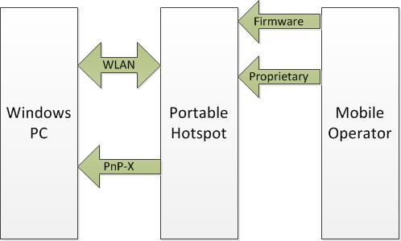

# Communication channels

Because the mobile broadband interface is not directly attached to the computer, information from the operator must be exchanged by using the personal hotspot device, as shown in the following figure:

You have two opportunities to influence the data provided by the device: in firmware at the time of setup, and by using proprietary back channels (usually web services) that are used by the device during its operational lifetime. These protocols are outside the scope of Microsoft’s design.

All required functionality can be implemented by the device manufacturer by using data that is provided by the carrier as part of the firmware or initial configuration. Optional functionality can require the availability of real-time updates.

The following topics are available in this section:

-   [Network cost information element](network-cost-information-element.md)

-   [PnP-X for mobile broadband apps](pnp-x-for-mobile-broadband-apps.md)

## Related topics

[Enabling mobile broadband experiences using portable hotspot devices](enabling-mobile-broadband-experiences-using-portable-hotspot-devices.md)

 

 

