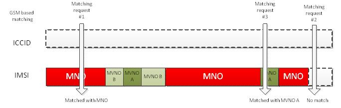
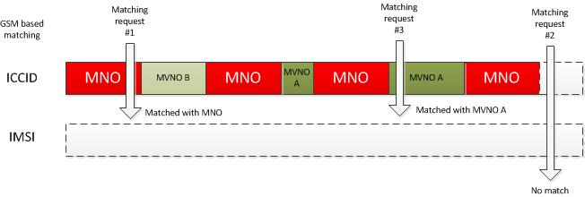
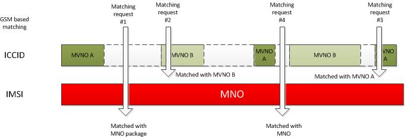
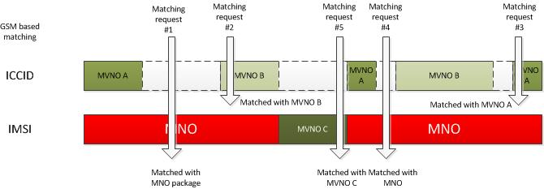
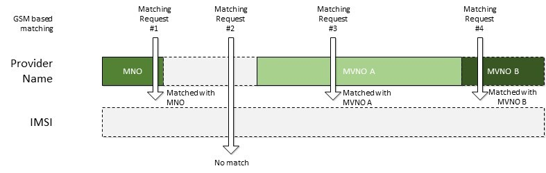
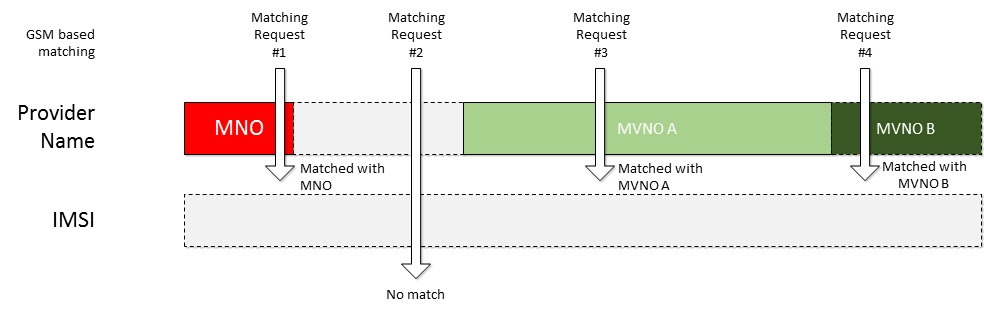
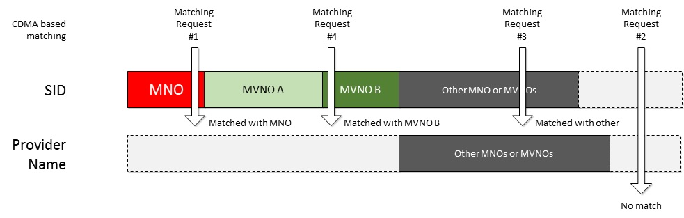
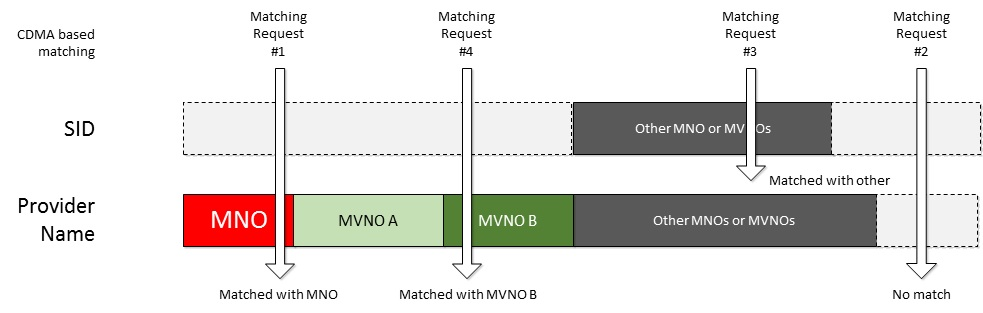

# Delivering experiences for MVNOs

[!include[MBAE deprecation warning](mbae-deprecation-warning.md)]

This topic provides info on how you can match service metadata to a mobile network operator (MNO) or mobile virtual network operator (MVNO) so that a mobile broadband app is automatically downloaded when the mobile broadband device is inserted.

To successfully match service metadata, Windows reads information from the SIM card that is inserted into the computer. For CDMA networks, the mobile broadband device itself is read. Windows then queries the Windows Metadata and Internet Services (WMIS) database to download the correct service metadata package. After the service metadata package is downloaded, Windows downloads the associated mobile broadband app to the computer.

Use the link from the following list that is appropriate for your network:

-   [Matching on GSM networks](#matching-on-gsm-networks)

-   [Matching on CDMA networks](#matching-on-cdma-networks)

For info about the hardware that is required to properly match service metadata to an MNO and MVNO, see [Mobile operator hardware overview](mobile-operator-hardware-overview.md).

For info on service metadata, see [Service metadata](service-metadata.md).

For info on the service metadata package schema, see [Service metadata package schema reference](service-metadata-package-schema-reference.md).

## Matching on GSM networks

For a GSM network (3GPP), Windows reads the Integrated Circuit Card Identifier (ICCID) and the International Mobile Subscriber Identity (IMSI) number from the SIM card. These numbers must be set and retrievable from the device. If a SIM is PIN-locked and the IMSI information is hidden, Windows does not take action until the SIM PIN is unlocked. Windows also reads the Home Provider Name from the SIM or mobile broadband device.

If the ICCID, IMSI, and Home Provider Name are available from the device, the ICCID and IMSI are stripped of the last two digits, encoded by using a hashing algorithm, and sent to WMIS in the form of Hardware IDs (HWIDs) to match to a service metadata package. The Home Provider Name is checked. If there is no match, the ICCID is checked. If there is no match, the IMSI is checked. If no matches are found, no service metadata package is downloaded. Windows checks approximately every eight days to see if new metadata exists for the user’s mobile broadband SIM.

### Managing MVNOs

If you are an MNO who has a single brand for all customers, you can create a metadata package that covers all the IMSI ranges for your MCC+MNC. For example, if your MCC+MNC is 123 456, you can create a metadata package that covers 123456000000000 – 123456999999999. This means that any user who inserts a SIM that is in that range is matched to your experience.

This can get more complicated if one or more MVNOs share that same MCC+MNC value. The following describes some strategies for dealing with this situation.

**Option 1: Segmenting IMSI ranges**

With this option, The MNO does not define an ICCID range in the service metadata packages, and instead segments out IMSI ranges that define the MNO experience and the MVNO experience. When a matching request comes from client devices, their IMSI values are used to match the correct experience to that SIM.

This method requires that the MNO ensures that the IMSI ranges are kept up-to-date, and that the MVNOs are assigned future ranges in predictable blocks of IMSI numbers.

If neither the ICCID nor the IMSI matches the request from the client machine, no match is made.

**Note**  
IMSI ranges must have a granularity of 100. The start range value must end in 00, and the end range value must end in 99.

 

*Figure 1 Segmenting IMSI ranges (within an MNO's MCC+MNC)* shows an example of client device that request service metadata from WMIS and how each matching request from the client is matched to an experience.

**Figure 1 Segmenting IMSI ranges (in an MNO's MCC+MNC)**

-   Computer \#1’s matching request does not match any ICCID values and lands inside the IMSI range that is defined by the MNO. The MNO service metadata is downloaded to that computer.

-   Computer \#2’s matching request does not match any ICCID values or any IMSI values. No experience is downloaded.

-   Computer \#3’s matching request does not match any ICCID values and lands inside the IMSI range for MVNO A. The MVNO service metadata is downloaded to that computer.

**Option 2: Segmenting ICCID ranges**

With this option, the MNO does not define an IMSI range in the service metadata packages, and instead segments out ICCID ranges that define the MNO experience and the MVNO experience. When a matching request comes from client machines, the ICCID values are used to match the correct experience to that SIM.

This method requires that the MNO ensures that the ranges are kept up-to-date and that the MVNOs are assigned future ranges in predictable blocks of ICCID numbers. If large blocks of ICCIDs are assigned to SIMs during SIM manufacturing, this can be a desirable matching strategy for the MNO and their MVNOs.

If neither the ICCID nor the IMSI matches the request coming from the client machine, then no match is made.

**Note**  
IMSI ranges must have a granularity of 100. The start range value must end in 00, and the end range value must end in 99.

 

*Figure 2 Segmenting ICCID ranges (within an MNO's ICCID issuer identification number)* shows an example of client computers that request service metadata from WMIS and how each matching request from the client is matched to an experience.

**Figure 2 Segmenting ICCID ranges (in an MNO's ICCID issuer identification number)**

-   Computer \#1’s matching request in includes in the ICCID range that is defined by the MNO. The MNO service metadata is downloaded to that computer.

-   Computer \#2’s matching request does not match any ICCID values or any IMSI values. No experience is downloaded.

-   Computer \#3’s matching request lands inside the ICCID range that is defined for MVNO A. The MVNO service metadata is downloaded to that computer.

**Option 3: Describing MVNOs with ICCID ranges and MNO together with an IMSI range**

An MNO’s entire IMSI-based range can be assigned (that is, everything under their MCC+MNC values). Any MVNOs can then be assigned a specific ICCID range for their SIMs. This means that unless an ICCID match exists for that SIM, the SIM gets the MNO experience.

This option requires the MNO or MVNO to ensure that the ICCID ranges are kept up-to-date and that the MVNOs are assigned future ranges in predictable blocks of ICCID numbers. If large blocks of ICCIDs are assigned to SIMs during SIM manufacturing, this can be a desirable matching strategy for the MNO and their MVNOs. This means that the MNO has less maintenance because their package spans all the IMSI-based ranges. In this scenario, it is very important to ensure that the MVNO keeps their ICCID ranges up to date; otherwise, customers of the MVNO can be matched to the MNO experience.

**Note**  
IMSI ranges must have a granularity of 100. The start range value must end in 00, and the end range value must end in 99.

 

*Figure 3 Using ICCID to define MVNOs and an all-encompassing IMSI range for the MNO* shows an example of client computers that request service metadata from WMIS and how each matching request from the client is matched to an experience.

*Figure 3 Using ICCID to define MVNOs and an all-encompassing IMSI range for the MNO*

-   Computer \#1’s matching request does not match any ICCID values and lands inside the IMSI range that is defined by the MNO. The MNO service metadata is downloaded on that computer.

-   Computer \#2’s matching request in included in the ICCID range for MVNO B. MVNO B’s service metadata is downloaded to that computer.

-   Computer \#3’s matching request is included in the ICCID range for MVNO A. MVNO A’s service metadata is downloaded to that computer.

-   Computer \#4’s matching request does not match any ICCID values and lands inside the IMSI range that is defined by the MNO. The MNO service metadata is downloaded on that computer.

**Option 4: Segmenting ICCID and IMSI ranges**

You can use a mixture of ICCID ranges and IMSI ranges to describe the MNO and MVNO networks.

**Note**  
ICCID ranges get first priority for matching.

 

This is the most complex matching model. To ensure proper matching, the MNO and MVNO must frequently update their service metadata packages.

*Figure 4 Segmenting ICCID and IMSI ranges* shows an example of client device that request service metadata from WMIS, and how each matching request from the client is matched to an experience.

*Figure 4 Segmenting ICCID and IMSI ranges*

-   Computer \#1’s matching request does not match any ICCID values, but is included in the IMSI range that is defined by the MNO. The MNO service metadata is downloaded to that computer.

-   Computer \#2’s matching request is included in the ICCID range for MVNO B. MVNO B’s service metadata is downloaded to that computer.

-   Computer \#3’s matching request is included in the ICCID range for MVNO A. MVNO A’s service metadata is downloaded to that computer.

-   Computer \#4’s matching request does not match any ICCID values, but is included in the IMSI range that is defined by the MNO. The MNO service metadata is downloaded to that computer.

-   Computer \#5’s matching request does not match any ICCID values, but is included in the IMSI range that is defined by MVNO C. MVNO C’s service metadata is downloaded to that computer.

**Option 5: Using Home Provider Name for GSM networks to identify the MNO and MVNO**

With this option, the MNO does not define an IMSI or ICCID range in the service metadata packages, and instead segments out the Home Provider Names that define the MNO experience and the MVNO experience.

For mobile broadband devices that are assigned to MVNOs, make sure that each MVNO device reports a Provider Name value that uniquely identifies the MVNO. The MNO should have its own Provider Name value that uniquely identifies it.

When a matching request comes from client machines, the Home Provider Name is used to match the correct experience to that SIM.

This option is recommended only in the case where IMSI and ICCID cannot be used.

If the Home Provider Name does not match the request coming from the client machine, no match is made.

**Note**  
Home Provider Names must be globally unique to ensure that a user gets the correct experience. Service metadata will only allow a single service metadata package that uses a given Home Provider Name.

 

*Figure 5 Provider Name-based matching for GSM networks* shows an example of devices that request service metadata from the Windows Metadata and Internet Services (WMIS) service, and how each matching request from the device is matched to an experience.

*Figure 5 Provider Name-based matching for GSM networks*

-   Computer \#1’s matching request matches the Home Provider Name for the MNO. The MNO service metadata is downloaded.

-   Computer \#2’s matching request does not match any Provider Name values. No experience is downloaded.

-   Computer \#3’s matching request matches the Home Provider Name for MVNO A. MVNO A’s service metadata is downloaded.

-   Computer \#4’s matching request matches the Home Provider Name for MVNO B. MVNO B’s service metadata is downloaded.

**Option 6: Describing MVNOs with Home Provider Name and MNO together with an IMSI range**

An MNO’s entire IMSI-based range can be assigned (that is, everything under their MCC+MNC values). Any MVNOs can then be assigned a specific Home Provider Name. This means that unless a Home Provider Name match exists for that device, the device gets the MNO experience.

This option requires the MNO or MVNO to ensure that the Home Provider Name reported from the device does not change, is globally unique and is kept up-to-date. This option is recommended only in the case where IMSI and ICCID cannot be used.

*Figure 6 Using Home Provider Name to define MVNOs and an all-encompassing IMSI range for the MNO* shows an example of client computers that request service metadata from WMIS and how each matching request from the client is matched to an experience.

*Figure 6 Using Home Provider Name to define MVNOs and an all-encompassing IMSI range for the MNO*

-   Computer \#1’s matching request matches the Home Provider Name for MVNO A. The MVNO A service metadata is downloaded on that computer.

-   Computer \#2’s matching request does not match any Home Provider Name values and lands inside the IMSI range that is defined by the MNO. The MNO service metadata is downloaded on that computer.

-   Computer \#3’s matching request matches the Home Provider Name for MVNO B. MVNO B’s service metadata is downloaded to that computer.

-   Computer \#4’s matching request does not match any Home Provider Name values and lands inside the IMSI range that is defined by the MNO. The MNO service metadata is downloaded on that computer.

**Option 7: Alternative matching method**

If none of these methods works for the MNO’s network (for example, the MNO cannot keep track of IMSI and ICCID ranges between the MNO’s and MVNO’s customers), the following alternative is available. It is less ideal than any of the options described above, but provides a mobile broadband solution for Windows 8, Windows 8.1, or Windows 10 customers on the network.

**Service metadata**

This method creates a service metadata package that covers the entire MNO network. This is usually done by submitting an IMSI range that covers all the MCC+MNC values on the MNO network, and no ICCID ranges. MVNO ranges are not described. The service metadata package features generic branding and a generic network name that displays in the Windows Connection Manager. The service metadata then references a generic app that is automatically downloaded from the Microsoft Store when the MNO’s SIM is detected.

**Determining network affiliation**

If the user does not already have a plan, the app opens when user tries to connect to the network by using Windows Connection Manager.

When the app is running, it performs one of the following actions:

-   Prompts the user to identify the network for which they have a plan from a displayed list of MVNOs and the MNO network.

-   Uses web services to send information about the user’s SIM back to the MNO backend so that the operator can use custom logic to determine the correct network branding for the user.

**Customizing the Windows Connection Manager branding**

After the user’s mobile broadband data plan affiliation is determined, the mobile broadband app can change the logo and network name that displays in Windows Connection Manager. This is done by using account provisioning metadata, which allows the operator app to send XML-based information to Windows that relates to the specific subscriber’s plan information.

For more information about account provisioning, see [Account provisioning](account-provisioning.md).

**Service metadata updates**

Future service metadata updates (for example, any changes that are submitted to the generic service metadata package) can overwrite the applied branding on the subscriber’s computer. To avoid this, we recommend that, if possible, you do not update the service metadata package. Because the metadata package contains generic branding and covers the entire IMSI range for an MNO, there should not be a frequent need to update the package for this scenario.

If you must update the service metadata package, make sure that the mobile broadband app can initiate another account provisioning metadata operation that is based on the backend logic that the operator provides. In this way, you can specify when the service metadata is updated on the backend, and have the app periodically check the backend and apply account provisioning metadata information as required.

**Note**  
Because service metadata is not versioned, the app cannot query the local copy of metadata to determine if it has been updated or applied over the customizations that were made by using account provisioning metadata. There is no way for an app to wake up and react to service metadata updates that are applied to the computer.

A delay can occur between the time that the service metadata is uploaded through the Windows Dev Center hardware dashboard, and the time that computers receive the updated metadata.

 

**Branding in the mobile broadband app**

The previous steps that are described in this topic lets you rebrand the Windows Connection Manager icon and network name for the MNO/MVNO’s network. However, there are limited ways in which the app itself can be rebranded.

You can rebrand the following items in the app:

-   The app content itself (that is, everything inside the app can be changed for a particular operator). This is code over which the app has complete control. You might want to change help content, navigation options, page layouts, colors, and branding inside the app, based on the MNO/MVNO.

-   The app tile can be dynamically updated to show specific images and layouts that are specific to the operator. For information about how to dynamically update tile content, see [Quickstart: Sending a tile update](https://msdn.microsoft.com/library/windows/apps/hh465439).

You cannot rebrand the following items in the app:

-   Name of the app. You can try to hide the name by changing the tile template, but you cannot change either the name itself or the icon that represents that app, as it is defined in the app manifest.

-   App name, information, and the icon in the settings charm.

-   Description of the app.

### SIM reprogramming

If you want to dynamically reprogram SIMs to change the IMSI or the ICCID, you should be aware of the following ways in which Windows 8, Windows 8.1, and Windows 10 interpret the reprogramming:

-   Reprogramming requires invalidation of the device’s caching of IMSI and ICCID. There are several ways this can be done, depending on the operator network and device.

-   After the SIM is reprogrammed, the device re-reads the SIM information. It can use the hot SIM swap insertion sequence to let Windows know that it should re-query the new IMSI and ICCID values.

-   The ICCID must be changed or Windows will not treat the SIM as a new SIM.

-   If only the IMSI is changed, Windows does not treat the SIM as a new SIM and your service metadata is not downloaded. The mobile broadband app is not downloaded if a different app has already been downloaded for this SIM.

To get new service metadata (which results in new branding), and to get a new mobile broadband app to download the ICCID and the IMSI, you must change both the service data and the mobile broadband app by using the operator’s reprogramming method.

## Matching on CDMA networks

For a CDMA network (3GPP2), Windows reads the SID and the Provider Name values that are reported by the device to a corresponding service metadata package in WMIS. If no matches are found, no service metadata package is downloaded. Windows checks approximately every eight days to see if new metadata exists for the device. If service metadata exists for a SID and a separate service metadata package exists for a Provider Name, and both values match the SID and Provider Name values that the device is reporting, matching preference is given to SID. In this case, the Provider Name package is not matched.

**Important**  
The Provider Name value is case sensitive and must be an exact match to the Provider Name that the device reports to Windows. If you want to match by using the Provider Name, you must make sure that you have specified all spelling and capitalization variations of the Provider Name that CDMA devices report to Windows in the service metadata package that you submit through the Windows Dev Center hardware dashboard.

 

### Managing MVNOs

MVNOs on CDMA networks can be identified by using one of following three options.

**Option 1: MNO and MVNOs get their own SID values**

For mobile broadband devices that are assigned to MVNOs, make sure that each MVNO gets a unique SID. The MNOs should have their own SID value that is different from each of the MVNOs.

Separate service metadata is created for the MNO and for each of the MVNOs that matches on the unique SID value that the device reports to Windows.

*Figure 7 SID-based matching for CDMA networks* shows an example of computers that request service metadata from WMIS service, and how each matching request from the client gets matched to an experience.

*Figure 7 SID-based matching for CDMA networks*

-   Computer \#1’s matching request matches the SID for the MNO. The MNO service metadata is downloaded.

-   PC \#2’s matching request does not match any SID values or any Provider Name values. No experience is downloaded.

-   PC \#3’s matching request matches a SID value that is defined by another MNO or MVNO.

-   PC \#4’s matching request matches the SID for MVNO B. MVNO B’s service metadata downloaded.

**Option 2: MNO and MVNOs get their own provider name values**

For mobile broadband devices that are assigned to MVNOs, make sure that each MVNO device reports a Provider Name value that uniquely identifies the MVNO. The MNO should have its own Provider Name value that uniquely identifies it.

Separate service metadata is created for the MNO and for each of the MVNOs that matches on the Provider Name value that the device reports to Windows.

For this option to work, the MNO must make sure that no service metadata is submitted that matches on the SID that the devices report. If service metadata exists for those SIDs, matches are performed on the SID instead of the Provider Name, causing this scheme to break. To remove a SID-based metadata package from WMIS, you must contact Windows Dev Center hardware dashboard support.

*Figure 8 Provider Name-based matching for CDMA networks* shows an example of devices that request service metadata from the Windows Metadata and Internet Services (WMIS) service, and how each matching request from the device is matched to an experience.

*Figure 8 Provider Name-based matching for CDMA networks*

-   PC \#1’s matching request does not match on the SID, but does match the Provider Name for the MNO. The MNO service metadata is downloaded.

-   PC \#2’s matching request does not match any SID values or any Provider Name values. No experience is downloaded.

-   PC \#3’s matching request matches a SID value that is defined by another MNO or MVNO.

-   PC \#4’s matching request does not match on the SID, but does match the Provider Name for MVNO B. The MVNO B’s service metadata is downloaded.

**Option 3: Alternative matching method**

If the first two options described here are not acceptable, CDMA operators can use the alternative matching method described in **Option 7: Alternative matching method** of the Matching on GSM networks section.

## Radios and metadata

You can expect the following matching behaviors, depending on the type of radio.

### Single-Mode Single-Subscription Device

The single-mode single subscription device is a GSM-only or CDMA-only device. These are commonly available devices that provide access to only a GSM or CDMA network.

This device reports either GSM or CDMA mode to Windows. The previously described matching logic applies and the device is matched to the appropriate service metadata.

### Multi-Mode Single-Subscription Device

The multi-mode single subscription device has both GSM and CDMA capabilities. For example, it can connect to a GSM LTE network or a CDMA network by using a single subscriber subscription for that operator.

This device reports GSM as the primary mode to Windows.

When matching service metadata for this type of device, you can create GSM-based metadata that matches the GSM properties of the device.

### Single-Mode Multi-Subscription Device

The single-mode multi-subscription device can have either GSM or CDMA capabilities active at one time, and it can work with multiple providers. The user must have a subscription from each provider to use more than one provider. For example, the Qualcomm Gobi chipset allows the user to connect to various CDMA networks or to a GSM network.

This device reports the mode to Windows for the active provider. If the device is active with the GSM provider, it should report that it is in GSM mode. In this case, you should create GSM metadata for matching. The GSM metadata and mobile operator app can access the device when it is in GSM mode only.

If the device is active with the CDMA provider, it should report that it is in CDMA mode to Windows. In this case, the operator should create CDMA metadata for matching. The CDMA metadata and mobile broadband app can access the device only when it is in CDMA mode and active for that CDMA network.

## Metadata Maintenance Implications

It is important to keep the following metadata package content up-to-date:

-   How the packages are described.

-   The IMSI and/or ICCID or CDMA provider name or SID values against which the packages match.

For more information about mobile broadband metadata see [Using metadata to configure mobile broadband experiences](using-metadata-to-configure-mobile-broadband-experiences.md).

 

 

