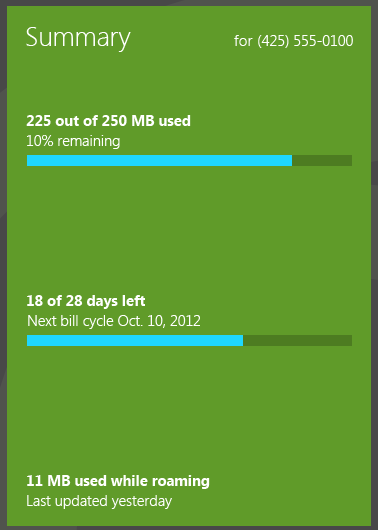
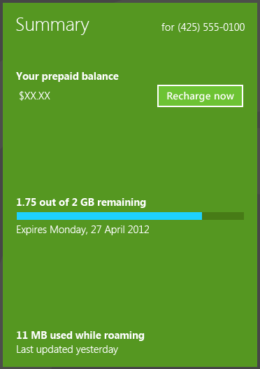

# Design account balance and usage info in a mobile broadband app

Users primarily use your mobile broadband app to view account balance and usage information. This data should be clearly visible on the app’s home screen.

Relevant account information for post-paid accounts includes the following:

-   Mobile phone number of account

-   Account balance remaining

-   Data used, roaming data used, and usage remaining

-   Billing period or plan expiration date

At a glance, users can clearly understand how much data they’ve used, how much data they have left, and when the billing cycle ends (for monthly accounts).

Relevant account information for prepaid accounts includes the following:

-   Mobile phone number of account

-   Account balance remaining

-   Recharge Now button, which links to make a payment page

-   Data used and remaining

-   Plan expiration date (if it exists)

## Quick summary

Appropriate design for displaying account info:

-   Show relevant account information

-   Show when data was last updated

-   Use illustrations, such as charts and graphs, to visualize data

    **Tip**  
    You can implement a bar chart by using a determinate progress bar control, as discussed in [Adding progress controls](https://msdn.microsoft.com/library/windows/apps/hh465428).

     

-   When remaining usage is low, show a link to the Plans page to upgrade the plan

Inappropriate design for displaying account information:

-   Don’t show a long paragraph of legal disclaimers next to data usage. This can distract users from the main focus of the account usage section. Instead, show a link to a separate section of the app that has the full legal disclaimers.

## Related topics

[Designing the user experience of a mobile broadband app](designing-the-user-experience-of-a-mobile-broadband-app.md)

 

 

[Send comments about this topic to Microsoft](mailto:wsddocfb@microsoft.com?subject=Documentation%20feedback%20%5Bp_mb\p_mb%5D:%20Design%20account%20balance%20and%20usage%20info%20in%20a%20mobile%20broadband%20app%20%20RELEASE:%20%281/18/2017%29&body=%0A%0APRIVACY%20STATEMENT%0A%0AWe%20use%20your%20feedback%20to%20improve%20the%20documentation.%20We%20don't%20use%20your%20email%20address%20for%20any%20other%20purpose,%20and%20we'll%20remove%20your%20email%20address%20from%20our%20system%20after%20the%20issue%20that%20you're%20reporting%20is%20fixed.%20While%20we're%20working%20to%20fix%20this%20issue,%20we%20might%20send%20you%20an%20email%20message%20to%20ask%20for%20more%20info.%20Later,%20we%20might%20also%20send%20you%20an%20email%20message%20to%20let%20you%20know%20that%20we've%20addressed%20your%20feedback.%0A%0AFor%20more%20info%20about%20Microsoft's%20privacy%20policy,%20see%20http://privacy.microsoft.com/default.aspx. "Send comments about this topic to Microsoft")

