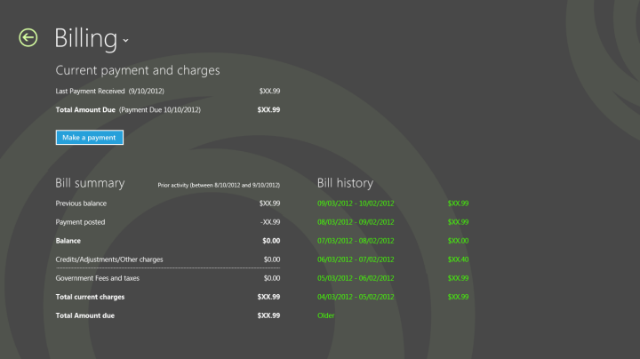
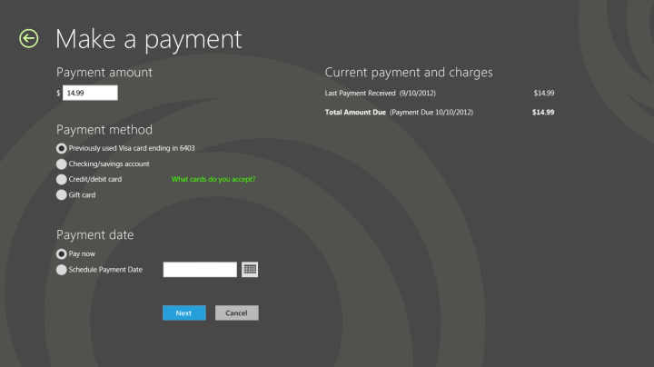

# Design billing pages in a mobile broadband app

You should provide the user with the ability to view a billing summary, billing history, make payments, or recharge the plan.

The **Make a payment** form should adhere to form guidelines that are described in [Design purchase flows in a mobile broadband app](design-purchase-flows-in-a-mobile-broadband-app.md). This page can be linked to from the **Billing** page for post-paid plans, and through the **Recharge now** button on the landing page for prepaid plans.

## Quick summary

Appropriate design for the billing page:

-   Follow the form guidelines, including left alignment, white space, proper grid alignment, and touch friendliness.

-   Use a simple layout to improve readability.

-   Use vertical scrolling for long forms because this makes it easier to tab and to use the online keyboard.

-   Make the making payments process a simple experience.

Inappropriate design for the billing page:

-   Don’t try to fill up white space.

-   Don’t use an iframe to host the flows. Instead, build flows directly into the app experience.

-   Don’t make the user wait long times without providing visual feedback.

-   Don’t link to external sites outside of the app.

## Additional resources

-   For more information about views and layouts: see [Choosing a layout](https://msdn.microsoft.com/library/windows/apps/hh465327).

-   For more information about Listviews, see [Quickstart: Adding a ListView](https://msdn.microsoft.com/library/windows/apps/hh465496).

-   For design guidance for error handling, see [Laying out your UI](https://msdn.microsoft.com/library/windows/apps/hh465304).

-   For accessibility guidance, see [Accessibility in UWP apps using C++, C#, or Visual Basic](https://msdn.microsoft.com/library/windows/apps/hh452680).

-   For more information about how to use built-in controls, see [Adding controls and content](https://msdn.microsoft.com/library/windows/apps/hh465393).

-   For touch input guidelines, see [Quickstart: Touch input](https://msdn.microsoft.com/library/windows/apps/xaml/hh465387).

## Related topics

[Designing the user experience of a mobile broadband app](designing-the-user-experience-of-a-mobile-broadband-app.md)

 

 

