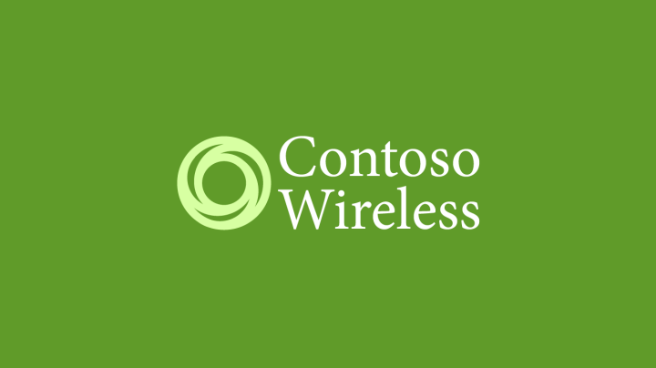

# Design branding in a mobile broadband app

UWP apps encourage branding in the following ways:

-   **Customization of colors and fonts** This includes being able to customize background colors and font colors. For example, you can use your look or brand colors in the app.

-   **Use brand imagery** Windows Connection Manager uses logos together with metadata. We recommend that you keep the imagery simple, to keep the overall look and feel of the app inviting. You can use brand imagery on the splash screen and on the start screen tiles.

You can use branding in the following places in your mobile broadband app:

-   Start screen tile (small)

    

-   Start screen tile (medium)

    

-   Start screen tile (wide)

    

-   Start screen tile (large)

    

-   [Integrate a mobile broadband app with other Windows components](integrate-a-mobile-broadband-app-with-other-windows-components.md#app-settings) shows brand name

-   Uninstall user interface (UI) on the **Start** menu shows an icon and name

-   Toast notifications

    

-   Task manager with brand icon and name

-   Mobile broadband information in computer settings (shows operator name)

-   Splash screen

    

-   Windows Connection Manager

    

For more info about Windows 10 branding guidance, see [UWP app marketing guidelines](https://msdn.microsoft.com/library/windows/apps/hh694084).

## Quick summary

Appropriate design for operator branding:

-   Use primary and secondary corporate brand colors in your app for backgrounds and fonts.

-   Use brand icons appropriately to maintain simplicity and follow UWP app design guidelines.

Inappropriate design for operator branding:

-   Don’t fill up white space with icons and images.

## Additional resources

-   [Integrate a mobile broadband app with other Windows components](integrate-a-mobile-broadband-app-with-other-windows-components.md#splash)

-   [Integrate a mobile broadband app with other Windows components](integrate-a-mobile-broadband-app-with-other-windows-components.md#app-settings)

-   [Integrate a mobile broadband app with other Windows components](integrate-a-mobile-broadband-app-with-other-windows-components.md#tileandtoast)

## Related topics

[Designing the user experience of a mobile broadband app](designing-the-user-experience-of-a-mobile-broadband-app.md)

 

 

