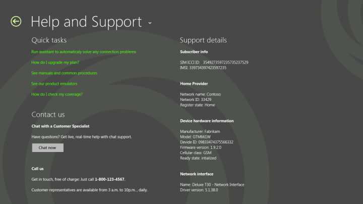

# Design help and support pages in a mobile broadband app

Customers who encounter issues using your mobile broadband service will go to the Help and Support page:

We recommend that you show the following information in the Help and Support section:

-   Instructions or tutorial videos on how to use the mobile broadband service

-   FAQs about mobile broadband hardware and service

-   Online chat with customer support

-   Customer support telephone number

-   Hardware and software diagnostics information

## Quick summary

Appropriate design for help and support page:

-   Displaying Help and Support content should not require Internet access. The customer might not have Internet access because they are having issues connecting to your service.

Inappropriate design for help and support page:

-   Don’t display links that open a web page in an external web browser.

-   All help and support content should appear inside the app, and the user shouldn’t have to switch between apps.

## Additional resources

-   For more information about how to use built-in controls, see [Adding controls and content](https://msdn.microsoft.com/library/windows/apps/hh465393).

-   [Mobile broadband WinRT API overview](mobile-broadband-winrt-api-overview.md)

## Related topics

[Designing the user experience of a mobile broadband app](designing-the-user-experience-of-a-mobile-broadband-app.md)

 

 

[Send comments about this topic to Microsoft](mailto:wsddocfb@microsoft.com?subject=Documentation%20feedback%20%5Bp_mb\p_mb%5D:%20Design%20help%20and%20support%20pages%20in%20a%20mobile%20broadband%20app%20%20RELEASE:%20%281/18/2017%29&body=%0A%0APRIVACY%20STATEMENT%0A%0AWe%20use%20your%20feedback%20to%20improve%20the%20documentation.%20We%20don't%20use%20your%20email%20address%20for%20any%20other%20purpose,%20and%20we'll%20remove%20your%20email%20address%20from%20our%20system%20after%20the%20issue%20that%20you're%20reporting%20is%20fixed.%20While%20we're%20working%20to%20fix%20this%20issue,%20we%20might%20send%20you%20an%20email%20message%20to%20ask%20for%20more%20info.%20Later,%20we%20might%20also%20send%20you%20an%20email%20message%20to%20let%20you%20know%20that%20we've%20addressed%20your%20feedback.%0A%0AFor%20more%20info%20about%20Microsoft's%20privacy%20policy,%20see%20http://privacy.microsoft.com/default.aspx. "Send comments about this topic to Microsoft")

