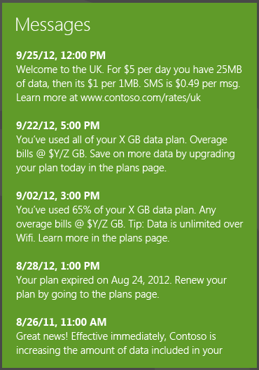

# Design messages in a mobile broadband app

Your mobile broadband app is a convenient way to communicate with your customers about important account information. The app should have a section or link on the home screen where end users can view important account messages. While important operator messages should be shown as tile and toast notifications, they should also be shown in app view because of the transient nature of toast notifications and the limited amount of text that can be shown in a tile notification.

You should not show user-to-user chat text messaging, promotions, and advertisements in the messages section mixed together with operator notifications and alerts because customers might miss important operator notifications. You can display promotions and advertisements in the layout of your app and display user-to-user chat text messages in a separate section of the user interface.

The following table shows some example operator messages and alerts.

<table>
<colgroup>
<col width="50%" />
<col width="50%" />
</colgroup>
<thead>
<tr class="header">
<th>Type</th>
<th>Example message</th>
</tr>
</thead>
<tbody>
<tr class="odd">
<td>
International roaming
</td>
<td>
Welcome to the UK. For $5 per day you have 25 MB of data, and then it&#39;s $1 per 1 MB. SMS is $0.49 per msg. Learn more at www.contoso.com/rates/uk.
</td>
</tr>
<tr class="even">
<td>
Data usage overage
</td>
<td>
You’ve used your entire 4 GB data plan. Overage bills @ $10/GB. Save on more data by upgrading your plan today in the Plans page.
</td>
</tr>
<tr class="odd">
<td>
Data usage status
</td>
<td>
You’ve used 65% of your 40 GB data plan. Any overage bills @ $5/GB. Tip: Data is unlimited over Wi-Fi. Learn more in the Plans page.
</td>
</tr>
<tr class="even">
<td>
Plan expiration
</td>
<td>
Your plan expired on July 1, 2013. Renew your plan by going to the Plans page.
</td>
</tr>
<tr class="odd">
<td>
Account update
</td>
<td>
Great news! Effective immediately, Contoso is increasing the amount of data included in your DataPro Tethering plan from 2 GB to 4 GB. The monthly charge for your plan will not change and no action is required by you. Thank you for being a great customer.
</td>
</tr>
</tbody>
</table>

 

## Quick summary

Appropriate design for showing operator messages:

-   Include functionality to view a list of all messages received, view full details of a message, and delete a message.

-   Show important operator messages in a section of the home screen of the app or on its own page in the app.

Inappropriate design for showing operator messages:

-   Don’t show user-to-user chat text messages and promotions and advertisements mixed together with operator notifications and alerts.

## Additional resources

-   Use [**ListView**](https://msdn.microsoft.com/library/windows/apps/br211837) to display messages. For more info, see [Adding List View, Semantic Zoom, and other data controls](https://msdn.microsoft.com/library/windows/apps/hh465409).

-   Use the app bar control to view and delete messages. For more info, see [Guidelines for app bars](https://msdn.microsoft.com/library/windows/apps/hh465302).

-   [Integrate a mobile broadband app with other Windows components](integrate-a-mobile-broadband-app-with-other-windows-components.md#tileandtoast)

## Related topics

[Designing the user experience of a mobile broadband app](designing-the-user-experience-of-a-mobile-broadband-app.md)

 

 

