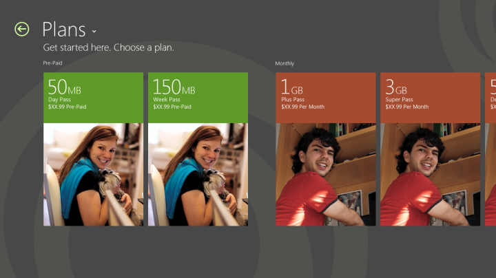
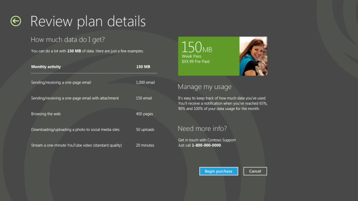

# Design purchase flows in a mobile broadband app

Your mobile broadband app can include a purchase flow for users to use to purchase plans. For first-time purchases, support your purchase flow over the web. Here are some standard recommendations for the purchase flow.

**Note**  
Do not use an iframe to host these flows in your app.

 

1.  Show users the plan details and allow them to select a plan before you forwarding them into a complete purchase flow.

    

2.  You can optionally provide a data breakdown for users to estimate the data that they will require. This can help the user select the best plan to purchase.

    

3.  If your purchase flow contains forms, follow these guidelines:

    -   Allow vertical scrolling in form pages.

    -   Make sure that all form fields are left-aligned.

    -   Because the app must be compatible with multiple form factors, we recommend that you provide touch-friendly spacing between form fields.

    -   Leave plenty of white space to promote simplicity.

    -   Follow best practices for form support. This includes, but is not limited to, providing proper support for address, number, and credit card fields.

    -   Make sure that the input scope is defined for form fields so that the appropriate touch keyboard shows for fields—for example, number, text, and so on.

    -   Make sure that the form has all controls and fields properly aligned.

    -   Minimize the number of clicks and fields.

4.  After the user enters their information, allow them to review the order before completing the purchase. If the order is placed and activation is quick, continue with activation and redirect the app to the landing page. If activation is expected to take longer, you can include a placeholder page for activation progress and use a progress control to show that activation is happening. For more info about progress controls, see [Quickstart: adding progress controls](/previous-versions/windows/apps/hh465487(v=win.10)).

## Quick summary

Appropriate design for purchase pages:

-   Follow the form guidelines, which include left alignment, white space, proper grid alignment, and touch friendliness.

-   Use a simple layout to improve readability.

-   Use vertical scrolling for long forms to make it easier to tab and to use the onscreen keyboard.

-   Let users review and select plans before you start the purchase flow.

-   Support purchase over the web and first-time purchase.

Inappropriate design for the purchase, recharge, refill, and billing pages:

-   Don’t use horizontal scrolling for long forms.

-   Don’t fill up all the white space.

-   Don’t use an iframe to host the flows.

-   Don’t make the user wait a long time without providing visual feedback.

-   Don’t link to websites outside of the app.

## Additional resources

-   For more information about views and layouts: see [Choosing a layout](/previous-versions/windows/apps/hh465327(v=win.10)).

-   For more information about Listviews, see [Quickstart: Adding a ListView](/previous-versions/windows/apps/hh465496(v=win.10)).

-   For design guidance for error handling, see [Laying out your UI](/previous-versions/windows/apps/hh465304(v=win.10)).

-   For accessibility guidance, see [Accessibility in UWP apps using C++, C#, or Visual Basic](/previous-versions/windows/apps/hh452680(v=win.10)).

-   For more information about how to use built-in controls, see [Adding controls and content](/previous-versions/windows/apps/hh465393(v=win.10)).

-   For touch input guidelines, see [Quickstart: Touch input](/previous-versions/windows/apps/hh465387(v=win.10)).

## Related topics

[Designing the user experience of a mobile broadband app](designing-the-user-experience-of-a-mobile-broadband-app.md)

 

