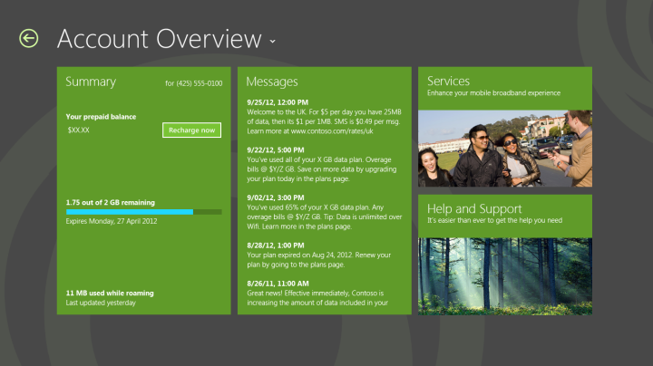

# Design the landing page of a mobile broadband app

The landing page is the first page that the user sees when they start the mobile broadband app, except for certain cases that are described in [Integrate a mobile broadband app with other Windows components](integrate-a-mobile-broadband-app-with-other-windows-components.md#launchpts).

The landing page should follow Windows Store app guidelines for app layout. To encourage simplicity and ease of navigation, we recommend that you fit all contents of the landing page into a single page. The landing page is the central hub of your app. Although it is not a primary navigation method or management page, it showcases your app and its major functionality.

The following sections describe some of the content that you can include in the landing page:

-   [Usage – show an overview or link](#usageov)

-   [Operator messages – show an overview or link](#opmsg)

-   [Links to other key pages](#keylinks)

-   [App navigation](#appnav)

-   [Operator branding](#opbrand)

-   [Quick summary](#sum)

-   [Additional resources](#res)

## Usage – show an overview or link

### Postpaid plans

Because it is important user to be able to see information about their data usage, usage should be highlighted on the landing page if possible. Although an overview is encouraged, you can alternatively provide a link to a separate page in the app that contains more details. Some suggestions for additional details can be found in the data usage section. See [Design account balance and usage info in a mobile broadband app](design-account-balance-and-usage-info-in-a-mobile-broadband-app.md) for more info.

### Prepaid plans

Data usage display is simplified for prepaid plans. A user should also be offered an option to recharge or refill their plan. You can provide a link to a page that offers payment options. See [Design billing pages in a mobile broadband app](design-billing-pages-in-a-mobile-broadband-app.md) for more info. The following shows a typical overview page for a prepaid plan:

## Operator messages – show an overview or link

A list of operator text messages can be highlighted on the landing page. Because a number of operator messages are high priority, users prefer having easy access to these. For more information about functionality that should be included for text messages, see [Design messages in a mobile broadband app](design-messages-in-a-mobile-broadband-app.md).

## Links to other key pages

You can provide links to other key pages on the landing page. For example, you could include a tile for **Help and Support** and a tile for **Services**.

## App navigation

When describing the landing page, it is important to consider navigation within the app. Your app will have multiple pages that have various purposes. Windows 8, Windows 8.1, and Windows 10 offer the following tools that can be used for navigation:

-   **Back button** The Back button can be used to return to the previous page in the app. For more information about the Back button styling, see [Quickstart: styling controls](https://msdn.microsoft.com/library/windows/apps/hh465498).

-   **Drop-down affordance with header text** The header text can be used as a drop-down affordance for navigation between multiple pages in an app. In the previous figures, clicking **Account Overview** would result in a drop-down list of pages in the app that can be navigated to, as shown in the following figure:

    

    For more information about designing app navigation, see [Quickstart: Using single-page navigation](https://msdn.microsoft.com/library/windows/apps/hh452768) and [**select element | select object**](https://msdn.microsoft.com/library/windows/apps/hh466252).

## Operator branding

You can customize your mobile broadband app to suit your individual branding style. By using numerous customizations, you can make your app unique and easily recognizable. For more info on how you can brand your app, see [Design branding in a mobile broadband app](design-branding-in-a-mobile-broadband-app.md).

## Quick summary

### Appropriate design for the landing page

-   Show information at a glance that users will primarily look for in your app.

-   Use a simple layout to improve readability.

-   Follow Windows Store app guidelines.

-   Disable the **Back** button if this is the first time that the user is visiting the app.

### Inappropriate design for the landing page

-   Don’t have scrolling on the landing page. Try to restrict all content to a single page.

-   Don’t have management functionality on the landing page.

## Additional resources

-   [Index of UX guidelines for Windows Store apps](https://msdn.microsoft.com/library/windows/apps/hh465424)

-   [Adding controls and content](https://msdn.microsoft.com/library/windows/apps/hh465393)

-   [Make great Windows Store apps](https://msdn.microsoft.com/library/windows/apps/hh464920)

-   [Laying out your UI](https://msdn.microsoft.com/library/windows/apps/hh465304)

-   [Integrate a mobile broadband app with other Windows components](integrate-a-mobile-broadband-app-with-other-windows-components.md#splash)

-   [Integrate a mobile broadband app with other Windows components](integrate-a-mobile-broadband-app-with-other-windows-components.md#tileandtoast)

## Related topics

[Designing the user experience of a mobile broadband app](designing-the-user-experience-of-a-mobile-broadband-app.md)

 

 

[Send comments about this topic to Microsoft](mailto:wsddocfb@microsoft.com?subject=Documentation%20feedback%20%5Bp_mb\p_mb%5D:%20Design%20the%20landing%20page%20of%20a%20mobile%20broadband%20app%20%20RELEASE:%20%281/18/2017%29&body=%0A%0APRIVACY%20STATEMENT%0A%0AWe%20use%20your%20feedback%20to%20improve%20the%20documentation.%20We%20don't%20use%20your%20email%20address%20for%20any%20other%20purpose,%20and%20we'll%20remove%20your%20email%20address%20from%20our%20system%20after%20the%20issue%20that%20you're%20reporting%20is%20fixed.%20While%20we're%20working%20to%20fix%20this%20issue,%20we%20might%20send%20you%20an%20email%20message%20to%20ask%20for%20more%20info.%20Later,%20we%20might%20also%20send%20you%20an%20email%20message%20to%20let%20you%20know%20that%20we've%20addressed%20your%20feedback.%0A%0AFor%20more%20info%20about%20Microsoft's%20privacy%20policy,%20see%20http://privacy.microsoft.com/default.aspx. "Send comments about this topic to Microsoft")

