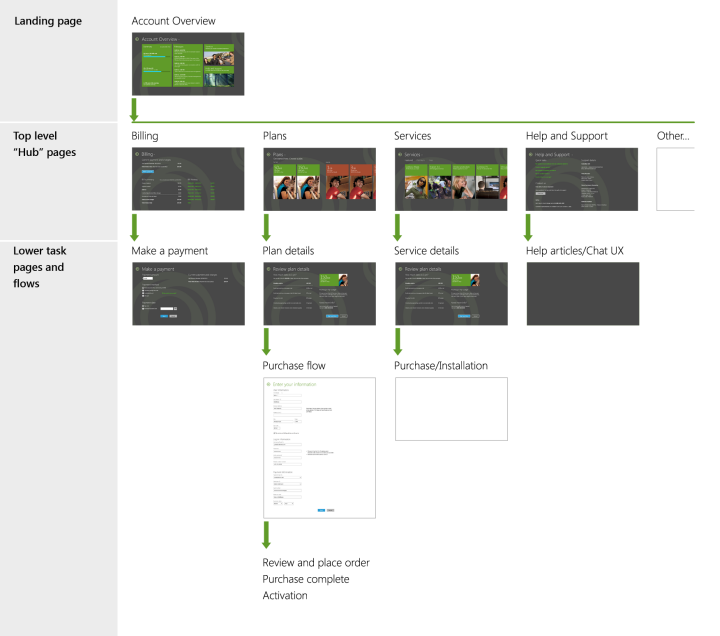

# Designing the user experience of a mobile broadband app

This topic provides information about how to design UWP mobile broadband apps for Windows 10. It provides user experience design guidelines to design apps for users to manage their mobile broadband account and service. It assumes you familiar with mobile broadband technology, Windows mobile broadband networking, and the Microsoft Store app platform.

The following sections are available in this topic:

-   [Key scenarios](#keyui)

-   [App organization](#apporg)

-   [Additional resources](#resources)

## Key scenarios

The mobile broadband app should include the following key scenarios:

-   **Plan purchase**

    -   Purchase a new subscription to data service.

    -   Refill account balance to a plan.

-   **Account management** Displays account data and current plan information.

-   **View data usage**

    -   Display current data usage and billing cycle information.

    -   Update Windows with the latest data usage.

-   **Notifications** Display data usage and other important account and service messages.

-   **Help and Support** Display troubleshooting and customer support contact information.

## App organization

The following shows how different pages in the app can be organized:

-   The app has an account overview landing page that provides a summary of a customer’s account and data usage. It also contains links to other app pages.

-   From the landing page, end users can visit a hub page to view billing, plans, services, or help and support details.

-   Some hub pages lead to task pages and flows, such as a purchase checkout flow.

**Tip**  
For prepaid plans, the account overview could directly link to a **Make a Payment** page for refill scenarios.

 

For more information about how to design these pages, see the following topics:

-   [Design the landing page of a mobile broadband app](design-the-landing-page-of-a-mobile-broadband-app.md)

-   [Design branding in a mobile broadband app](design-branding-in-a-mobile-broadband-app.md)

-   [Design account balance and usage info in a mobile broadband app](design-account-balance-and-usage-info-in-a-mobile-broadband-app.md)

-   [Design messages in a mobile broadband app](design-messages-in-a-mobile-broadband-app.md)

-   [Design billing pages in a mobile broadband app](design-billing-pages-in-a-mobile-broadband-app.md)

-   [Design purchase flows in a mobile broadband app](design-purchase-flows-in-a-mobile-broadband-app.md)

-   [Design help and support pages in a mobile broadband app](design-help-and-support-pages-in-a-mobile-broadband-app.md)

-   [Design services and goods pages in a mobile broadband app](design-services-and-goods-pages-in-a-mobile-broadband-app.md)

-   [Integrate a mobile broadband app with other Windows components](integrate-a-mobile-broadband-app-with-other-windows-components.md)

## Additional resources

-   [Index of UX guidelines for UWP apps](https://msdn.microsoft.com/library/windows/apps/hh465424)

-   [Overview of mobile broadband](overview-of-mobile-broadband.md)

 

 

