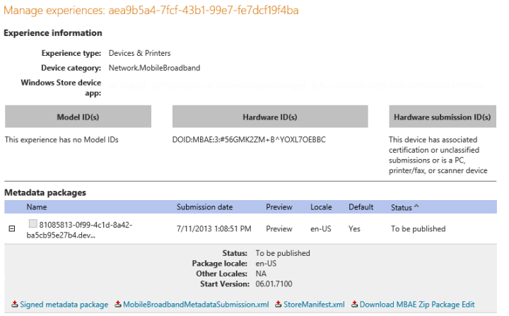

# Developer guide for creating service metadata

[!include[MBAE deprecation warning](mbae-deprecation-warning.md)]


This guide walks you through the process of creating a service metadata package on the Windows Dev Center hardware dashboard, previously known as Sysdev (<http://sysdev.microsoft.com>). Service metadata is required to connect a mobile broadband app to your hardware device. When a user plugs a mobile broadband device into their computer, the associated service metadata is downloaded and then the mobile broadband app is automatically downloaded.

You can leverage service metadata to create a deeply integrated experience with Windows. Service metadata packages allow you to include branding information, such as icons and your operator name, configure settings and permissions for accessing SIM hardware and personal hotspots, and provision mobile broadband apps to work with your mobile broadband device.

**Note**  
Even though the mobile broadband app is automatically installed, the user must pin it to the Start Screen manually.


## <span id="Getting_started"></span><span id="getting_started"></span><span id="GETTING_STARTED"></span>Getting started


To create a successful service metadata package, you must complete the steps included in this section.

### <span id="Register_your_company_with_the_Windows_Dev_Center_hardware_dashboard"></span><span id="register_your_company_with_the_windows_dev_center_hardware_dashboard"></span><span id="REGISTER_YOUR_COMPANY_WITH_THE_WINDOWS_DEV_CENTER_HARDWARE_DASHBOARD"></span>Register your company with the Windows Dev Center hardware dashboard

-   Your company has an active account on the Windows Dev Center hardware dashboard. If your company does not have an account on the Windows Dev Center hardware dashboard, you can create a new account and add your user account to you company. For more info, see [Administration](https://msdn.microsoft.com/library/windows/hardware/mt786447) in the Windows Dev Center hardware dashboard help.

-   Your company has a VeriSign code signing certificate to sign the packages.

### <span id="Service_Metadata_wizard_access_and_service_identifiers_registration"></span><span id="service_metadata_wizard_access_and_service_identifiers_registration"></span><span id="SERVICE_METADATA_WIZARD_ACCESS_AND_SERVICE_IDENTIFIERS_REGISTRATION"></span>Service Metadata wizard access and service identifiers registration

MNOs and MVNOs must complete the following steps before you can create a service metadata package:

-   Request access to the Service Metadata wizard

-   Register your service identifiers

To complete the steps above, you must send an email to sysdev@microsoft.com with the following info:

-   The organization name used when you registered for the Windows Dev Center hardware dashboard.

-   Whether you are a mobile network operator or a mobile virtual network operator.

-   Your website and justification on why you need to create a service metadata package.

Include the following service identifiers as applicable:

-   List of GSM Provider IDs

-   List of GSM Provider Names

-   List of CDMA SIDs

-   List of CDMA Provider Names

You should receive an acknowledgement emails with 24 hours that your request was received. However, it could take up to 5 business days to process the request. If we have conflicts, we’ll send you an email asking for additional information.

### <span id="Mobile_broadband_app"></span><span id="mobile_broadband_app"></span><span id="MOBILE_BROADBAND_APP"></span>Mobile broadband app

Before you create your service metadata package, ensure that your mobile broadband app has been developed and associated with the Microsoft Store. This app should provide key experiences, such as plan purchase, data usage, help and support, as well as highlighting value-added services from the operator. For more info about creating the mobile broadband app, see the following links:

-   [Mobile broadband WinRT API overview](mobile-broadband-winrt-api-overview.md)

-   [Mobile operator hardware overview](mobile-operator-hardware-overview.md)

-   [UWP mobile broadband apps](uwp-mobile-broadband-apps.md)

**Note**  
The mobile broadband app doesn’t have to be published to the Microsoft Store until the service metadata has been tested and is ready to be published externally. We recommend that the app is published to the Microsoft Store only after the service metadata package passes preview mode testing.


## <span id="Creating_service_metadata_packages"></span><span id="creating_service_metadata_packages"></span><span id="CREATING_SERVICE_METADATA_PACKAGES"></span>Creating service metadata packages


Creating a service metadata package starts with the Service Metadata wizard that is available on the Windows Dev Center hardware dashboard. For more info on the Service Metadata wizard, see [Step 2- Create the service metadata package](#2-create-the-service-metadata-package). You can use the Service Metadata wizard to create a new or edit an existing service metadata package. As you go through the wizard and fill out the values, the wizard will validate and notify you of any errors or warnings. This validation includes checking for missing or incorrect fields, service identifier ownership, mobile broadband app existence in the Microsoft Store, and so on.

When you are on the final confirmation page and ready to submit, you have the option of submitting your package either in **Developer** mode or **Preview** mode.

-   **Developer mode** Used during the initial stages when your intent is to simply create service metadata packages and use it for offline test purposes. In this mode, the package will not be signed and will have to be manually downloaded and installed to the test machine for validation purposes. This mode can be viewed as a quick and rapid way to create and verify service metadata packages works with your device.

-   **Preview mode** Used when you are confident that the package is authored correctly and is ready for submission for end to end testing. In this mode, the package will be signed by the Windows Dev Center hardware dashboard and will automatically get downloaded to test machines, provided your test machines are provisioned correctly.

When you have completed preview testing, and verified your package works for all scenarios, then you can publish the package to live.

The following diagram discusses the workflow:


To create a new service metadata package, see [Steps for creating a service metadata package](#steps-for-creating-a-service-metadata-package).

To edit an existing service metadata package, see [Steps for editing a service metadata package](#steps-for-editing-a-service-metadata-package).

## Steps for creating a service metadata package


Use the following steps to create a service metadata package on the Windows Dev Center hardware dashboard:

-   [1-Gather the required information for the service metadata package](#1-gather-the-required-information-for-the-service-metadata-package)

-   [2-Create the service metadata package](#2-create-the-service-metadata-package)

-   [3-Insert the store manifest file into the Microsoft Store device app](#3-insert-the-store-manifest-file-into-the-uwp-device-app)

-   [4-Test the service metadata package](#4-test-the-service-metadata-package)

-   [5-Publish the service metadata package](#5-publish-the-service-metadata-package)

### 1-Gather the required information for the service metadata package

As you go through the steps in the Service Metadata Wizard in Step 2 of this topic, several pieces of information stored in the package.appxmanifest file from the mobile broadband app project that you want to associated with the device is required. Use the following steps to gather the information so that it’s ready for Step 2 of this topic.

**Caution**  
The mobile broadband app must be associated with the Microsoft Store before you gather the values in this step. When you associate a mobile broadband app, the values in the package manifest file are updated to use the information from your Microsoft Store developer account. However, the mobile broadband app does not have to be published to the Microsoft Store. It can stay in your local development environment until you are ready to publish the service metadata package.


**To gather UWP device app information**

1.  Open the mobile broadband app project by using Visual Studio 2013.

2.  In the right hand pane, right click the **Package.appxmanifest** file, and then click **View Code**.

3.  Gather the following attributes from the package.appxmanifest file:

    -   From the **Identity** element, the **Name** attribute will be used for the **Package name** field in the Service Metadata Wizard.

    -   From **Identity** element, the **Publisher** attribute will be used for the **Publisher** field in the Service Metadata Wizard.

    -   From the **Applications** element, the **Id** attribute from the **Application** child element will be used for the **App ID** field in the Service Metadata Wizard.

4.  Close the package.appxmanifest file.


You can also complete this without using Visual Studio 2013 by doing the following steps:

**To gather mobile broadband app information without using Visual Studio 2013**

1.  Navigate to the package.appxmanifest file for your mobile broadband app.

2.  Right-click the file, and then click **Open with**.

3.  Clear the **Use this app for all .appxmanifest files** check box, click **More options**, and then click **Notepad**.

4.  Gather the following attributes from the package.appxmanifest file:

    -   From the **Identity** element, the **Name** attribute will be used for the **Package name** field in the Service Metadata Wizard.

    -   From **Identity** element, the **Publisher** attribute will be used for the **Publisher** field in the Service Metadata Wizard.

    -   From the **Applications** element, the **Id** attribute from the **Application** child element will be used for the **App ID** field in the Service Metadata Wizard.

5.  Save and close the package.appxmanifest file.

### 2-Create the service metadata package

Service metadata is created by using the Service Metadata Wizard in the Windows Dev Center hardware dashboard.

**To create a service metadata package**

1.  Navigate to <http://sysdev.microsoft.com>.

2.  Under the **Device metadata** heading, click **Create mobile broadband experience**.

    

3.  On the **Service info** page, complete the following fields, and then click **Next**.

    -   **Enter the name for your network that is to be used in the Windows network selection UI** – The name of you network that will be displayed to customers in Windows Connection Manager.

    -   **Enter your service number** – A GUID that must match the carrier ID field in your provisioning metadata. You can create a GUID by using Visual Studio 2013. For more information on how to create a GUID, see [Create GUID (guidgen.exe)](http://go.microsoft.com/fwlink/p/?linkid=330070).

    -   **Upload your icon that is to be shown in the Windows network selection UI** – Click **Browse**, and then select the icon that is shown to customers in Windows Connection Manager.

    -   **Enter the Windows notification event handler in your app (optional unless entitlement check is required below)** – This is the notification handler that was registered in your mobile broadband app.

    -   **Do you want to allow users to share their mobile broadband connection (personal hotspot)?** – The possible options are **Always allow**, **Allow only with entitlement check (Windows notification event handler required)**, and **Never allow**. The default option is to always allow.

    -   **Do you want to require system admin privileges to perform PIN unlock on SIMs?** – If you want to require system administrator privileges to PIN unlock a SIM card, click the **Yes** option.

    

4.  On the **Hardware info** page, select the information that should be used to identify your experience. Once a check box is selected, you can add the appropriate network ranges. The ID generated should exist in the Windows APN database so the right subscriber is identified. For more information about the APN database, see [COSA/APN database submission](cosa-apn-database-submission.md).

    -   If you are a GSM Provider that uses the International Mobile Subscriber Identity (IMSI), select the **IMSI** check box under the **GSM** heading. In the **Provider ID** box, enter the GSM service provider ID. Under the **IMSI/ICCID Ranges** heading, enter the range, and then click **Add**.

    -   If you are a GSM provider that uses the integrated circuit card identifier (ICCID), select the **SIM ICC ID** check box under the **GSM** heading. Under the **Enter the Provider ID and ICC ID range** heading, enter the range, and then click **Add**.

    -   If you are a GSM provider that uses the home provider name, select the **Home provider name** check box under the **GSM** heading. Under the **Enter the Home Provider Name or enter the Provider ID (MCC+MNC)** heading, enter the provider ID and provider name, and then click **Add**.

    -   If you are a CDMA provider that uses the SID, select the **SID** check box under the **CDMA** heading. In the **Enter the SID** box, enter the CDMA SID.

    -   If you are a CDMA provider that uses the provider name, select the **Provider name** check box under the **CDMA** heading. In the **Enter Provider Name** box, enter the CDMA service provider name.

    -   Click **Next**.

    

5.  On the **App info** page, enter the information you gathered in Step 1 of this topic. If you want to add additional privileged apps, click **Add**, and then enter up to 7 more. When all of the privileged apps are entered, click **Next**.

    

6.  On the **Confirm** page, verify that the information is correct. Select the **Developer Mode** or **Preview Mode** option, and then click **Submit**.

    -   **Developer Mode** – The package is not signed and it must be manually downloaded and installed on every computer. Use this option if you want to save the package for offline development.

    -   **Preview Mode** – The package is signed and automatically downloaded from Microsoft to test computers with the appropriate registry settings configured. Preview Mode does not check to ensure that the mobile broadband app is published to the Microsoft Store.

    

### 3-Insert the store manifest file into the Microsoft Store device app

A store manifest file must be included with a UWP device app. Use the following steps to download the store manifest file from your service metadata package and insert it into the mobile broadband app project.

**Insert the store manifest file**

1.  On the Windows Dev Center hardware dashboard, on the manage experience page for your service metadata package, click the service metadata package, and then click **StoreManifest.xml** to download your store manifest file.

    

2.  Open the mobile broadband app project by using Visual Studio 2013.

3.  Right-click the project, click **Add**, and then click **Existing Item**.

4.  Browse to the store manifest file that you downloaded, and then click **Add**.

5.  Recompile the mobile broadband app and publish it again to the Microsoft Store.

### 4-Test the service metadata package

To test the service metadata package, you must have the mobile broadband device and the service metadata package files. The instructions to configure your test system and install the service metadata package depend on the mode of the package.

### <span id="Test_a_service_metadata_package_in_developer_mode"></span><span id="test_a_service_metadata_package_in_developer_mode"></span><span id="TEST_A_SERVICE_METADATA_PACKAGE_IN_DEVELOPER_MODE"></span>Test a service metadata package in developer mode

You must manually download the package and install it in the right location for the scenarios to work correctly. Your developer mode package will need to be accessed from two different entry points depending on whether you authored a new package or an existing package.

If you created a new package, in the Windows Dev Center hardware dashboard, click **Manage experiences**, and then click **Unassociated Dev Packages** (the first entry in the **Manage experiences** table). The following figure shows an example:


If you edited an existing service metadata package that is already associated with an experience, select the experience from the **Manage experiences** table, and you will see the developer mode package in the **Metadata packages** table. Click **Download MBAE Zip Package Edit** to download it.


After you’ve download the service metadata package, you must enable test signing because the service metadata package is not signed. To enable test signing, **run bcdedit –set testsigning on** from an elevated command prompt and then restart your computer.

After test signing is enabled, copy the \*.devicemetadata-ms file from the service metadata package to the following location: **%ProgramData%\\Microsoft\\Windows\\DeviceMetadataStore\\**<em>culture</em>, where *culture* is the current culture code for your computer.

### <span id="Test_a_service_metadata_package_in_preview_mode"></span><span id="test_a_service_metadata_package_in_preview_mode"></span><span id="TEST_A_SERVICE_METADATA_PACKAGE_IN_PREVIEW_MODE"></span>Test a service metadata package in preview mode

If the service metadata package is in preview mode, you must create the PreviewKey registry entry on your test computer. For more info about configuring the PreviewKey registry entry, see [Creating a Preview Package](https://msdn.microsoft.com/library/windows/hardware/br230780).

**Note**  
You do not have to enable test signing to test a service metadata package that is in preview mode.


After the PreviewKey registry entry is created, plug in your mobile broadband device and ensure that it shows in the Networks list. If it does not, see the [Troubleshooting](#troubleshooting) section for more info.

### <span id="Clear_the_existing_service_metadata"></span><span id="clear_the_existing_service_metadata"></span><span id="CLEAR_THE_EXISTING_SERVICE_METADATA"></span>Clear the existing service metadata

When service metadata is installed on a PC, the values contained in the metadata are stored in many different places, including the registry, metadata cache, metadata store, WWAN profiles and dev node. This can make it challenging to repeat multiple tests with the same, or different, metadata packages. To ensure that the service metadata is installed correctly, you should clear any existing service metadata. You can clear existing service metadata by setting up your test computer to run a PowerShell script that removes all traces. First, you must set up the environment on your test computer:

**Note**  
This will not work on a Windows RT device. Use the steps in the procedure named “To clear service metadata on a device running Windows RT”.


**To set up the environment for clearing service metadata**

1.  Download psexec.exe (<http://go.microsoft.com/fwlink/p/?linkid=330071>), and then extract it to a folder.

2.  Download and install the Windows Driver Kit Windows 8.1 (<http://go.microsoft.com/fwlink/?LinkId=330072>).

3.  Navigate to where the WDK files are installed. The default location is **C:\\Program Files (x86)\\Windows Kits\\8.1\\Tools**. If your test computer is running x86, copy devcon.exe from the x86 folder into the same folder as psexec.exe. If your test computer is running x64, copy devcon.exe from the x64 folder.

4.  Save the following script as MetadataRemovalScript.ps1 in the same folder as Devcon.exe and PsExec.exe.

    **Note**  
    In the **Save as type** box, make sure to select **All files (\*.\*)** before saving the file.


```PowerShell
# DEVICE SHOULD BE CONNECTED TO MACHINE

Write-Host "Launching devcon to remove MBAE software device nodes devcon.exe remove @SWD\MBAE\*"
$DevconParameters = ' remove @SWD\MBAE\* '
try
{
   Start-Process devcon.exe -ArgumentList $DevconParameters
}
catch
{
   $Error[0] # Dump details about the last error
   Write-Host "Error running devcon.exe " $DevconParameters
   exit
}

Write-Host "Removing MB Profiles"
$mbprcmd = "mbn sh pr i=*"
$mddelprcmd = "mbn del pr i=* name="

$cmdout = $mbprcmd | netsh | Out-String

$tokens = $cmdout.Split( [String[]] ("`r`n"), [StringSplitOptions]::RemoveEmptyEntries)

if($tokens.Length -gt 3)
{
   for($i=3;$i -lt $tokens.Length-1;$i++)
   {
      $x = $mddelprcmd + '"' + $tokens[$i].trim() +'"'
      Write-Host "Deleting Profile Cmd :" $x
      $x | netsh
   }
}

Write-Host ""
Write-Host "Disabling ALL Mobile Broadband Adapters"
$MBAdapters = Get-Netadapter -Name "Mobile Broadband*"

foreach($MBAdapter in $MBAdapters)
{
   Write-Host "Disabling MB Adapter :"$MBAdapter.Name
   Disable-NetAdapter -Name $MBAdapter.Name -Confirm:$false
}

Write-Host "Stopping Device Setup Manager Service"
Stop-Service DsmSvc

Write-Host "Removing MBAE metadata packages in store"
#Find Package Ids
$MBAEPackageRegKeyHive = "HKLM:\SOFTWARE\Microsoft\WwanSvc\MobileBroadbandAccounts\Accounts\"
if(Test-Path $MBAEPackageRegKeyHive)
{
    $DevMetadataStorePath = join-path -Path $Env:ProgramData -ChildPath "Microsoft\Windows\DeviceMetadataStore"

    $PackageIds = Get-ChildItem $MBAEPackageRegKeyHive | ForEach-Object {Get-ItemProperty $_.pspath} | where-object {$_.MetadataPackageId} | Foreach-Object {$_.MetadataPackageId}
    foreach($PackageId in $PackageIds)
    {
        $PackageStoreFile = $PackageId + ".devicemetadata-ms"        
        $PackageStorePath = Get-ChildItem $DevMetadataStorePath -Recurse -Filter $PackageStoreFile
        if($PackageStorePath -ne $null)
        {
            Write-Host "Deleting Device Metadata Store @" $PackageStorePath.FullName
            Remove-Item -Force $PackageStorePath.FullName
        }
    }
}

Write-Host "Removing all metadata from cache"
$DevMetadataCachePath = join-path -Path $Env:ProgramData -ChildPath "Microsoft\Windows\DeviceMetadataCache\*"
if(Test-Path $DevMetadataCachePath)
{
   Write-Host "Delete All Metadata Packages under "$DevMetadataCachePath
   Remove-Item -Recurse -Force $DevMetadataCachePath
}

Write-Host "Cleanup MBAE registry keys"
$MBAERegKeyPath = "HKLM:\SOFTWARE\Microsoft\WwanSvc\MobileBroadbandAccounts\*"
if(Test-Path $MBAERegKeyPath)
{
    Write-Host "Found MBAE reg keys - deleting"   
    Remove-Item -Path $MBAERegKeyPath -Recurse
}

Write-Host "Enabling all MB Adapters, press any key to continue"
$keypress = $host.UI.RawUI.ReadKey("NoEcho,IncludeKeyUp")

$MBAdapters = Get-Netadapter -Name "Mobile Broadband*"

foreach($MBAdapter in $MBAdapters)
{
   Write-Host "Enabling MB Adapter :"$MBAdapter.Name
   Enable-NetAdapter -Name $MBAdapter.Name -Confirm:$false
}


Write-Host "END of Script"

# DEVICE SHOULD BE CONNECTED TO MACHINE

Write-Host "Launching devcon to remove MBAE software device nodes devcon.exe remove @SWD\MBAE\*"
$DevconParameters = ' remove @SWD\MBAE\* '
try
{
    Start-Process devcon.exe -ArgumentList $DevconParameters    
}
catch
{
    $Error[0] # Dump details about the last error
    Write-Host "Error running devcon.exe " $DevconParameters
    exit
}

Write-Host "Removing MB Profiles"
$mbprcmd = "mbn sh pr i=*"
$mddelprcmd = "mbn del pr i=* name="

$cmdout = $mbprcmd | netsh | Out-String

$tokens = $cmdout.Split( [String[]] ("`r`n"), [StringSplitOptions]::RemoveEmptyEntries)

if($tokens.Length -gt 3)
{
    for($i=3;$i -lt $tokens.Length-1;$i++)
    {
        $x = $mddelprcmd + '"' + $tokens[$i].trim() +'"'
        Write-Host "Deleting Profile Cmd :" $x
        $x | netsh
    }
}

Write-Host ""
Write-Host "Please remove the MB device from the system and press any key to continue"
$keypress = $host.UI.RawUI.ReadKey("NoEcho,IncludeKeyDown")


Write-Host "Removing MBAE metadata packages in cache and store"
#Find Package Ids
$MBAEPackageRegKeyHive = "HKLM:\SOFTWARE\Microsoft\WwanSvc\MobileBroadbandAccounts\Accounts\"
if(Test-Path $MBAEPackageRegKeyHive)
{
    $DevMetadataCachePath = join-path -Path $Env:ProgramData -ChildPath "Microsoft\Windows\DeviceMetadataCache"
    $DevMetadataStorePath = join-path -Path $Env:ProgramData -ChildPath "Microsoft\Windows\DeviceMetadataStore"

    $PackageIds = Get-ChildItem $MBAEPackageRegKeyHive | ForEach-Object {Get-ItemProperty $_.pspath} | where-object {$_.MetadataPackageId} | Foreach-Object {$_.MetadataPackageId}
    foreach($PackageId in $PackageIds)
    {
        $PackageCacheFolder = Get-ChildItem $DevMetadataCachePath -Recurse -Filter $PackageId
        if($PackageCacheFolder -ne $null)
        {
            Write-Host "Deleting Device Metadata Cache @" $PackageCacheFolder.FullName
            Remove-Item -Recurse -Force $PackageCacheFolder.FullName
        }
        $PackageStoreFile = $PackageId + ".devicemetadata-ms"        
        $PackageStorePath = Get-ChildItem $DevMetadataStorePath -Recurse -Filter $PackageStoreFile
        if($PackageStorePath -ne $null)
        {
            Write-Host "Deleting Device Metadata Store @" $PackageStorePath.FullName
            Remove-Item -Force $PackageStorePath.FullName
        }
    }
}

Write-Host "Cleanup MBAE registry keys"
$MBAERegKeyPath = "HKLM:\SOFTWARE\Microsoft\WwanSvc\MobileBroadbandAccounts\*"
if(Test-Path $MBAERegKeyPath)
{
    Write-Host "Found MBAE reg keys - deleting"   
    Remove-Item -Path $MBAERegKeyPath -Recurse
}


Write-Host "END"
```


After the environment is set up, run the following steps each time that you want to clear any existing service metadata:

**To clear the service metadata**

1.  Ensure that the mobile broadband device is plugged into your test computer.

2.  From an elevated command prompt, navigate to the folder where you extracted psexec.exe, and then run **psexec /s /i powershell**

3.  In the PowerShell command prompt, navigate to the folder where you extracted psexec.exe.

4.  Type **set-executionpolicy unrestricted** and then press Enter.

5.  Type **Y** and then Enter.

6.  Type **.\\MetadataRemovalScript.ps1** and then press Enter.

7.  When prompted, remove the mobile broadband device, and then press Enter.

8.  Repeat these steps each time you want to clear the service metadata from your test computer.

**To clear service metadata on a device running Windows RT**

1. Remove the software device nodes.

   1.  In Device Manager, click **View**, and then click **Show hidden devices**.

   2.  Expand Software devices.

   3.  Right-click the following device nodes, and then click **Uninstall**: **Windows.Devices.Sms.SmsDevice** and **Windows.Networking/NetworkOperators.MobileBroadbandAccount**

2. Remove all mobile broadband profiles from all interfaces.

   1. From an elevated command prompt, type **netsh mbn sho pro i=\\***

   2. For each of the profiles, type **netsh mbn delete profile name = “The profile name here” i=\\*** and then press Enter.

3. Disable all mobile broadband adapters.

   1.  In Device Manager, expand **Network adapters**.

   2.  Right-click each mobile broadband device, and then click **Disable**.

4. From an elevated command prompt, stop the DSM service by typing **sc stop dsmsvc** and then press Enter.

5. Remove your service metadata packages from the device metadata store by deleting any folder that contains your service metadata package from **%ProgramData%\\Microsoft\\Windows\\DeviceMetadataStore**. You can identify service metadata packages by looking for the MobileBroadbandInfo.xml file.

6. Delete all WWAN SVC MBAE registry entries.

   1.  In Registry Editor, delete the following registry entry and all child entries: HKEY\_LOCAL\_MACHINE\\Software\\Microsoft\\WwanSvc\\MobileBroadbandAccounts.

   2.  If you don’t have access to delete the registry entry, you must give yourself Full Control permissions.

7. Enable all mobile broadband adapters.

   1.  In Device Manager, expand **Network adapters**.

   2.  Right-click each mobile broadband device, and then click **Enable**.

### 5-Publish the service metadata package

Once you have confirmed that the service metadata package works correctly, the final step is to release the package. You can release the package by selecting the package attached to the specific experience by clicking the **Release** button, as shown below.


## Steps for editing a service metadata package


You can edit a service metadata package by using the Manage Experiences page of the Windows Dev Center hardware dashboard.



## Troubleshooting


Open the networks list and look for your mobile broadband network. If the network is listed by using the name and icon that you used in the service metadata package **ServiceInfo.xml** file, the package is correctly parsed. If you are updating a service metadata package that has the same name and icon, or if the name or icon has not appeared in the list after about approximately one minute, you should perform additional steps, as discussed here:

-   Force a metadata refresh

-   Check the metadata cache

-   Check the registry

-   Check the WWAN Logs

### <span id="forcemdref"></span><span id="FORCEMDREF"></span>Force a metadata refresh

Some parts of the metadata and mobile broadband app systems rely on network access, which can fail and leave the computer in an inconsistent state. If this happens, you can encounter a situation where service metadata is not installed or the mobile broadband app is not installed. The system periodically tries to remedy the situation, but to conserve power, retries are fairly infrequent (just a few times a day). Instead of waiting for the next retry, you can manually force a refresh to happen immediately. To do this, perform the following steps:

1.  Open the desktop **Control Panel**.

2.  Open **Devices and Printers**.

3.  From the **View** menu, click **Refresh**, or press the **F5** key. This action causes metadata to be reparsed and background events to be re-registered.

**Important**  
If a service metadata package has already been successfully parsed, the system will treat this refresh as a metadata update. In this case, your metadata package must have a different GUID in its filename and an updated timestamp in the [LastModifiedDate](lastmodifieddate.md) element of **PackageInfo.xml**.


### <span id="checkmdcache"></span><span id="CHECKMDCACHE"></span>Check the metadata cache

If a metadata refresh did not fix the problem, make sure that the service metadata package is valid and that it has the correct Hardware IDs. To do this, perform the following steps:

1. Navigate to **%programdata%\\Microsoft\\Windows\\DeviceMetadataCache\\dmrccache\\**<em>culture</em>, where *culture* is the culture code for the current culture of your test computer (for example, **en-us** or **es-es**).

2. Look for a folder that has the same name as your metadata package (without the **.devicemetadata-ms** extension). If this directory does not exist, it can mean one of four things:

   -   The service metadata package is corrupt.

   -   The service metadata package does not have the correct Hardware IDs.

   -   The mobile broadband device is not in a state where metadata can be downloaded, or you plugged in the device before you copied the service metadata package.

   -   A problem occurred when checking the digital signature on the metadata package. This is usually caused by not having test signing enabled on your test computer.

If you’re sure that the package is not corrupted and that you first plugged in the mobile broadband device after you copied the service metadata package, check the IMSI ranges. It’s very easy to type in too many or too few 0s or 9s. If the problem persists after confirming or correcting these items, you must look at the registry.

### <span id="checkreg"></span><span id="CHECKREG"></span>Check the registry

**Warning**  
You should not edit registry data that does not belong to your application unless it is absolutely necessary. If there is an error in the registry, your system might not function properly. Do not, under any circumstances, delete the **MobileBroadbandAccounts** registry key. Windows will not re-create it and you will break the feature.


Perform the following steps to check the registry:

1.  Open Registry Editor.

2.  Go to **HKLM\\SOFTWARE\\Microsoft\\WwanSvc\\MobileBroadbandAccounts**.

3.  Inside this registry key, look for three other keys: **Accounts**, **NetworkInterfaceBindings**, and **Data**. These keys do not exist by default; they are automatically created the first time that a mobile broadband device is inserted, turned on, or connected.

4.  If the **Accounts** or **NetworkInterfaceBindings** keys do not exist and you have already plugged in or turned on your mobile broadband adapter, check the WWAN logs.

5.  If some or all of these keys exist, expand the **Accounts** key in the **Tree** view. One or more registry keys that have names similar to GUIDs should exist inside it. The registry tree entries should be similar to the registry tree that is displayed below:

    

    If the registry key looks similar to the above figure (the value names will vary slightly depending on whether the account is on a GSM or CDMA network), and if you do not see the icon in the networks list, you should look at the event logs.

    If the Registry entries are similar to the next figure, it means that the mobile broadband adapter was inserted before the service metadata package was copied into the device metadata store, the service metadata package is corrupted, or the Hardware IDs are incorrect. To remedy a situation where you plugged in or turned on the device before copying the metadata package into the metadata store, perform the steps in Force a metadata refresh. Otherwise, follow the steps in Check the WWAN Logs.

    

### <span id="checkwwanlogs"></span><span id="CHECKWWANLOGS"></span>Check the WWAN Logs

If there are no **Accounts** or **NetworkInterfaceBindings** registry keys under **HKLM\\SOFTWARE\\Microsoft\\WwanSvc\\MobileBroadbandAccounts**, or if there are entries that are not fully populated, you must look at the WWAN logs. The following steps will reset the computer to a known state:

1.  Unplug or turn off your mobile broadband device (if the device is embedded, disable it in the **Device Manager**).

2.  Delete the following registry keys:

    -   **HKLM\\SOFTWARE\\Microsoft\\WwanSvc\\MobileBroadbandAccounts\\Accounts**

    -   **HKLM\\SOFTWARE\\Microsoft\\WwanSvc\\MobileBroadbandAccounts\\NetworkInterfaceBindings**

    **Warning**  
    Do not, under any circumstances, delete the **HKLM\\SOFTWARE\\Microsoft\\WwanSvc\\MobileBroadbandAccounts\\** registry key. Windows will not re-create it and you will break the feature.


There are two types of entries that are of interest in the logs: account management WWAN service entries log entries, and parser task entries. The first type can help debug issues that are caused by problems with the networking hardware, and the second type can help debug metadata parsing issues.

Account management WWAN service entries log entries for a network that is successfully processed are similar to the following:

```syntax
[0]02CC.0CD0::‎2012‎-‎01‎-‎04 09:22:26.567 [Microsoft-Windows-WWAN-SVC-EVENTS]Account Management: Account updater started for network interface {7a0a0dce-0a51-471a-8c16-6e767cd0b861. 
[0]02CC.0CD0::‎2012‎-‎01‎-‎04 09:22:26.567 [Microsoft-Windows-WWAN-SVC-EVENTS]Account Management: Getting home provider ID from hardware device for network interface {7A0A0DCE-0A51-471A-8C16-6E767CD0B861}.  Provider ID is "234567". 
[0]02CC.0CD0::‎2012‎-‎01‎-‎04 09:22:26.567 [Microsoft-Windows-WWAN-SVC-EVENTS]Account Management: Getting home provider name from hardware device for network interface {7A0A0DCE-0A51-471A-8C16-6E767CD0B861}.  Provider name is "MS GSM". 
[0]02CC.0CD0::‎2012‎-‎01‎-‎04 09:22:26.586 [Microsoft-Windows-WWAN-SVC-EVENTS]Account Management: Network identity not recognized, assigning new network account ID. 
[0]02CC.0CD0::‎2012‎-‎01‎-‎04 09:22:26.597 [Microsoft-Windows-WWAN-SVC-EVENTS]Account Management: Devnode create/update started. 
[0]02CC.0CD0::‎2012‎-‎01‎-‎04 09:22:26.617 [Microsoft-Windows-WWAN-SVC-EVENTS]Account Management: Devnode create/update finished. 
[0]02CC.0CD0::‎2012‎-‎01‎-‎04 09:22:26.617 [Microsoft-Windows-WWAN-SVC-EVENTS]Account Management: Data store create/update started. 
[0]02CC.0CD0::‎2012‎-‎01‎-‎04 09:22:26.707 [Microsoft-Windows-WWAN-SVC-EVENTS]Account Management: Data store create/update finished. 
[0]02CC.0CD0::‎2012‎-‎01‎-‎04 09:22:26.707 [Microsoft-Windows-WWAN-SVC-EVENTS]Account Management: Account updater finished for network interface {7a0a0dce-0a51-471a-8c16-6e767cd0b861}.
```

You can find these entries by searching the log for **Account Management**. In this case, the most important entries are **Data store create/update started** and **Data store create/update finished**. If these entries exist and have no error messages, the hardware is behaving correctly. (The data store that is referred to here contains the registry keys that are discussed in Check the registry.)

By contrast, on a device where the SIM is removed, the entries typically look like the following:

```syntax
[0]02CC.03E4::‎2012‎-‎01‎-‎04 09:29:50.309 [Microsoft-Windows-WWAN-SVC-EVENTS]Account Management: Account updater started for network interface {7a0a0dce-0a51-471a-8c16-6e767cd0b861}. 
[0]02CC.03E4::‎2012‎-‎01‎-‎04 09:29:50.309 [Microsoft-Windows-WWAN-SVC-EVENTS]Account Management: Detected removal of SIM from device bound to network interface {7A0A0DCE-0A51-471A-8C16-6E767CD0B861}. 
[0]02CC.03E4::‎2012‎-‎01‎-‎04 09:29:50.309 [Microsoft-Windows-WWAN-SVC-EVENTS]Account Management: Devnode create/update started. 
[0]02CC.03E4::‎2012‎-‎01‎-‎04 09:29:50.309 [Microsoft-Windows-WWAN-SVC-EVENTS]Account Management: Devnode create/update finished. 
[0]02CC.03E4::‎2012‎-‎01‎-‎04 09:29:50.309 [Microsoft-Windows-WWAN-SVC-EVENTS]Account Management: Account updater finished for network interface {7a0a0dce-0a51-471a-8c16-6e767cd0b861}. 
```

**Note**  
In the latter example, there are no entries for **Data store create/update started** or **Data store create/update finished**. Because information stored in the SIM is critical to the account management process, a device that does not have a SIM will not have the necessary associated metadata.


If the hardware was successfully processed, but your logo or name do not display in the networks list, there might be a problem with the metadata package. This can be investigated by using the parser task entries in the log. To find these entries, search for **Parser-Task**. Log entries for a successful parse typically look like the following:

```syntax
[0]0DA8.0A2C::‎2012‎-‎01‎-‎04 09:22:32.007 [Microsoft-Windows-Mobile-Broadband-Experience-Parser-Task]Parser task started. 
[0]0DA8.0A2C::‎2012‎-‎01‎-‎04 09:22:32.030 [Microsoft-Windows-Mobile-Broadband-Experience-Parser-Task]Parsing metadata for device container with id "{972238E7-36F4-11E1-BC81-00155DE96B01}" for culture "en-US". 
[0]0DA8.0A2C::‎2012‎-‎01‎-‎04 09:22:32.297 [Microsoft-Windows-Mobile-Broadband-Experience-Parser-Task]Starting parse of mobile broadband service information file. 
[0]0DA8.0A2C::‎2012‎-‎01‎-‎04 09:22:32.297 [Microsoft-Windows-Mobile-Broadband-Experience-Parser-Task]Metadata package contains no data for culture "en-US". Using fallback data. 
[0]0DA8.0A2C::‎2012‎-‎01‎-‎04 09:22:32.356 [Microsoft-Windows-Mobile-Broadband-Experience-Parser-Task]Finished parse of mobile broadband service information file. 
[0]0DA8.0A2C::‎2012‎-‎01‎-‎04 09:22:32.356 [Microsoft-Windows-Mobile-Broadband-Experience-Parser-Task]Starting update of stored network account information. 
[0]0DA8.0A2C::‎2012‎-‎01‎-‎04 09:22:32.377 [Microsoft-Windows-Mobile-Broadband-Experience-Parser-Task]The mobile broadband account now contains service provider information. 
[0]0DA8.0A2C::‎2012‎-‎01‎-‎04 09:22:32.378 [Microsoft-Windows-Mobile-Broadband-Experience-Parser-Task]Finished update of stored network account information. 
[0]0DA8.0A2C::‎2012‎-‎01‎-‎04 09:22:32.378 [Microsoft-Windows-Mobile-Broadband-Experience-Parser-Task]Applying WWAN profiles for service provider Contoso GSM. 
[0]0DA8.0A2C::‎2012‎-‎01‎-‎04 09:22:32.378 [Microsoft-Windows-Mobile-Broadband-Experience-Parser-Task]Starting creation and/or update of WWAN profiles. 
[0]02CC.0CD0::‎2012‎-‎01‎-‎04 09:22:32.512 [Microsoft-Windows-WWAN-SVC-EVENTS]WWAN Service event: Profile Update Notification received 
[0]02CC.0CD0::‎2012‎-‎01‎-‎04 09:22:32.519 [Microsoft-Windows-WWAN-SVC-EVENTS]WWAN Service event: Complete Scanning 
[0]02CC.0CD0::‎2012‎-‎01‎-‎04 09:22:32.519 [Microsoft-Windows-WWAN-SVC-EVENTS]WWAN Service event: WWAN Interface information 
[0]02CC.0CD0::‎2012‎-‎01‎-‎04 09:22:32.586 [Microsoft-Windows-WWAN-SVC-EVENTS]WWAN Service event: Profile Update Notification received 
[0]02CC.0CD0::‎2012‎-‎01‎-‎04 09:22:32.651 [Microsoft-Windows-WWAN-SVC-EVENTS]WWAN Service event: Profile Update Notification received 
[0]0DA8.0A2C::‎2012‎-‎01‎-‎04 09:22:32.659 [Microsoft-Windows-Mobile-Broadband-Experience-Parser-Task]Finished creation and/or update of WWAN profiles. 
[0]0DA8.0A2C::‎2012‎-‎01‎-‎04 09:22:32.659 [Microsoft-Windows-Mobile-Broadband-Experience-Parser-Task]WWAN profiles applied successfully for service provider Contoso GSM. 
[0]0DA8.0A2C::‎2012‎-‎01‎-‎04 09:22:32.659 [Microsoft-Windows-Mobile-Broadband-Experience-Parser-Task]Adding trusted provisioning certificates for service provider Contoso GSM. 
[0]0DA8.0A2C::‎2012‎-‎01‎-‎04 09:22:32.659 [Microsoft-Windows-Mobile-Broadband-Experience-Parser-Task]Starting setting of trusted certificates for network provisioning. 
[0]0DA8.0A2C::‎2012‎-‎01‎-‎04 09:22:33.016 [Microsoft-Windows-Mobile-Broadband-Experience-Parser-Task]Finished setting of trusted certificates for network provisioning. 
[0]0DA8.0A2C::‎2012‎-‎01‎-‎04 09:22:33.016 [Microsoft-Windows-Mobile-Broadband-Experience-Parser-Task]Trusted provisioning certificates added successfully for service provider Contoso GSM. 
[0]0DA8.0A2C::‎2012‎-‎01‎-‎04 09:22:33.017 [Microsoft-Windows-Mobile-Broadband-Experience-Parser-Task]Parser task finished. 
[0]0DA8.0A2C::‎2012‎-‎01‎-‎04 09:22:33.017 [Microsoft-Windows-Mobile-Broadband-Experience-Parser-Task]MbaeParserTask completed successfully. 
```

These logs show that the **MobileBroadbandInfo.xml** file was correctly parsed, that the parser task applied the WWAN profiles (together with the WWAN service logging that successfully updated the profiles), and that the parser task set the trusted provisioning certificates mentioned in **MobileBroadbandInfo.xml**.

If any part of the process failed, that failure is logged. For example, if the digital signature check fails on the service provider icon file, log entries typically look like the following:

```syntax
[0]0F24.0C70::‎2012‎-‎01‎-‎04 10:09:49.271 [Microsoft-Windows-Mobile-Broadband-Experience-Parser-Task]Parser task started. 
[0]0F24.0C70::‎2012‎-‎01‎-‎04 10:09:49.288 [Microsoft-Windows-Mobile-Broadband-Experience-Parser-Task]Parsing metadata for device container with id "{97223B34-36F4-11E1-BC81-00155DE96B01}" for culture "en-US". 
[0]0F24.0C70::‎2012‎-‎01‎-‎04 10:09:49.483 [Microsoft-Windows-Mobile-Broadband-Experience-Parser-Task]Starting parse of mobile broadband service information file. 
[0]0F24.0C70::‎2012‎-‎01‎-‎04 10:09:49.483 [Microsoft-Windows-Mobile-Broadband-Experience-Parser-Task]Metadata package contains no data for culture "en-US". Using fallback data. 
[0]0F24.0C70::‎2012‎-‎01‎-‎04 10:09:49.547 [Microsoft-Windows-Mobile-Broadband-Experience-Parser-Task]Finished parse of mobile broadband service information file. 
[0]0F24.0C70::‎2012‎-‎01‎-‎04 10:09:49.547 [Microsoft-Windows-Mobile-Broadband-Experience-Parser-Task]Starting update of stored network account information. 
[0]0F24.0C70::‎2012‎-‎01‎-‎04 10:09:49.688 [Microsoft-Windows-Mobile-Broadband-Experience-Parser-Task]Digital signature verification failed for file "c:\programdata\microsoft\windows\devicemetadatacache\dmrccache\en-us\B68264FF-E4D1-49B1-AB5F-2B9C1C16EF5D\ServiceInformation\ContosoBroadband.ico". 
[0]0F24.0C70::‎2012‎-‎01‎-‎04 10:09:49.690 [Microsoft-Windows-Mobile-Broadband-Experience-Parser-Task]Finished update of stored network account information. 
[0]0F24.0C70::‎2012‎-‎01‎-‎04 10:09:49.692 [Microsoft-Windows-Mobile-Broadband-Experience-Parser-Task]Parser task finished. 
[0]0F24.0C70::‎2012‎-‎01‎-‎04 10:09:49.692 [Microsoft-Windows-Mobile-Broadband-Experience-Parser-Task]MbaeParserTask did not complete successfully.  Error is 0x80070306: One or more errors occurred while processing the request. 
```

Because it is normal for the parser task to run more than one time, you might see more than one set of `[Microsoft-Windows-Mobile-Broadband-Experience-Parser-Task]` log entries. In this case, the sets of entries are typically the same - if they are not the same, it can indicate an intermittent problem.

## <span id="Additional_resources"></span><span id="additional_resources"></span><span id="ADDITIONAL_RESOURCES"></span>Additional resources


Use the following links to learn more about mobile broadband in Windows 8.1 and Windows 10:

-   [Overview of mobile broadband](overview-of-mobile-broadband.md)

-   [APN database overview](apn-database-overview.md)

-   [Service metadata](service-metadata.md)


