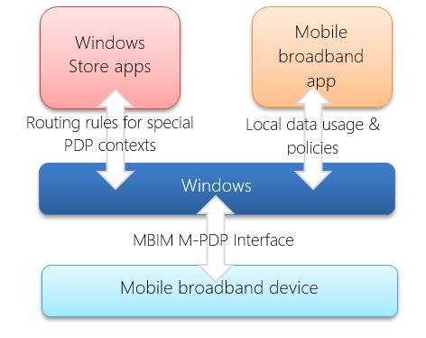
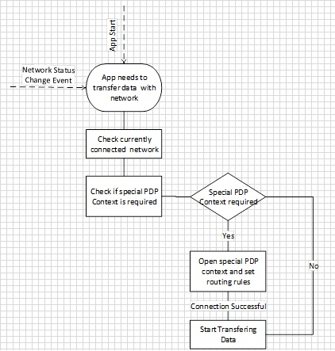
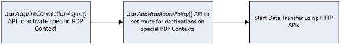
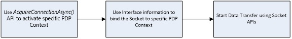
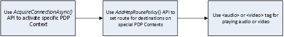
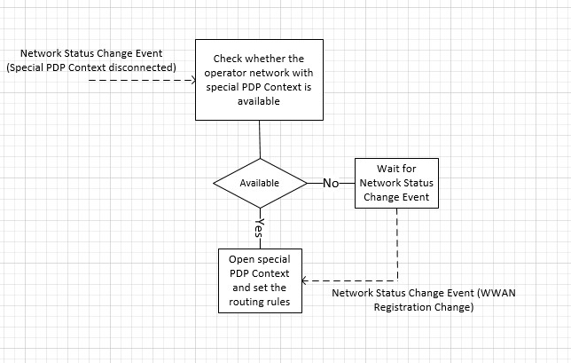

# Developing apps using multiple PDP contexts


A Packet Data Protocol (PDP) context offers a packet data connection over which a device and the mobile network can exchange IP packets. As per 3GPP standards, a device can have more than one PDP context activated at a time. In Windows 8.1 and Windows 10, multiple PDP contexts are supported and enables apps to communicate over special PDP contexts to the mobile networks along with the internet PDP context that was supported in Windows 8. You can use this feature to create differentiated experiences and innovative services on Windows. You can also partner with app developers to develop great quality VOIP and video streaming experiences for their customers.

Here’s a figure that shows how multiple PDP context works in Windows 8.1 and Windows 10:



Use the following sections in this topic to learn more about multiple PDP contexts:

-   [Key scenarios](#key-scenarios)

-   [Mobile broadband apps](#mobile-broadband-apps)

-   [Mobile broadband devices](#mobile-broadband-devices)

## Key scenarios


You can use multiple PDP contexts to enable premium services.

-   **Differentiated Billing** – You can vary the data or billing restrictions by using multiple PDP contexts. For example, Contoso is a mobile operator that developed a data backup app for their customers. As a mobile operator, Contoso could create multiple PDP contexts and let premium subscribers use the app for free. All other subscribers are charged separately to use it.

-   **Rich Communication Services** – A global initiative created by the GSM Association to provide rich communication services, such as an enhanced phonebook, enhanced messaging, and enriched calling. Rich Communication Services provide interoperability across mobile operators and offers new ways to use existing assets and capabilities to deliver high quality and innovative communication services.

-   **Sponsored Connectivity** – This allows users to a specific type of content without it going against their monthly data usage. The content provider makes an arrangement to reimburse the mobile operator by paying them directly, doing a revenue-sharing deal, or some other business arrangement.

-   **Personal Hotspot** – Some mobile operators charge different rates when the connection is being used as a personal hotspot. You can use multiple PDP contexts to differentiate between the two.

## Mobile broadband apps


UWP mobile broadband apps can take advantage of multiple PDP contexts to activate a special PDP context and specify rules to route data traffic. These apps can create rules for specific destinations or for all data traffic.

When the mobile broadband app needs to exchange data with the network, it checks the available and connected networks. If the mobile broadband app has a special rule for any of these networks, it uses the Connection Manager API to open a special PDP context. If this connection is successful, the PDP context provides routing rules for this connection and transfers the data using networking APIs. The mobile broadband app should repeat this if it receives the [**NetworkStatusChanged**](https://msdn.microsoft.com/library/windows/apps/br207299) event to see whether any connections have changed and whether it needs to open a PDP context for the new connection.



### <span id="Networking_APIs"></span><span id="networking_apis"></span><span id="NETWORKING_APIS"></span>Networking APIs

For sending data by using a special PDP context, the Microsoft Store app must use different logic based on networking APIs that it uses for transferring data.

### <span id="HTTP-based_APIs"></span><span id="http-based_apis"></span><span id="HTTP-BASED_APIS"></span>HTTP-based APIs

HTTP-based APIs, such as [**XMLHTTPRequest**](https://msdn.microsoft.com/library/windows/apps/br229787), [IXHR2](https://msdn.microsoft.com/library/windows/desktop/hh831163), [**Windows.Web.Syndication**](https://msdn.microsoft.com/library/windows/apps/br243632), and [**Windows.Web.AtomPub**](https://msdn.microsoft.com/library/windows/apps/br210609), and APIs based on the Windows HTTP protocol, such as JQuery and [**Windows.Web.Http**](https://msdn.microsoft.com/library/windows/apps/dn279692), do not have the ability to bind to a specific interface. For these APIs, Windows handles the routing of data to a special PDP context by using policies. Once the special PDP context is activated, the app can specify routing rules based on destination and special PDP context. The destination can be domain name or IP address, such as video.fabrikam.com, .contoso.com, or 123.23.34.333. After specifying the routing rules, if the app uses any of the above HTTP APIs to transfer the data, Windows will send the data to the special PDP context based on routing rules. Once the app has finished transferring data, it should disconnect the special PDP context and remove the route policy.

**Note**  
[**Background Transfer APIs**](https://msdn.microsoft.com/library/windows/apps/br207242) and [HTTP Client(C#) APIs](https://msdn.microsoft.com/library/windows/apps/system.net.http.httpclient.aspx) cannot use a route policy.

 



### <span id="Socket-based_APIs"></span><span id="socket-based_apis"></span><span id="SOCKET-BASED_APIS"></span>Socket-based APIs

Socket-based APIs available in the [**Windows.Networking.Sockets**](https://msdn.microsoft.com/library/windows/apps/br226960) namespace, such as TCP, UDP, and stream sockets, provide a mechanism to bind to a specific interface. When an app uses the socket APIs, it should bind to specific interface for routing data to the special PDP context. Once the special PDP context is activated, the [**AcquireConnectionAsync**](https://msdn.microsoft.com/library/windows/apps/dn266103) API provides the interface information to the app. It can use this information to bind to a specific interface and start transferring the data.



### <span id="Multiple_PDP_content_API_info"></span><span id="multiple_pdp_content_api_info"></span><span id="MULTIPLE_PDP_CONTENT_API_INFO"></span>Multiple PDP content API info

Windows 8.1 and Windows 10 have added the following APIs to support multiple PDP contexts:

-   [**CellularApnContext**](https://msdn.microsoft.com/library/windows/apps/dn266056) This class contains properties used to specify an access point on a network. An **CellularApnContext** object is passed with an [**AcquireConnectionAsync**](https://msdn.microsoft.com/library/windows/apps/dn266103) call to establish a connection to a specific access point.

-   [**ConnectivityManager::AcquireConnectionAsync**](https://msdn.microsoft.com/library/windows/apps/dn266103) This API activates a new connection for a specified Access Point Name (APN) or PDP context. This asynchronous method allows an app to request a connection to a specific APN or PDP context with the appropriate configuration information. After the special APN is activated, it appears as a new virtual interface to Windows and apps.

-   [**ConnectivityManager::AddHttpRoutePolicy**](https://msdn.microsoft.com/library/windows/apps/dn266105) This method adds a policy to be used by the HTTP stack traffic for routing data to a special PDP context. The app can specify the policy based on destinations, such as domain name and IP address, and special PDP context profile. The Windows HTTP stack uses the policy for routing the data to the special PDP context once the app has created the policy.

-   [**ConnectivityManager::RemoveHttpRoutePolicy**](https://msdn.microsoft.com/library/windows/apps/dn266106) This method removes a previously added HTTP route policy.

The following code shows how to use these APIs for an HTTP-based data transfer:

``` syntax
var connectivity = Windows.Networking.Connectivity;
var currentRoutePolicy = null;
var currentConnectionSession = null;

//  Create PDP context/APN data 
var apnContext                      =   new connectivity.CellularApnContext();
apnContext.accessName               =   "myAPN.com";
apnContext.userName                 =   "APNusername"
apnContext.password                 =   "APNPassword";
apnContext.isCompressionEnabled     =   false;
apnContext.authenticationType       =   connectivity.CellularApnAuthenticationType.none;

//  Request a connection to Windows
connectivity.ConnectivityManager.acquireConnectionAsync(apnContext).done(onConnectionSucceeded, onConnectionFailed);


//  On successful Activation of APN, Windows returns a ConnectionSession object that encapsulates the new connection profile

function onConnectionSucceeded(result
{
    // keep the connectionSession in scope
    currentConnectionSession= result;

    //  create a route policy for the new connection
    currentRoutePolicy = new connectivity.routePolicy(currentConnectionSession.ConnectionProfile, new hostName("video.mydomain.com"),Windows.Networking.DomainNameType.suffix);

    //  indicate the new route policy to the Http stack
    connectivity.connectivityManager.addHttpRoutePolicy(currentRoutePolicy);

    // Backend data interaction with appropriate HTTP APIs (IXHR, Open IFrame etc.)


    // After completing the data transfer remove the Route Policy
    connectivity.connectivityManager.removeHttpRoutePolicy(currentRoutePolicy);
    currentRoutePolicy = null;

    // Disconnect the PDP Context to free up resources
    currentConnectionSession.close();
}
```

The following code shows you how to use these APIs for a socket-based data transfer:

``` syntax
// Connect to Special PDP Context
var connectivity = Windows.Networking.Connectivity;
var currentRoutePolicy = null;
var currentConnectionSession = null;

// Create PDP Context/APN Data 
var apnContext = new connectivity.CellularApnContext();

// Create PDP context/APN data 
var apnContext = new connectivity.CellularApnContext();
apnContext.accessName = "myAPN.com";
apnContext.userName = "APNusername"
apnContext.password = "APNPassword";
apnContext.isCompressionEnabled = false;
apnContext.authenticationType = connectivity.CellularApnAuthenticationType.none;

// Request the connection to Windows
connectivity.ConnectivityManager.acquireConnectionAsync(apnContext).done(onConnectionSucceeded, onConnectionFailed);

// On successful activation of an APN, Windows returns a ConnectionSession object that encapsulates the new connection profile
                function onConnectionSucceeded(result) {

// keep the connectionSession in scope
currentConnectionSession = result;

var socket = new Windows.Networking.Sockets.StreamSocket();
var hostName = new Windows.Networking.HostName("www.contoso.com");
var portNumber = "1234";

// Bind the socket to new Special PDP Context Connection
socket.connectAsync(hostName, portNumber, SocketProtectionLevel.PlainSocket, currentConnectionSession.connectionProfile.networkAdapter).done(onSocketConnectionSucceeded, onSocketConnectionFailed);

function onSocketConnectionSucceeded(result)
{
    // Start transferring data using socket APIs

}

// Closing the sockets
socket.close();

// Disconnect the PDP Context to free up resources
currentConnectionSession.close();
```

Your app must handle [**NetworkStatusChanged**](https://msdn.microsoft.com/library/windows/apps/br207299) event to handle any network transitions on the special PDP context connection.

### <span id="Scenario__Premium_mobile_broadband_app_provides_free_data_access_using_special_APN"></span><span id="scenario__premium_mobile_broadband_app_provides_free_data_access_using_special_apn"></span><span id="SCENARIO__PREMIUM_MOBILE_BROADBAND_APP_PROVIDES_FREE_DATA_ACCESS_USING_SPECIAL_APN"></span>Scenario: Premium mobile broadband app provides free data access using special APN

In this scenario, the mobile broadband app provides free data access using a special PDP context. The app either uses a connected network, such as a Wi-Fi network, if it is free or it uses a special APN if connected to a specific operator network. The following sample code illustrates how an app can use the multiple PDP context APIs for transferring data on a special PDP context if no free networks are connected.

``` syntax
// Reference the namespace
var connectivity = Windows.Networking.Connectivity;

// Current route policy
var currentRoutePolicy = null;
var currentConnectionSession = null;

function onLoad()
{
  // Register for network status change
  connectivity.networkInformation.addEventListener("networkstatuschanged", OnNetworkStatusChange);
  // Process the current status
  handleNetworkChange();
}

//  Handle newtork status changes
function onNetworkStatusChange()
{
  HandleNetworkChange();
}

// On network status change:
//  if there is no connectionPolicy, evaluate a new one
//  if there is a current connectionPolicy ==> verify it is still valid 
//      evaluate a new one if the current connectionPolicy is not valid 
function handleNetworkChange()
{
  if (isCurrentPolicyStillValid())
  {
    //the current policy is still valid.
    return;
  }

  //  No policy or current policy is not good anymore
  //  cleanup any previous configuration
  if (currentRoutePolicy)
  {
    connectivity.ConnectivityManager.removeHttpRoutePolicy(currentRoutePolicy);
    currentRoutePolicy = null;
  }

  //  if a different APN was connected, disconnect it to free up resources
  if (connectionConnectionSession != null)
  {
    connectionConnectionSession.close();
    connectionConnectionSession = null;
  }

  // evaluate connection policy
  startEvaluateConnectionPolicy();
}

//  evaluate if the current connectionPolicy is still valid
function isCurrentPolicyStillValid()
{
  if (null != currentRoutePolicy)
  {
    // a policy is currently in place, let's verify if it is still valid
    var currentProfile = currentRoutePolicy.connectionProfile();
    if (NetworkConnectivityLevel.none != currentProfile.GetNetworkConnectivityLevel())
    {
      // current policy is still good. bail out
      return true;
    }
  }
  return false;
}

// starts the evaluation of a new connection policy
function startEvaluateConnectionPolicy()
{
  // first try to get a free network if it is available
  var queryFilter = new connectivity.connectionProfileFilter();
  queryFilter.networkCostType = connectivity.networkCostType.unrestricted;
  queryFilter.isConnected = true;

  connectivity.networkInformation.findConnectionProfilesAsync(queryFilter).done(onSuccess, onFailure);
}

//  Succesfully retrieved at least one free connection profile
function onSuccess(results)
{
  if(results.count > 0)
  {
  //  Enfore the route to the http stack
  enforceHttpRoutePolicy(results[0]);

  // Backend data interaction with appropriate APIs(Open IFrame etc.)

  }
  else
  {
    onFailure();
  }
}

//  there are no free networks available at this time
function onFailure()
{
  //  create a request to connect a specific APN on the network
  // no free network available, connect
  var apnContext                      =   new connectivity.CellularApnContext();
  apnContext.accessPointName          =   "myAPN.com";
  apnContext.userName                 =   "APNusername"
  apnContext.password                 =   "APNPassword";
  apnContext.isCompressionEnabled     =   false;
  apnContext.authenticationType       =   connectivity.CellularApnAuthenticationType.none;

  //
  //  request the connection to Windows
  connectivity.connectivityManager.acquireConnectionAsync(apnContext).done(onConnectionSucceeded, onConnectionFailed);
}

//  on success Windows returns a ConnectionSession object that encapsulates the new connection profile
function onConnectionSucceeded(result)
{
  // keep the connectionSession in scope
  currentConnectionSession= result;
  //  create a route policy for the new connection
  enforceHttpRoutePolicy(currentConnectionSession.ConnectionProfile,new hostName("video.mydomain.com"),Windows.Networking.DomainNameType.suffix);

  // Backend data interaction with appropriate APIs(Open IFrame etc.)

}

//  Windows was not able to connect the specified APN
function onConnectionFailed()
{
  // display error message and just wait for Network Status Change event to try again
}

//  utility function to enforce a route policy
function enforceHttpRoutePolicy(connectionProfile,targetSuffix)
{
  //  Keep the route request global so we can close it later
  currentRoutePolicy= new connectivity.routePolicy(connectionProfile, targetSuffix);
  //  Indicate the new route policy to the Http stack
  connectivity.connectivityManager.addHttpRoutePolicy(currentRoutePolicy);
}

//  cleanup on shutdown
function onShutdown()
{
  //  Remove the route policy from HttpStack
  connectivity.connectivityManager.removeHttpRoutePolicy(currentRoutePolicy);
  currentRoutePolicy = null;

  //  If a different APN was connected, disconnect it to free up resources
  if(currentConnectionSession!= null)
  {
    currentConnectionSession.close();
  }
}
```

### <span id="Scenario__Mobile_broadband_app_requires_special_PDP_Context_for_subscription_purchase_and_provisioning"></span><span id="scenario__mobile_broadband_app_requires_special_pdp_context_for_subscription_purchase_and_provisioning"></span><span id="SCENARIO__MOBILE_BROADBAND_APP_REQUIRES_SPECIAL_PDP_CONTEXT_FOR_SUBSCRIPTION_PURCHASE_AND_PROVISIONING"></span>Scenario: Mobile broadband app requires special PDP Context for subscription purchase and provisioning

In this scenario, the mobile broadband app requires a special PDP context for subscription purchase and provisioning. This app will activate a special PDP context regardless of the connected network.

``` syntax
var connectivity = Windows.Networking.Connectivity;
var currentRoutePolicy = null;
var currentConnectionSession = null;

function onLoad()
{
  // Register for network status change
  connectivity.networkInformation.addEventListener("networkstatuschanged", OnNetworkStatusChange);
  // Process the current status
  handleNetworkChange();
}

function onNetworkStatusChange()
{
  HandleNetworkChange();
}

//  Create the PDP Context/APN Data 
var apnContext                      =   new connectivity.CellularApnContext();
apnContext.providerId               =   "23545";
apnContext.accessPointName          =   "myAPN.com";
apnContext.userName                 =   "APNusername"
apnContext.password                 =   "";
apnContext.isCompressionEnabled     =  false;
apnContext.authenticationType       =   connectivity.CellularApnAuthenticationType.none;

//  Request the connection to Windows
connectivity.connectivityManager.acquireConnectionAsync(apnContext).done(onConnectionSucceeded, onConnectionFailed);

//  On successful connection to PDP Context,  Windows returns a ConnectionSession object that incapsulate the new connection profile
function onConnectionSucceeded(result)
{
  // keep the connectionSession in scope
  currentConnectionSession= result;

  //  create a route policy for the new connection
  currentRoutePolicy = new connectivity.routePolicy(currentConnectionSession.ConnectionProfile, new hostName("video.mydomain.com"),Windows.Networking.DomainNameType.suffix);

  //  indicate the new route policy to the Http stack
  connectivity.connectivityManager.addHttpRoutePolicy(currentRoutePolicy);

  // Backend data interaction with appropriate APIs(Open IFrame etc.)

  // After completing the data transfer remove the Route Policy
  connectivity.connectivityManager.removeHttpRoutePolicy(currentRoutePolicy);
  currentRoutePolicy = null;

  // Disconnect the PDP Context to free up resources
  currentConnectionSession.close();

}

function handleNetworkChange()
{
  // App behavior to handle network 
  var currentProfile = currentRoutePolicy.connectionProfile();
  if (NetworkConnectivityLevel.none != currentProfile.GetNetworkConnectivityLevel())
  {
    // The special PDP Context is disconnected, app should handle this. It can request another connection to special PDP Context or it can show error to the user.
  }
}
```

### <span id="Considerations_for_mobile_broadband_apps"></span><span id="considerations_for_mobile_broadband_apps"></span><span id="CONSIDERATIONS_FOR_MOBILE_BROADBAND_APPS"></span>Considerations for mobile broadband apps

Mobile broadband apps can get local data usage information for each PDP context and influence Windows with policies for special PDP contexts.

### <span id="Local_data_usage"></span><span id="local_data_usage"></span><span id="LOCAL_DATA_USAGE"></span>Local data usage

In Windows 8, you provide an ongoing subscription-based relationship with users through your mobile broadband app which has the ability to show current data usage. Users can view their current data usage and understand their billing cycle or session end date to make an appropriate decision. To reduce the load on the network as much as possible, you should check the data usage with the network periodically. Windows provides a local Data Usage API that you can use to combine with data usage to show the current data usage to user.

A special PDP context provides you the ability to differentiate data access charges to certain apps or services. Each different PDP context is treated as a different profile for local data usage counters. The mobile broadband app can query the local data usage for each PDP context for a particular duration, similar to how the internet PDP context worked in Windows 8. You can use this information to show appropriate data usage experience to the user.

The following sample code demonstrates how you can use the networking APIs to read local data usage for all PDP contexts:

``` syntax
// Get the network account ID.
IReadOnlyList<string> networkAccIds = Windows.Networking.NetworkOperators.MobileBroadbandAccount.AvailableNetworkAccountIds;

if (networkAccIds.Count == 0)
{
  rootPage.NotifyUser("No network account ID found", NotifyType.ErrorMessage);
  return;
}

// For the sake of simplicity, assume we want to use the first account.
// Refer to the MobileBroadbandAccount API's how to select a specific account ID.
string networkAccountId = networkAccIds[0];

// Create mobile broadband object for specified network account ID
var mobileBroadbandAccount = Windows.Networking.NetworkOperators.MobileBroadbandAccount.CreateFromNetworkAccountId(networkAccountId);

// Get all connection profiles associated with this network account ID
var connectionProfiles = mobileBroadbandAccount.GetConnectionProfiles();

// Collect local usages for last one hour
DateTime endTime = DateTime.Now;
TimeSpan timeDiff = TimeSpan.FromHours(1);
DateTime startTime = endTime.Subtract(timeDiff);
string message = string.Empty;

foreach (var connectionProfile in connectionProfiles)
{
  // Display local usages for each connection profiles
  DataUsage localUsage = connectionProfile.GetLocalUsage(startTime, endTime);
  message += "Connection Profile Name:  " + connectionProfile.ProfileName + "\n\n";
  message += "Local Data Usage from " + startTime.ToString() + " to " + endTime.ToString() + ":\n";
  message += " Bytes Sent     : " + localUsage.BytesSent + "\n";
  message += " Bytes Received : " + localUsage.BytesReceived + "\n\n";
}

// Print the message string
```

### <span id="Policies"></span><span id="policies"></span><span id="POLICIES"></span>Policies

Some operators have indicated that special PDP contexts have limited bandwidth. Apps that activate the special PDP context but do not have access to use the special PDP context can create a denial of service attack. You should restrict the usage of special APNs to specific apps with a business relationship. You are able to provide Windows a list of UWP apps with special APN names. Windows will use that information to limit the access to special APNs. If you do not provide a list, Windows assumes that the special PDP context is open for all apps.

**Note**  
This is just to avoid extra traffic on special PDP contexts. You cannot rely on this as a security mechanism for restricting apps to special PDP contexts. If you would like to restrict access to special PDP contexts, you must implement some authentication or security mechanism on your network. For example, you could use a filter that allows only certain IP addresses for a specific PDP context.

 

Some mobile networks do not support multiple PDP contexts. You can provision whether your network supports multiple PDP context or not. If your network doesn’t support multiple PDP contexts, Windows should not allow apps to create on-demand connections on special APNs. By default, Windows assumes you support multiple PDP contexts.

The following sample XML file demonstrates how to use Windows provisioning metadata to provide an allowed app list for special PDP contexts:

``` syntax
<?xml version="1.0" encoding="utf-8"?>
<CarrierProvisioning xmlns="http://www.microsoft.com/networking/CarrierControl/v1">
  <Global>
    <!-- Adjust the Carrier ID to fit your own ID. Refer to the documentation about Carrier ID's. -->
    <CarrierId>{11111111-1111-1111-1111-111111111111}</CarrierId>
    <!-- Adjust the Susbscriber ID. Refer to the documentation about Subscriber ID's. -->
    <SubscriberId>1234567890</SubscriberId>
  </Global>
  <Extensions>
    <Extensions_v2 xmlns="http://www.microsoft.com/networking/CarrierControl/v2">
      <AdditionalPDPContexts>
        <MultiplePDPContextPolicies MultiplePDPContextSupport="true">
          <PDPContextPolicy>
            <!-- Adjust the profile name -->
            <Name>Contoso1</Name>
            <Context>
              <!-- Adjust the access string to your APN. -->
              <AccessString>Contoso.Contoso1</AccessString>
              <!-- Adjust the UserLogonCred to fit your UserLogonCred. Refer to the documentation about UserLogonCred's. -->
              <UserLogonCred>
                <UserName>user1</UserName>
                <Password>password1</Password>
              </UserLogonCred>
            </Context>
            <AppIDList>
              <!-- Adjust the AppId to your AppId -->
              <AppID>Contoso.Sample1.CS_dsarewaj</AppID>
              <AppID>Contoso.Sample2.CPP_dsarewaj</AppID>
            </AppIDList>
          </PDPContextPolicy>
          <PDPContextPolicy>
            <!-- Adjust the profile name -->
            <Name>Contoso2</Name>
            <Context>
              <!-- Adjust the access string to your APN. -->
              <AccessString>Contoso.Contoso2</AccessString>
              <!-- Adjust the UserLogonCred to fit your UserLogonCred. Refer to the documentation about UserLogonCred. -->
              <UserLogonCred>
                <UserName>user2</UserName>
                <Password>password2</Password>
              </UserLogonCred>
            </Context>
            <AppIDList>
              <!-- Adjust the AppId to your AppId -->
              <AppID>Contoso.Sample3.CS_dsarewaj</AppID>
              <AppID>Contoso.Sample4.CPP_dsarewaj</AppID>
            </AppIDList>
          </PDPContextPolicy>
        </MultiplePDPContextPolicies>
      </AdditionalPDPContexts>
    </Extensions_v2>
  </Extensions>
</CarrierProvisioning>
```

## <span id="Audio_and_video_streaming"></span><span id="audio_and_video_streaming"></span><span id="AUDIO_AND_VIDEO_STREAMING"></span>Audio and video streaming


Audio streaming apps can play audio or video streams using a special PDP context. Similar to HTTP APIs, your app can use the following logic to play audio or video by using the &lt;audio&gt; or &lt;video&gt; tag.



You can use [Player Framework](http://playerframework.codeplex.com/) or other video frameworks based on the [WinInet](https://msdn.microsoft.com/library/windows/desktop/aa385331) APIs.

## <span id="InstantGo"></span><span id="instantgo"></span><span id="INSTANTGO"></span>InstantGo


InstantGo provides an instant on, instant off user experience that users have come to expect on their phone. And just like on the phone, InstantGo enables the system to stay fresh, up-to-date, and reachable whenever a suitable network is available. InstantGo on low-power PCs platforms must meet specific Windows Certification requirements.

The following scenarios are supported in InstantGo:

-   Updating live tiles with fresh content

-   Receiving email

-   Downloading files from, or uploading them to, a website

-   Sharing content, such as photos on a website

-   Receiving instant messages

-   Receiving VoIP calls

-   Communicating in real-time

-   Playing background audio and music

For more info on InstantGo, see [Introduction to InstantGo](https://msdn.microsoft.com/library/windows/hardware/mt282515).

Your mobile broadband app can use a special PDP context for enabling some of these InstantGo scenarios. You need to use following logic to reconnect to the special PDP context if it is disconnected because it is out of coverage. When the device enters the Connected Standby power state, Windows will disconnect all the connections to special PDP contexts after 10 minutes and your app has to request the connection again.

For more info on how you can enable background networking in your mobile broadband apps, see [Introduction to Background Tasks](http://www.microsoft.com/download/details.aspx?id=27411) and [Background Networking](http://www.microsoft.com/download/details.aspx?id=28999).



### <span id="Audio_streaming_in_background"></span><span id="audio_streaming_in_background"></span><span id="AUDIO_STREAMING_IN_BACKGROUND"></span>Audio streaming in background

Audio streaming apps can audio in background and in the Connected Standby power state by using a special PDP context. For more info on how to play audio in the background, see [How to How to play audio in the background](https://msdn.microsoft.com/library/windows/apps/hh700367).

### <span id="Real-time_communication_apps"></span><span id="real-time_communication_apps"></span><span id="REAL-TIME_COMMUNICATION_APPS"></span>Real-time communication apps

Real-time communication apps, such as VoIP or chat apps, can receive a wake up trigger on a special PDP context. The wake up trigger allows your app to be triggered at all times including when the system is in the Connected Standby power state. For more info on how to enable the wake up trigger, see [Background Networking](http://www.microsoft.com/download/details.aspx?id=28999).

To enable this scenario, the mobile broadband device should support wake up filters on special PDP context, as stated in the [Mobile Broadband Interface Model (MBIM) specification](https://msdn.microsoft.com/library/windows/hardware/dn265427).

## Mobile broadband devices


To support multiple PDP contexts, the firmware of the mobile broadband Device must support multiple PDP contexts, as defined in the [MBIM specification](https://go.microsoft.com/fwlink/?linkid=620028). It must also pass any Windows Hardware Certification Kit tests specific to multiple PDP contexts.

Since this feature is operator specific, it is optional for mobile broadband devices. If you need this feature, you must add multiple PDP context functionality in the operator requirements with the following:

-   The device firmware should support multiple IP data streams as detailed in section 10.5.12.1 of the [MBIM specification](https://go.microsoft.com/fwlink/?linkid=620028). This includes supporting all the control implementation of CIDs and IP data streams for full support of multiple PDP contexts.

-   The device firmware must support multiple dual bearer (IPv4 & IPv6) PDP contexts for use by Windows.

    -   This includes 1 for internet connectivity and additional PDP contexts for mobile broadband apps, according to your requirements.

    -   This does not require device-managed PDP contexts that the firmware may use for SMS and other administrative contexts.

-   The device firmware should be able to leverage a host operating system request gracefully for a PDP context that is already device-managed internally in its firmware.

-   The device firmware should continue to abstract SMS PDP contexts and route them through the SMS CIDs regardless of the bearer used underneath.

 

 


