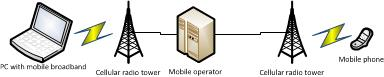

# Developing SMS apps

Windows 8, Windows 8.1, and Windows 10 provide a Short Message Service (SMS) text messaging platform for mobile network operators, mobile broadband adapter IHVs, OEMs, and their partnered software vendor’s app with SMS access into a UWP app.

**Note**  
A mobile broadband app requires SMS support to show notifications to the end user when text messages are received. SMS might also be required to conform to regulatory requirements or best practices in certain markets.

 

The Mobile Broadband SMS platform provides the following functionality:

-   Send and read SMS data in text-mode or PDU-mode (binary)

-   Filter for data cap overage, roaming, and other administrative SMS operator notifications

-   New SMS received background event

-   Read and delete messages from the mobile broadband device message store

-   Get properties of the mobile broadband device

-   SMS API access prompt

The sections in this topic include:

-   [Mobile broadband SMS supported devices](#supporteddevices)

-   [Access to mobile broadband SMS](#smsaccess)

-   [SMS notifications filtering](#filtering)

-   [Developing your SMS app](#developsmsapp)

## Mobile broadband SMS supported devices

Here’s an overview diagram on how the SMS works with a mobile broadband connection:

### Basic requirements

-   The computer must be running Windows 8, Windows 8.1, or Windows 10, a mobile broadband device, and active service from a mobile network operator.

-   The device should be hardware certified for Windows 8, Windows 8.1, or Windows 10 with the SMS send/receive capabilities set.

-   Both internal and external devices are supported.

-   Global System for Mobile Communications (GSM)- and Code division multiple access (CDMA)-based devices are both supported.

### Additional guidance for a better user experience

-   An SMS message can be sent or received by an app when the device is in a network coverage area for the supported operator. Devices must be registered to the network service provider, but do not need to be connected to data services to send or receive messages.

-   Sending or receiving SMS data while on a roaming network is subject to additional fees based on the mobile network operator (MNO) policy.

-   Devices cannot send or receive SMS data if the device is PIN locked.

## Access to mobile broadband SMS

### UWP app access to SMS

Access to mobile broadband SMS functionality is available in the following ways:

-   Mobile network operators can provide users with SMS functionality by using a mobile broadband app.

-   Mobile broadband adapter IHVs who build open market mobile broadband adapters can enable a mobile broadband app to access SMS.

-   OEMs who build computers that have embedded mobile broadband adapters can enable a mobile broadband app to access SMS.

-   UWP apps can be given privileged access to SMS by a mobile operator, mobile broadband adapter IHV, or OEM.

Access to SMS is specified in service metadata or device metadata. Device metadata package is a set of XML files that create the link between a particular device and its UWP device app. The link is based on the HardwareId of IHV mobile broadband adapter, or computer hardware IDs of the computer device container for OEMs who build computers that have embedded mobile broadband adapters.

For more information about service metadata, see [Service metadata](service-metadata.md).

For mobile network operators and mobile broadband adapters IHVs, Windows 8, Windows 8.1, and Windows 10 automatically download and install the mobile broadband app from the Microsoft Store when users connect their device for the first time. In Windows 8.1 and Windows 10 the mobile broadband app is added to the **All Apps** view.

Mobile broadband apps and IHV apps have simultaneous access SMS for a single mobile broadband device. If both a mobile broadband app and an IHV or OEM UWP app are installed and both show a notifications user interface when a new SMS is received, the users see two notification UIs. The user can turn off notifications or uninstall one of the apps.

### User consent to SMS access

Mobile broadband apps must obtain user consent to use SMS because sending messages from the user's device can cause the user to be charged for sending or receiving messages by their cellular service provider.

Users running Windows 8, Windows 8.1, or Windows 10 can control access to SMS capability at an app level by using the Settings charm.

**Note**  
Together with user consent, the app must also have access granted by the device by adding the app name in the device or service metadata.

 

## SMS notifications filtering

The Mobile Broadband SMS platform filters newly received SMS data into two types: administrative SMS notifications from a mobile network operator (MNO), and general SMS messages. Administrative SMS notifications that are received from an MNO are only accessible to a mobile broadband app, and are hidden from general SMS client apps.

MNOs specify custom filtering rules for administrative SMS notifications in the Windows Provisioning platform. If no message filtering rules are specified, the SMS platform classifies all SMS messages as general SMS messages that are available to any app.

For more information about notification filtering, see [Enabling mobile operator notifications and system events](enabling-mobile-operator-notifications-and-system-events.md).

## Developing your SMS app

You can write JavaScript, C#, or C++ apps that use the [**Windows.Devices.Sms**](https://msdn.microsoft.com/library/windows/apps/br206567) API to send, read, and delete messages.

**Note**  
The Windows 7 Mobile Broadband SMS API provided only a low-level modem interface for SMS. Windows 8, Windows 8.1, and Windows 10 provide an alternate text-mode interface that is suitable for general app development.

 

-   [SMS device storage limits](sms-device-storage-limits.md)

-   [Enumerate SMS devices](enumerate-sms-devices.md)

-   [Get SMS device information](get-sms-device-information.md)

-   [Read received SMS by using the text-mode interface](read-received-sms-by-using-the-text-mode-interface.md)

-   [Run new SMS received background events](run-new-sms-received-background-events.md)

-   [Send SMS by using custom character sets](send-sms-by-using-custom-character-sets.md)

-   [Send SMS by using the text-mode interface](send-sms-by-using-the-text-mode-interface.md)

-   [Set SMS declarations](set-sms-declarations.md)

 

 

