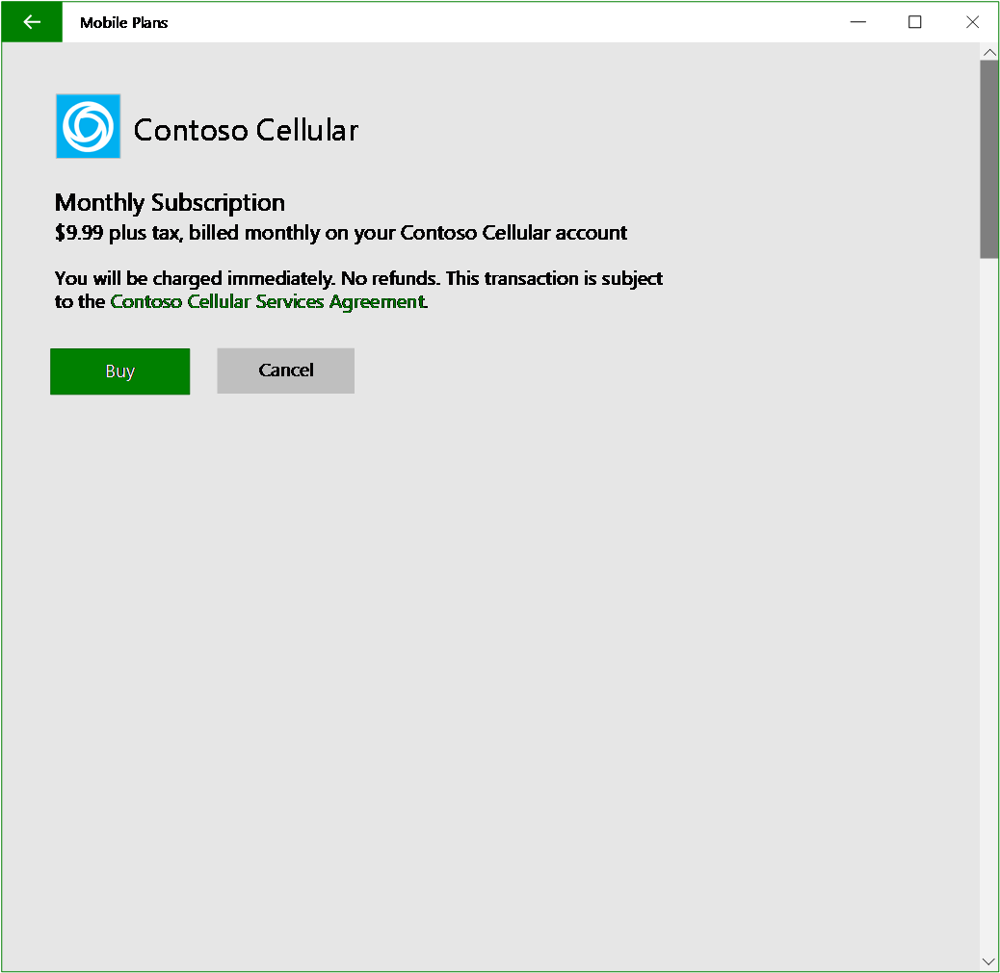
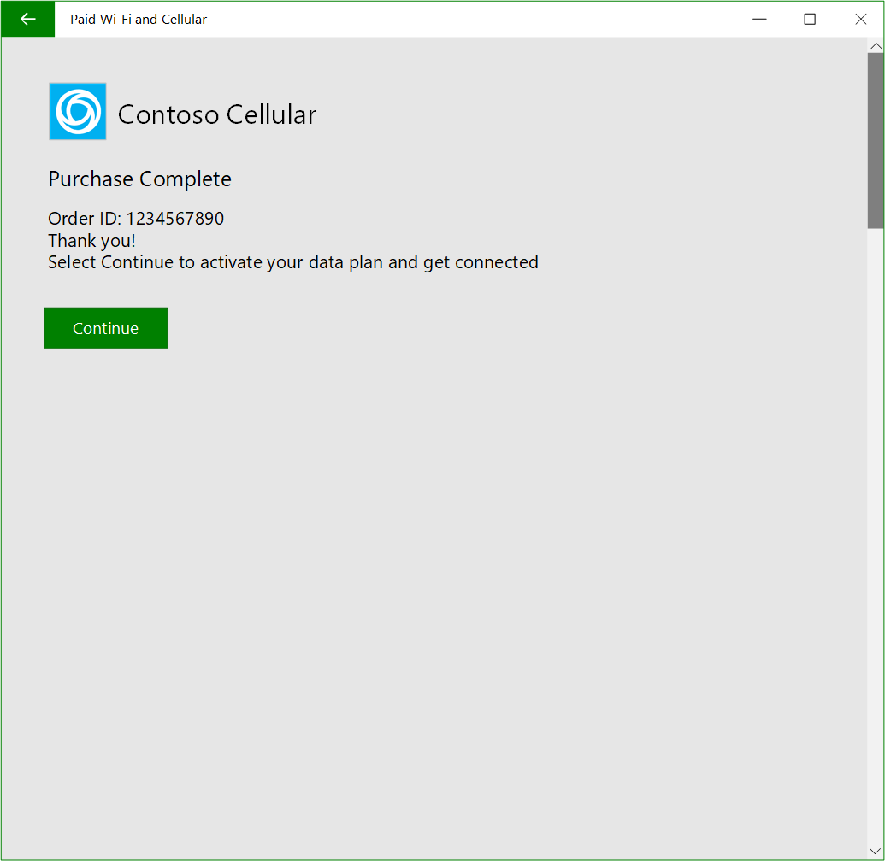
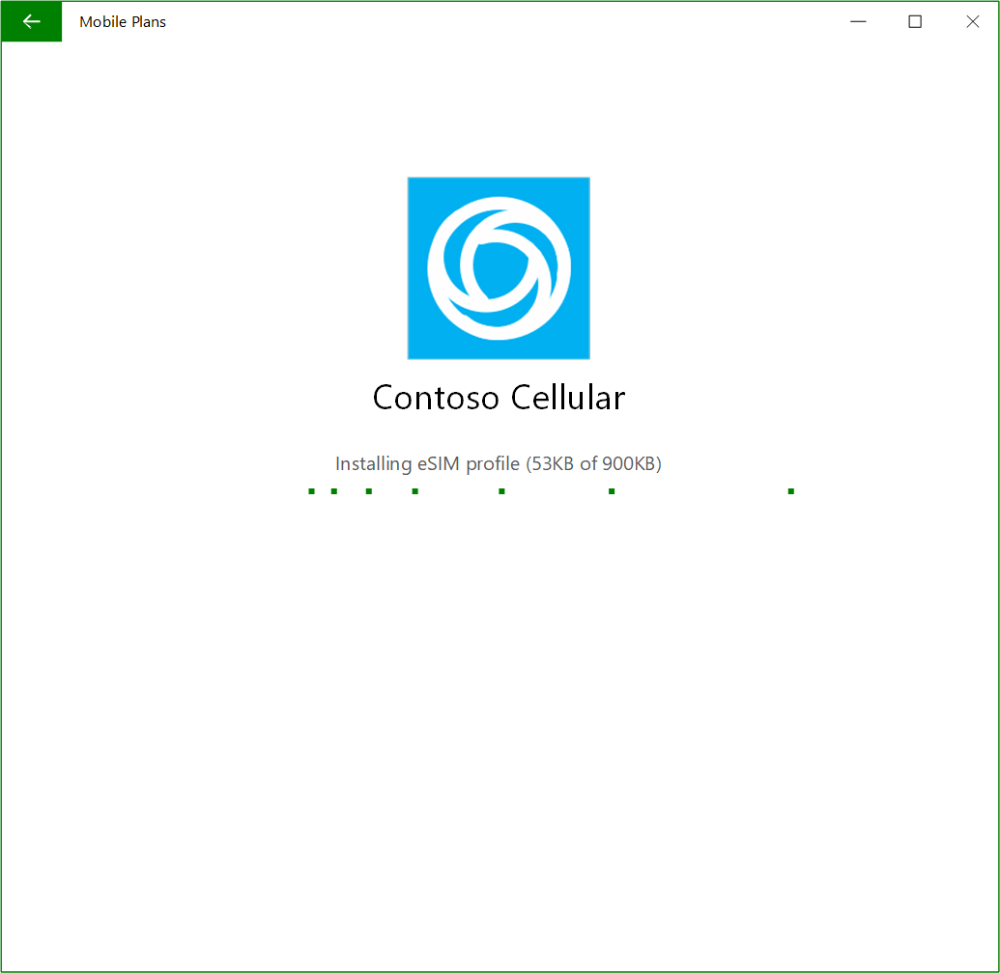

# DYNAMO appendix

## Web portal flow and reference design

This reference design is a template that you can alter to best represent your brand and products. This reference design shows the recommended UX design with navigation elements, branding locations, and website functionalities.

### MO Direct reference site walkthrough

1. The user clicks on the "Continue" button:

    

    - This dialog is prompted by Mobile Plans app.

2. The user enters the MO Direct portal and signs in with their MO account:

    

    - Page layout is consistent throughout all pages. For example, logo and branding elements are in top left, and navigation elements are on the bottom.
    - The sign-in page can link to signing up for a new account.
    - “Forgot password” is optional. Note that the user is in the Walled Garden, and only the Mobile Plans app can access the internet. If you want to support password reset through the MO Direct portal, make sure that users can reset it within two or three steps without launching a browser or email app on the device.

3. The user picks an option:

    

    - Present the most important content, available services, at the center of the page.
    - Logo and branding elements are in the top left corner.
    - Navigation buttons are in the bottom right corner.
    - Use large tiles for available options, with a title and short description of the service category.
    - Both the “Next” and “Cancel” buttons are available for users to navigate forward or exit. The MO Direct expected data service categories might include prepaid plans, recurring monthly plans, and attaching a new device to an existing plan.

4. The user submits the order:

    

    - Page layout is consistent throughout all pages. For example, logo and branding elements are in top left, and navigation elements are on the bottom.
    - The Terms of Service link must be visible on the web page.
    - The order confirmation page lists key information for users to review before submitting the order, including details on data service, payment method, amount of payment, etc.

5. If the user cancels the MO Direct flow at any time:

    

    - A confirmation dialog to leave the MO Direct experience is prompted by Mobile Plans app.

6. An order is completed:

    

    - This shows an example of transaction confirmation, which is part of the mobile operator portal.
    - Once the order is processed successfully and, in this case, after clicking “Continue,” the notification should be posted to the Mobile Plans app with the purchase result, eSIM activation code, and other information required in the API. The user will be automatically redirected to the Mobile Plans app PDP (product details page).
    - If the transaction is for a physical SIM card or the active eSIM profile is in place, you should be activating the plan in the backend.
    - If the transaction requires a new profile to be downloaded, move on to the next step.

7. Downloading an eSIM profile (if applicable):

    

    - The eSIM profile is being downloaded.

8. The MO Direct plan is activated:

    

    - The device is connected.
    - The user has an active MO Direct account.

### Hyperlink experience

If there is a hyperlink pointing to a new page in your MO Direct portal and the user clicks on it, the web view control will render that page in the same window. Users must click on the back button in the Mobile Plans app to return to the previous page.

Alternatively, you might use a hyperlink to launch a dialog within the context of the WebView control.

### Back Button experience

The back button on the menu bar of the Mobile Plans app will navigate users to the previous page just like in a web browser. 

> [!IMPORTANT]
> Build your MO Direct portal as if you are building a shopping cart experience if you would like the user to return to the previous state without losing any data they had entered.

### Error while loading the MO Direct experience

When there are any unhandled errors or exceptions on the MO Direct portal that cause the Mobile Plans app to fail to load the MO Direct experience, the following error will be displayed:

## DYNAMO user journey

The following diagram shows the journey when a user is attaching an eSIM-capable Windows Connected device to a mobile operator that participates in the DYNAMO program.

## High-level integration schedule

The following table provides a high-level overview of the DYNAMO project integration schedule.

| Phase | Activities | Owner | Time estimate |
| --- | --- | --- | --- |
| Configuration | Define ICCID range | MO | N/A |
| Configuration | Submit COSA database update 
This is to ensure your APN configuration on Windows is automatic and is a hard deadline for inclusion in the Windows build. Prior to this the settings must be configured and validated.
 | MO | about 2 months |
| Configuration | Create Dev center account and submit app | MO | N/A |
| Configuration | White list MO app and account | MS | 2 days |
| Configuration | Provide service configuration email | MO | N/A |
| Configuration | Publish metadata package in Dev center | MO | N/A |
| Implementation | Implement mobile operator APIs | MO | N/A |
| Implementation | Enable Walled Garden | MO | N/A |
| Implementation | Build MO Direct web experience | MO | N/A |
| Validation | MO APIs Code Complete | MO | N/A |
| Validation | Validate MO API implementation | MO | N/A |
| Integration | Provide a list of SIM/eSIMs to use during integration phase | MO | 1 day |
| Integration | Configure SIM/eSIMs to validate | MS | up to 1 week |
| Integration | Configure MO API staging endpoint in DM PPE environment | MS | up to 1 week |
| Integration | MO API testing complete for Active SIM (checkpoint) | MS | 2 weeks |
| Integration | MO API is production ready (checkpoint) | MO & MS | N/A |
| Launch | Submit production MO API endpoint to DM | MO | N/A |
| Launch | Configure MO API production endpoint in DM PPE environment | MS | up to 1 week |
| Launch | Load test | MO & MS | 1 week |
| Launch | Monitoring & escalation paths in place | MS | 1 week |
| Launch | Configure smaller test SIM range with MO API production endpoint in DM Production environment | MS | up to 1 week |
| Launch | End to end validation (checkpoint) | MO | N/A |
| Launch | Go/No Go (final checkpoint) | MO & MS | N/A |
| Launch | Configure full SIM range with MO API production endpoint in DM production environment | MS | up to 1 week |
| Launch | Release review- launch readiness | MS | 2 days |
| Launch | Launch | MO & MS | N/A |

[Send comments about this topic to Microsoft](mailto:wsddocfb@microsoft.com?subject=Documentation%20feedback%20%5Bp_mb\p_mb%5D:%20Mobile%20operator%20scenarios%20%20RELEASE:%20%281/18/2017%29&body=%0A%0APRIVACY%20STATEMENT%0A%0AWe%20use%20your%20feedback%20to%20improve%20the%20documentation.%20We%20don't%20use%20your%20email%20address%20for%20any%20other%20purpose,%20and%20we'll%20remove%20your%20email%20address%20from%20our%20system%20after%20the%20issue%20that%20you're%20reporting%20is%20fixed.%20While%20we're%20working%20to%20fix%20this%20issue,%20we%20might%20send%20you%20an%20email%20message%20to%20ask%20for%20more%20info.%20Later,%20we%20might%20also%20send%20you%20an%20email%20message%20to%20let%20you%20know%20that%20we've%20addressed%20your%20feedback.%0A%0AFor%20more%20info%20about%20Microsoft's%20privacy%20policy,%20see%20http://privacy.microsoft.com/default.aspx. "Send comments about this topic to Microsoft")