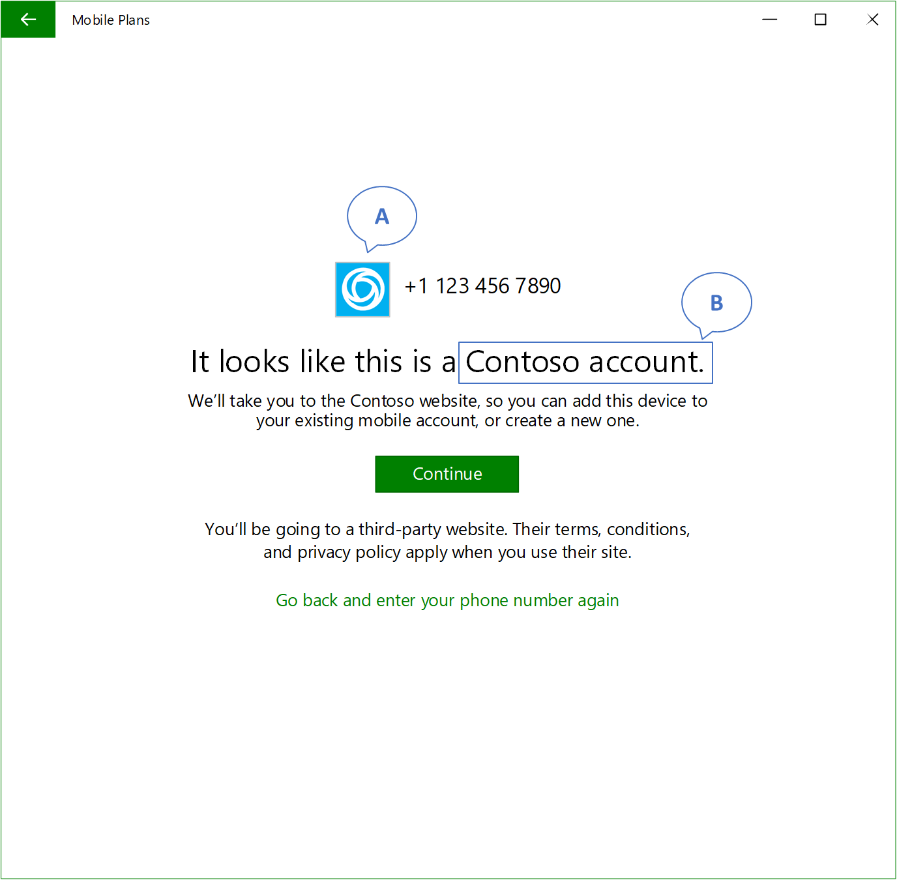

# DYNAMO configuration

This topic describes how to build a foundation on Windows connected devices that support DYNAMO. It details how to configure your eSIM profiles to ensure the best consumer experience, as well as how to provide service configuration information that ensures that the DYNAMO experience is properly rendered on Windows devices.

## eSIM profile configuration requirements

You must prepare eSIM profiles that meet the following requirements:

- The eSIM profile must not be PIN locked.
- The eSIM profile must not be deleted from your SM-DP+ server until you receive confirmation that the profile download has been completed successfully. The activation code can be reused to retry downloading the same profile when previous attempts to download have failed. 
- The eSIM profile must not have the “Do not delete” or “Do not deactivate” policies set.
- The activation code must not include any prefixes such as “LPA:”.
- The activation code is available immediately after the MO Direct flow.
- The eSIM profile can be downloaded immediately from the SMDP+ server after MO Direct flow.
- The device can immediately connect to the network for the end user after the eSIM is downloaded and activated.

Finally, the DYNAMO user experience expects the eSIM profile to be in a warm state, meaning that a data plan can be activated in real-time after downloading the eSIM profile.

## Service configuration

After preparing your eSIM profile, the Microsoft configuration service needs to configure the service platform to support you as a mobile operator. To start this process, send an email to [DYNAMOpartnersup@microsoft.com](mailto:swifipartnersup@microsoft.com) with the following information for onboarding: 

1.	The brand name you would like to use for your products.
2.	The branding logo. Required resolutions are as follows: 150x150, 188x188, 225x225, 600x600, 300x300, and 400x400 pixels. Images should also be full bleed with no transparency.
3.	The list of countries where your solution is supported.
4.	Your MO Direct portal URI.
5.	A notification URI (described in Implementation).
6.	The ICCID range or ranges that you want to want to associate with DYNAMO.

The following image shows an example for merchandise information and layout of a provider description page (PDP) in the Mobile Plans app. The “A” annotation corresponds to the branding logo you submit, and the “B” annotation corresponds to the brand name.

[Send comments about this topic to Microsoft](mailto:wsddocfb@microsoft.com?subject=Documentation%20feedback%20%5Bp_mb\p_mb%5D:%20Mobile%20operator%20scenarios%20%20RELEASE:%20%281/18/2017%29&body=%0A%0APRIVACY%20STATEMENT%0A%0AWe%20use%20your%20feedback%20to%20improve%20the%20documentation.%20We%20don't%20use%20your%20email%20address%20for%20any%20other%20purpose,%20and%20we'll%20remove%20your%20email%20address%20from%20our%20system%20after%20the%20issue%20that%20you're%20reporting%20is%20fixed.%20While%20we're%20working%20to%20fix%20this%20issue,%20we%20might%20send%20you%20an%20email%20message%20to%20ask%20for%20more%20info.%20Later,%20we%20might%20also%20send%20you%20an%20email%20message%20to%20let%20you%20know%20that%20we've%20addressed%20your%20feedback.%0A%0AFor%20more%20info%20about%20Microsoft's%20privacy%20policy,%20see%20http://privacy.microsoft.com/default.aspx. "Send comments about this topic to Microsoft")