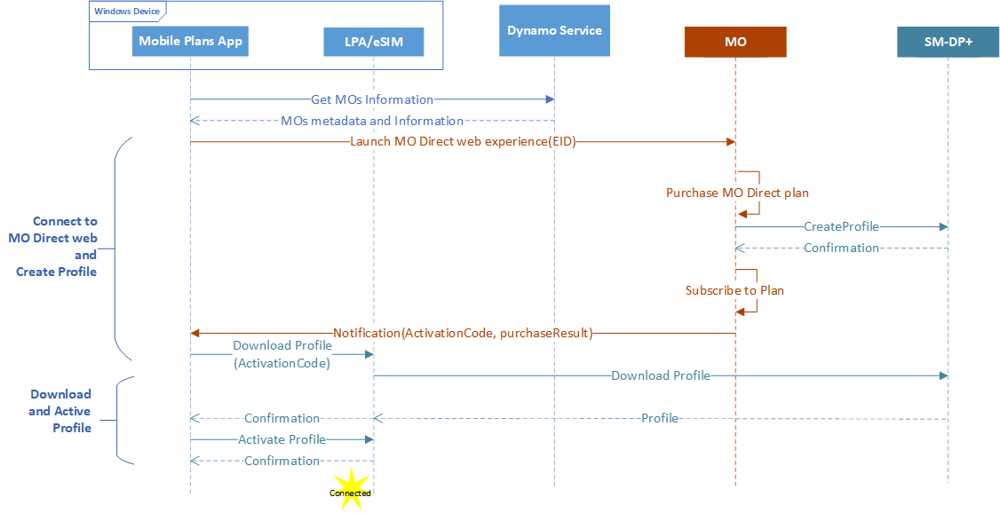
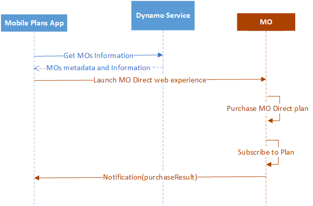

# DYNAMO implementation

This topic describes MO Direct portal design policies and guidance to work with DYNAMO, as well as the work needed to implement the Web service API that will host your experiences in the Mobile Plans app.

## MO web portal

The MO Direct web portal allows mobile operators to provide connectivity solutions directly to Windows users through a curated web experience hosted in the Mobile Plans app. You need to create your web experiences following design policies and implement the web service API to make it reachable. 

For more info about Web portal flow and reference design, see [Web portal flow and reference design](dynamo-appendix.md#web-portal-flow-and-reference-design).

### Web Service API hosting MO Direct web portal 

The Mobile Plans app will use the [WebView](https://docs.microsoft.com/uwp/api/Windows.UI.Xaml.Controls.WebView) control to host the MO Direct experience. The app only trusts content returned by the DYNAMO service.

When starting the WebView, the *EID*, *market*, and previous *ICCID* are passed if available. The following example shows these three launch parameters for eSIM.

```c#
MyWebView.ScriptNotify += MyWebView_ScriptNotify;

List<Uri> allowedUris = new List<Uri>();

allowedUris.AddRange(AllowedNotifyUris);

MyWebView.AllowedScriptNotifyUris = allowedUris;

MyWebView.Navigate(“https://moportal.com?eid=\”eid\”& iccid=8988247000100003319&market=us&transactionId=cvcvcv&location=us”);
```

The next example shows the launch parameters for a physical SIM: *iccid*, *market*, and *location*. Previous lines of code have been excised for brevity.

```c#
...

MyWebView.Navigate(“https://moportal.com? iccid=8988247000100003319&market=us&transactionId=waoigFfX00yGH3Vb.1&location=us”);
```

The Web Service API must disregard any additional parameters it might receive from Mobile Plans app. This provides flexibility for introducing new features without breaking the DYNAMO experience. If new parameters are implemented, partners will be informed of new parameters in advance.

The following table describes the launch parameters available for eSIM and physical SIMs.

| Parameter name | Description | Example |
| --- | --- | --- |
| eid | The eSIM Identifier. This is sent only if an eSIM is present. | `eid= 89033024010400000100000000009136` |
| iccid | Required parameter for a physical SIM. Optional parameter for eSIM. Specifies the available ICCID’s on the physical sim. | `iccid=8988247000100003319` |
| iccids | Optional parameter. Specifies the list of ICCID’s from the available profile on an eSIM only. If there are no ICCID’s matching the MO available on the eSIM, this parameter won’t be sent. | `iccids=8988247000100003319, 988247000100003555` |
| location | The user’s current physical location with a country-level granularity. | `location=us` | 
| transactionId | The Transaction ID used for debugging the session. Providers should log this and send it in the notification payload. Maximum size is 64 characters.	| `transactionId=waoigFfX00yGH3Vb.1` |
| market | The 2-letter ISO code of the region settings in the PC. | `market=us` |

The user’s language preference will be sent using the Accept-Language header, described in the following table.

| Header name | Description | Example |
| --- | --- | --- |
| Accept-Language | The user’s current language settings. The MO portal should render the contents in the specified language if possible. | `Accept-Language: en-us` |

### MO Direct flow diagram

The following high-level flow diagram for eSIM MO Direct illustrates a scenario where the user doesn’t have an MO profile installed and is purchasing a plan from the MO portal.



The following diagram shows the high-level flow for MO Direct when the user has a eSIM profile or is using a physical SIM in their device.



### Control handoff to the Mobile Plans app

After the user completes the purchase flow, either by making a successful purchase or cancelling the purchase, the MO portal must return control to the Mobile Plans app. This is done by issuing a notification to the app with the result of the user interaction with the MO portal. The notification can be sent using JavaScript with the following syntax:

```javascript
DataMart.notifyPurchaseResult(notificationPayload);
```

An example of the notification payload for an eSIM is as follows:

```json
{
"ver":"1",
"purchaseResult":
“{
\"userAccount\":\"New\",
\"purchaseInstrument\":\"New\",
\"line\":\"New\",
\"moDirectStatus\":\"Complete\",
\"planName\":\"MyPlan\"
}”,
"success":true,
"Iccid":"8988247000100297655",
"activationCode":"activationCode",
"transactionId":"CDE2882E-BD5E-485F-B921-D0D60BBCF7FF"
}
```

An example of the notification payload for a physical SIM is as follows:

```json
{
"ver":"1",
"purchaseResult":
{
\"userAccount\":\"New\",
\"purchaseInstrument\":\"New\",
\"line\":\"New\",
\"moDirectStatus\":\"Complete\",
\"planName\":\"MyPlan\"
},
"success":true,
"iccid":”8988247000100297655”,
"transactionId":"CDE2882E-BD5E-485F-B921-D0D60BBCF7FF"
}
```

The MO Portal URI from which the notification is sent must be in the secure https protocol. The following table describes each field in the JSON payload of the notification:

| JSON field | Type | Description | Example |
| --- | --- | --- | --- |
| success | Boolean | True if the user purchased an MO Direct plan. | `“success”:true` |
| iccid | String | For eSIM, this indicates the ICCID that the client must use for consuming the MO Direct plan purchased. | `iccid:”8988247000100297655”` |
| activationCode | String | The activation code to retrieve the eSIM profile. | `“ActivationCode”` |
| transactionId | String | The Transaction ID the MO portal received as a query parameter when the portal was launched. | `transctionId= rRi8OzhI3EiR02nm.2.0.1` | 
| purchaseResult | JSON | Contains the details of the user interaction with the MO portal. |   |
| userAccount | Enum | This field is required. <p>Possible values:</p><ul><li>New: Indicates that a new user account was created by the user.</li><li>Existing: Indicates that the user logged on with an existing user account.</li><li>Bailed: Indicates that the user ended the purchase flow at this step.</li><li>None: Indicates that the user didn’t reach this step.</li></ul> | `“userAccount”:”New”` |
| purchaseInstrument | Enum | This field is required. <p>Possible values:</p><ul><li>New: Indicates that a new user account was created by the user.</li><li>Existing: Indicates that the user logged on with an existing user account.</li><li>Bailed: Indicates that the user ended the purchase flow at this step.</li><li>None: Indicates that the user didn’t reach this step.</li></ul> | `“purchaseInstrument”:”New”` |
| line | Enum | This field is required. <p>Possible values:</p><ul><li>New: Indicates that a SIM card was added by the user account.</li><li>Existing: Indicates that the transferred an existing line to the device.</li><li>Bailed: Indicates that the user ended the purchase flow at this step.</li><li>None: Indicates that the user didn’t reach this step.</li></ul> | `“line”:”New”` |
| moDirectStatus | Enum | This field is required. <p>Possible values:</p><ul><li>Complete: Indicates that the user completed the purchase successfully.</li><li>ServiceError: Indicates that the user was unable to complete the purchase due to an MO service error.</li><li>InvalidSIM: Indicates that the ICCID passed to the portal was incorrect.</li><li>LogOnFailed: Indicates that the user failed to log in to the MO portal.</li><li>PurchaseFailed: Indicates that the purchase failed due to a billing error.</li><li>ClientError: Indicates that invalid arguments were passed to the portal.</li><li>BillingError: Indicates that there was an error with the user billing.</li></ul> | `“moDirectStatus”:”Complete”` |
| planName | String | For a successful transaction, this field must not be empty and provide a descriptive plan name. For an unsuccessful transaction, this field must be an empty string. | `“planName”:”prepaid_3GperMonth”` |

### Web portal design policies

To ensure the best user experience on Windows, you should adhere to the policies in this section when developing the MO Direct experience. These policies are supplementary to the terms and conditions of the DYNAMO Partner Addendum, [Windows App Developer Agreement](https://msdn.microsoft.com/library/windows/apps/hh694058) and [Microsoft Store Policies](https://msdn.microsoft.com/library/windows/apps/dn764944).

#### Business functions

| Policy | Requird or Recommended |
| --- | --- |
| The MO Direct experience must meet all applicable legal and regulatory requirements in the countries offered. Any content displayed in the MO Direct portal must comply with all applicable laws. | Required |
| Products offered through the MO Direct experience must be an offer for network connectivity. | Required |
| Network connectivity products offered through the MO Direct experience must be immediately activated after user completes the purchase flow. | Required |
| Network connectivity products offered through the MO Direct experience must have clear information on service details. Any specific terms of service must be available for users to review before purchase in the MO Direct experience. | Required |
| Customer support contact information must be accessible to users in the MO Direct experience. | Required |
| The privacy policy must be available for users to review in the MO Direct experience. | Required |
| The account management experience provided by an MO, which can be within the MO Direct experience, a separate and dedicated account management portal, or a dedicated MO app, should enable users to take actions on their current data plans, such as canceling a subscription. | Required |
| Users will receive an order confirmation after purchasing a data plan from the MO Direct experience successfully. | Recommended |


#### Security

| Policy | Requird or Recommended |
| --- | --- |
| The MO Direct experience must not deliver or install any 3rd party-owned or branded apps or modules. | Required |
| Before users exit the MO Direct experience, users must be securely logged out from the MO Direct portal. | Required |
| The MO Direct portal URI and all requests or notifications sent to and from the MO Direct portal must use the secure HTTPS protocol. | Required |
| All MO portal resources and references must use the secure HTTPS protocol. | Required |

#### Advertising

| Policy | Requird or Recommended |
| --- | --- |
| The MO Direct portal must not display any advertisements, sponsored content, videos, large images, animations, or maps. | Required |

#### Capabilities

| Policy | Requird or Recommended |
| --- | --- |
| The required minimum functionality for the MO Direct experience is to enable a user to purchase a data plan with an account registered with a mobile operator. | Required |
| The MO Direct portal must start up promptly and remain responsive to user input until the user exits the MO Direct experience. | Required |
| Once invoked, the MO Direct portal must have and retain user focus until either: <ul><li>The MO Direct flow has completed and the focus has been returned by Mobile Operator back to the Mobile Plans app,</li></ul><p>OR</p><ul><li>The user has cancelled the MO Direct flow.</li></ul> | Required |
| The MO Direct portal must not display any pop-up windows, open any additional windows, or redirect the user to any other websites or apps, except as required to complete the purchase flow. | Required |
| The MO Direct portal must handle all legitimate errors and exceptions, such as rejection of payment method, backend failure etc. After the error or exception is handled, the MO Direct portal must remain responsive for users to exit and return to the Microsoft Store. | Required |
| If users run into an error that can be fixed with user actions, it is recommended to display mobile operator customer support information with the error message. | Recommended |

#### Usability

| Policy | Requird or Recommended |
| --- | --- |
| The default frame size for the MO Direct portal is 800x600. Adopt responsive web design so that content on the MO Direct portal can be auto-adjusted to fit into the web control frame when users resize the Mobile Plans app. | Required |
| Load times and data consumption for loading the MO Direct experience should be optimized. | Required |
| The MO Direct experience should be simple and easy navigate with necessary on-screen guidelines.  | Required |
| UI elements on the MO Direct portal should provide a cohesive experience integrated with the Mobile Plans app, not confusing users or reminding the users that this is an embedded web control. For example, there should be no close/max/min button within the MO Direct portal. | Required |
| Layout of web pages in the MO Direct portal should be clean and easy to navigate. Users can navigate backward and forward through web pages in the MO Direct portal with UI elements within MO Direct experience. For more info, see [Web portal flow and reference design](dynamo-appendix.md#web-portal-flow-and-reference-design). | Required |
| The MO Direct portal must be functional within the Web Control frame and, once invoked, it must not interfere with users’ interaction with the Mobile Plans app at any time. | Required |
| The MO Direct portal must not be cluttered with too many images, banners, lengthy text, external links, etc. | Required |
| An on-screen cancel button within the MO Direct experience should be available for users to exit the flow when applicable. | Recommended |
| Mobile operators can choose the color scheme and fonts that represents the brand the best. Ensure that all visual elements work well together and reinforce the brand. | Recommended |

#### Localization

| Policy | Requird or Recommended |
| --- | --- |
| The MO Direct portal should be able to receive and understand users’ locale setting passed by the DYNAMO service to display content in the proper language. | Required |
| Mobile operators may localize the MO Direct portal in the languages they want to support. | Recommended |
| The experience provided by the MO Direct portal should be reasonably similar in all languages that it supports, although data plan availability can vary from region to region. | Recommended |

#### Accessibility

| Policy | Requird or Recommended |
| --- | --- |
| The MO Direct portal should provide accessibility to disabled users and adhere to the accessibility guidelines applicable in the jurisdictions where the mobile operator implements and enables the MO Direct experience. | Recommended |


[Send comments about this topic to Microsoft](mailto:wsddocfb@microsoft.com?subject=Documentation%20feedback%20%5Bp_mb\p_mb%5D:%20Mobile%20operator%20scenarios%20%20RELEASE:%20%281/18/2017%29&body=%0A%0APRIVACY%20STATEMENT%0A%0AWe%20use%20your%20feedback%20to%20improve%20the%20documentation.%20We%20don't%20use%20your%20email%20address%20for%20any%20other%20purpose,%20and%20we'll%20remove%20your%20email%20address%20from%20our%20system%20after%20the%20issue%20that%20you're%20reporting%20is%20fixed.%20While%20we're%20working%20to%20fix%20this%20issue,%20we%20might%20send%20you%20an%20email%20message%20to%20ask%20for%20more%20info.%20Later,%20we%20might%20also%20send%20you%20an%20email%20message%20to%20let%20you%20know%20that%20we've%20addressed%20your%20feedback.%0A%0AFor%20more%20info%20about%20Microsoft's%20privacy%20policy,%20see%20http://privacy.microsoft.com/default.aspx. "Send comments about this topic to Microsoft")