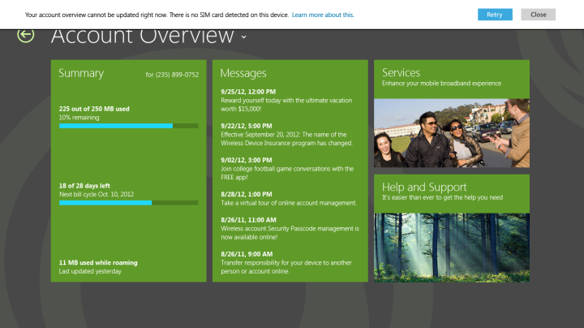
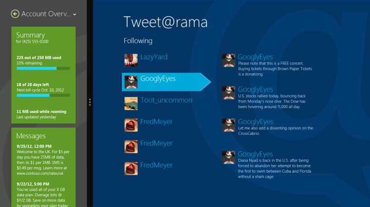
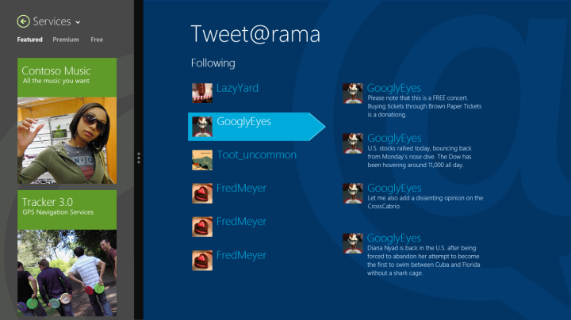
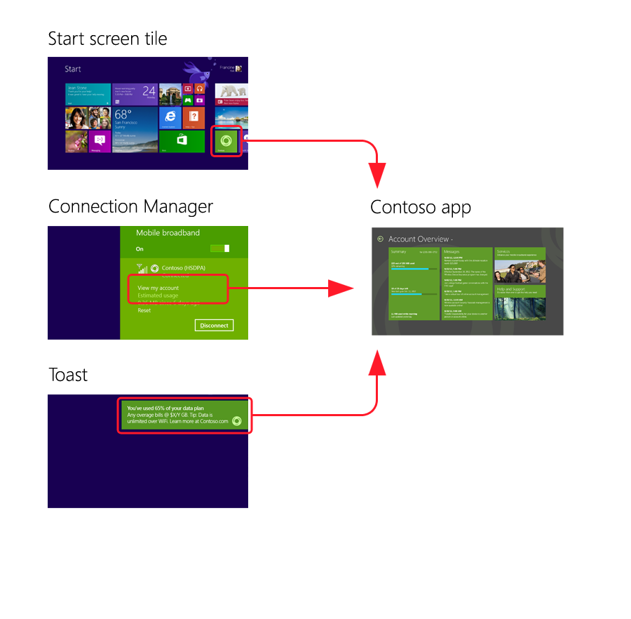
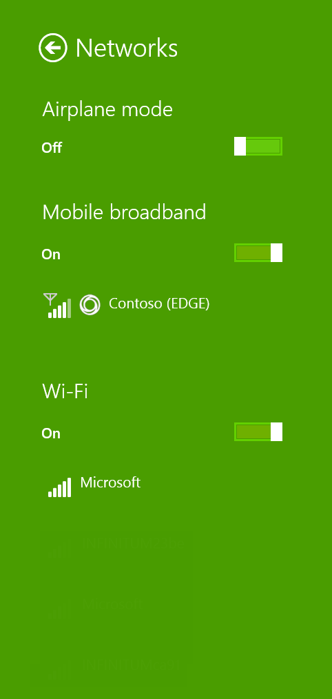
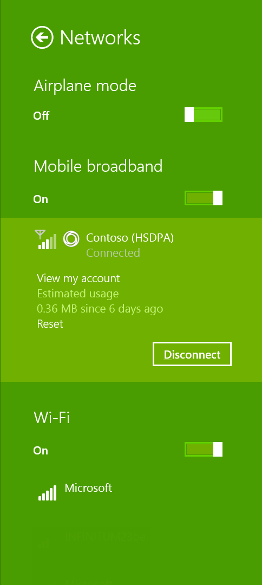
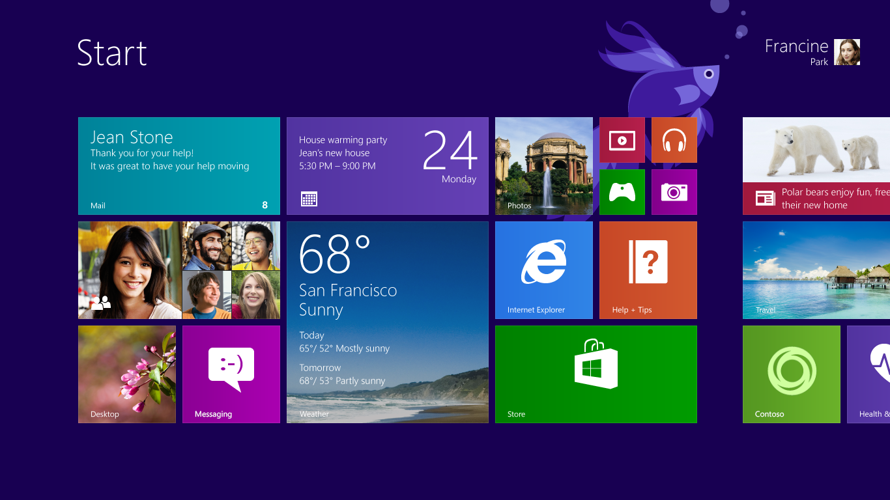
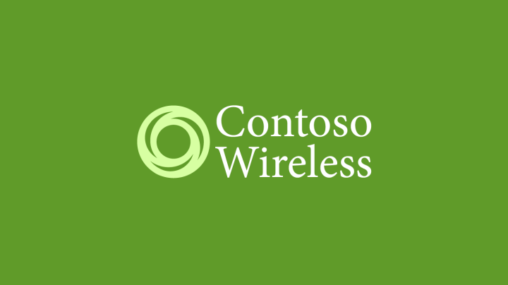

# Integrate a mobile broadband app with other Windows components

You can use Windows 10 user interface (UI) surfaces to enhance the overall experience of your mobile broadband app.

For additional user experience design guidelines for layout, navigation, commanding, animations, touch interaction, snapping and scaling, contracts and capabilities, tiles and notifications, UI controls, app roaming to the cloud, and fundamentals, see [Index of UX guidelines for UWP apps](https://msdn.microsoft.com/library/windows/apps/hh465424).

This topic contains the following sections:

-   [App settings](#app-settings)

-   [Error user experience](#errorux)

-   [App views](#appviews)

-   [Launch points](#launchpts)

-   [Tile and toast notifications](#tileandtoast)

-   [Splash screen](#splash)

-   [Quick summary](#qusum)

-   [Additional resources](#resources)

## App settings

You can use [App settings](https://msdn.microsoft.com/library/windows/apps/hh770544) to include settings for your apps configuration. Some examples of these are as follows:

-   Sign in and sign out

-   View and edit the user profile

-   Change billing address

-   View and edit payment options

-   View and set marketing preferences

## Error user experience

### General

Your mobile broadband app can have a number of error cases that should be dealt with gracefully. Some common examples are as follows:

-   **Device is missing or unplugged** Appears when a device such as a SIM or a dongle is missing or unplugged.

-   **Locked device** Appears when a connected device is locked to the user.

-   **Internet connectivity lost** Appears when no network connection is detected.

-   **Multiple devices are plugged in** Appears when a built-in adaptor and an external dongle are plugged in. A notification bar error is recommended for such cases.

-   **Form field validation errors** Appears when a user enters incorrect information into a form. Validation errors should be shown inline so that the user knows the field with which the error is associated.

For guidance on how to present errors, see [Laying out your UI](https://msdn.microsoft.com/library/windows/apps/hh465304). In the example below, a notification bar is displayed at the top of the page.

### Errors in data usage

The following error cases should be shown on the overview page in the following ways:

-   **When the user is near plan expiration**: Use a bar on the top of the screen to indicate that the user’s plan is close to expiration.

-   **When usage is over the data cap** The data bars should be full and there should also be an inline message that describes the issue and tells the user what to do about it. Alternatively, the over data cap usage message can be in a notification bar on the top of the page.

-   **When the plan is expired**: Use a bar on the top of the summary box to describe the issue and actions that the user can take. In this case, data usage, billing cycle, and roaming information is not displayed.

-   **International roaming**: Indicate roaming at the bottom of the summary section.

## App views

Your app should be adaptive and be able to fit a number of layouts, including:

-   Landscape

-   Portrait

-   Side by side with another app

-   Filled

-   Keyboard up

    **Note**  
    When the touch keyboard is up, make sure that elements such as form fields scroll appropriately.

     

The following examples show how some pages look when side by side with another app.

Make sure that your app is accessible through app views, including high-contrast mode and screen reader readiness. For more information about how to make your app accessible, see [Accessibility in UWP apps using JavaScript](https://msdn.microsoft.com/library/windows/apps/hh452681).

## Launch points

Your mobile broadband app is available to users in the **All Apps** view, in Windows Connection Manager, or through a toast notification.

### Launch from Windows Connection Manager

You can connect to the mobile broadband app by using Windows Connection Manager. Your app should open to the landing page with account and data usage information. After you are connected, Windows Connection Manager shows the current account and data usage.

**Automatic launch from connection manager during a captive portal purchase flow**

When the user is connected to a captive portal network where web traffic is redirected, Windows provides you the option to automatically launch their app if it’s installed. The app should open to the Plans page that provides information on how to purchase Internet access.

### Launch app from tile in All Apps view

Your app should support users who have multiple simultaneous accounts (for example, using two external USB mobile broadband adapters). When your app is launched from a tile, your app should let users select the account that they want to use.

If your app was suspended or already running, it should show the last page used. If your app wasn’t already running or suspend information is not available, your app should open to the landing page.

### Tile and toast notifications

In the **Start** menu, tiles are the primary representation of an app. Users launch their apps through those tiles, which can display new, relevant, and tailored content through notifications. This makes the **Start** menu feel vibrant, and allows the user to see what's new at a glance. An app can also communicate time-critical events to the user through toast notifications, whether the user is in another app, on the **Start** screen, or on the Desktop. The methodology to design and deliver toast closely parallels that of tiles, thereby lowering the learning curve.

A toast notification can contain text and images but do not support secondary actions such as buttons. Think of toast as similar to a Windows balloon notification from the taskbar's notification area. Like balloon notifications, a toast appears in the lower-right corner of the screen. When a user taps or clicks on the toast, the associated app is launched in a view that is related to the notification. This is the only mechanism by which one app can interrupt a user in another app. Toasts can be activated, dismissed, or ignored by the user. The user can disable all toasts for an app.

A toast notification should be used only for information of high interest to the user and typically involves some form of user opt-in. It is a good choice for incoming email alerts, IM chat requests, and breaking news. However, it is very important that when you consider using a toast notification, you realize that, due to its transient nature, the user might never see it. When using toast notifications for data usage overage or roaming alerts, consider showing the information on your tile and within your app views in case the end user misses the toast notification.

### Splash screen

You can use splash screen to promote branding. For more info about the splash screen, see [Adding a splash screen](https://msdn.microsoft.com/library/windows/apps/hh465332).

### Quick summary

Appropriate design for operator notifications:

-   Use both toast and tile notifications to alert users of important and high-interest messages that relate to the subscriber’s account and service plan.

-   Customize toast and tile background colors and logo based on your brand guidelines.

-   Include important SMS or USSD operator notifications and alerts that relate to the subscriber’s account and service plan directly on the landing page.

Inappropriate design for operator notifications:

-   Don’t show toast notifications for information that is not real time (such as promotional advertisements).

-   Don’t show user-to-user chat messages and promotions and advertisements mixed together with operator notifications and alerts, because end users can miss important operator notifications.

### Additional resources

-   [Working with tiles, badges, and toast notifications](https://msdn.microsoft.com/library/windows/apps/xaml/hh868259)

-   [Guidelines and checklist for toast notifications](https://msdn.microsoft.com/library/windows/apps/hh465391)

## Related topics

[Designing the user experience of a mobile broadband app](designing-the-user-experience-of-a-mobile-broadband-app.md)

 

 

