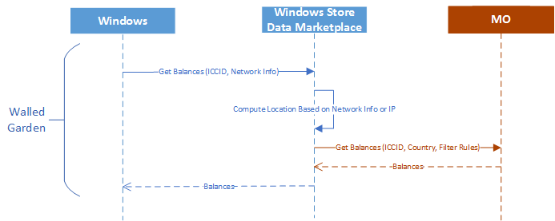
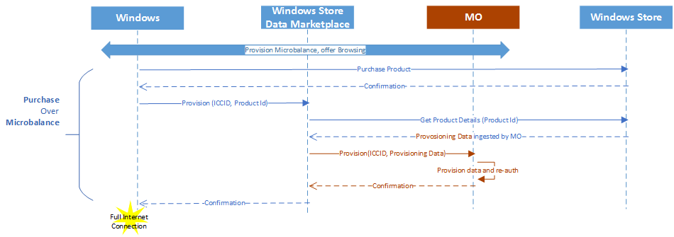
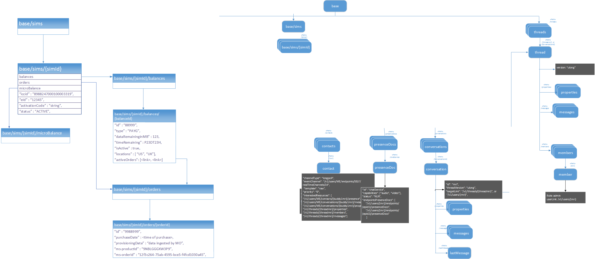

# Microsoft Store PAYG integration

Now that you’ve onboarded to Dev Center and published an initial set of connectivity offers, you need to integrate with the Data Marketplace Service so that Data Marketplace can correctly provision data within your systems.

To fully integrate with Data Marketplace, you must do the following:

1. Send information below to Data Marketplace Support:
  - The reserved ICCID range.
  - Your service endpoint.
  - Your App ID.
2. Configure &#39;Purchase Intent Connectivity&#39;, including Walled Garden:
  - Zero-rating of a small number of http and https endpoints.
  - Configuring a small, free-of-charge &#39;microbalance&#39;, which is provisioned to allow the customer used to complete the purchase process.
3. Implement the Data Marketplace Mobile Operator (MO) APIs.

In addition to these core requirements, there are several other considerations when integrating with Data Marketplace that you should keep in mind as they may impact your subscribers’ experience. The following sub-sections highlight the logical service touchpoints.

## Configuration

Please send this information to Data Marketplace Support at [datamartpartnersup@microsoft.com](mailto:swifipartnersup@microsoft.com) 

### ICCID range

This should be the same ICCID range you submitted to COSA with &#39;Data Marketplace Supported = Yes&#39;. For example: 1212123000100295352-1212123000100295360; 1212123000100295782-1212123000100295832;

### Service endpoint

You&#39;re service endpoint. For example: [https://moapi.contoso.com/v1](https://moapi.contoso.com/v1)

### App ID

This is the Microsoft Store ID of your App. For example: 9NBLGGGZ5ZB2

### Brand name

This is the name to be displayed for you as a provider on the Paid Wi-Fi &amp; Cellular App. For example: &quot;Cellular Data&quot;

## Purchase Intent Connectivity [Walled Garden]

As a function of participating in Data Marketplace, mobile operators must provide Purchase Intent Connectivity.  Purchase Intent Connectivity is a type of limited connectivity provided to customers to facilitate the browse and purchase experience.

Purchase Intent Connectivity consists of two elements:

  - Zero-rating of a small number of http and https endpoints based on FQDN.
  - Providing a small &#39;microbalance&#39; of open Internet connectivity to complete the purchase process.

The initial process by which offers are retrieved for your customers occurs through the zero-rated endpoints provided below.  Once the customer launches the Paid Wi-Fi and Cellular App, a call is made to the API endpoint which you have provided to allocate a small amount of open Internet connectivity.  The Data Marketplace client restricts the usage of this connectivity to only the Paid Wi-Fi and Cellular app and the Data Marketplace backend systems limit the total number of times and rate at which it is provided to customers to limit abuse.

#### Walled Garden endpoints

There are only a small number of required endpoints which will be always accessible to end customer.

The table below defines the endpoints that are needed for walled garden.

| URL | HTTP/HTTPS |
| --- | --- |
| service.datamart.windows.com | https |
| dogfood.datamart.windows.com | https |
| windows.policies.live.net | https |
| [ctldl.windowsupdate.com](http://ctldl.windowsupdate.com) | http |
| msftncsi.com | http |
| login.live.com | http + https |
| storagetos.datamart.windows.com | http + https |
| cdp1.public-trust.com | http |
| ocsp.omniroot.com | http |
| vassg142.ocsp.omniroot.com | http |
| vassg142.crl.omniroot.com | http |
| mscrl.microsoft.com | http |
| crl.microsoft.com | http |
| msftconnecttest.com | http |

#### Micro-balance requirements
End-to-end
Once the Paid Wi-Fi and Cellular App is launched by the customer, the app will request the allocation of the micro balance. This micro-balance provides open Internet connectivity but is restricted by the client so it can only be utilized to enable the Data Marketplace experience. This provisioning call is made using the micro-balance API defined above.

For an eSIM scenario, where a network profile needs to be downloaded after purchase, a second microbalance will be provisioned for downloading the profile. There is no flag to differentiate the purpose of the microbalance, so all the microbalance will have the same size and expiry.

Each device can have, at most, 6 microbalance per hour per ICCID, and, at most, 10 every 24 hours per ICCID to avoid fraud.

The microbalance itself has several minimum requirements listed in the table below.  The size and expiry may be adjusted by you based on specific provider requirements but the below values are suggested minimums.

| **Property** | **Value** | **Description** |
| --- | --- | --- |
| Size | 5MB or more | The current size is intended to accommodate physical SIMs.  This size may slightly increase for eSIM scenarios based on profile download requirements |
| Expiry | 5 minutes | This is the minimum expiry, but a slightly longer expiry is preferable to allow customers more time to browse and purchase. |
| Internet Access | Open Internet Access | The microbalance must provide unrestricted access to the Internet and is restricted for use by the Data Marketplace application using client policy rules. |

<Image>Table 22 - Illustrates client policy restriction of microbalance utilization

## Mobile Operator APIs

To participate as a provider within Data Marketplace, you must implement a set of well-defined APIs which allow us to integrate with your systems.

The most basic set of APIs provides support for pay-as-you-go (PAYG) plans sold through the Microsoft Store and is required of all providers.  In addition to this core set of APIs, there is one additional API which must be provided if you wish to support eSIM-based scenarios in which your profile is downloaded to the device.

| **API** | **Physical or eSIM** | **Description** |
| --- | --- | --- |
| Get Balance | Physical, eSIM | Returns the balances for the customer sorted by the filtering rules. |
| Provision microbalance | Physical, eSIM | Provision the microbalance which is used for offer browsing and purchase |
| Provision Data | Physical, eSIM | Provision data for the customer based on a purchase.  In the eSIM case, this API also creates an eSIM profile and returns an activation code for download. |

### End-to-end flows

### Resource model

The communication between the Data Marketplace service and the MO service involves the manipulation of the below resources.

> [!NOTE] 
> There is no CRUD operation against Sim resource at this time.

| **JSON Property** | **Type** | **Description** |
| --- | --- | --- |
| **activationCode** | **string** | **The activation code that LAN on the client can use to download and activate the profile.** |
| **Iccid** | **string** | **ICCID of the profile that has been created.** |
| **eId** | **String** | **eId of the eSIM** |

#### Balance resource

| **JSON Property** | **Type** | **Description** |
| --- | --- | --- |
| **Type** | **Enumeration ( MODIRECT,  MODIRECTPAYG PAYG, NONE, NOTSUPPORTED)** | **MODIRECT:**  **Indicates if the customer balance is MO Direct**  **MODIRECTPAYG:**  **Indicates if the customer balance is MO Direct PAYG.**   **PAYG:  Indicates if the customer balance is**  ** PAYG**   **NONE: Indicates**  **the customer has no balance****.  When the remaining balance is 0 but the plan has not expired, we expect to receive &#39;NONE&#39; so that customer can purchase data plans. ** ** NOTSUPPORTED: Indicates **** the SIM is not supported by Data Marketplace experience. ****&#39;NOTSUPPORTED&#39; is used when the SIM should not be in Data Marketplace supported range and we will turn off Data Marketplace experience in the flyout and return a generic error message in the PWC app when we receive this type.** |
| **dataRemainingInMB** | **double** | **The data remaining in the current customer plan in MB.** |
| **timeRemaining** | **String** | **Time duration specified in** [**ISO 6801**](https://en.wikipedia.org/wiki/ISO_8601#Durations) |
| **locations** | **Collection of strings** | **Array of location in two letter ISO code. This comes from MCC or reverse IP lookup when there is no Cellular network connection.** |
| **ms-provisioningDataSet** | **Collection of ms-provisioningData** | **Collections of ms-provisioningData that are associated with this balance instance of the customer.**   |

#### Order resource

| **JSON Property** | **Value** | **Description** |
| --- | --- | --- |
| **orderId** | **String** | **Id of the created order** |
| **purchaseDate** | **Date Time** | **Date time specified using DateLiteral Format. This specifies the time when the purchase was made by the customer.** |
| **provisioningData** | **String** | **This is a blob of string or JSON object that the MO will add to the offer metadata in Dev central while authoring offers. This will contain all the details needed to provision the offer by MO.** |
| **ms-provisioningData** | **String** | **This contains opaque data from Microsoft that the MO will return during the balance call.** |
| **ms-market** | **String** | **The 2 letter ISO code of the country catalog from which the customer can buy products. This is the same as the region setting in Windows device.** |
| **ms-oem** | **String** | **The OEM of the device.** |
| **sims** | **Collection of strings** | **List of ICCID&#39;s from the MO which are currently available on the client. The MO will either choose one of the ICCID from this list to which data will be provisioned or will return a new ICCID indicating that a new profile must be downloaded. For physical SIM&#39;s this list will contain only one entry.** |
| **eId** | **String (Optional)** | **For eSIM, this will contain the eId.** |

### Common headers

Here is a list of headers that may be included in requests from the Data Marketplace Service to the Mobile Provider&#39;s endpoint.

| **Header name** | **Value** | **Description** |
| --- | --- | --- |
| **X-MS-DM-TransactionId** | **String** | **Transaction Id to uniquely identify this request/response interaction between the Data Marketplace Service and MO service.** |
| **Authorization (optional)** | **String** | **Basic auth string optionally provider by MO.** |

### Common error codes

| **Error code** | **Description** |
| --- | --- |
| **Http 200**** (OK)** | The operation was successfully completed. |
| **Http 201**** (Created)** | Indicates that the operation was successfully completed and the resource was successfully created. |
| **Http 400**** (Bad Request)** | This error code must be used for invalid query parameter or header or payload. In the response body, the parameter that is incorrect should be indicated. For example, if an invalid fieldsTemplate is specified, this error code must be returned with details in the response body. |
| **Http 401**** (Unauthorized)** | Authentication credentials were incorrect or invalid. This can occur when the basic auth credentials passed are incorrect. |
| **Http 403**** (Forbidden)** | Client certificate is untrusted or invalid. If the client certificate included as a part of MTLS is invalid, HTTP 403 should be returned. |
| **Http 404**** (Not Found)** | The MO service should return this error when the resource doesn&#39;t exist. This can occur when an incorrect ICCID is sent. This shouldn&#39;t be used to indicate that the customer doesn&#39;t have a balance in the specified location. |
| **Http 409**** (Conflict)** | Http status code 409 is used if a transaction Id is repeated |
| **Http 429**** (Too many requests)** | HTTP status code 429 should be used by the MO service to indicate that the Data Marketplace service is sending too many requests within the specified amount of time. In the response, the MO service must use the Retry-After header to indicate the time after which the Data Marketplace Service should retry for the resource. In the response body, optional details can be provided. |
| **Http 500**** (Internal Error)** | Something unexpected happened in the MO service. The MO service should include the cause of error whenever possible so that it can be used for further debugging as needed. |

### APIs for physical SIM support

#### Get Balance API

Data Marketplace must understand the current balance of the subscriber for several reasons.   The most important reason is that Data Marketplace decides where a customer should be allowed to purchase a new plan based on his current balance.

Customers can only purchase a data plan when they have no existing balance; or, put another way, customers cannot &quot;stack&quot; data plans in a given country.   Note that it is permitted for customers to purchase concurrent data plans if they are each specific to a different country.  For example, while a customer cannot purchase a second data plan in the United States if he has remaining data, if he travels to France he would still be able to buy a plan there even though he has remaining balance there.

Since you, as the MO, are the authoritative source of balance information for the subscriber, Data Marketplace needs to be able to retrieve balance to know if the customer is allowed to purchase a new plan.

Additionally, the customer must be able to check his current remaining balance at any time within the experience.

**HTTP Request:** 

GET https://{moBaseUrl}/sims/{sim id}/balances?fieldsTemplate=basic&amp;limit=1&amp;location=US HTTP/1.1 

**Where:**  
**moBaseUrl** is the endpoint of the MO hosted service. 
**sim id** is the ICCID. 

| **Query Parameter Name** | **Value** | **Description** |
| --- | --- | --- |
| **location (Optional)** | **String** | **The location for which the customer balance is being queried. If not specified, all the active balances are expected.** |
| --- | --- | --- |
| **limit (Optional)** | **Integer** | **The maximum count of balances to be returned. If not specified, all the balances should be returned.** |
| --- | --- | --- |
| **fieldsTemplate** | **Enumeration (basic, full)** | **Specifies the list of fields that must be returned in the resource. For the fieldsTemplate is &quot;basic&quot;, then &quot;type&quot;, &quot;dataRemainingInMB&quot; and &quot;timeRemaining&quot; MUST be returned. When fieldsTemplate is &quot;full&quot;, ALL the properties in the balance resource MUST be returned.** |
| --- | --- | --- |

Example:
The below example, will return the first balance that is available for the customer in US.

GET [https://moendpoint.com/v1/sims/iccid:](https://moendpoint.com/v1/sims/iccid:%208988247000100003319/balances?fieldsTemplate=basic&amp;limit=1&amp;location=us) [8988247000100003319](https://moendpoint.com/v1/sims/iccid:%208988247000100003319/balances?fieldsTemplate=basic&amp;limit=1&amp;location=us) [/balances?fieldsTemplate=basic&amp;limit=1&amp;location=us](https://moendpoint.com/v1/sims/iccid:%208988247000100003319/balances?fieldsTemplate=basic&amp;limit=1&amp;location=us) HTTP/1.1

X-MS-DM-TransactionId: &quot;MSFT-12345678-1234-1234-1234-123456789abc&quot; 

HTTP Response:
If successful, this method will return the balance of the customer. 

Response JSON:

| **Data** | **Type** | **Description** |
| --- | --- | --- |
| **Balances** | **Collection** | **Collection of balances** |
| --- | --- | --- |

Example:

HTTP/1.1 200 OKContent-type: application/jsonX-MS-DM-TransactionId: &quot;12345&quot; {&quot;balances&quot;: [    {         &quot;id&quot;: &quot;23445&quot;,         &quot;type&quot;: &quot;PAYG&quot;,         &quot;dataRemaininginMB&quot;: 123.0,         &quot;timeRemaining&quot;: &quot;P23DT23H&quot;    } ]} 

The example below shows the expected response when fieldsTemplate is set as full.

GET [https://moendpoint.com/v1/sims/iccid:](https://moendpoint.com/v1/sims/iccid:%208988247000100003319/balances?fieldsTemplate=full) [8988247000100003319](https://moendpoint.com/v1/sims/iccid:%208988247000100003319/balances?fieldsTemplate=full) [/balances?fieldsTemplate=full](https://moendpoint.com/v1/sims/iccid:%208988247000100003319/balances?fieldsTemplate=full) HTTP/1.1X-MS-DM-TransactionId: &quot;MSFT-12345678-1234-1234-1234-123456789abc&quot; HTTP/1.1 200 OKContent-type: application/jsonX-MS-DM-TransactionId: &quot;MSFT-12345678-1234-1234-1234-123456789abc&quot; {&quot;balances&quot;: [    {         &quot;id&quot;: &quot;23445&quot;,         &quot;type&quot;: &quot;PAYG&quot;,         &quot;dataRemaininginMB&quot;: 123.0,         &quot;timeRemaining&quot;: &quot;P23DT23H&quot;,         &quot;locations&quot;: [&quot;US&quot;, &quot;CA&quot;],         &quot;ms-provisioningDataSet&quot;: [&quot;xxxxx&quot;, &quot;yyyyy&quot;]    },    {         &quot;id&quot;: &quot;12345&quot;,         &quot;type&quot;: &quot;PAYG&quot;,         &quot;dataRemaininginMB&quot;: 1367.0,         &quot;timeRemaining&quot;: &quot;P23DT23H&quot;,         &quot;locations&quot;: [&quot;UK&quot;, &quot;FR&quot;],         &quot;ms-provisioningDataSet&quot;: [&quot;xxxxx&quot;, &quot;yyyyy&quot;]    }  ]}  

The example below shows the expected response for a SIM that is in the COSA ICCID range, but should not be supported by Data Marketplace. You should use this response in cases where it is impossible to segment out a particular ICCID range to exclude certain SIMs. For DM &quot;NotSupported&quot; SIMs, the customer will see default Windows OS behavior. If you include an Account Management URL in your COSA database submission, and the customer will see a &quot;Launch Account Experience&quot; link in the network flyout and access the website you provide. If the customer launches Paid Wi-Fi &amp; Cellular App from the **Start** menu, the customer will see a generic error message for invalid SIM in the app.

HTTP Request: 

GET https://{moBaseUrl}/sims/{sim id}/balances?fieldsTemplate=basic&amp;limit=1&amp;location=US HTTP/1.1 

Response JSON: 
Example:

HTTP/1.1 200 OKContent-type: application/jsonX-MS-DM-TransactionId: &quot;12345&quot; {&quot;balances&quot;: [    {         &quot;id&quot;: &quot;23445&quot;,         &quot;type&quot;: &quot;NOTSUPPORTED&quot;,         &quot;dataRemaininginMB&quot;: 0.0,         &quot;timeRemaining&quot;: &quot;PT0S&quot;    } ]} 

This table captures the expected error codes from the Get Balance API, in addition to common error codes:

| **Error code** | **Description** |
| --- | --- |
| **Http 200**** (OK)** | The operation was successfully completed. This should also be used to indicate if the customer has 0 balance in the specified location. It should be done using dataRemainingInMB=0 and timeRemaining=&quot;PT0S&quot; with Http 200. |
| --- | --- |

#### Microbalance API

As part of participating in the Data Marketplace, you must provide Purchase Intent Connectivity.  This consists of zero-rating of a small set of endpoints as well as a small allocation of open Internet access, which is restricted for use by only Data Marketplace using client policy rules.  Purchase Intent Connectivity is explained at length in a dedicated section of this document.

The microbalance API is required for so that Data Marketplace can allocate a small balance of data required to complete browse and purchase of a data plan.

Microbalance is allocated only when the customer doesn&#39;t have full internet connectivity. For example, if the customer is making purchase over Wi-Fi, microbalance won&#39;t be allocated. Microbalance is deleted as soon as the customer exits the purchase flow, if one was granted. This ensures that there is, at most, only one microbalance active at any time.

HTTP Request: 

PUT https://{moBaseUrl}/sims/{sim id}/microbalance HTTP/1.1 

Where: 
**moBaseUrl** is the endpoint of the MO hosted service. 
**sim id** is the ICCID. 

Query Parameters:

| **Query Parameter Name** | **Value** | **Description** |
| --- | --- | --- |
| **location** | **String** | **The location where the Microbalance must be available.** |
| --- | --- | --- |

 Example:

PUT https://moendpoint.com/sims/iccid:8988247000100003319/microbalance HTTP/1.1 X-MS-DM-TransactionId: &quot;MSFT-12345678-1234-1234-1234-123456789abc&quot; {      &quot;location&quot;: &quot;US&quot;} 

HTTP Response: 
Response JSON:
Example:

HTTP/1.1 200 OKX-MS-DM-TransactionId: &quot;MSFT-12345678-1234-1234-1234-123456789abc&quot;Location: [https://moendpoint.com/sims/iccid:](https://moendpoint.com/sims/iccid:8988247000100003319/microbalance) [8988247000100003319](https://moendpoint.com/sims/iccid:8988247000100003319/microbalance) [/microbalance](https://moendpoint.com/sims/iccid:8988247000100003319/microbalance) {} 

This will be used when customer exits browsing or purchase flow.

HTTP Request: 

Delete https://{moBaseUrl}/sims/{sim id}/microbalance HTTP/1.1 

Where: 
**moBaseUrl** is the endpoint of the MO hosted service. 
**sim id** is the ICCID.  

Query Parameters:

| **Query Parameter Name** | **Value** | **Description** |
| --- | --- | --- |
| **location** | **String** | **The location where the Microbalance must be available.** |
| --- | --- | --- |

 Example:

DELETE [https://moendpoint.com/sims/iccid:](https://moendpoint.com/sims/iccid:8988247000100003319/microbalance%20HTTP/1.1) [8988247000100003319](https://moendpoint.com/sims/iccid:8988247000100003319/microbalance%20HTTP/1.1) [/microbalance HTTP/1.1](https://moendpoint.com/sims/iccid:8988247000100003319/microbalance%20HTTP/1.1)X-MS-DM-TransactionId: &quot;MSFT-12345678-1234-1234-1234-123456789abc&quot; {} 

HTTP Response: 
Response JSON:
Example:

HTTP/1.1 200 OKX-MS-DM-TransactionId: &quot;MSFT-12345678-1234-1234-1234-123456789abc&quot; {} 

Expected response codes for this API are listed in the Common error codes section.

#### Provisioning API

Once the customer has purchased one of your data plans, Data Marketplace must contact you to provision this data on the subscriber account.  As described previously, balance is specific to a country-level location.

As described in the Windows Dev Center onboarding process, when ingesting offers, you must submit any specific, proprietary information in the **tag** textbox as the value of the providerData JSON field.  This data is treated as an opaque blob by both Dev Center and Data Marketplace and passed back using the provisioning API to ensure you have any information you require to correctly provision the offer within your system.

HTTP Request: 

POST https://{moBaseUrl}/orders HTTP/1.1 

Where: 
**moBaseUrl** is the endpoint of the MO hosted service.  
**JSON Body:**** Order resource for physical SIM** 

Example:

POST [https://moendpoint.com/v1/orders HTTP/1.1](https://moendpoint.com/v1/orders%20HTTP/1.1)X-MS-DM-TransactionId: &quot;MSFT-12345678-1234-1234-1234-123456789abc&quot; {       &quot;purchaseDate&quot;: &lt;Time of purchase&gt;       &quot;provisioningData&quot;: &quot;data ingested by MO in Microsoft Store&quot;,       &quot;ms-provisioningData&quot;: &quot;xxxxxx&quot;,       &quot;ms-market&quot;: &quot;US&quot;,       &quot;ms-oem&quot;: &quot;Contoso&quot;,       &quot;sims&quot;: [&quot;iccid:122345678910&quot;]} 

HTTP Response:

If successful, this method will return the order resources. 

Response Headers:

| **Header Name** | **Value** | **Description** |
| --- | --- | --- |
| **X-MS-DM-TransactionId** | **String** | **Transaction Id to uniquely identify this request/response interaction between Data Marketplace Service and MO service.** |
| --- | --- | --- |
| **Location** | **String** | **Location where the resource is created.** |
| --- | --- | --- |

 Response body: **JSON Body:**

| **JSON Property** | **Value** | **Description** |
| --- | --- | --- |
| **iccid** | **String** | **ICCID of the SIM for which the provisioning data was applied** |
| --- | --- | --- |

  Example:

HTTP/1.1 201 CreatedX-MS-DM-TransactionId: &quot;MSFT-12345678-1234-1234-1234-123456789abc&quot;Location: https://{moBaseUrl}/sims/{mo sim Id}/orders/&lt;orderId&gt; {       &quot;iccid&quot;: &quot;12345678910&quot;}  

If the MO receives a provisioning request with a transaction ID that has been sent previous, you MUST return HTTP status code 409, conflict to indicate that the request has been previous submitted and processed successfully.

Example conflict response: 

HTTP/1.1 409 Conflict  

Expected response codes for this API are listed in the Common error codes section.

### APIs for eSIM Support

In addition to the core APIs required of any provider wishing to participate in Data Marketplace, if you wish to enable eSIM support you must implement some additional features within the Provisioning API to allow of the creation of an eSIM profile and the return of an activation code during the provisioning flow.

In addition to the API itself, you must have a GSMA compliant eSIM profile and provide additional information on the SM-DP+ location at which it can be downloaded.

#### Provisioning API

The Data Marketplace service will give all the ICCID&#39;s available on the client from the provider as an input along with the provisioning data. 

HTTP Request: 

POST https://{moBaseUrl}/orders HTTP/1.1 

Where: 
**moBaseUrl** is the endpoint of the MO hosted service.   

**JSON Body:**
** Order resource for eSIM with no profile** 

Example:

POST [https://moendpoint.com/v1/orders HTTP/1.1](https://moendpoint.com/v1/orders%20HTTP/1.1)X-MS-DM-TransactionId: &quot;MSFT-12345678-1234-1234-1234-123456789abc&quot; {       &quot;purchaseDate&quot;: &lt;Time of purchase&gt;       &quot;provisioningData&quot;: &quot;data ingested by MO in Microsoft Store&quot;,       &quot;ms-provisioningData&quot;: &quot;xxxxxx&quot;,       &quot;ms-market&quot;: &quot;US&quot;,       &quot;ms-oem&quot;: &quot;Contoso&quot;,       &quot;eId&quot;: &quot;4567890123&quot;,       &quot;sims&quot;: []} 

HTTP Response:

If successful, this method will return the order resources. 

Response Headers:

| **Header Name** | **Value** | **Description** |
| --- | --- | --- |
| **X-MS-DM-TransactionId** | **String** | **Transaction Id to uniquely identify this request/response interaction between Data Marketplace service and MO service.** |
| --- | --- | --- |
| **Location (Optional)** | **String** | **Location where the resource is created.** |
| --- | --- | --- |

 Response body: 
**JSON Body:**

| **JSON Property** | **Value** | **Description** |
| --- | --- | --- |
| **Iccid** | **String** | **ICCID of the SIM for which the provisioning data was applied** |
| --- | --- | --- |
| **activationCode** | **String** | **If none of the ICCID&#39;s in the input can be used and a new ICCID is being returned, this will contain the activation code that LPA will use to download the profile.** |
| --- | --- | --- |

Example:

HTTP/1.1 201 CreatedX-MS-DM-TransactionId: &quot;MSFT-12345678-1234-1234-1234-123456789abc&quot;Location: https://{moBaseUrl}/sims/{mo sim Id}/orders/&lt;orderId&gt; {      &quot;activationCode&quot;: &quot;activationCode&quot;       &quot;iccid&quot;: &quot;34567891012&quot;}  

In the example above, the order API resulted in a new ICCID being returned by the API, and hence, an activation code was returned.

**JSON Body: Order resource for eSim with multiple profiles**

In the second example below, the ICCID on the client be reused and thus there is no activation code returned.

POST [https://moendpoint.com/v1/orders HTTP/1.1](https://moendpoint.com/v1/orders%20HTTP/1.1)X-MS-DM-TransactionId: &quot;MSFT-12345678-1234-1234-1234-123456789abc&quot; {       &quot;purchaseDate&quot;: &lt;Time of purchase&gt;       &quot;provisioningData&quot;: &quot;data ingested by MO in Microsoft Store&quot;,       &quot;ms-provisioningData&quot;: &quot;xxxxxx&quot;,       &quot;ms-market&quot;:&quot;US&quot;,       &quot;ms-oem&quot;:&quot;Contoso&quot;,       &quot;eId&quot;: &quot;4567890123&quot;,       &quot;sims&quot;: [&quot;iccid:122345678910&quot;, &quot;iccid:456789012&quot;]} HTTP/1.1 201 CreatedX-MS-DM-TransactionId: &quot;MSFT-12345678-1234-1234-1234-123456789abc&quot;Location: https://{moBaseUrl}/sims/{mo sim Id}/orders/&lt;orderId&gt; {       &quot;iccid&quot;: &quot;122345678910&quot;}  

Expected response codes for this API are listed in Common error codes section.

The below example shows the launch parameters for eSIM.

MyWebView.Navigate(&quot;https://moportal.com? **eid=** 89033024010400000100000000009136&amp; **iccids** =8988247000100003319, 8988247000100003555&amp; **market** =us&amp; **transactionId** =waoigFfX00yGH3Vb.1&amp; **location** =us&quot;);  

## Additional requirements on your network service

### Online Charging System (OCS)

1. Your system must support connectivity offers that may expire based on data consumption or elapsed time. For instance, a client can be provisioned 200MB for 24 hours of network access. This access is cut off when either the 200MB are consumed or 24 hours passes from the time of provisioning.
2. Your system must support provisioning a small amount of data, such as 5 MB that is zero-rated, and that is used by a customer at the time of purchase. This helps a customer complete a purchase in the circumstance that the customer must contact an endpoint that isn&#39;t included in the walled garden.
3. &lt;Lan&gt; Your system must support quickly re-authenticating a client that is provisioned data but already had a balance from the data allocated to support purchase.

### Authentication

Communication between our services must be authenticated using Mutual Transport Layer Security (MTLS)

## Additional recommendations for a superior customer experience

To ensure the best possible customer experience when using Data Marketplace and your connectivity offers, we also recommend the following.

1. That you have at least one packet gateway (PGW) in a data center for each country your network covers.
2. That customers receive an IP address associated with the country the client is located. For instance, a client physically located in the US would receive a US IP address.

By providing a local PGW, you ensure minimal latency for your customers as well as reduce the impacts of this latency to the overall bandwidth provided.

By providing local IPs, you ensure that any websites that use localized content, provide that localized content for the country in which your customers are physically located.

[Send comments about this topic to Microsoft](mailto:wsddocfb@microsoft.com?subject=Documentation%20feedback%20%5Bp_mb\p_mb%5D:%20Planning%20your%20APN%20database%20submission%20%20RELEASE:%20%281/18/2017%29&body=%0A%0APRIVACY%20STATEMENT%0A%0AWe%20use%20your%20feedback%20to%20improve%20the%20documentation.%20We%20don't%20use%20your%20email%20address%20for%20any%20other%20purpose,%20and%20we'll%20remove%20your%20email%20address%20from%20our%20system%20after%20the%20issue%20that%20you're%20reporting%20is%20fixed.%20While%20we're%20working%20to%20fix%20this%20issue,%20we%20might%20send%20you%20an%20email%20message%20to%20ask%20for%20more%20info.%20Later,%20we%20might%20also%20send%20you%20an%20email%20message%20to%20let%20you%20know%20that%20we've%20addressed%20your%20feedback.%0A%0AFor%20more%20info%20about%20Microsoft's%20privacy%20policy,%20see%20http://privacy.microsoft.com/default.aspx. "Send comments about this topic to Microsoft")

