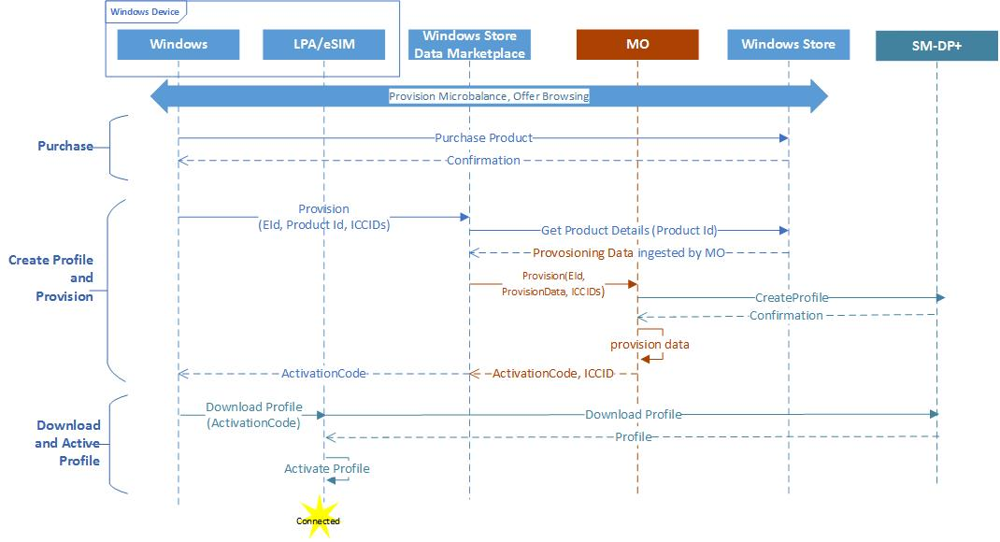
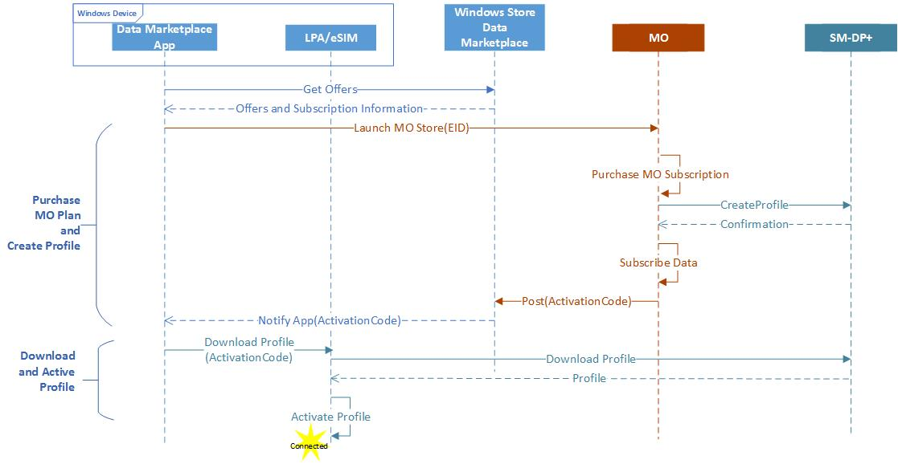

# MO Direct API

## Hosting the MO Direct experience

The Data Marketplace application will use the **webView** control to host the Mobile Operator Direct (MO Direct) experience. The application will trust only the content returned by the Data Marketplace service. Details about the **webView** control can be found on [Windows Dev Center](https://msdn.microsoft.com/en-us/library/windows/apps/windows.ui.xaml.controls.webview.aspx).

```
    MyWebView.ScriptNotify += MyWebView\_ScriptNotify;      // Here we have to set the AllowedScriptNotifyUri property because we are
                                                            // navigating to some site where we don&#39;t own the content and we want to     
                                                            // allow window.external.notify() to pass data back to the app.    
    List&lt;Uri&gt; allowedUris = new List&lt;Uri&gt;();    
    allowedUris.AddRange(AllowedNotifyUris);    
    MyWebView.AllowedScriptNotifyUris = allowedUris;    
    MyWebView.Navigate(&quot;https://moportal.com? **eid** =\&quot;eid\&quot;&amp; **iccid** =8988247000100003319&amp; **market** =us&amp; **transactionId** =cvcvcv&amp; **location** =us&quot;);
```

When starting **webView**, the EID, market, and previous ICCID, if available, will be passed.

The launch parameters for physical SIM are shown here.

```
MyWebView.Navigate(&quot;https://moportal.com? **iccid** =8988247000100003319&amp; **market** =us&amp; **transactionId** =waoigFfX00yGH3Vb.1&amp; **location** =us&quot;);
```

The language preference will be sent using the Accept-Language header.

| Parameter Name | Description | Example |
| --- | --- | --- |
| eid | eSIM Identifier. This is sent only if an eSIM is present. | eid=89033024010400000100000000009136 |
| iccid | ICCID is required parameter for a physical SIM and an optional parameter for eSIM. Specifies the available ICCID&#39;s on the physical sim. | iccid=8988247000100003319 |
| iccids | Optional parameter. Specifies the list of ICCID&#39;s from available profiles  on the eSIM only. If there are no ICCID&#39;s matching the MO available on eSIM, this parameter won&#39;t be sent. | iccids=8988247000100003319, 988247000100003555 |
| location | Users current physical location with a country level granularity | location=us |
| transactionId | Transaction Id used for debugging the session. Providers should log this and send it in the notification payload. Maximum size is 64 characters. | transactionId=waoigFfX00yGH3Vb.1 |
| market | The two-letter ISO code of the country catalog for Windows Store. | market=us |

| Header Name | Description | Example |
| --- | --- | --- |
| Accept-Language | Users current language settings. The MO portal should render the contents in the specified language if possible. | Accept-Language: en-us |

## MO Direct flow diagram

This diagram gives a high-level flow for the eSIM MO Direct flow. In this scenario, the user doesn&#39;t have an MO profile installed and is purchasing a plan from the MO portal.

<p></p>

The following diagram provides the high-level flow of MO Direct when the user has a physical SIM.

<p></p>

## Control handoff to Paid Wi-Fi and Cellular app

After the user completes the purchase flow (either by making a successful purchase, or cancelling the purchase), the MO portal must hand off the flow back to the Paid Wi-Fi and Cellular app. This is done by issuing a notification to app with the result of the user interaction with the MO portal. The notification can be sent using JavaScript with the following syntax.

window.external.notify(notificationPayload)

An example of the notification payload for eSIM is shown here.

{&quot;ver&quot;:&quot;1&quot;,&quot;purchaseResult&quot;:&quot;{\&quot;userAccount\&quot;:\&quot;New\&quot;,\&quot;purchaseInstrument\&quot;:\&quot;New\&quot;,\&quot;line\&quot;:\&quot;New\&quot;,\&quot;moDirectStatus\&quot;:\&quot;Complete\&quot;,\&quot;planName\&quot;:\&quot;MyPlan\&quot;}&quot;,&quot;success&quot;:true,&quot;Iccid&quot;:&quot;8988247000100297655&quot;,&quot;activationCode&quot;:&quot;activationCode&quot;,&quot;eId&quot;:&quot;89033024010400000100000000009136&quot;&quot;transactionId&quot;:&quot;CDE2882E-BD5E-485F-B921-D0D60BBCF7FF&quot;,&quot;orderId&quot;:&quot;04282107&quot;} 

An example of notification payload for physical SIM is shown here.

{&quot;ver&quot;:&quot;1&quot;,&quot;purchaseResult&quot;:{\&quot;userAccount\&quot;:\&quot;New\&quot;,\&quot;purchaseInstrument\&quot;:\&quot;New\&quot;,\&quot;line\&quot;:\&quot;New\&quot;,\&quot;moDirectStatus\&quot;:\&quot;Complete\&quot;,\&quot;planName\&quot;:\&quot;MyPlan\&quot;},&quot;success&quot;:true,&quot;iccid&quot;:&quot;8988247000100297655&quot;,&quot;transactionId&quot;:&quot;CDE2882E-BD5E-485F-B921-D0D60BBCF7FF&quot;,&quot;orderId&quot;:&quot;04282107&quot;} 

The MO Portal URI that the notification is sent from must be in secure https protocol.

| JSON field | Type | Description | Example |
| --- | --- | --- | --- |
| success | Boolean | True if the user purchased an MO Direct plan | &quot;success&quot;:true |
| iccid | String | For eSIM, this indicates the ICCID that a client must use for consuming the MO Direct plan purchased | iccid:&quot;8988247000100297655&quot; |
| transactionId | String | MO Portal should return the transaction Id that it received as query parameter when the portal was launched. | transctionId= rRi8OzhI3EiR02nm.2.0.1 |
| purchaseResult | JSON | Contains the details of the user interaction with the MO portal |   |
| userAccount | Enum. Possible values:        None,        New,        Existing,        Bailed | **New** indicates that a new user account was created by the user. **Existing** indicates that the user logged on with an existing user account. **Bailed** indicates that the user ended the purchase flow at this step. **None** indicates that the user didn&#39;t reach this step. This field is **required**. | &quot;userAccount&quot;:&quot;New&quot; |
| purchaseInstrument | Enum. Possible values:        None,        New,        Existing,        Bailed | **New** indicates that a purchase instrument was added by the user. **Existing** indicates that the user used an existing purchase instrument. **Bailed** indicates that the user ended the purchase flow at this step. **None** indicates that the user didn&#39;t reach this step. This is an **optional** field. | &quot;purchaseInstrument&quot;: &quot;existing&quot; |
| line | Enum. Possible values:        None,        New,        Existing,        Bailed | **New** indicates that a SIM card was added by the user account. **Existing** indicates that the transferred an existing line to the device. **Bailed** indicates that the user ended the purchase flow at this step. **None** indicates that the user didn&#39;t reach this step. This field is **required**. | &quot;line&quot;:&quot;New&quot; |
| moDirectStatus | Enum. Possible Values        None,        Bailed,        Complete,        ServiceError,        BillingError,        InvalidSIM,        LogOnFailed,        PurchaseFailed,        ClientError | **Complete** indicates that the user completed the purchase successfully. **ServiceError** indicates that the user was unable to complete the purchase due to MO service error. **InvalidSIM** indicates that the ICCID passed to the portal was incorrect. **LogOnFailed** indicates that the user failed to log into the MO portal. **PurchaseFailed** indicates that the purchase failed due to billing. **errorClientError** indicates invalid arguments passed to portal. This field is **required**. | &quot;moDirectStatus&quot;:&quot;Complete&quot; |
| orderId | String | Upon successful purchase of a MO Direct transaction, the portal will return the orderId associated with the transaction. This orderId is displayed to the user along with a confirmation message to the user on a successful purchase. For a successful purchase, this field must not be empty. For an unsuccessful transaction, this field must be empty. This field is **required**. | &quot;orderId&quot;:&quot;04282017&quot; |

[Send comments about this topic to Microsoft](mailto:wsddocfb@microsoft.com?subject=Documentation%20feedback%20%5Bp_mb\p_mb%5D:%20Planning%20your%20APN%20database%20submission%20%20RELEASE:%20%281/18/2017%29&body=%0A%0APRIVACY%20STATEMENT%0A%0AWe%20use%20your%20feedback%20to%20improve%20the%20documentation.%20We%20don't%20use%20your%20email%20address%20for%20any%20other%20purpose,%20and%20we'll%20remove%20your%20email%20address%20from%20our%20system%20after%20the%20issue%20that%20you're%20reporting%20is%20fixed.%20While%20we're%20working%20to%20fix%20this%20issue,%20we%20might%20send%20you%20an%20email%20message%20to%20ask%20for%20more%20info.%20Later,%20we%20might%20also%20send%20you%20an%20email%20message%20to%20let%20you%20know%20that%20we've%20addressed%20your%20feedback.%0A%0AFor%20more%20info%20about%20Microsoft's%20privacy%20policy,%20see%20http://privacy.microsoft.com/default.aspx. "Send comments about this topic to Microsoft")
