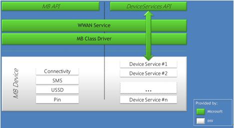

# Mobile operator hardware overview

You should use this topic to get a high-level understanding of the Windows 8, Windows 8.1, and Windows 10 mobile broadband hardware requirements and recommendations. We recommend the following to provide your customers with a simplified connection experience, as well as reducing your maintenance and support costs.

-   Embedded mobile broadband modules that provide USB interfaces must meet the Windows 8, Windows 8.1, or Windows 10 hardware certification requirements and be managed by using the mobile broadband class driver. Your hardware requirements documentation for IHVs should require that mobile broadband devices pass the Windows 8, Windows 8.1, or Windows 10 device certification.

-   External USB mobile broadband dongles must support identity morphing. Your hardware requirements documentation for IHVs should require that external mobile broadband devices pass both the Windows 8 device certification, Windows 8.1, or Windows 10 device certification and pass the Windows 7 logo certification.

    -   On a Windows 10 computer, the dongle appears as a Windows 10 certified mobile broadband device and is managed by using the mobile broadband class driver.

    -   On a Windows 8.1 computer, the dongle appears as a Windows 8.1 certified mobile broadband device and is managed by using the mobile broadband class driver.

    -   On a Windows 8 computer, the dongle appears as a Windows 8 certified mobile broadband device and is managed by using the mobile broadband class driver.

    -   On a Windows 7 computer, the dongle appears as a mass storage device, allowing the user to install specific device drivers.

-   If you require EAP-SIM, USSD, or multiple PDP connections, the IHV must enable it and it must comply with the Windows 8, Windows 8.1, or Windows 10 hardware certification requirements.

-   Any additional functionality required by you or the IHV must be implemented using the device services extension and enabled in Windows 8, Windows 8.1, or Windows 10 by using the mobile broadband class driver and the Device Services APIs. You should include any additional functionality as part of your hardware requirement documentation.

## Key scenarios

### Purchase an external device

An external device is likely to be inserted immediately before the user wants to begin using it.

1.  As soon as the device is inserted, it is recognized and managed by the mobile broadband class driver.

2.  The Mobile Broadband Service reads the IMSI and generates a set of hashes.

3.  When the user clicks **Connect**, these hashes are used to match connection settings within the [COSA/APN database submission](cosa-apn-database-submission.md).

    -   If the connection is successful and Internet connectivity is available, nothing further happens. The user has already purchased service.

    -   If the connection is successful, but Internet connectivity is not available, the web browser opens to the URL specified in the APN database or your UWP mobile broadband app.

    -   If the connection fails, the user is notified of the error.

4.  Your web site or your mobile broadband app helps the user purchase service.

5.  After purchase, the device is provisioned by using the provisioning API from a provisioning file. The provisioning file is passed to the provisioning agent by the web site or the mobile broadband app. The provisioning file configures Windows with basic information about the plan that the user has purchased. Depending on the network structure, one of the following occurs:

    -   The user is granted Internet access on the current connection.

    -   The provisioning file includes instructions to disconnect and reconnect to the same network or a different network, which will provide Internet access.

### Connect an external device with an active SIM

When an active device is attached that already had an active SIM, the workflow is similar to when you purchase an external device, except that the attempted connection will lead to the Internet. You don’t need to direct the user to your website or mobile broadband app to purchase service.

1.  As soon as the device is inserted, it is recognized and managed by the mobile broadband class driver.

2.  The Mobile Broadband Service reads the IMSI and generates a set of hashes.

3.  When the user clicks **Connect**, these hashes are used to match connection settings within the [COSA/APN database submission](cosa-apn-database-submission.md). For a device with an active SIM, the connection is successful and Internet connectivity is available.

## Components

### Windows 8, Windows 8.1, or Windows 10 certified mobile broadband devices

To take full advantage of the Windows mobile broadband platform, your mobile broadband device must meet the Windows 8, Windows 8.1, or Windows 10 hardware certification requirements. For a comprehensive description of the hardware certification requirements, see [Windows Hardware Certification Requirements](https://msdn.microsoft.com/library/windows/hardware/hh748188).

For the end user, the most simplified connection experience is delivered with a USB-based mobile broadband device. As part of the hardware certification requirements, any mobile broadband device that manifests as a USB device must comply with the [Mobile Broadband Interface Model (MBIM) specification](https://msdn.microsoft.com/library/windows/hardware/dn265427) and the MBIM v1.0 Errata. This includes both external USB dongles and embedded modules that provide USB interfaces. For this class of devices, Windows 8, Windows 8.1, or Windows 10 includes a mobile broadband class driver, which eliminates the need for additional drivers from the IHV and simplifies the user’s connection experience. Other hardware that is not USB and driver models can receive Windows 8, Windows 8.1, and Windows 10 certification and will provide the Microsoft Store mobile broadband app experience, but these are not supported by the mobile broadband class driver.

### Mobile broadband class driver

The mobile broadband class driver reduces the burden on device manufacturers to deliver a custom driver for their specific mobile broadband device. The mobile broadband class driver manages any USB MBIM-compliant mobile broadband interface that meets the Windows 8, Windows 8.1, or Windows 10 device certification. When a certified device is connected, no additional drivers are required and Windows can immediately use the device to connect to your network. The mobile broadband class driver conforms to the Windows mobile broadband driver model and provides full functionality to the Windows Mobile Broadband Service. It supports GSM networks, including HSPA+ and LTE; CDMA networks; and dual-mode networks offering 3G CDMA and 4G LTE. It also supports operator messages such as SMS and USSD, and EAP-SIM-based authentication.

**Note**  
While USSD, EAP-SIM, and multiple PDP contexts are supported by the mobile broadband class driver, they are optional components of the Windows 8, Windows 8.1, or Windows 10 for desktop editions (Home, Pro, Enterprise, and Education) hardware certification requirements. Multiple PDP contexts are required for Windows 10 Mobile for hardware certification, however.

 

Additional device functionality can be implemented using custom device service extensions, which will be exposed directly to the mobile broadband app through the WinRT Device Services API.

For more information on the mobile broadband class driver, see [Mobile Broadband (MB) Reference](https://msdn.microsoft.com/library/windows/hardware/ff560545).

### Device service extension API

One of the distinct advantages to using the Windows platform is the ability to provide new hardware scenarios that support operator differentiation. The Windows mobile broadband platform is expected to enable differentiation for operators that can command higher customer loyalty and brand equity. The platform provides a set of extension points that you can incorporate into your unique experience.

Windows certified mobile broadband devices declare each supported extension point as a “device service”. Examples of such services include Phonebook, SIM Toolkit, or GPS features. Any device services that are not natively implemented by the Windows mobile broadband platform can be accessed by using the Device Service Extension API. You and the IHV define the device services that should be implemented. The IHV’s firmware and your mobile broadband app must be designed concurrently to enable the desired device services. The USB Implementers Forum is establishing a registry of device services that are available to IHVs at [MBIMRegistry](http://www.usb.org), and we recommend that you and the IHVs you are working with use this registry to coordinate to ensure consistency for common device services extensions.

The Device Service Extension API provides a direct way for the mobile broadband app to access functionality on their mobile broadband device. This provides a conduit through the WWAN service and the mobile broadband class driver to the device, as illustrated in the following diagram:

Each device service has a corresponding GUID. All control messages and non-IP packets exchanged between the mobile broadband class driver and the device will carry the GUID to identify the service associated with the request. Command identifiers (CIDs) and status indication codes are defined under a service’s GUID namespace. For example, Phonebook and STK could both share the same CID code, but will be distinguished by the device service GUID exchanged in the request.

**Note**  
The COM-based Device Services API is accessible to any desktop application or service. The WinRT projected Device Services API is available only to a privileged UWP device app that is authorized by a mobile broadband operator. Developers should carefully consider privacy and security when communicating information this way.

 

The Windows wireless platform supports APIs for the following functionality that is available to apps:

-   Enumerate device services

-   Open and close device services

-   Send control commands to a specific device service

-   Send or receive data to or from a specific device service

-   Register for unsolicited device events from a specific device

For more information, see [**IMbnDeviceService interface**](https://msdn.microsoft.com/library/windows/desktop/hh780509).

### Legacy support and identity morphing

Windows 8, Windows 8.1, and Windows 10 support mobile broadband devices designed for Windows 7. Whereas the current ecosystem of devices will continue to function on Windows 8, Windows 8.1, and Windows 10 they will not fully utilize the Windows 8, Windows 8.1, or Windows 10 mobile broadband platforms.

A summary of mobile broadband device support inWindows 8, Windows RT, Windows 8.1, and Windows RT 8.1 is provided here:

-   Windows 10 certified devices – These devices pass the mobile broadband experience tests supporting the Windows 10 Hardware Certification Kit. For these devices, Windows 10 provides the mobile broadband class driver and advanced power management.

-   Windows 8 or Windows 8.1 certified devices – These devices pass the mobile broadband experience tests supporting the Windows 8 or Windows 8.1 Hardware Certification Kit. For these devices, Windows 8 and Windows 8.1 provide the mobile broadband class driver and advanced power management.

-   Windows 7 logo’d devices – These devices use third-party IHV drivers based on Windows 7 NDIS 6.20 driver model. Windows 8 and Windows 8.1 provide mobile broadband experience in backward compatibility mode for these devices and they are limited to Windows 7 functionality.

-   Windows 8 and Windows 8.1 will continue to support the legacy devices based on modem or Ethernet interfaces along with a custom connection manager as in earlier versions of Windows. Windows 8 and Windows 8.1 will not be able to provide mobile broadband experiences as they are not compliant with the mobile broadband stack. Because the legacy devices are not recognized by the mobile broadband stack, connectivity over such devices may result in excessive data consumption as they are not managed by Windows Connection Manager.

-   Windows RT and Windows RT 8.1 certified devices – These devices pass mobile broadband experience tests supported by the Windows RT or Windows RT 8.1 Windows Hardware Certification Kit. For these devices, Windows RT and Windows RT 8.1 provide the mobile broadband class driver and advanced power management.

    **Note**  
    Windows RT and Windows RT 8.1 systems do not support mobile broadband devices designed for Windows 7 and earlier versions.

     

To ensure that Windows 8 and Windows 8.1 certified devices are useful on older platforms, Windows provides an identity morphing solution that enables the device to exhibit behavior that is appropriate for the operating system to which it is connected.

### Identity morphing

When the device is first connected to a Windows 7 PC, a typical external mobile broadband USB dongle presents itself as a mass storage device. This does not expose other functionality to prevent these devices from appearing as non-functional due to missing driver software. The mass storage device contains the IHV-supplied software that installs the driver package. After the user installs the driver package, the IHV-supplied software must morph the device to expose the other functions to the user. At this point, the device will appear as a mobile broadband device and the user can connect to your network.

The native Windows 8, Windows 8.1, and Windows 10 class driver eliminates the need for an external USB device to expose itself initially as a mass storage device, since no driver installation is necessary. Windows 8, Windows 8.1, and Windows 10 include the capability to trigger a device’s identity morphing, allowing the device to immediately appear as a mobile broadband device.

To learn how to develop an identity morphing solution, see [**IMbnDeviceService interface**](https://msdn.microsoft.com/library/windows/desktop/hh780509).\]

### Firmware update support

Mobile broadband device firmware should be updated by using Windows Update. For info on how this can be done, see [Mobile Broadband Device Firmware Update on Windows 8](https://msdn.microsoft.com/library/windows/hardware/dn423926). Specific configurations for your experience can be provisioned by using your mobile broadband app.

### OMA-DM client support

Windows 8.1 added OMA-DM support for enterprises to manage your devices running Windows in BYOD (Bring Your Own Device) scenarios. This extends support for these scenarios by adding enterprise-relevant protocols ([MS-MDE](https://go.microsoft.com/fwlink/?linkid=617595), [MS-MDM](https://go.microsoft.com/fwlink/?linkid=619346)) for use by 3rd-party mobile device management providers and Windows InTune.

Windows separates OMA-DM support for mobile Network operator configuration from the support for enterprise BYOD. The OMA-DM client in Windows 8.1 and Windows 10 does not support configuring Mobile Operator specific settings natively and is not 3rd party extensible to support mobile network operator requirements. OMA-DM solutions supporting Windows Phone platform are not compatible with the Windows 8.1 OMA-DM client or the Windows 10 OMA-DM client.

Here are some options to consider when supporting an operator-specific OMA-DM:

-   If the OMA-DM client is in the network adapter’s firmware:

    -   Typically, mobile broadband device manufacturers may bundle operator-specific OMA-DM client in their network adapter’s firmware.

    -   The mobile broadband device manufacturer may be able to provide 3rd party OMA-DM client solutions for integrating in their network adapter firmware if a natively supported solution does not exist.

    -   Mobile broadband apps should continue to use [provisioning metadata](https://msdn.microsoft.com/library/windows/apps/windows.networking.networkoperators.provisioningagent) when configuring operating system specific parameters.

-   OMA-DM client in the mobile broadband app:

    -   If the modules do not support an OMA-DM client in the network adapter’s firmware, you may want to implement OMA-DM client in your mobile broadband app.

    -   This solution requires operator-specific or device manufacturer-specific custom device service support for configuring device specific parameters by the mobile broadband app.

    -   Mobile broadband app that include an OMA-DM client should use [**provisioning metadata**](https://msdn.microsoft.com/library/windows/apps/br207397) when configuring operating system specific parameters.

### APN Management

Default APN management is done by using the local APN database. You may desire to have the APN information changed for selective users, such as enterprise users. In such cases, either you or the OEM can choose to update the APN directly on the device by using OMA DM in OTA signaling.

Your device must implement the following:

-   When pre-provisioned by operator or provisioned through OTA **prior to** a successful connection by using the SIM on that system, the device should provide Internet PDP context as a first provisioned context with the ContextType set to **Internet** when queried by Windows as defined in MBIM section 10.5.13.5. This ensures that the connection logic uses this APN information when attempting a connection.

-   If the SIM has been used to establish a successful connection to the network using an alternative APN on that system, setting the ContextType to Internet will not work. The only way to force the Window to establish a connection using the new APN is to delete the specific profile created. The profile can be deleted by running the following command from an elevated command prompt: **netsh mbn delete profile interface="Mobile Broadband Connection" name="myProfileName"**

**Note**  
Since this is an optional Windows feature for devices to support, there is no HCK test or automated test case to validate this scenario on the system. It is our expectation that the operator certification will handle the validation to confirm that the device conforms to the operator requirements.

 

For more info about the APN database, see [APN database overview](apn-database-overview.md).

### Network personalization

Certain operators require that mobile broadband-enabled systems be locked to its network or have requirements to unlock a locked device to allow for service portability. To enable this scenario, we require the OEM’s and device vendors use MBIM\_PIN\_TYPE guidance in the MBIM Specification for Subsidy Lock.

The device must report [**WWAN\_READY\_INFO**](https://msdn.microsoft.com/library/windows/hardware/ff571226):: [**ReadyState**](https://msdn.microsoft.com/library/windows/hardware/ff571227)=**WwanReadyStateInitialized** in this locked state and should not report **WwanReadyStateDeviceLocked**.

**Note**  
There is no HCK test case to validate that this feature implemented on the device or system works with Windows. We look towards the OEM and the operator to use specific filters within MBOT to ensure that the final product can be tested.

 

 

 

