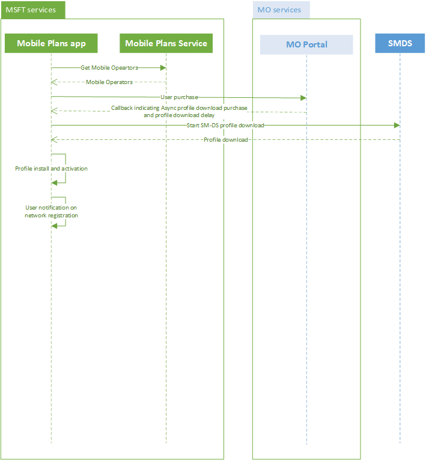

# Mobile Plans asynchronous fulfillment

[!include[Mobile Plans Beta Prerelease](../mobile-plans-beta-prerelease.md)]

## Overview

This topic provides API details for mobile operators that need asynchronous fulfillment for either of the following scenarios:

- Asynchronous connectivity: when the mobile operator can't immediately grant connectivity to a user when the user downloads a profile after purchase.
- Asynchronous profile delivery: when the profile is not available for download at purchase time.

## Asynchronous connectivity

The following diagram shows the high level flow for how the Mobile Plans program supports delayed connectivity.


After the user successfully completes a purchase that requires a profile download from the mobile operator's MO Direct portal, the portal informs the Mobile Plans application that it should trigger the delayed connectivity flow using the `DataMart.notifyPurchaseWithProfileDownload` API. 

### DataMart.notifyPurchaseWithProfileDownload

| Parameter name | Type | Description |
| --- | --- | -- |
| purchaseMetadata | Object | This object contains metadata about the user's purchase. This includes details about the user account, the purchase method or instrument, details if the user is adding a new line, and the name of the plan that the user purchased. All these are used for reporting. |
| activationCode | String | The activation code for downloading the eSIM profile. The ICCID for the profile is inferred from the profile metadata. |
| networkRegistrationInterval | Unsigned integer | The time needed for the mobile operator to provision connectivity to the user. The Mobile Plans app attempts to register to the network within the specified time interval, in minutes. **Note** This time is rounded to the nearest 15 minute interval. For example, if this is set as 5 minutes, the application tries to re-register to the network after approximately 15 minutes (but it might take longer). |

The following Javascript function shows an example of the API to inform the application that the user purchase requires a delayed provisioning of connectivity.

 ```Javascript
function finishPurchaseWithDownload() {
        var metadata = DataMart.createPurchaseMetaData();
        metadata.userAccount = "New";
        metadata.purchaseInstrument = "New";
        metadata.moDirectStatus = "Complete";
        metadata.line = "New";
        metadata.planName = "2GB Monthly";
        DataMart.notifyPurchaseWithProfileDownload(metadata, "1$smdp.address$", 15);
}
```

| Property Name | Type | Description | Example |
| --- | --- | --- | --- |
| userAccount | String | Possible values: <ul><li>New: Indicates that a new user account was created by the user.</li><li>Existing: Indicates that the user logged on with an existing user account.</li><li>Bailed: Indicates that the user ended the purchase flow at this step.</li><li>None: Indicates that the user didn’t reach this step.</li></ul> | "userAccount":"New" |
| purchaseInstrument | String | Possible values: <ul><li>New: Indicates that a new user account was created by the user.</li><li>Existing: Indicates that the user logged on with an existing user account.</li><li>Bailed: Indicates that the user ended the purchase flow at this step.</li><li>None: Indicates that the user didn’t reach this step.</li></ul> | "purchaseInstrument":"New" |
| line | String | Possible values: <ul><li>New: Indicates that a SIM card was added by the user account.</li><li>Existing: Indicates that the user transferred an existing line to the device.</li><li>Bailed: Indicates that the user ended the purchase flow at this step.</li><li>None: Indicates that the user didn’t reach this step.</li></ul> | "line":New" |
| moDirectStatus | String | Possible values: <ul><li>Complete: Indicates that the user completed the purchase successfully.</li><li>ServiceError: Indicates that the user was unable to complete the purchase due to an MO service error.</li><li>InvalidSIM: Indicates that the ICCID passed to the portal was incorrect.</li><li>LogOnFailed: indicates that the user failed to log in to the MO portal.</li><li>PurchaseFailed: Indicates that the purchase failed due to a billing error.</li><li>ClientError: Indicates that invalid arguments were passed to the portal.</li>BillingError: Indicates that there was an error with the user billing.</li></ul> | "moDirectStatus":"Complete" |
| planName | String | For a successful transaction, this field must not be empty and must provide a descriptive plan name. For an unsuccessful transaction, this field must be an empty string. | "planName":"2GB Monthly"|


## Asynchronous profile delivery

The following diagram shows the high level flow for how the Mobile Plans program supports delayed profile download.



After the user successfully completes a purchase that requires a profile download from the mobile operator's MO Direct portal, the portal informs the Mobile Plans application that it should trigger the delayed profile download flow using the `DataMart.notifyPurchaseDelayedProfile` API. 

### DataMart.notifyPurchaseDelayedProfile

| Parameter Name | Type | Description |
| --- | --- | -- |
| purchaseMetadata | Object | This object contains metadata about the user's purchase. This includes details about the user account, the purchase method or instrument, details if the user is adding a new line, and the name of the plan that the user purchased. All these are used for reporting. |
| profileDownloadDelayInterval | Unsigned integer | The time needed for the mobile operator to create the profile for the user profile and have it ready for download from SM-DS. The Mobile Plans app downloads the profile from SM-DS after this interval, in minutes. **Note** This time is rounded to the nearest 15 minute interval. For example, if this is set as 5 minutes, the application tries to download to the network after approximately 15 minutes (may take longer)|

The following Javascript function shows an example of the API to inform the application that the user purchase requires a delayed profile download using SM-DS.

 ```Javascript
function finishPurchaseWithSMDS() {
        var metadata = DataMart.createPurchaseMetaData();
        metadata.userAccount = "New";
        metadata.purchaseInstrument = "New";
        metadata.moDirectStatus = "Complete";
        metadata.line = "New";
        metadata.planName = "2GB Monthly";
        DataMart.notifyPurchaseDelayedProfile(metadata, 15);
}
```

## Adding balance

When a user completes a purchase in the MO Direct portal by adding more data to their account (no profile download needed because the user used the current profile on the eSIM), the MO portal should invoke the `DataMart.notifyBalanceAddition` API return control back to the Mobile Plans app.

### DataMart.notifyBalanceAddition

| Parameter name | Type | Description |
| --- | --- | -- |
| purchaseMetadata | Object | This object contains metadata about the user's purchase. This includes details about the user account, the purchase method or instrument, details if the user is adding a new line, and the name of the plan that the user purchased. All these are used for reporting. |
| iccid | String | The ICCID to which data is assigned. If this ICCID is not active, the Mobile Plans app activates the corresponding profile.|

The following Javascript function shows an example of the API to inform the application that the user has completed a purchase using a profile already available, but not neccessarily active, on the eSIM.

 ```Javascript
function finishPurchaseWithBalanceAddition() {
        var metadata = DataMart.createPurchaseMetaData();
        metadata.userAccount = "New";
        metadata.purchaseInstrument = "New";
        metadata.moDirectStatus = "Complete";
        metadata.line = "New";
        metadata.planName = "2GB Monthly";
        DataMart.notifyBalanceAddition(metadata, "89000000000000000000");
    }
```

## Canceling purchase flow

If a user cancels the purchase flow at the MO portal, then the portal must invoke the `DataMart.notifyCancelledPurchase` API to return control back to the Mobile Plans app.

### DataMart.notifyCancelledPurchase

| Parameter name | Type | Description |
| --- | --- | -- |
| purchaseMetadata | Object | This object contains metadata about the user's purchase. This includes details about the user account, the purchase method or instrument, details if the user is adding a new line, and the name of the plan that the user purchased. All these are used for reporting. |

The following Javascript function shows an example of the API to inform the application that the user has canceled a purchase.

 ```Javascript
function finishPurchaseWithCancellation() {
        var metadata = DataMart.createPurchaseMetaData();
        metadata.userAccount = "New";
        metadata.purchaseInstrument = "New";
        metadata.moDirectStatus = "Cancelled";
        metadata.line = "Bailed";
        metadata.planName = "";
        DataMart.notifyCancelledPurchase(metadata);
    }
```

> [!NOTE]
> The cancelation and balance addition flows using the `DataMart.notifyPurchaseResult` API are still supported. 

## Frequently Asked Questions

1. Is *Transaction ID* still required?

        Mobile operators do not have to return the *Transaction ID* passed to the portal, but they are required to store this value for troubleshooting purposes.

2. Which API should be used to transfer control back to Mobile Plans when connectivity is available immediately?

        The `DataMart.notifyPurchaseDelayedProfile` API is supported for this scenario going forward. In this specific case, the *networkRegistrationInterval* parameter should be set to **0**.

        If you have implemented the `DataMart.notifyPurchaseResult` API as specified in the integration guide, it is still supported. 

3. Is ICCID information still required for the eSIM activation callback?

        ICCID information is only needed for the adding balance scenario, when the `DataMart.notifyBalanceAddition` API callback is used.

        If you have implemented the `DataMart.notifyPurchaseResult` API as specified in the integration guide, it is still supported.

4. What if I still need help?

        Please contact your Microsoft representative.