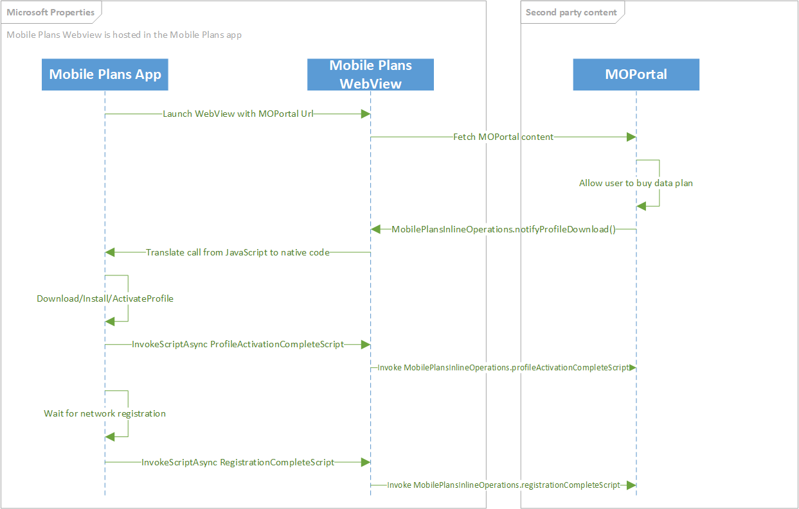
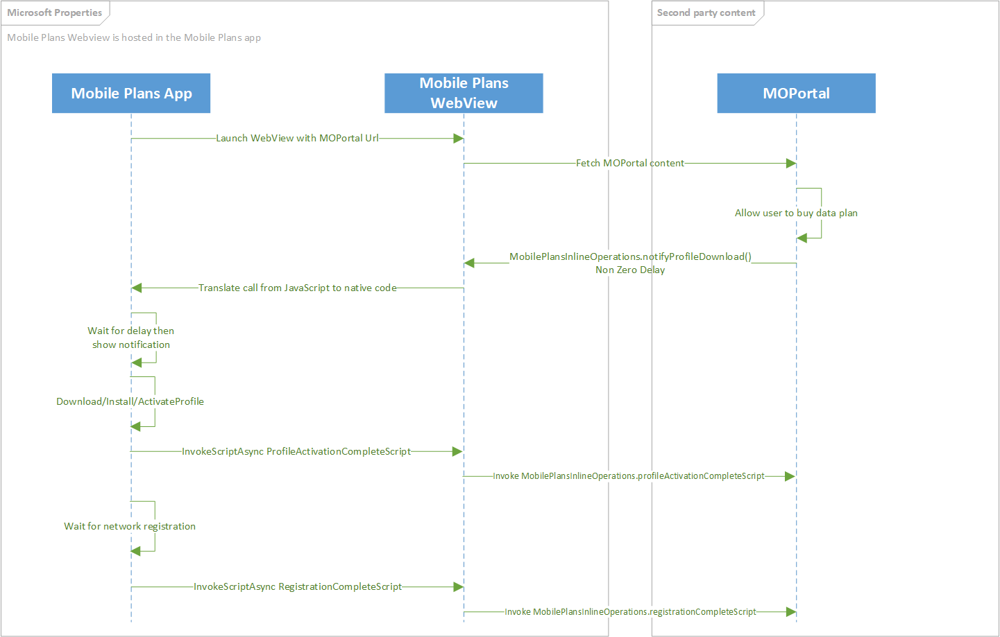
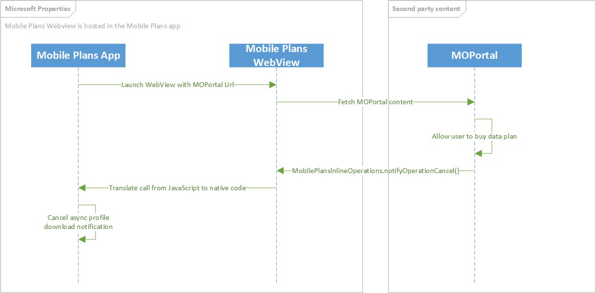
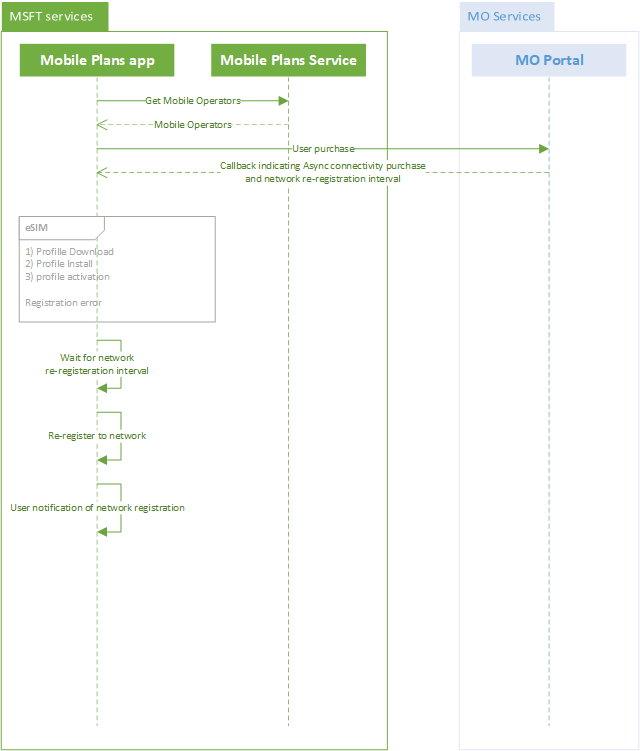
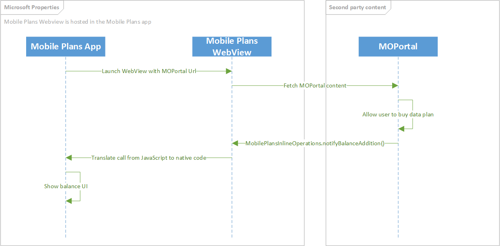
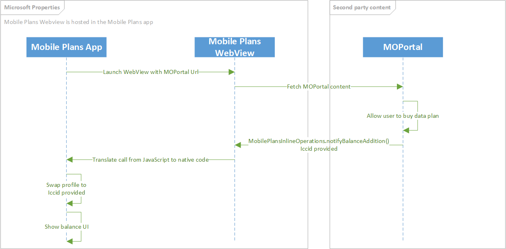

# Mobile Plans callback notifications

## Overview

Once a user finishes the activation flow in the mobile operator web portal, the portal must provide a signal to let the Mobile Plans app know that the flow has completed. This is done by issuing a notification to the app that includes the result of the user interaction with the web portal.

Transactions that the web portal supports include, but are not limited to, the following:

- Issuing a new eSIM profile (using an activation code).
- Associating the device with a new or existing subscription.
- Purchasing a new data plan (either postpaid or prepaid).
- Purchasing additional data for to an prepaid plan.
- Canceling a subscription.

> [!NOTE]
> The callback notification must be returned from the host defined in the mobile operator's [Service configuration](mobile-plans-service-configuration.md).

## Inline profile download and connectivity

The callback method should be used when performing an eSIM profile download in the background while keeping the user in the mobile operator web portal. This enables the portal to show additional content, such as an account management page, after the profile download is completed. Additionally, it is expected that the profile will enable the device to register on the cellular network immediately upon activation, with no time delay required.


The following diagram shows the call flow for an inline profile download callback:



This is a revised version of the legacy [Inline profile delivery](mobile-plans-legacy-callback-notifications.md#inline-profile-delivery) callback, which can be found in the Appendix for documentation purposes. It is recommended that mobile operators use the revised callback method above.

### MobilePlansInlineOperations.notifyProfileDownload(purchaseMetaData, activationCode)

| Parameter name | Type | Description |
| --- | --- | -- |
| purchaseMetadata | Object | This object contains metadata about the user's purchase. This includes details about the user account, the purchase method or instrument, details if the user is adding a new line, and the name of the plan that the user purchased. These are used for business reporting. |
| activationCode | String | The activation code to be used to download an eSIM profile

| Return value type | Description |
| --- | --- |
| MobilePlansOperationContext | An object with identifiers to which match to this unique download operation.

The eSIM profile download will begin upon receipt of the callback notificaiton. Control is returned to the web portal immediately after the call. UI will be displayed to show the profile download progress as popup element rendered on top of the web portal. The web portal can continue to be navigated during this process.

The following Javascript function shows an example of the API to inform the application that a profile download should begin:

```Javascript
var purchaseMetaData = MobilePlans.createPurchaseMetaData();
    purchaseMetaData.userAccount = MobilePlansUserAccount.new;
    purchaseMetaData.purchaseInstrument = MobilePlansPurchaseInstrument.new;
    purchaseMetaData.lineType = MobilePlansLineType.new;
    purchaseMetaData.modirectStatus = MobilePlansMoDirectStatus.complete;
    purchaseMetaData.planName = "My Plan";
    MobilePlansInlineOperations.registrationChangedScript = "onRegistrationChanged";
    MobilePlansInlineOperations.profileActivationCompleteScript = "onActivationComplete";
    MobilePlansInlineOperations.notifyProfileDownload(purchaseMetaData , "1$smdp.address$matchingID");
```

See [purchase metadata properties](#purchase-metadata-properties-details) for details about the puchaseMetadata object.

### Listening for network registration changes

To listen for network registration changes, the `MobilePlansInlineProfileDownload.registrationChangedScript` must be set to a string that is the name of a Javascript function that takes a string for the `registrationArgs`.

The registration args are a string that represents a JSON object.

#### ProfileRegistrationCompleteArgs

| Property name | Type | Description |
| --- | --- | -- |
| networkRegistrationState | String | A string representing the current network registration state. The values of this property can be seen in `MobilePlansNetworkRegistrationState`. |
| iccid | String | The ICCID for which the network registration state has changed. |

#### MobilePlansNetworkRegistrationState

| Property name | Type | Description |
| --- | --- | -- |
| none | String | No connectivity. |
| deregistered | String | The device is not registered and is not searching for a network provider. |
| searching | String | The device is not registered and is searching for a network provider. |
| home | String | The device is on a home network provider. |
| roaming | String | The device is on a roaming network provider. |
| partner | String | The device is on a roaming partner network provider. |
| denied | String | The device was denied registration. |

The following Javascript example shows how to implement a listener for network registration changed events.

```Javascript
function onRegistrationChanged(registrationArgs) {
    var registrationObj = JSON.parse(registrationArgs);
    if(registrationObj.networkRegistrationState == MobilePlansNetworkRegistrationState.home ||
       registrationObj.networkRegistrationState == MobilePlansNetworkRegistrationState.roaming ||
       registrationObj.networkRegistrationState == MobilePlansNetworkRegistrationState.partner)
    {
        Log('Registration Successful!');
    }
}
```

### Listening for profile activation

To listen for profile activation events, the `MobilePlansInlineProfileDownload.profileActivationCompleteScript` must be set to a string that is the name of a Javascript function that takes a string for the `activationArgs`.

The `activationArgs` is a string that represents a JSON object.

#### ProfileActivationCompleteArgs

| Property name | Type | Description |
| --- | --- | -- |
| activationResult | String | The result of the activation. The values of this property can be seen in `MobilePlansActivationError`. |
| iccid | String | The ICCID of the profile that was activated. |

#### MobilePlansActivationError

| Property name | Type | Description |
| --- | --- | -- |
| success | String | Indicates that an operation was successful. |
| notAuthorized | String | Indicates that the operation was not authorized. |
| notFound | String | Indicates that the specified eSIM profile was not found. |
| policyViolation | String | Indicates that the operation violates policy. |
| insufficientSpaceOnCard | String | Indicates that there is not enough storage space on the card to complete the operation. |
| serverFailure | String | Indicates that a server failure occurred during the operation. |
| serverNotReachable | String | Indicates that the server could not be reached during the operation. |
| timeoutWaitingForUserConsent | String | Indicates that user consent was not granted within the timeout period of the operation. |
| incorrectConfirmationCode | String | Indicates that the wrong confirmation code was supplied during the operation. |
| confirmationCodeMaxRetriesExceeded | String | Indicates that the wrong confirmation code was supplied during the operation, and that no more retries are permitted. |
| cardRemoved | String | Indicates that the SIM card has been removed. |
| cardBusy | String | Indicates that the SIM card is busy. |
| other | String | Indicates a status that is not accounted for by a more specific status. |
| cardGeneralFailure | String | Indicates that a card error occurred that prevented the download, install, or other operation from completing successfully. |
| confirmationCodeMissing | String | Indicates that a confirmation code is needed to download the eSIM profile. |
| invalidMatchingId | String | Indicates that the matching ID from the activation code or discovered event was refused. |
| noEligibleProfileForThisDevice | String | Indicates that an eSIM profile compatible with this device could not be found. For example, a profile was found that requires LTE support, but the device only supports 3G. |
| operationAborted | String | Indicates that the operation aborted. |
| eidMismatch | String | Indicates that an eSIM profile on the mobile operator server is already allocated for a different eSIM EID than the one the device has. |
| profileNotAvailableForNewBinding | String | Indicates that the user is trying to download an eSIM profile that has already been claimed or downloaded. |
| profileNotReleasedByOperator | String | Indicates that the eSIM profile is available, but it is not yet marked as released for download by the mobile operator. Only released profiles can be downloaded, so the MO needs to mark the profile as released. |
| operationProhibitedByProfileClass | String | Indicates that the operation is not allowed for the eSIM profile class. |
| profileNotPresent | String | Indicates that an eSIM profile could not be found. |
| noCorrespondingRequest | String | Indicates that no corresponding request could be found. |
| unknownError | String | Indicates that LPA returned an error that is unknown. |
| lpaInitializationError | String | Indicates that an error occurred when trying to initialize LPA. |
| modemNotFound | String | Indicates that no cellular modem was found on the device. |
| localSettingsAccessFailed | String | Indicates that accessing app local settings failed. |
| invalidJson | String | Indicates that the MO portal has provided invalid JSON when calling the Mobile Plans app. |
| invalidActivationCode | String | Indicates that the MO portal has given invalid activation code. |
| invalidIccid | String | Indicates that the MO portal has given an invalid ICCID. |

The following Javascript example shows how to implement a listener for the profile activation event.

```Javascript
function onActivationComplete(activationArgs) {
    var activationObj = JSON.parse(activationArgs);
    if(activationObj.activationResult == MobilePlansActivationError.success)
        Log('Activation Success');
}
```

## Delayed eSIM profile download and activation

The following diagram shows the call flow for how the Mobile Plans app supports the delayed download and activation of an eSIM profile. This should be used when the eSIM profile is not available to be released by the SM-DP+ server, and can only be downloaded after a period of time. It is expected that the device will be able to register on the cellular network once the profile is downloaded and activated.



### MobilePlansInlineOperations.notifyProfileDownload(purchaseMetaData, activationCode, downloadDelay)

| Parameter name | Type | Description |
| --- | --- | -- |
| purchaseMetadata | Object | This object contains metadata about the user's purchase. This includes details about the user account, the purchase method or instrument, details if the user is adding a new line, and the name of the plan that the user purchased. All these are used for reporting. |
| activationCode | String | The activation code or SM-DP+ address where the profile is located
| downloadDelay | uint | The number of minutes to wait before attempting to download the eSIM profile

| Return value type | Description |
| --- | --- |
| MobilePlansOperationContext | An object with identifiers to which match to this unique download operation.

Control is returned to the mobile operator Portal immediately after the call. UI will be displayed to inform the user that a profile will be installed later. After the `downloadDelay` minutes has occurred, a notification will be shown to the user, inviting them to begin the process of downloading the profile.

The following Javascript function shows an example of the API to inform the application that a profile download with delay should begin

```Javascript
var purchaseMetaData = MobilePlans.createPurchaseMetaData();
    purchaseMetaData.userAccount = MobilePlansUserAccount.new;
    purchaseMetaData.purchaseInstrument = MobilePlansPurchaseInstrument.new;
    purchaseMetaData.lineType = MobilePlansLineType.new;
    purchaseMetaData.modirectStatus = MobilePlansMoDirectStatus.complete;
    purchaseMetaData.planName = "My Plan";
    MobilePlansInlineOperations.registrationChangedScript = "onRegistrationChanged";
    MobilePlansInlineOperations.profileActivationCompleteScript = "onActivationComplete";
    MobilePlansInlineOperations.notifyProfileDownload(purchaseMetaData , "1$smdp.address$matchingID", 15);
```

See [purchase metadata properties](#purchase-metadata-properties-details) for details about the puchaseMetadata object.

See [listening for network registration changes](#listening-for-network-registration-changes) section above.

See [listening for profile activation](#listening-for-profile-activation) section above.

## Cancel eSIM profile download

This applies for the deferred eSIM profile download scenario, but it could be used for future use cases as well.

The following diagram shows the high level flow for how the Mobile Plans program supports a cancellation of an eSIM profile download without control leaving the MODirect portal.



### MobilePlansInlineOperations.notifyOperationCancel(MobilePlansOperationContext)

| Parameter name | Type | Description |
| --- | --- | -- |
| operationContext | Object | This object contains information that uniquely identifies a previous operation |

This operation can be canceled before the user sees a toast notification informing them that download is ready to begin.

The following Javascript function shows an example of the API to cancel an asynchronous action.

```Javascript
var purchaseMetaData = MobilePlans.createPurchaseMetaData();
    purchaseMetaData.userAccount = MobilePlansUserAccount.new;
    purchaseMetaData.purchaseInstrument = MobilePlansPurchaseInstrument.new;
    purchaseMetaData.lineType = MobilePlansLineType.new;
    purchaseMetaData.modirectStatus = MobilePlansMoDirectStatus.complete;
    purchaseMetaData.planName = "My Plan";
    MobilePlansInlineOperations.registrationChangedScript = "onRegistrationChanged";
    MobilePlansInlineOperations.profileActivationCompleteScript = "onActivationComplete";
    var op = MobilePlansInlineOperations.notifyProfileDownload(purchaseMetaData , "1$smdp.address$matchingID", 15);
    MobilePlansInlineOperations.notifyOperationCancel(op);
```

## Asynchronous connectivity

The following diagram shows the high level flow for how the Mobile Plans app supports delayed connectivity. This callback method should be used when the eSIM profile is already available for release by the SM-DP+ server, however the device needs to wait some time before attempting to register on the cellular network.



After the user successfully completes the activation flow, the web portal informs the Mobile Plans app that it should trigger the delayed connectivity flow using the `MobilePlans.notifyPurchaseWithProfileDownload` API.

### MobilePlans.notifyPurchaseWithProfileDownload

| Parameter name | Type | Description |
| --- | --- | -- |
| purchaseMetadata | Object | This object contains metadata about the user's purchase. This includes details about the user account, the purchase method or instrument, details if the user is adding a new line, and the name of the plan that the user purchased. All these are used for reporting. |
| activationCode | String | The activation code for downloading the eSIM profile. The ICCID for the profile is inferred from the profile metadata. |
| networkRegistrationInterval | Unsigned integer | The time needed for the mobile operator to provision connectivity to the user. The Mobile Plans app attempts to register to the network within the specified time interval, in minutes. **Note** This time is rounded to the nearest 15 minute interval. For example, if this is set as 5 minutes, the application tries to re-register to the network after approximately 15 minutes (but it might take longer). if set to "0" the device will attempt to register immediately. |

The following Javascript function shows an example of the API to inform the application that the user purchase requires a delayed provisioning of connectivity.

 ```Javascript
function finishPurchaseWithDownload() {
        var metadata = MobilePlans.createPurchaseMetaData();
        metadata.userAccount = MobilePlansUserAccount.new;
        metadata.purchaseInstrument = MobilePlansPurchaseInstrument.new;
        metadata.moDirectStatus = MobilePlansMoDirectStatus.complete;
        metadata.line = MobilePlansLineType.new;
        metadata.planName = "2GB Monthly";
        MobilePlans.notifyPurchaseWithProfileDownload(metadata, "1$smdp.address$matchingID", 15);
}
```

See [purchase metadata properties](#purchase-metadata-properties-details) for details about the puchaseMetadata object.

## Adding balance

When a user completes a purchase in the web portal by adding more balance to an existing account, the web portal should invoke the `MobilePlansInlineOperations.notifyBalanceAddition` API return control back to the Mobile Plans app. This could be used for *physical SIM* or *eSIM profile* which are already installed in the device.

The following diagram shows the high level flow for how the Mobile Plans app supports adding balance.



### MobilePlansInlineOperations.notifyBalanceAddition(purchaseMetaData)

| Parameter name | Type | Description |
| --- | --- | -- |
| purchaseMetadata | Object | This object contains metadata about the user's purchase. This includes details about the user account, the purchase method or instrument, details if the user is adding a new line, and the name of the plan that the user purchased. All these are used for reporting. |

| Return value type | Description |
| --- | --- |
| MobilePlansOperationContext | An object with identifiers to which match to this unique download operation.

When the mobile operator would like to add balance to a given account, the web portal should call the `MobilePlansInlineOperations.notifyBalanceAddition` API.

The following Javascript function shows an example of the API to inform the application that a balance addition has been made.

```Javascript
function NotifyMobilePlans() {
    var purchaseMetaData = MobilePlans.createPurchaseMetaData();
    purchaseMetaData.userAccount = MobilePlansUserAccount.new;
    purchaseMetaData.purchaseInstrument = MobilePlansPurchaseInstrument.new;
    purchaseMetaData.lineType = MobilePlansLineType.new;
    purchaseMetaData.modirectStatus = MobilePlansMoDirectStatus.complete;
    purchaseMetaData.planName = "My Plan";
    MobilePlansInlineOperations.notifyBalanceAddition(purchaseMetaData);
}
```

See [purchase metadata properties](#purchase-metadata-properties-details) for details about the `puchaseMetadata` object.

## Adding balance and activate eSIM profile

When a user completes a purcahse in the web portal by adding more data to an existing account, the web portal should invoke the `MobilePlansInlineOperations.notifyBalanceAddition` API return control back to the Mobile Plans app. This could be used for an *eSIM profile* which is already installed on the device. The ICCID parameter indicates which eSIM profile should be activated.

The following diagram shows the call flow for how the Mobile Plans app supports adding balance with iccid information.



### MobilePlansInlineOperations.notifyBalanceAddition(purchaseMetaData, iccid)

| Parameter name | Type | Description |
| --- | --- | -- |
| purchaseMetadata | Object | This object contains metadata about the user's purchase. This includes details about the user account, the purchase method or instrument, details if the user is adding a new line, and the name of the plan that the user purchased. All these are used for reporting. |
| iccid | String | The ICCID which should be made active after the balance addition

| Return value type | Description |
| --- | --- |
| MobilePlansOperationContext | An object with identifiers to which match to this unique download operation.

Balance addition can also be made to a non active profile if the ICCID of the profile is known. Using the `MobilePlansInlineOperations.notifyBalanceAddition` with an ICCID will inform the app of the balance addition as well as switch the active profile to the profile corresponding to the provided ICCID.

The following Javascript function shows an example of the API to inform the application that a balance addition has been made.

```Javascript
function NotifyMobilePlans() {
    var purchaseMetaData = MobilePlans.createPurchaseMetaData();
    purchaseMetaData.userAccount = MobilePlansUserAccount.new;
    purchaseMetaData.purchaseInstrument = MobilePlansPurchaseInstrument.new;
    purchaseMetaData.lineType = MobilePlansLineType.new;
    purchaseMetaData.modirectStatus = MobilePlansMoDirectStatus.complete;
    purchaseMetaData.planName = "My Plan";
    MobilePlansInlineOperations.notifyBalanceAddition(purchaseMetaData, "8900000000000000001");
}
```

See [purchase metadata properties](#purchase-metadata-properties-details) for details about the `puchaseMetadata` object.

## Canceling purchase flow

If a user cancels the activation flow in the web portal, the portal must invoke the `MobilePlans.notifyCancelledPurchase` API to return control back to the Mobile Plans app.

### MobilePlans.notifyCancelledPurchase

| Parameter name | Type | Description |
| --- | --- | -- |
| purchaseMetadata | Object | This object contains metadata about the user's purchase. This includes details about the user account, the purchase method or instrument, details if the user is adding a new line, and the name of the plan that the user purchased. All these are used for reporting. |

The following Javascript function shows an example of the API to inform the application that the user has canceled a purchase.

 ```Javascript
function finishPurchaseWithCancellation() {
        var metadata = MobilePlans.createPurchaseMetaData();
        metadata.userAccount = MobilePlansUserAccount.new;
        metadata.purchaseInstrument = MobilePlansPurchaseInstrument.new;
        metadata.moDirectStatus = MobilePlansMoDirectStatus.cancelled;
        metadata.line = MobilePlansLineType.bailed;
        metadata.planName = "";
        MobilePlans.notifyCancelledPurchase(metadata);
    }
```

See [purchase metadata properties](#purchase-metadata-properties-details) for details about the `puchaseMetadata` object.

## Purchase Metadata Properties details

The following table describes the details used in the purchase metadata.

| Property name | Type | Description | Example |
| --- | --- | --- | --- |
| userAccount | String | Possible values: <ul><li>New: Indicates that a new user account was created by the user.</li><li>Existing: Indicates that the user logged on with an existing user account.</li><li>Bailed: Indicates that the user ended the purchase flow at this step.</li><li>None: Indicates that the user didn’t reach this step.</li></ul> | "userAccount":"New" |
| purchaseInstrument | String | Possible values: <ul><li>New: Indicates that a new user account was created by the user.</li><li>Existing: Indicates that the user logged on with an existing user account.</li><li>Bailed: Indicates that the user ended the purchase flow at this step.</li><li>None: Indicates that the user didn’t reach this step.</li></ul> | "purchaseInstrument":"New" |
| line | String | Possible values: <ul><li>New: Indicates that a SIM card was added by the user account.</li><li>Existing: Indicates that the user transferred an existing line to the device.</li><li>Bailed: Indicates that the user ended the purchase flow at this step.</li><li>None: Indicates that the user didn’t reach this step.</li></ul> | "line":New" |
| moDirectStatus | String | Possible values: <ul><li>Complete: Indicates that the user completed the purchase successfully.</li><li>ServiceError: Indicates that the user was unable to complete the purchase due to an MO service error.</li><li>InvalidSIM: Indicates that the ICCID passed to the portal was incorrect.</li><li>LogOnFailed: indicates that the user failed to log in to the MO portal.</li><li>PurchaseFailed: Indicates that the purchase failed due to a billing error.</li><li>ClientError: Indicates that invalid arguments were passed to the portal.</li>BillingError: Indicates that there was an error with the user billing.</li></ul> | "moDirectStatus":"Complete" |
| planName | String | For a successful transaction, this field must not be empty and must provide a descriptive plan name. For an unsuccessful transaction, this field must be an empty string. | "planName":"2GB Monthly"|

## Legacy callback notifications

Please refer to the specific page where all [legacy callbacks are documented](mobile-plans-legacy-callback-notifications.md).
