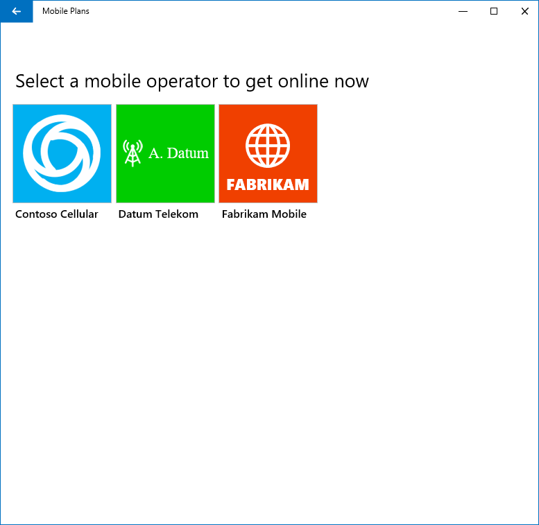

# Mobile Plans operator catalog

## Overview

The Mobile Plans app enables users to see and choose from a list of mobile operators. This article defines the principles applied in the display of mobile operators on the Select Providers page.

> [!NOTE]
> The Select Providers page is only available on eSIM-enabled Windows 10 PCs. Since legacy physical UICCs do not allow the mobile operator's SIM profile to be changed, the Select Provider page is not available when there is no active eSIM on the device.

## List of mobile operators

- Users have the ability to see the list of mobile operators which are enabled in Mobile Plans to sell data plans in a given country.
- The physical location of the device is used to determine the country. When the device is connected via cellular, the network ID is used to determine the country. If the device is connected via Wi-Fi, the country is determined by reverse IP.
- The list of mobile operators that is shown to users is shorted alphabetically by the mobile operator's brand name.

## Mobile operator branding
- Mobile operators shown in the catalog must use the brand name and marks that are commonly associated with their cellular services in the countries where they operate. This is so that users have a clear understanding of who the service provider is.
- Mobile operator brand names which include brand elements associated with a Windows PC OEM will be shown to those OEM devices only. This is to prevent showing an OEM brand element to a user on a different OEM device. The mobile operator or OEM must supply the make and model of the devices (as found in the Windows System Info dialog) on which their OEM-branded mobile operator will be made available.

## Device filtering
- If a device (including the modem and/or eSIM hardware or firwmare) is found to be incompatible with a mobile operator's nework, the mobile operator can request to be filtered from the list of mobile operators shown on that device. This is to prevent an end user from attempting to acquire a data plan from an operator which cannot be used on their device. The make and model of the device (as found in the Windows System Info dialog), or the eID of the eSIM, must be supplied by the mobile operator to enable the filtering.
