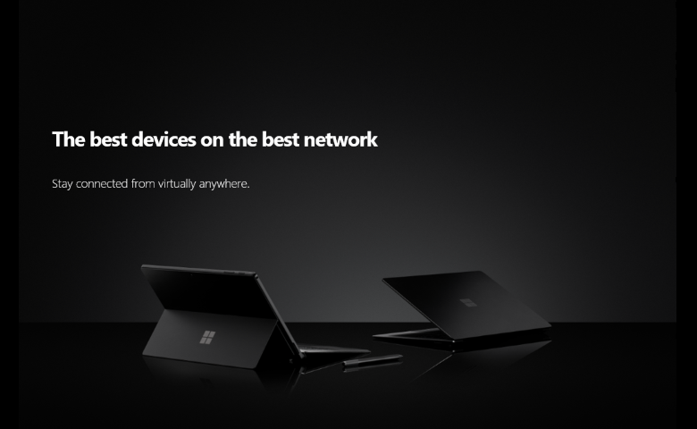
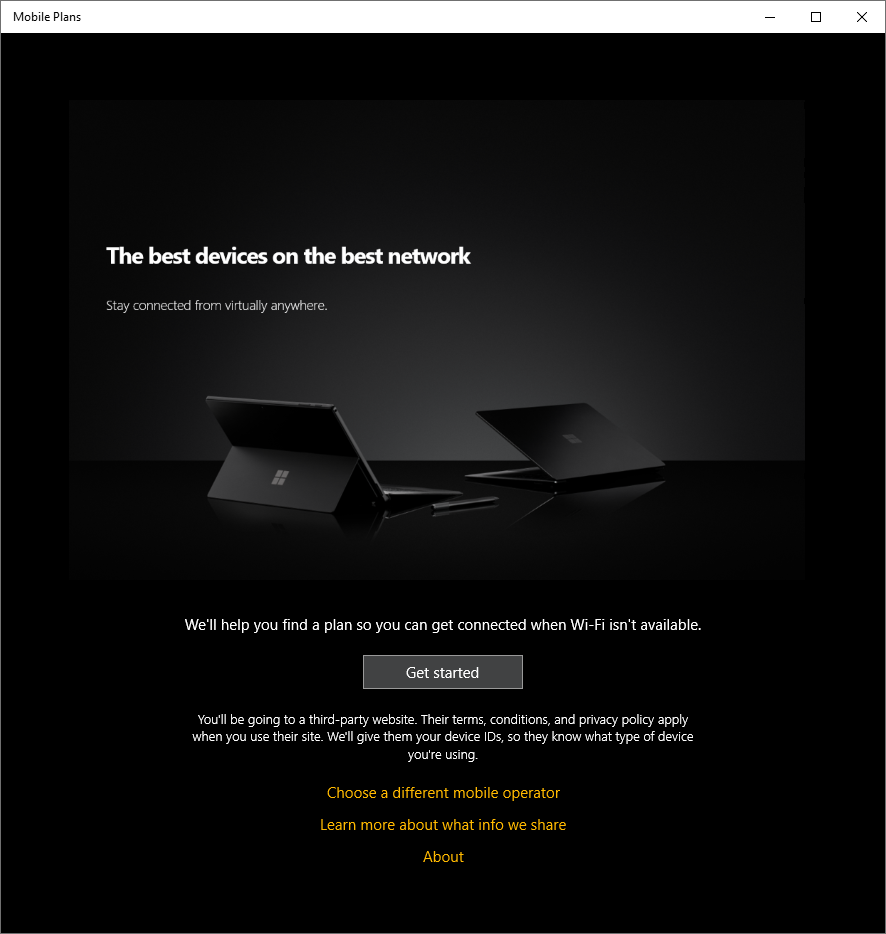

# Mobile Plans service configuration

This topic describes how to build a foundation on Windows connected devices that support *Mobile Plans*. It details how to configure your eSIM profiles to ensure the best consumer experience, as well as how to provide service configuration information that ensures that the *Mobile Plans* experience is properly rendered on Windows devices.

## eSIM profile configuration requirements

You must prepare eSIM profiles that meet the following requirements:

- The eSIM profile must not be PIN locked.
- The eSIM profile must not be deleted from your SM-DP+ server until you receive confirmation that the profile download has been completed successfully. The activation code can be reused to retry downloading the same profile when previous attempts to download have failed.
- The eSIM profile must not have the “Do not delete” or “Do not deactivate” policies set.
- The activation code must not include any prefixes such as “LPA:”.
- The activation code is available immediately after the MO Direct flow.
- The activation code must not require a "Confirmation Code".

### eSIM profile testing

It is expected that the Mobile Operator perform a validation to ensure that their eSIM profiles are able to be installed in different Windows devices. For this it is recommended to source some eSIM capable devices and use the *Settings app* to download, install and activate profiles.

<!-- #Removed due to support to Async Connectivity

- The device can immediately connect to the network for the end user after the eSIM is downloaded and activated.
- The eSIM profile can be downloaded immediately from the SMDP+ server after MO Direct flow.
Finally, the *Mobile Plans* user experience expects the eSIM profile to be in a warm state, meaning that a data plan can be activated in real-time after downloading the eSIM profile. If the eSIM cannot be activated in real-time, please ensure that you implement the <span style="color:green"> Asynchronous connectivity callback</span> **_TODO: Put a LINK HERE_**
-->

## Service configuration

*Mobile Plans* service need to ingest some configuration information to support a mobile operator. To start a configuration process, please send an email to [Mobile Plans Implementation Support](mailto:mpimplementation@microsoft.com).

### Minimum Configuration Information

1. The brand name you would like to use for your products.
2. The branding logo. Required resolution is 300x300 pixels. Image should also be full bleed with no transparency.
3. The list of countries where your solution is supported. Please use [ISO 3166 code](https://en.wikipedia.org/wiki/ISO_3166-1_alpha-2) to create the list (comma separated).
4. Your MO Direct portal URI (localization is not supported). This should be a https address. Port numbers are not supported
5. A notification URI. This is the host address from where the javascript callbacks ([control back notifications]((mobile-plans-callbacks.md)) are going to be run. This should be a https address. Port numbers are not supported.
6. The ICCID range or ranges that you want to want to associate with *Mobile Plans*.

<!--
[//]: # (Removed for Phone Number Lookup.)
[//]: # (7. MCC/MNC combinations for which you would like phone number lookup to direct to your mobile operator portal.)
-->
The following image shows an example for the *standard gateway page*  in the Mobile Plans app. The “A” annotation corresponds to the branding logo you submit, and the “B” annotation corresponds to the brand name.


### Enhanced gateway page

This is an optional feature supported in Mobile Plans app version **5.1902.331.0** or above.
The standard landing page could be enhanced with the mobile operator branding look and feel to highlight their offering.

#### Enhanced gateway content

Enhanced gateway content is defined using a JSON file with the following elements:

```JSON
{ // Root object
  "promotionTemplates": [
    { // PromotionTemplate
      "id": 0,
      "backgroundColor": "0x000000FF", // Black
      "bodyFontColor": "0xFFFFFFFF", // White
      "buttonColor": "0x414243FF", // Grey
      "buttonFontColor": "0xFFFFFFFF", // White
      "bodyText": "We’ll help you find a plan so you can get connected when W-Fi isn’t available",
      "buttonText": "Get started",
      "hyperlinkColor": "0xBB8CF9FF", //Purple
      "images": [
        { // Image
          "height": 480,
          "uri": "https://content.windows.com/MO1/landing740x480.png",
          "width": 740,
        }
      ]
    }
  ]
}
```

The following table describes each JSON object in the previous example.

| JSON object | Field name | Description | Example |
| --- | --- | --- | --- |
| Root object | promotionTemplates | A list of promotion templates to be shown on the gateway page. Only one promotion template is supported for each mobile operator. | N/A |
| PromotionTemplate | id | A unique string identifier for the template. | 123 |
|   | backgroundColor | The background color of the gateway page. This field is a hexadecimal string in the format of `0xRRGGBBAA`. If undefined, white is used as the default. | 0x000000FF |
|   | bodyFontColor | The font color for the body text. This field is a hexadecimal string in the format of `0xRRGGBBAA`. If undefined black is used as the default. | 0xFFFFFFFF |
|   | buttonColor | The color of the "Continue" button that launches the mobile operator's portal. This field is a hexadecimal string in the format of `0xRRGGBBAA`. If undefined, the user-selected system highlight color is used as the default. | 0x414243FF |
|   | buttonFontColor | The font color for the text on the "Continue" button. This field is a hexadecimal string in the format of `0xRRGGBBAA`. If undefined, white is used as the default. | 0xFFFFFFFF |
|   | bodyText | The localized body text for the client's language. | We'll help you find a plan so you can get connected when Wi-Fi isn't available. |
|   | buttonText | The localized text for the "Continue" button. | Get started |
|   | hyperlinkColor | The hyperlinks in the gateway page are going to be using this color. This field is a hexadecimal string in the format of `0xRRGGBBAA`. If undefined, default hyperlink color will be used. | 0xBB8CF9FF |
|   | images | Images to use for the template. Different sizes are supported. If multiple sizes are included, the Mobile Plans app uses the optimum size for the screen resolution. Maximum image size is 1200 x 600 pixels, file format *png*.|  |

#### Example enhanced gateway landing page

