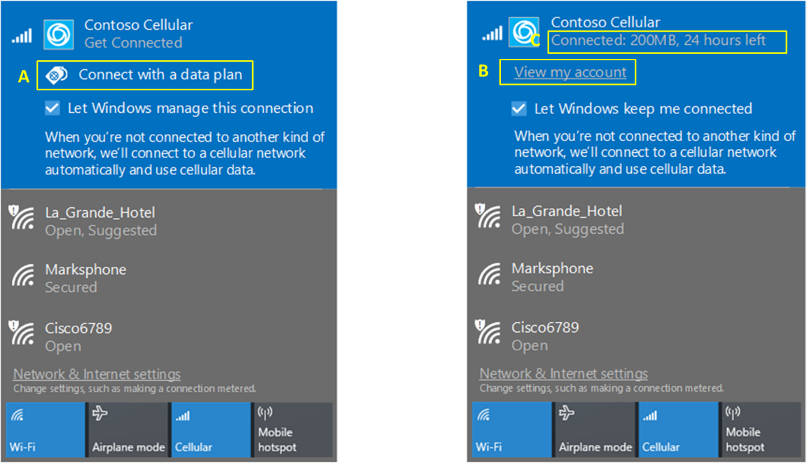
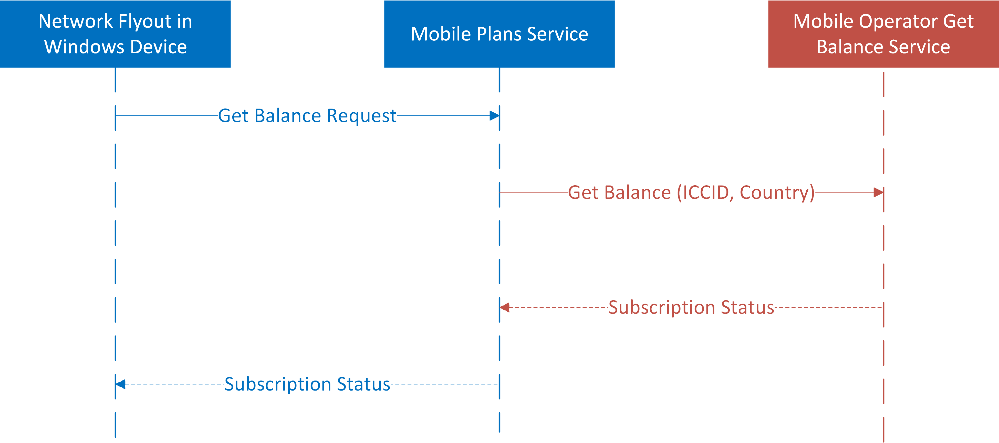
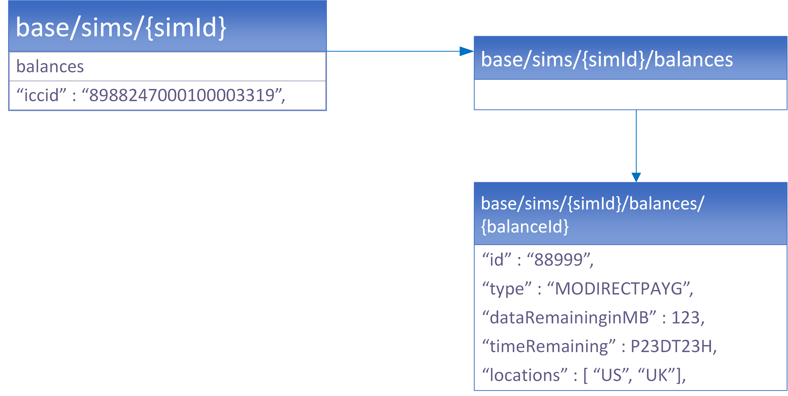

# Mobile Plans Windows device experience

This topic describes, which are the capabilities that Mobile Plans program offers to ensure that mobile operator customers have experiences according to the mobile operator offerings.

## Basic device experience

This section describes which are the options to configure what the *View my account* link in the Windows Connection Manager, also known as also known as the network flyout.

The *View my account* link could be configured to:

- Launch a web browser and open a defined web page
- Launch the Mobile Plans app and open the Mobile Plans Web Portal

 Once an option has been choose, please request a COSA database update to implement the righ behavior, please see [Planning your desktop COSA/APN database submission](planning-your-desktop-cosa-apn-database-submission.md).

The following settings apply for the above options:

- *AccountExperienceURL* parameter defines the web page.
- *AppID* parameter defined which app launched, to use Mobile Plans app configure _Microsoft.OneConnect_8wekyb3d8bbwe!App_

The following image shows an example of the network flyout:


## Enhanced device experience

By implementing the enhanced device experience, you can offer these benefits to your consumers:

- Consumers can see how much data is available, and the amount of time left until their subscriptions expire, in the network flyout.
- Consumers can top up their prepaid subscriptions over mobile connectivity, even when they run out of prepaid balance or their subscriptions has expired.
- You can manage your network flyout offering based on consumers’ subscription status.

These experiences build on top of the [basic device experience](#basic-device-experience); this will be the default experience in the device network flyout.

### Network flyout user experience

Depending on the information that is received from *GetBalance* API calls, the network flyout behaves differently, which enhances the user experience. 
The network flyout has the following elements:

1. Connect with a data plan  
  This launches the Mobile Plans app.
2. View my account  
  Behaves based on the [basic device experience](#basic-device-experience)
3. Balance information  
  Shows the balance available, which is provided in your *GetBalance* response.

The following image shows these network flyout elements. Connect with a data plan corresponds with A, View my account corresponds with B, and Balance information corresponds with C.



To provide the right information in the network flyout, MOs provide *Type* and *Balance* (dataRemainingMB and timeRemaining) information as defined in the [GetBalance API](#getbalance-api) section.

The table below provide a reference between the GetBalance response type and what it is displayed in the network flyout.

| GetBalance response type | Network flyout shows... |
| --- | --- |
| MODIRECT | "View my account" only with no balance information |
| MODIRECTPAYG | "View my account" and balance information |
| NONE | "Connect with a data plan" |
| NOTSUPPORTED | "View my account" only |

## GetBalance API

> [!Important]
> Please request a [Windows COSA update to enable Get Balance](#how-to-enable-get-balance-in-windows-cosa) in Windows.

The GetBalance API queries current subscription status, controls whether the *Mobile Plans* experience is available on the device, and shows remaining data and time in the network flyout for prepaid subscriptions. The following diagram shows the high-level flow for the *GetBalance* API.




### Resource model

Communication between the *Mobile Plans* service and the MO service involves manipulating the resources in the following diagram. Explanations for each resource are in the tables following the diagram.



#### SIM resource

> [!NOTE]
> The SIM resource does not currently support “create,” “read,” “update,” or “delete” operations.

| JSON property | Type | Description |
| --- | --- | --- |
| Iccid | String | The ICCID of the profile that has been created. |

#### Balance resource

| JSON property | Type | Description |
| --- | --- | --- |
|id |String| Mobile operator internal id, to track the transaction | 
Type | Enum | Possible values: <ul><li>MODIRECT: Indicates if the user balance is MO Direct.</li><li>MODIRECTPAYG: Indicates if the user balance is MO Direct PAYG.</li><li>NONE: Indicates the user has no balance. When the remaining balance is 0 but the plan has not expired, we expect to receive "NONE" so that the user can purchase data plans.</li><li>NOTSUPPORTED: Indicates the SIM is not supported by the *Mobile Plans* experience. "NOTSUPPORTED" is used when the SIM should not be in the *Mobile Plans* supported range. We will turn off the *Mobile Plans* experience in the network flyout and return a generic error message in the Mobile Plans app when we receive this type.</li></ul> |
| dataRemainingInMB | Double | The data remaining in the current user plan, in MB. |
| timeRemaining | String | The time duration specified in [ISO 8601](https://go.microsoft.com/fwlink/p/?linkid=866182). |

### Headers

The following headers may be included in every request from the *Mobile Plans* service to the Mobile Provider’s endpoint.

| Header name | Value | Description |
| --- | --- | --- |
| X-MS-DM-TransactionId | String | The TransactionId to uniquely identify this request/response interaction between the *Mobile Plans* service and the MO service. |
| Authorization (optional) | String | A basic authentication string optionally provided by the MO. |

### Error codes

The table below defines the error codes that should be used in the HTTP response.

| Error code | Description |
| --- | --- |
| HTTP 200 (OK) | The operation completed successfully. This code should also be used to indicate if the user has 0 balance in the specified location, which should be done using dataRemainingInMB=0 and timeRemaining=”PT0S” with HTTP 200. |
  HTTP 201 (Created) | Indicates that the operation completed successfully and the resource was created successfully. |
| HTTP 400 (Bad Request) | Used for invalid an invalid query parameter, invalid header, or invalid payload. In the response body, the parameter that is incorrect should be indicated. For example, if an invalid fieldsTemplate is specified, this error code must be returned with details in the response body. |
| HTTP 401 (Unauthorized) | Authentication credentials were incorrect or invalid. This can occur when the basic auth credentials passed are incorrect. |
| HTTP 403 (Forbidden) | The client certificate is untrusted or invalid. If the client certificate included as a part of MTLS is invalid, HTTP 403 should be returned. |
| HTTP 404 (Not Found) | The MO service should return this error when the resource doesn’t exist. This can occur when an incorrect ICCID is sent. This should not be used to indicate that the user doesn’t have a balance in the specified location, which is indicated with HTTP 200 (OK). |
| HTTP 409 (Conflict) | Used if a TransactionId is repeated. |
| HTTP 429 (Too many requests) | Used by the MO service to indicate that the Mobile Plans service is sending too many requests within the specified amount of time. In the response, the MO service must use the Retry-After header to indicate the time after which the *Mobile Plans* service should retry for the resource. In the response body, optional details can be provided. |
| HTTP 500 (Internal Error) | Something unexpected happened on the MO service. The MO service should include the cause of error whenever possible so that it can be used for further debugging as needed. |

### GetBalance API specification

The *GetBalance* API is called when network flyout is displayed in the Windows device, the Mobile Plans service is a proxy for this communication

HTTP request, where *moBaseUrl* is the endpoint of the MO-hosted service and *sim id* is the ICCID:

```HTTP
GET https://{moBaseUrl}/sims/{sim id}/balances?fieldsTemplate=basic&limit=1&location=US HTTP/1.1
```

Query parameters:

| Query parameter name | Value | Description |
| --- | --- | --- |
| location | String | Optional. The location where the user balance is being queried. If not specified, all active balances are expected. **Note** The location parameter is case-sensitive. |
| limit | Integer |Optional. The maximum count of balances to be returned. If not specified, all balances should be returned. |
| fieldsTemplate | Enum |Specifies the list of fields that must be returned in the resource. <p>Possible values:</p><ul><li>Basic: *type*, *dataRemainingInMB*, and *timeRemaining* in the Balance resource must be returned.</li><li>Full: All properties in the Balance resource must be returned.</li></ul> |

The following series of examples show the call flow for the *GetBalance* API.

#### Example 1: Returning the first balance that is available for the user in US

```HTTP
GET https://moendpoint.com/v1/sims/iccid: 8988247000100003319/balances?fieldsTemplate=basic&limit=1&location=us HTTP/1.1
X-MS-DM-TransactionId: “MSFT-12345678-1234-1234-1234-123456789abc”
```

HTTP response:

```HTTP
HTTP/1.1 200 OK
Content-type: application/json
X-MS-DM-TransactionId: “12345”

{
“balances”: [
    {
         “id”: “23445”,
         “type”: “MODIRECTPAYG”,
         “dataRemaininginMB”: 123.0,
         “timeRemaining”: “P23DT23H”
    }
  ]
}
```

If successful, this method will return the balance of the user.

Response JSON:

| Data | Type | Description |
| --- | --- | --- |
| Balances | Collection | A collection of Balances. |

#### Example 2: The expected response for a SIM that is in the COSA ICCID range but should not be supported by Mobile Plans

HTTP request:

```html
GET https://{moBaseUrl}/sims/{sim id}/balances?fieldsTemplate=basic&limit=1&location=US 
HTTP/1.1
```

Response JSON:

```json
HTTP/1.1 200 OK
Content-type: application/json
X-MS-DM-TransactionId: “12345”

{
“balances”: [
    {
         “id”: “23445”,
         “type”: “NOTSUPPORTED”,
         “dataRemaininginMB”: 0.0,
         “timeRemaining”: “PT0S”
    }
  ]
}
```

### Authentication

Communication between Mobile Plans service and mobile operator service must be authenticated using the Mutual Transport Layer Security (MTLS). Microsoft will provide a certificate that you will use to validate the identity of the requester to **moBaseUrl**.

Microsoft will provide the certificate during onboarding process.

### How to enable Get Balance in Windows COSA

It is required to configure the following settings in Windows COSA to enable the Get Balance support in Windows devices.

The following COSA settings are required:

- SupportDataMarketplace (must be set to “Yes”)
- DataMarketplaceRoamingUIEnabled
- SIM ICCID range (ICCID Range – Start and ICCID Range – End)

For more info about all supported fields, see the Desktop COSA-only settings on [Desktop COSA/APN database settings](desktop-cosa-apn-database-settings.md).

To download the COSA/APN update spreadsheet, click [here](https://go.microsoft.com/fwlink/p/?linkid=851213).

## Walled Garden

Walled Garden is key to supporting your customers when they run out of data. It enables them to reach the MO Direct portal even when there is no alternative internet connection such as Wi-Fi. This will enable consumers to purchase additional data plans and manage their subscriptions.

> [!NOTE]
> The *Mobile Plans* architecture does not support IP ranges for Walled Garden endpoints. Host names must be used for whitelisting.

The MO Direct web portal and *GetBalance* API endpoint must also be part of this Walled Garden.

### Walled Garden endpoints

There are only a small number of required endpoints that are always accessible to end users. The following table defines the endpoints required for Walled Garden. 

| URL | HTTP/HTTPS |
| --- | --- |
| service.datamart.windows<span></span>.com | https |
| dogfood.datamart.windows<span></span>.com | https |
| windows.policies.live<span></span>.net | https |
| ctldl.windowsupdate<span></span>.com | http |
| cdp1.public-trust<span></span>.com | http |
| ocsp.omniroot<span></span>.com | http |
| vassg142.ocsp.omniroot<span></span>.com | http |
| vassg142.crl.omniroot<span></span>.com | http |
| mscrl.microsoft<span></span>.com | http |
| crl.microsoft<span></span>.com | http |
| msftconnecttest<span></span>.com | http |
| crl3.digicert<span></span>.com | http |
| Ocsp.digicert<span></span>.com | http |
| login.live<span></span>.com | http + https |
| storagetos.datamart.windows<span></span>.com | http + https |
| mps.datamart.windows<span></span>.com | http + https |
| mps-service.datamart.windows<span></span>.com | http + https |
| staging.datamart.windows<span></span>.com | http + https |
| mps-staging.datamart.windows<span></span>.com | http + https |
