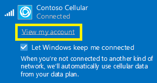

# Mobile Plans Windows device experience

This topic describes, which are the capabilities that Mobile Plans program offers to ensure that mobile operator customers have experiences according to the mobile operator offerings.

## Basic Windows experiences

This section describes which are the options to configure what the *View my account* link in the Windows Connection Manager, also known as also known as the network flyout.

The *View my account* link could be configured to:

- Launch a web browser and open a defined web page
- Launch the Mobile Plans app and open the Mobile Plans Web Portal

 Once an option has been choose, please request a COSA database update to implement the righ behavior, please see [Planning your desktop COSA/APN database submission](planning-your-desktop-cosa-apn-database-submission.md).

The following settings apply for the above options:

- *AccountExperienceURL* parameter defines the web page.
- *AppID* parameter defined which app launched, to use Mobile Plans app configure _Microsoft.OneConnect_8wekyb3d8bbwe!App_

The following image shows an example of the network flyout:

