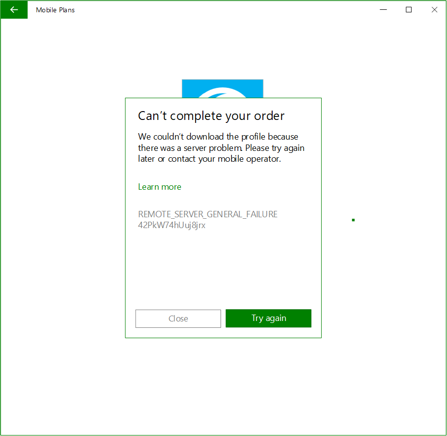

# Mobile Plans eSIM profile download error handling

## Overview

The Mobile Plans app has a built-in retry solution that attempts to repair situations where the eSIM profile download does not complete successfully. However, in some scenarios, intervention from the mobile operator is necessary to ensure that the eSIM is installed on the device. Mobile operators can support eSIM error handling in their web portal to delight their consumers.

## Handling eSIM download errors

The Mobile Plans app has a feature that passes error codes to the MO portal once the user re-enters the portal. The following example shows how the app passes relevant paremeters.

```HTTP
GET https://moportal.com/?market=US&location=US&transactionId=HADRdRhKI0S5bN4n.1&eid=89033023422130000000000199272786&imei=001102000224082 HTTP/1.1
X-MP-LPAError-Codes: ServerFailure,ServerNotReachable
X-MP-LPAError-TimeStamps: 5/18/2018 11:17:23 PM,5/18/2018 11:27:33 PM
X-MP-LPAError-ICCIDs: 8988247000101997790
```

The Mobile Plans app adds three headers, described in the following table.

| Header name              | Description                                                                                                                                                                                                                                                                                                                          | Example                                                               |
| ------------------------ | ------------------------------------------------------------------------------------------------------------------------------------------------------------------------------------------------------------------------------------------------------------------------------------------------------------------------------------ | --------------------------------------------------------------------- |
| X-MP-LPAError-Codes      | This field provides the error code that has been captured in the LPA. If there are multiple errors, the error codes are passed in a comma-separated list. <p>For a list of possible error codes, see the [ESimOperationStatus enum](/uwp/api/windows.networking.networkoperators.esimoperationstatus).</p> | X-MP-LPAError-Codes: ServerFailure,ServerNotReachable                 |
| X-MP-LPAError-TimeStamps | This field provides the timestamp of when the error occurred. The format of the timestamp is *Date Time UTC offset*. If there are multiple errors, the timestamps are passed as a comma-separated list.                                                                                                                                 | X-MP-LPAError-TimeStamps: 5/18/2018 11:17:23 PM,5/18/2018 11:27:33 PM |
| X-MP-LPAError-ICCIDs     | This field provides the ICCID of the eSIM profile that the user attempted to download and install. This ICCID was passed back to the Mobile Plans app when control handoff occurred. Only one ICCID is passed.                                                                                                                       | X-MP-LPAError-ICCIDs: 8988247000101997790                             |

Mobile operators might choose not to support handling errors passed by the Mobile Plans app, but we recommend doing so because it enhances the user experience.

The following image shows an example of the error message that is displayed to the user:


