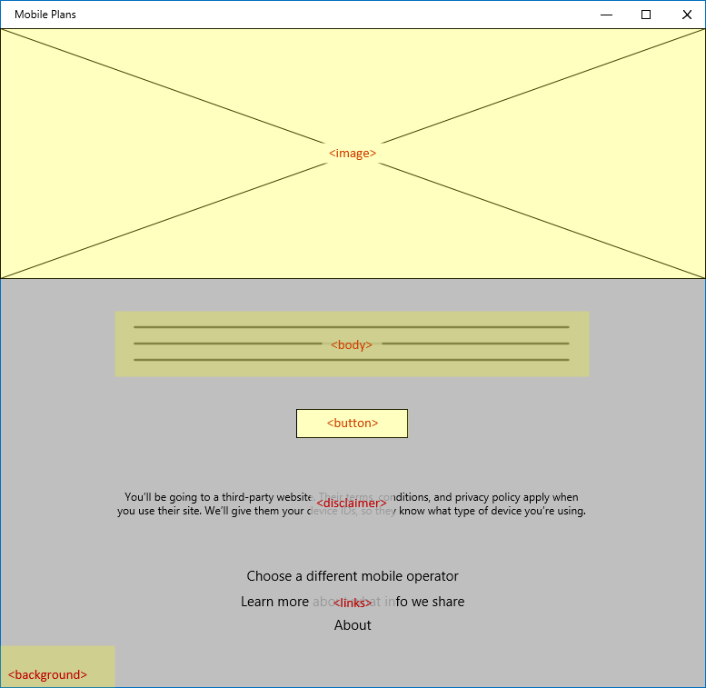
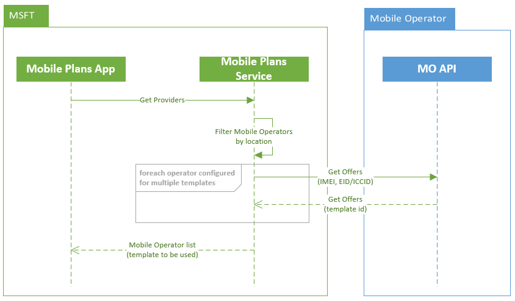
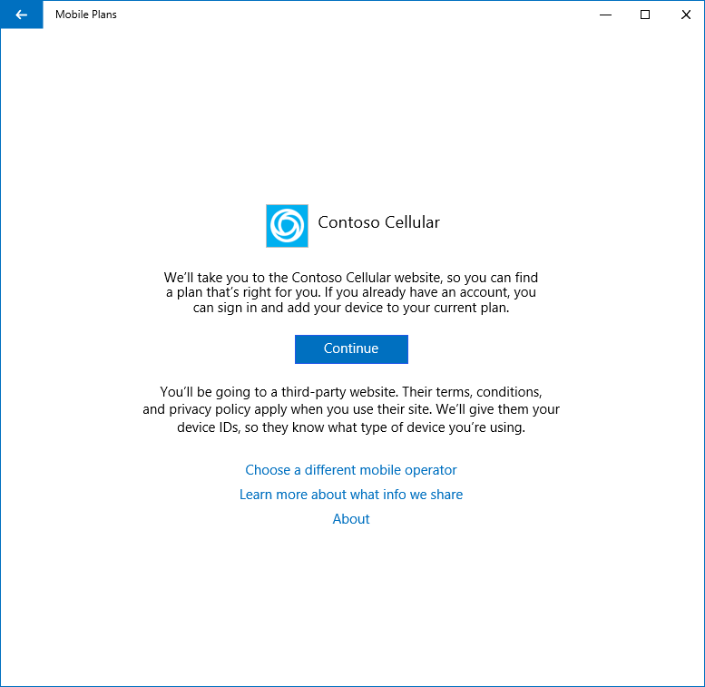

# Mobile Plans gateway page

## Overview

The Mobile Plans app hosts a Gateway page for every mobile operator enabled in the catalog. The Gateway page is shown to the end user as part of the Welcome step. It contains basic brand elements for the mobile operator, as well as several links and a privacy disclaimer. The Gateway page also includes a button to invoke the mobile operator web portal.

## Enhanced Gateway page

This is an optional feature supported in Mobile Plans app version **5.1902.331.0** or above.

The Gateway page can be customized by the mobile operator by specifying the content and style of the page. This ensures they can highlight their offerings and unique brand value.

### Enhanced Gateway page content

The enhanced Gateway page is specified using a template with predefined elements. The highlighted elements are definable by the mobile operator.



### Enhanced Gateway page templates

Custom content shown on the enhanced Gateway page is defined using a JSON file with the following elements:

```JSON
{ // Root object
  "promotionTemplates": [
    { // PromotionTemplate
      "id": 0,
      "backgroundColor": "0x000000FF", // Black
      "bodyFontColor": "0xFFFFFFFF", // White
      "bodyText": "Stay connected from virtually anywhere.",
      "buttonColor": "0x00B0F0FF", // Light Blue
      "buttonFontColor": "0xFFFFFFFF", // White
      "buttonText": "Get started",
      "hyperlinkFontColor": "0x00B0F0FF", //Light Blue
      "images": [
        { // Image
          "uri": "https://picsum.photos/id/1/740/480",
          "width": 740,
          "height": 480,
        }
      ]
    }
  ]
}
```

The following table describes each JSON element in the previous example.

| JSON element | Field name | Description | Example |
| --- | --- | --- | --- |
| Root object | promotionTemplates | List of templates to be used for the enhanced Gateway page. One or more templates can be defined for each mobile operator. | N/A |
| PromotionTemplate | id | Unique string identifier for each template. The default value when only one template is defined should be "0" | 123 |
|   | backgroundColor | Color of the Gateway page background. This field is a hexadecimal string in the format of `0xRRGGBBAA`. If undefined, white is used as the default. | 0x000000FF |
|   | bodyFontColor | Color for the body text. This is a hexadecimal string in the format of `0xRRGGBBAA`. If undefined, black is used as the default. | 0xFFFFFFFF |
|   | bodyText | The localized body text for the client's language. Note that the Disclaimer text cannot be changed.| Stay connected from virtually anywhere. |
|   | buttonColor | Color of the "Continue" button that launches the mobile operator web portal. This field is a hexadecimal string in the format of `0xRRGGBBAA`. If undefined, the user-selected system highlight color is used as the default. | 0x00B0F0FF |
|   | buttonFontColor | Color for the text on the "Continue" button. This field is a hexadecimal string in the format of `0xRRGGBBAA`. If undefined, white is used as the default. | 0xFFFFFFFF |
|   | buttonText | The localized text for the "Continue" button. | Get started |
|   | hyperlinkFontColor | Color of the hyperlinks. This field is a hexadecimal string in the format of `0xRRGGBBAA`. If undefined, the user-selected system highlight color is used as the default. | 0x00B0F0FF |
|   | images | Images to use for the template. Different sizes are supported. If multiple sizes are included, the Mobile Plans app uses the optimum size for the screen resolution. Maximum image size is 1200 x 600 pixels, file format *png*.| https://picsum.photos/id/1/740/480 |

### Sample enhanced Gateway page


### Using multiple Gateway page templates

Mobile operators have the option to define more than one Gateway page template. If this is done, the Mobile Plans service will call the Mobile Operator API at runtime to request an ID for the template which should be shown to the user.

Since the request includes identifiers for the profile and device, the mobile operator can define multiple templates for different user segments. This could be used for A/B testing, or for showing one template to new users inviting them to signup, and a different template for returning users purchasing additional balance. Gateway page templates can also be combined with Mobile Plans notifications to create highly targeted campgains.

> [!NOTE]
> If the device does not have an active profile for the mobile operator, the request will not be made and the template ID "0" will be used by default.

The Get Offers request returns the template ID to be shown to the user.



### GetOffers API specification

The `GetOffers` API is called prior to showing the mobile operator Gateway page. The Mobile Plans service is a proxy for this request.

```HTTP
GET https://{offerUri}sims/{simmri}/offers?limit=1&imei=1234
```

- *{offerUri}* is the OfferUri value onboarded as part of the mobile operator's service configuration.

The endpoint has two query parameters:
- *limit*, which is required and specifies the number of offers to return.
- *imei*, which is optional and specifies the client’s IMEI.

The response is a JSON object with a single property named *offers* that contains a list of offers. The number of offers in this list is at most *limit* from the request. Each offer in this list is an object with a single property *gatewayId*, which must identify an existing gateway in the mobile operator’s service configuration.

The following is an example interaction using this endpoint:

```HTTP
GET https://moendpoint.com/v1/sims/iccid:8988247000100003319/offers?limit=1&imei=1234
X-MS-DM-TransactionId: "MSFT-12345678-1234-1234-1234-123456789abc"

HTTP/1.1 200 OK
Content-type: application/json
X-MS-DM-TransactionId: "MSFT-12345678-1234-1234-1234-123456789abc"
{
  "offers" : [
   {
      "gatewayId": "0"
    }
  ]
}
```

## Standard Gateway page

The standard Gateway page is shown to the end when there is no enhanced Gateway page defined. The standard Gateway page can also be shown as a downgraded experiend when there is a problem loading content for a mobile operator's enhanced Gateway page.

The standard Gateway page uses a basic template which cannot be customized by the mobile operator.


