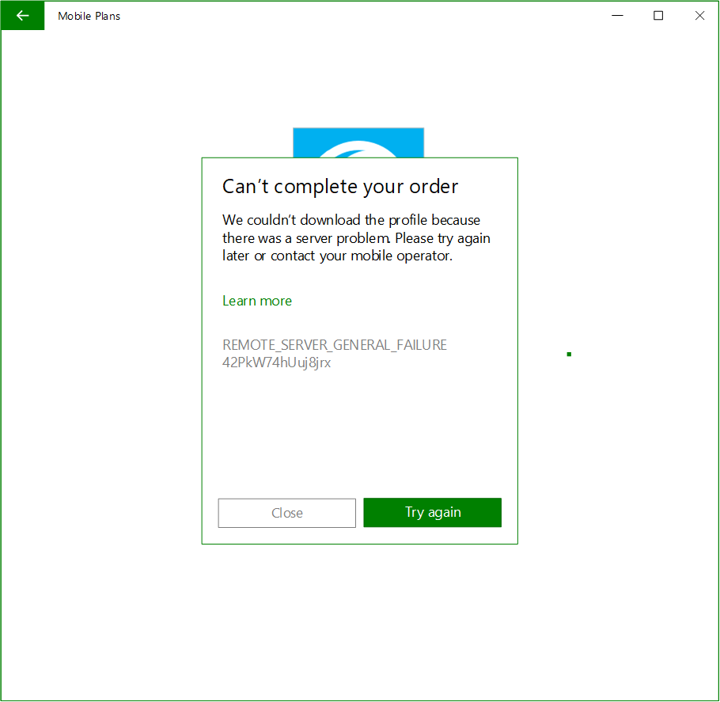

# Mobile Plans implementation
<!-- To be replaced as with a meaningful title
-->
[!include[Mobile Plans Beta Prerelease](../mobile-plans-beta-prerelease.md)]

## Overview
This topic describes the work needed to implement a mobile operator web service API/portal that will host your experience in the Mobile Plans app, the implementation needed to install an eSIM profile in a Windows device, how to handle eSIM installation errors. In addition, this topic will also describe how to optionally provide account management experience for physical SIMs in your mobile operator web portal. 
<!--
This topic describes MO Direct portal design policies and guidance to work with Mobile Plans, as well as the work needed to implement the Web service API that will host your experiences in the Mobile Plans app.
-->

## Mobile Operator web portal

The mobile operator web portal enables mobile operators to provide connectivity solutions directly to Windows users through a curated web experience hosted in the Mobile Plans app. You need to create your web experiences following design policies and implement the web service API to make it reachable. This portal will be used for all scenarios supported in the Mobile Plans solution.

For more info about Web portal flow and reference design, see [Web portal flow and reference design](mobile-plans-appendix.md#web-portal-flow-and-reference-design).

## Mobile Plans eSIM Scenario

### eSIM scenario Flow diagram
The following flow diagram, illustrates a scenario where the user doesn’t have an eSIM profile installed or active in the eUICC and is purchasing a plan from the Mobile Operator portal.


### How the mobile operator portal is invoked


======================================================

### Web Service API hosting MO Direct web portal

The Mobile Plans app uses the [WebView](https://docs.microsoft.com/uwp/api/Windows.UI.Xaml.Controls.WebView) control to host the MO Direct experience. The app only trusts content returned by the *Mobile Plans* service.

When starting the WebView, the *eid*, *market*, *location*, *imei*, and *transactionId* parameters are passed to the MO web portal. If there is at least an eSIM profile matching the Mobile Operator, which Mobile Plans is reaching, the *iccids* are passed to the portal as well.


The following example shows these launch parameters for eSIM, embedded in the call to `MyWebView.Navigate()`.

```c#
MyWebView.ScriptNotify += MyWebView_ScriptNotify;

List<Uri> allowedUris = new List<Uri>();

allowedUris.AddRange(AllowedNotifyUris);

MyWebView.AllowedScriptNotifyUris = allowedUris;

MyWebView.Navigate(“https://moportal.com?market=US&location=US&transactionId=%2F7RBTuSJt02OZbX8.4&eid=89033023422130000000000199055797&imei=001102000315468&iccids=8988247000101867183,8988247000103824828”);
```

The next example shows the launch parameters for a physical SIM: *market*, *location*, *imei*, *iccid*, and *transactionId*. Previous lines of code have been left out for brevity.

```c#
...

MyWebView.Navigate(“https://moportal.com?iccid=8988247000100003319&imei=001102000311608&market=us&transactionId=waoigFfX00yGH3Vb.1&location=us”);
```

The Web Service API must disregard any additional parameters it might receive from the Mobile Plans app. This provides flexibility for introducing new features without breaking the *Mobile Plans* experience. Please check the documentation frequently to learn about new features.

The following table describes the launch parameters available for eSIM and physical SIMs.

| Parameter name | Description                                                                                                                                                                              | Example                                          |
| -------------- | ---------------------------------------------------------------------------------------------------------------------------------------------------------------------------------------- | ------------------------------------------------ |
| eid            | The eSIM Identifier. This is sent only if an eSIM is present.                                                                                                                            | `eid= 89033024010400000100000000009136`          |
| iccid          | Required parameter for a physical SIM. Specifies the ICCID on the physical sim.                                                                                                          | `iccid=8988247000100003319`                      |
| iccids         | Optional parameter. Specifies the list of ICCIDs from the available profile on an eSIM only. If there are no ICCID’s matching the MO available on the eSIM, this parameter is not sent. | `iccids=8988247000100003319, 988247000100003555` |
| imei           | The device's IMEI number.                                                                                                                                                                | `imei=001201234567890`                           |
| location       | The user’s current physical location with country-level granularity.                                                                                                                    | `location=us`                                    |
| transactionId  | The Transaction ID used for debugging the session. Providers should log this and send it in the notification payload. Maximum size is 64 characters.                                     | `transactionId=waoigFfX00yGH3Vb.1`               |
| market         | The two-letter ISO code of the region settings in the PC.                                                                                                                                | `market=us`                                      |

The user’s language preference is sent using the Accept-Language header, described in the following table.

| Header name     | Description                                                                                                                                                                                                                                     | Example                  |
| --------------- | ----------------------------------------------------------------------------------------------------------------------------------------------------------------------------------------------------------------------------------------------- | ------------------------ |
| Accept-Language | The user’s current language settings. The MO portal should render the contents in the specified language if possible. For more information, see [RFC 7231, section 5.3.5: Accept-Language](https://tools.ietf.org/html/rfc7231#section-5.3.5). | `Accept-Language: en-us` |

## Mobile Plans flow diagrams


The following diagram shows the flow when the user has a eSIM profile active or is using a physical SIM in their device.


## Control handoff to the Mobile Plans app

> **_TODO check if I should link this to a page with all the current supported callbacks_**

After the user completes the MO portal flow, the MO portal must return control to the Mobile Plans app. This is done by issuing a notification to the app with the result of the user interaction with the MO portal. 

Transactions that the MO portal supports include, but are not limited to, the following:

- Selling a new eSIM profile (issuing an activation code).
- Activating a subscription.
- Purchasing a new data plan (either postpaid or prepaid).
- Canceling a subscription.
- A failed transaction.
- The customer abandoning the MO portal in the middle of the flow.

The notification to the Mobile Plans app should be sent using JavaScript with the following syntax:

> [!IMPORTANT]
> Ensure that the notification payload is passed as a string.

```javascript
DataMart.notifyPurchaseResult(notificationPayload);
```

An example of the notification payload for an eSIM is as follows:

```javascript
let notificationPayload = new Object();
notificationPayload.ver = '1';
notificationPayload.purchaseResult = "{\"userAccount\":\"New\",\"purchaseInstrument\":\"New\",\"line\":\"New\",\"moDirectStatus\":\"Complete\",\"planName\":\"MyPlan\"}";
notificationPayload.success = true;
notificationPayload.transactionId = 'MSFT_ecf5a4d6-024c-46c3-8fcd-2c1f0deed572';
notificationPayload.activationCode = '1$trl.prod.ondemandconnectivity.com$JO46UQDI07IKQDGG';
notificationPayload.iccid = '8988247000101997790';

DataMart.notifyPurchaseResult(JSON.stringify(notificationPayload));
```

An example of the notification payload for a physical SIM is as follows:

```javascript
let notificationPayload = new Object();
notificationPayload.ver = '1';
notificationPayload.purchaseResult = "{\"userAccount\":\"New\",\"purchaseInstrument\":\"New\",\"line\":\"New\",\"moDirectStatus\":\"Complete\",\"planName\":\"MyPlan\"}";
notificationPayload.success = true;
notificationPayload.transactionId = 'MSFT_ecf5a4d6-024c-46c3-8fcd-2c1f0deed572';
notificationPayload.iccid = '8988247000101997790';

DataMart.notifyPurchaseResult(JSON.stringify(notificationPayload));
```

An example of the notification payload for an eSIM where the user abandoned the MO portal without a successful transaction is as follows. To implement all cases that apply to your specific implementation, see the table that follows the example.

```javascript
let notificationPayload = new Object();
notificationPayload.ver = '1';
notificationPayload.purchaseResult = "{\"userAccount\":\"Bailed\",\"purchaseInstrument\":\"None\",\"line\":\"None\",\"moDirectStatus\":\"None\",\"planName\":\"\"}";
notificationPayload.success = false;
notificationPayload.transactionId = 'MSFT_ecf5a4d6-024c-46c3-8fcd-2c1f0deed572';
notificationPayload.activationCode = '';
notificationPayload.iccid = '';

DataMart.notifyPurchaseResult(JSON.stringify(notificationPayload));
```

The MO Portal URI from which the notification is sent must be in the secure *https* protocol. You might specify the host but not necessarily the full path, which leaves some flexibility for the future. 

The following table describes each field in the JSON payload of the notification:

| JSON field         | Type    | Description                                                                                                                                                                                                                                                                                                                                                                                                                                                                                                                                                                                                                                                                      | Example                                |
| ------------------ | ------- | -------------------------------------------------------------------------------------------------------------------------------------------------------------------------------------------------------------------------------------------------------------------------------------------------------------------------------------------------------------------------------------------------------------------------------------------------------------------------------------------------------------------------------------------------------------------------------------------------------------------------------------------------------------------------------- | -------------------------------------- |
| success            | Boolean | **True** if the user purchased an MO Direct plan.                                                                                                                                                                                                                                                                                                                                                                                                                                                                                                                                                                                                                                | `“success”:true`                     |
| iccid              | String  | For an eSIM, this indicates the ICCID that the client must use for consuming the MO Direct plan purchased.                                                                                                                                                                                                                                                                                                                                                                                                                                                                                                                                                                       | `iccid:”8988247000100297655”`        |
| activationCode     | String  | The activation code to retrieve the eSIM profile.                                                                                                                                                                                                                                                                                                                                                                                                                                                                                                                                                                                                                                | `“ActivationCode”`                   |
| transactionId      | String  | The Transaction ID that the MO portal received as a query parameter when the portal was launched.                                                                                                                                                                                                                                                                                                                                                                                                                                                                                                                                                                                | `transctionId= rRi8OzhI3EiR02nm.2.0.1` |
| purchaseResult     | String  | Contains the details of the user interaction with the MO portal.                                                                                                                                                                                                                                                                                                                                                                                                                                                                                                                                                                                                                 |                                        |
| userAccount        | Enum    | This field is required. <p>Possible values:</p><ul><li>New: Indicates that a new user account was created by the user.</li><li>Existing: Indicates that the user logged on with an existing user account.</li><li>Bailed: Indicates that the user ended the purchase flow at this step.</li><li>None: Indicates that the user didn’t reach this step.</li></ul>                                                                                                                                                                                                                                                                                                                 | `“userAccount”:”New”`              |
| purchaseInstrument | Enum    | This field is required. <p>Possible values:</p><ul><li>New: Indicates that the user used a new method of payment.</li><li>Existing: Indicates that the user used an existing payment method that was on file.</li><li>Bailed: Indicates that the user ended the purchase flow at this step.</li><li>None: Indicates that the user didn’t reach this step.</li></ul>                                                                                                                                                                                                                                                                                                             | `“purchaseInstrument”:”New”`       |
| line               | Enum    | This field is required. <p>Possible values:</p><ul><li>New: Indicates that a SIM card was added by the user account.</li><li>Existing: Indicates that the transferred an existing line to the device.</li><li>Bailed: Indicates that the user ended the purchase flow at this step.</li><li>None: Indicates that the user didn’t reach this step.</li></ul>                                                                                                                                                                                                                                                                                                                     | `“line”:”New”`                     |
| moDirectStatus     | Enum    | This field is required. <p>Possible values:</p><ul><li>Complete: Indicates that the user completed the purchase successfully.</li><li>ServiceError: Indicates that the user was unable to complete the purchase due to an MO service error.</li><li>InvalidSIM: Indicates that the ICCID passed to the portal was incorrect.</li><li>LogOnFailed: Indicates that the user failed to log in to the MO portal.</li><li>PurchaseFailed: Indicates that the purchase failed due to a billing error.</li><li>ClientError: Indicates that invalid arguments were passed to the portal.</li><li>None: Indicates that the user ended the transaction without a specific error.</li></ul> | `“moDirectStatus”:”Complete”`      |
| planName           | String  | For a successful transaction, this field must not be empty and must provide a descriptive plan name. For an unsuccessful transaction, this field must be an empty string.                                                                                                                                                                                                                                                                                                                                                                                                                                                                                                        | `“planName”:”prepaid_3GperMonth”`  |

> **_END of TODO_**

## Web portal design policies

To ensure the best user experience on Windows, you should adhere to the policies in this section when developing the MO Direct experience. These policies are supplementary to the terms and conditions of the *Mobile Plans* Partner Addendum, [Windows App Developer Agreement](https://msdn.microsoft.com/library/windows/apps/hh694058) and [Microsoft Store Policies](https://msdn.microsoft.com/library/windows/apps/dn764944).

### Business functions

| Policy                                                                                                                                                                                                                                                                           | Required or Recommended |
| -------------------------------------------------------------------------------------------------------------------------------------------------------------------------------------------------------------------------------------------------------------------------------- | ----------------------- |
| The MO Direct experience must meet all applicable legal and regulatory requirements in the countries offered. Any content displayed in the MO Direct portal must comply with all applicable laws.                                                                                | Required                |
| Products offered through the MO Direct experience must be an offer for network connectivity.                                                                                                                                                                                     | Required                |
| Network connectivity products offered through the MO Direct experience must be immediately activated after user completes the purchase flow.                                                                                                                                     | Required                |
| Network connectivity products offered through the MO Direct experience must have clear information on service details. Any specific terms of service must be available for users to review before purchase in the MO Direct experience.                                          | Required                |
| Customer support contact information must be accessible to users in the MO Direct experience.                                                                                                                                                                                    | Required                |
| The privacy policy must be available for users to review in the MO Direct experience.                                                                                                                                                                                            | Required                |
| The account management experience provided by an MO, which can be within the MO Direct experience, a separate and dedicated account management portal, or a dedicated MO app, should enable users to take actions on their current data plans, such as canceling a subscription. | Required                |
| Users will receive an order confirmation after purchasing a data plan from the MO Direct experience successfully.                                                                                                                                                                | Recommended             |


### Security

| Policy                                                                                                                               | Required or Recommended |
| ------------------------------------------------------------------------------------------------------------------------------------ | ----------------------- |
| The MO Direct experience must not deliver or install any 3rd party-owned or branded apps or modules.                                 | Required                |
| Before users exit the MO Direct experience, users must be securely logged out from the MO Direct portal.                             | Required                |
| The MO Direct portal URI and all requests or notifications sent to and from the MO Direct portal must use the secure HTTPS protocol. | Required                |
| All MO portal resources and references must use the secure HTTPS protocol.                                                           | Required                |

### Advertising

| Policy                                                                                                                  | Required or Recommended |
| ----------------------------------------------------------------------------------------------------------------------- | ----------------------- |
| The MO Direct portal must not display any advertisements, sponsored content, videos, large images, animations, or maps. | Required                |

### Capabilities

| Policy                                                                                                                                                                                                                                                                                    | Required or Recommended |
| ----------------------------------------------------------------------------------------------------------------------------------------------------------------------------------------------------------------------------------------------------------------------------------------- | ----------------------- |
| The required minimum functionality for the MO Direct experience is to enable a user to purchase a data plan with an account registered with a mobile operator.                                                                                                                            | Required                |
| The MO Direct portal must start up promptly and remain responsive to user input until the user exits the MO Direct experience.                                                                                                                                                            | Required                |
| Once invoked, the MO Direct portal must have and retain user focus until either: <ul><li>The MO Direct flow has completed and the focus has been returned by Mobile Operator back to the Mobile Plans app,</li></ul><p>OR</p><ul><li>The user has cancelled the MO Direct flow.</li></ul> | Required                |
| The MO Direct portal must not display any pop-up windows, open any additional windows, or redirect the user to any other websites or apps, except as required to complete the purchase flow.                                                                                              | Required                |
| The MO Direct portal must handle all legitimate errors and exceptions, such as rejection of payment method, backend failure etc. After the error or exception is handled, the MO Direct portal must remain responsive for users to exit and return to the Microsoft Store.                | Required                |
| If users run into an error that can be fixed with user actions, it is recommended to display mobile operator customer support information with the error message.                                                                                                                         | Recommended             |

### Usability

| Policy                                                                                                                                                                                                                                                                                                                                      | Required or Recommended |
| ------------------------------------------------------------------------------------------------------------------------------------------------------------------------------------------------------------------------------------------------------------------------------------------------------------------------------------------- | ----------------------- |
| The default frame size for the MO Direct portal is 800x600. Adopt responsive web design so that content on the MO Direct portal can be auto-adjusted to fit into the web control frame when users resize the Mobile Plans app.                                                                                                              | Required                |
| Load times and data consumption for loading the MO Direct experience should be optimized.                                                                                                                                                                                                                                                   | Required                |
| The MO Direct experience should be simple and easy navigate with necessary on-screen guidelines.                                                                                                                                                                                                                                            | Required                |
| UI elements on the MO Direct portal should provide a cohesive experience integrated with the Mobile Plans app, not confusing users or reminding the users that this is an embedded web control. For example, there should be no close/max/min button within the MO Direct portal.                                                           | Required                |
| Layout of web pages in the MO Direct portal should be clean and easy to navigate. Users can navigate backward and forward through web pages in the MO Direct portal with UI elements within MO Direct experience. For more info, see [Web portal flow and reference design](mobile-plans-appendix.md#web-portal-flow-and-reference-design). | Required                |
| The MO Direct portal must be functional within the Web Control frame and, once invoked, it must not interfere with users’ interaction with the Mobile Plans app at any time.                                                                                                                                                               | Required                |
| The MO Direct portal must not be cluttered with too many images, banners, lengthy text, external links, etc.                                                                                                                                                                                                                                | Required                |
| An on-screen cancel button within the MO Direct experience should be available for users to exit the flow when applicable.                                                                                                                                                                                                                  | Recommended             |
| Mobile operators can choose the color scheme and fonts that represents the brand the best. Ensure that all visual elements work well together and reinforce the brand.                                                                                                                                                                      | Recommended             |

### Localization

| Policy                                                                                                                                                                          | Required or Recommended |
| ------------------------------------------------------------------------------------------------------------------------------------------------------------------------------- | ----------------------- |
| The MO Direct portal should be able to receive and understand users’ locale setting passed by the Mobile Plans service to display content in the proper language.              | Required                |
| Mobile operators may localize the MO Direct portal in the languages they want to support.                                                                                       | Recommended             |
| The experience provided by the MO Direct portal should be reasonably similar in all languages that it supports, although data plan availability can vary from region to region. | Recommended             |

### Accessibility

| Policy                                                                                                                                                                                                                    | Required or Recommended |
| ------------------------------------------------------------------------------------------------------------------------------------------------------------------------------------------------------------------------- | ----------------------- |
| The MO Direct portal should provide accessibility to disabled users and adhere to the accessibility guidelines applicable in the jurisdictions where the mobile operator implements and enables the MO Direct experience. | Recommended             |

## Handling eSIM download errors

This section applies to version 1807 of the Mobile Plans app and later.

The Mobile Plans app is responsible for downloading, installing, and activating the eSIM profile on the device after the MO portal flow finalizes, but these actions can fail. The Mobile Plans app has a built-in retry solution that attempts to repair situations where the eSIM profile download does not complete successfully. However, in some scenarios intervention from the mobile operator is necessary to ensure that the eSIM is installed on the device.

The Mobile Plans app has a feature that passes error codes to the MO portal once the user re-enters the portal. The following example shows how the app passes relevant paremeters.

```HTTP
GET https://moportal.com/?market=US&location=US&transactionId=HADRdRhKI0S5bN4n.1&eid=89033023422130000000000199272786&imei=001102000224082 HTTP/1.1
X-MP-LPAError-Codes: ServerFailure,ServerNotReachable
X-MP-LPAError-TimeStamps: 5/18/2018 11:17:23 PM,5/18/2018 11:27:33 PM
X-MP-LPAError-ICCIDs: 8988247000101997790
```

The Mobile Plans app adds three headers, described in the following table.

| Header name              | Description                                                                                                                                                                                                                                                                                                                          | Example                                                               |
| ------------------------ | ------------------------------------------------------------------------------------------------------------------------------------------------------------------------------------------------------------------------------------------------------------------------------------------------------------------------------------ | --------------------------------------------------------------------- |
| X-MP-LPAError-Codes      | This field provides the error code that has been captured in the LPA. If there are multiple errors, the error codes are passed in a comma-separated list. <p>For a list of possible error codes, see the [ESimOperationStatus enum](https://docs.microsoft.com/uwp/api/windows.networking.networkoperators.esimoperationstatus).</p> | X-MP-LPAError-Codes: ServerFailure,ServerNotReachable                 |
| X-MP-LPAError-TimeStamps | This field provides the timestamp when the error occurred. The format of the timestamp is *Date Time UTC offset*. If there are multiple errors, the timestamps are passed as a comma-separated list.                                                                                                                                 | X-MP-LPAError-TimeStamps: 5/18/2018 11:17:23 PM,5/18/2018 11:27:33 PM |
| X-MP-LPAError-ICCIDs     | This field provides the ICCID of the eSIM profile that the user attempted to download and install. This ICCID was passed back to the Mobile Plans app when control handoff occurred. Only one ICCID is passed.                                                                                                                       | X-MP-LPAError-ICCIDs: 8988247000101997790                             |

Mobile operators might choose not to support handling errors passed by the Mobile Plans app, but we recommend doing so because it enhances the user experience.

The following image shows an example of the error message that is displayed to the user:



## COSA requirement for postpaid (PayG)

The balance status experience for the Network Flyout and Settings page can be enabled for limited postpaid data plans, just like for prepaid data plans. MOs can do this by updating the COSA database. However, checking balance is typically a prepaid feature. For more information, see [Prepaid experience](mobile-plans-prepaid-experience.md).

## Walled Garden for postpaid (PayG)

Like the balance status experience, Walled Garden is supported for limited postpaid data plans but is also typically a prepaid feature. Walled Garden is detailed on the [Prepaid experience](mobile-plans-prepaid-experience.md) topic. 

> [!NOTE]
> The *Mobile Plans* architecture does not support IP ranges for Walled Garden endpoints. Host names must be used for whitelisting.