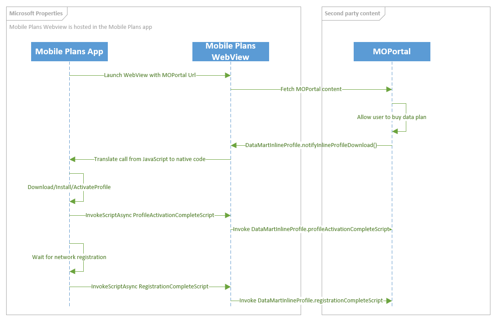

# Mobile Plans legacy callback notifications

> [!NOTE]
> This page documents Mobile Plans legacy callback notifications. Please use this as reference only and do not implement this code going forward.

## Inline profile delivery

The following diagram shows the high level flow for how the Mobile Plans program supports downloading a profile without control leaving the MODirect portal.



When the MO Direct portal is ready for a profile download, install, and activation to occur, the portal should call `MobilePlansInlineProfile.notifyInlineProfileDownload`.

### MobilePlansInlineProfile.notifyInlineProfileDownload

| Parameter name | Type | Description |
| --- | --- | -- |
| purchaseMetadata | Object | This object contains metadata about the user's purchase. This includes details about the user account, the purchase method or instrument, details if the user is adding a new line, and the name of the plan that the user purchased. All these are used for reporting. |
| activationCode | String | The activation code for downloading the eSIM profile. The ICCID for the profile is inferred from the profile metadata. |

The following Javascript function shows an example of the API to inform the application that an inline profile download should start.

```Javascript
function NotifyMobilePlans() {
    var purchaseMetaData = MobilePlans.createPurchaseMetaData();
    purchaseMetaData.userAccount = MobilePlansUserAccount.new;
    purchaseMetaData.purchaseInstrument = MobilePlansPurchaseInstrument.new;
    purchaseMetaData.lineType = MobilePlansLineType.new;
    purchaseMetaData.modirectStatus = MobilePlansMoDirectStatus.complete;
    purchaseMetaData.planName = "My Plan";
    MobilePlansInlineProfileDownload.registrationChangedScript = "onRegistrationChanged";
    MobilePlansInlineProfileDownload.profileActivationCompleteScript = "onActivationComplete";
    MobilePlansInlineProfileDownload.notifyInlineProfileDownload(purchaseMetaData , "1$smdp.address$matchingID");
}
```

See [purchase metadata properties](mobile-plans-callback-notifications.md#purchase-metadata-properties-details) for details about the `puchaseMetadata` object.

## Adding balance (Legacy)

When a user completes a purchase in the MO Direct portal by adding more data to their account (no profile download needed because the user used the current profile on the eSIM), the MO portal should invoke the `MobilePlans.notifyBalanceAddition` API return control back to the Mobile Plans app.

### MobilePlans.notifyBalanceAddition

| Parameter name | Type | Description |
| --- | --- | -- |
| purchaseMetadata | Object | This object contains metadata about the user's purchase. This includes details about the user account, the purchase method or instrument, details if the user is adding a new line, and the name of the plan that the user purchased. All these are used for reporting. |
| iccid | String | The ICCID to which data is assigned. If this ICCID is not active, the Mobile Plans app activates the corresponding profile.|

The following Javascript function shows an example of the API to inform the application that the user has completed a purchase using a profile already available, but not necessarily active, on the eSIM.

 ```Javascript
function finishPurchaseWithBalanceAddition() {
        var metadata = MobilePlans.createPurchaseMetaData();
        metadata.userAccount = MobilePlansUserAccount.new;
        metadata.purchaseInstrument = MobilePlansPurchaseInstrument.none;
        metadata.moDirectStatus = MobilePlansMoDirectStatus.complete;
        metadata.line = MobilePlansLineType.new;
        metadata.planName = "2GB Monthly";
        MobilePlans.notifyBalanceAddition(metadata, "89000000000000000000");
    }
```

See [purchase metadata properties](mobile-plans-callback-notifications.md#purchase-metadata-properties-details) for details about the `puchaseMetadata` object.

## Other Legacy callback notifications

The notification to the Mobile Plans app should be sent using JavaScript with the following syntax:

```javascript
DataMart.notifyPurchaseResult(notificationPayload);
```

An example of the notification payload for an eSIM is as follows:

```javascript
let notificationPayload = new Object();
notificationPayload.ver = '1';
notificationPayload.purchaseResult = "{\"userAccount\":\"New\",\"purchaseInstrument\":\"New\",\"line\":\"New\",\"moDirectStatus\":\"Complete\",\"planName\":\"MyPlan\"}";
notificationPayload.success = true;
notificationPayload.transactionId = 'MSFT_ecf5a4d6-024c-46c3-8fcd-2c1f0deed572';
notificationPayload.activationCode = '1$trl.prod.ondemandconnectivity.com$JO46UQDI07IKQDGG';
notificationPayload.iccid = '8988247000101997790';

DataMart.notifyPurchaseResult(JSON.stringify(notificationPayload));
```

An example of the notification payload for a physical SIM is as follows:

```javascript
let notificationPayload = new Object();
notificationPayload.ver = '1';
notificationPayload.purchaseResult = "{\"userAccount\":\"New\",\"purchaseInstrument\":\"New\",\"line\":\"New\",\"moDirectStatus\":\"Complete\",\"planName\":\"MyPlan\"}";
notificationPayload.success = true;
notificationPayload.transactionId = 'MSFT_ecf5a4d6-024c-46c3-8fcd-2c1f0deed572';
notificationPayload.iccid = '8988247000101997790';

DataMart.notifyPurchaseResult(JSON.stringify(notificationPayload));
```

An example of the notification payload for an eSIM where the user abandoned the MO portal without a successful transaction is as follows. To implement all cases that apply to your specific implementation, see the table that follows the example.

```javascript
let notificationPayload = new Object();
notificationPayload.ver = '1';
notificationPayload.purchaseResult = "{\"userAccount\":\"Bailed\",\"purchaseInstrument\":\"None\",\"line\":\"None\",\"moDirectStatus\":\"None\",\"planName\":\"\"}";
notificationPayload.success = false;
notificationPayload.transactionId = 'MSFT_ecf5a4d6-024c-46c3-8fcd-2c1f0deed572';
notificationPayload.activationCode = '';
notificationPayload.iccid = '';

DataMart.notifyPurchaseResult(JSON.stringify(notificationPayload));
```

The MO Portal URI from which the notification is sent must be in the secure *https* protocol. You can specify the host but not necessarily the full path, which leaves some flexibility for the future.

The following table describes each field in the JSON payload of the notification:

| JSON field         | Type    | Description                                                                                                                                                                                                                                                                                                                                                                                                                                                                                                                                                                                                                                                                      | Example                                |
| ------------------ | ------- | -------------------------------------------------------------------------------------------------------------------------------------------------------------------------------------------------------------------------------------------------------------------------------------------------------------------------------------------------------------------------------------------------------------------------------------------------------------------------------------------------------------------------------------------------------------------------------------------------------------------------------------------------------------------------------- | -------------------------------------- |
| success            | Boolean | **True** if the user purchased an MO Direct plan.                                                                                                                                                                                                                                                                                                                                                                                                                                                                                                                                                                                                                                | `“success”:true`                     |
| iccid              | String  | For an eSIM, this indicates the ICCID that the client must use for consuming the MO Direct plan purchased.                                                                                                                                                                                                                                                                                                                                                                                                                                                                                                                                                                       | `iccid:”8988247000100297655”`        |
| activationCode     | String  | The activation code to retrieve the eSIM profile.                                                                                                                                                                                                                                                                                                                                                                                                                                                                                                                                                                                                                                | `“ActivationCode”`                   |
| transactionId      | String  | The Transaction ID that the MO portal received as a query parameter when the portal was launched.                                                                                                                                                                                                                                                                                                                                                                                                                                                                                                                                                                                | `transctionId= rRi8OzhI3EiR02nm.2.0.1` |
| purchaseResult     | String  | Contains the details of the user interaction with the MO portal.                                                                                                                                                                                                                                                                                                                                                                                                                                                                                                                                                                                                                 |                                        |
| userAccount        | Enum    | This field is required. <p>Possible values:</p><ul><li>New: Indicates that a new user account was created by the user.</li><li>Existing: Indicates that the user logged on with an existing user account.</li><li>Bailed: Indicates that the user ended the purchase flow at this step.</li><li>None: Indicates that the user didn’t reach this step.</li></ul>                                                                                                                                                                                                                                                                                                                 | `“userAccount”:”New”`              |
| purchaseInstrument | Enum    | This field is required. <p>Possible values:</p><ul><li>New: Indicates that the user used a new method of payment.</li><li>Existing: Indicates that the user used an existing payment method that was on file.</li><li>Bailed: Indicates that the user ended the purchase flow at this step.</li><li>None: Indicates that the user didn’t reach this step.</li></ul>                                                                                                                                                                                                                                                                                                             | `“purchaseInstrument”:”New”`       |
| line               | Enum    | This field is required. <p>Possible values:</p><ul><li>New: Indicates that a SIM card was added by the user account.</li><li>Existing: Indicates that the transferred an existing line to the device.</li><li>Bailed: Indicates that the user ended the purchase flow at this step.</li><li>None: Indicates that the user didn’t reach this step.</li></ul>                                                                                                                                                                                                                                                                                                                     | `“line”:”New”`                     |
| moDirectStatus     | Enum    | This field is required. <p>Possible values:</p><ul><li>Complete: Indicates that the user completed the purchase successfully.</li><li>ServiceError: Indicates that the user was unable to complete the purchase due to an MO service error.</li><li>InvalidSIM: Indicates that the ICCID passed to the portal was incorrect.</li><li>LogOnFailed: Indicates that the user failed to log in to the MO portal.</li><li>PurchaseFailed: Indicates that the purchase failed due to a billing error.</li><li>ClientError: Indicates that invalid arguments were passed to the portal.</li><li>None: Indicates that the user ended the transaction without a specific error.</li></ul> | `“moDirectStatus”:”Complete”`      |
| planName           | String  | For a successful transaction, this field must not be empty and must provide a descriptive plan name. For an unsuccessful transaction, this field must be an empty string.                                                                                                                                                                                                                                                                                                                                                                                                                                                                                                        | `“planName”:”prepaid_3GperMonth”`  |
