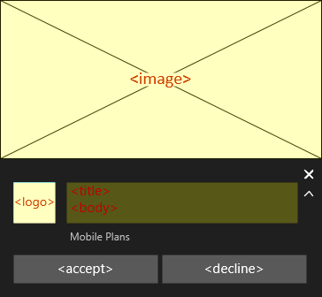
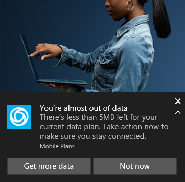
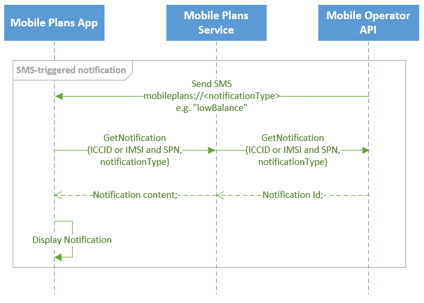
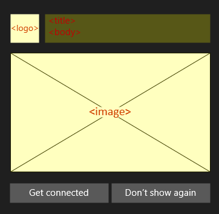
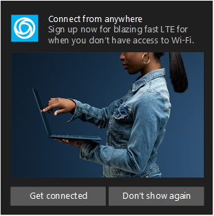

# Mobile Plans notifications

## Overview

This topic describes toast notifications in Mobile Plans that can be customized by the mobile operator with text and images to communicate with end users. Mobile Plans notifications are based on the [toast notifications framework in Windows 10](/windows/uwp/design/shell/tiles-and-notifications/adaptive-interactive-toasts).

> [!Note]
> Please reach out your Microsoft contact before planning to use this feature.

The Mobile Plans app supports the showing of 2 different types of toast notifications: SMS-triggered and app-triggered.

## SMS-triggered notifications

Mobile operators can trigger a notification to be shown on a user's device by sending an SMS to the device. The body of the SMS includes a string identifier which will route the message to the Mobile Plans app, and trigger showing of the notification. Clicking on the <accept> button will launch the Mobile Plans app and show the mobile operator's [Gateway page](mobile-plans-gateway.md).

Because the mobile operator triggers the notification via SMS, the device must have the active profile and be registered on the cellular network with ability to receive the SMS. The device must also have data access to the Mobile Plans service for requesting the notification content.

### SMS-triggered notification content

The notification content can be customized by the mobile operator using a template with predefined elements. The highlighted elements below are definable by the mobile operator.



Field name | Description | Example
---------- | ----------- | -------
Notification type | Several pre-defined types of SMS-notifications are supported. Each type behaves the same. Only the strings shown for the <accept> and <decline> buttons change depending on the type. | Low Balance, Zero Balance, New Offer, Trial Offer, Trial Ending, Trial Ended
Title | One line call to action | "You're almost out of data"
Body | Short message highlighting the offering value to the end user | "There's less than 5MB left for your current data plan. Take action now to make sure you stay connected."
Image | A lifestyle oriented photo with the PC as the centerpiece. Image dimensions are 364x180 pixels at 100% scaling. | https://picsum.photos/id/1/364/180
Logo | This is part of the assets that are provided during onboarding | 

### Sample SMS-triggered notification



### Using multiple notification templates

Mobile operators have the option to define more than one SMS-notification template. If this is done, the Mobile Plans service will call the Mobile Operator API at runtime to request an ID for the template which should be used for the notification.

Since the request includes identifiers for the active profile on the device, the mobile operator can define multiple templates for different user segments, or for A/B testing. SMS-notifications can also be combined with [enhanced Gateway pages](mobile-plans-gateway.md#enhanced-gateway-page) shown in the Mobile Plans app to create highly targeted campaings.

The Get Notifications request returns the template ID to be used for the notification shown to the user.




### GetNotifications API specification
The `GetOffers` API is called upon receipt of the SMS message by the Mobile Plans application. The Mobile Plans service is a proxy for this request.

```HTTP
GET https://{notificationUri}sims/{simmri}/notifications
```

- *{notificationUri}* is the NotificationUri value onboarded as part of the mobile operator's service configuration.

The endpoint has three query parameters:
- *limit*, which is required and specifies the number of notifications to return.
- *imei*, which is optional and specifies the client’s IMEI.
- *notificationType*, which is required and specifies the type of notifications to return. The *notificationType* parameter is always one of the enumerated strings accepted by the Mobile Plans’ GET Notifications Request.

The response is a JSON object with a single property named *notifications* that contains a list of notifications. The number of notifications in this list is at most *limit* from the request. Each notification in this list is an object with a single property, *notificationId*, which must identify an existing notification in the mobile operator’s service configuration.

The following is an example interaction using this endpoint:

```HTTP
GET https://moendpoint.com/v1/sims/iccid:8988247000100003319/notifications?notificationType=lowBalance&limit=1&imei=1234
X-MS-DM-TransactionId: "MSFT-12345678-1234-1234-1234-123456789abc"

HTTP/1.1 200 OK
Content-type: application/json
X-MS-DM-TransactionId: "MSFT-12345678-1234-1234-1234-123456789abc"
{
  "notifications": [
    {
      "notificationId": 1,
      "notificationType": "lowBalance"
    }
  ]
}
```

## App-triggered notifications

Mobile operators in some markets also have the ability to show a promotional notification on eSIM-enabled Windows 10 PCs that do not have an eSIM profile installed. The promotional notification is triggered by the app shortly after the user completes setup of the device in the out of box experience. Clicking on the <accept> button will launch the Mobile Plans app and show the mobile operator's [Gateway page](mobile-plans-gateway.md).

### App-triggered notification content

The promotional notification content can be customized by the mobile operator using a template with predefined elements. The highlighted elements below are definable by the mobile operator.



Field name | Description | Example
---------- | ----------- | -------
Title | One line call to action | "Activate your free trial"
Body | Short message highlighting the offering value to the end user | "Get 30GB FREE data, so you can stay connected from anywhere."
Image | A lifestyle oriented photo with the PC as the centerpiece. Image dimensions are 360x243 pixels at 100% scaling. | https://picsum.photos/id/1/360/234
Logo | This is part of the assets that are provided during onboarding | 

The [Notifications Visualizer app](https://www.microsoft.com/store/productId/9NBLGGH5XSL1) can be used to mockup and test notification content.

### Sample App-triggered notification


