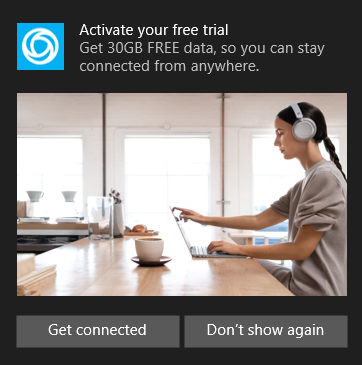

<!--
This page is not declared in the toc.yml file. Table of Content
-->

# Mobile Plans notifications

This section describes the Mobile Plans notifications, that could be tailored for the Mobile Operator
> [!Note]
> Please reach out your Microsoft contact before planning to use this feature.

## Notification details

* Promo Title: (One line)
* Promo Text: (reasonable short message)
* Toast Image: (Suggested a 360x243 image)
* Mobile Operator logo: (not needed; this is part of the assets provided during onboarding)

It is recommend that Mobile Operator use the [Notifications Visualizer app](https://www.microsoft.com/store/productId/9NBLGGH5XSL1) to test the overall notification and adjust it as needed.

## Notification message recommendations

* Emphasis on the end user value of the connectivity, e.g. “stay connected from anywhere, even when Wi-Fi isn’t available”
* Highlight the offering, e.g. “3 month free trial”
* Use lifestyle oriented photo with the PC as the centerpiece.

## Notification example

