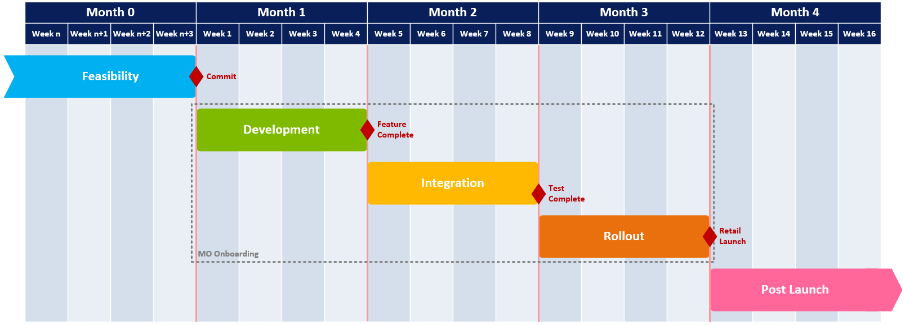

# Mobile Plans onboarding overview

## Project overview

Mobile Plans onboarding is a project composed of four phases:

| Phase | Description |
| --- | --- |
| **Feasibility** | The mobile operator assesses the Mobile Plans solution to determine feasibility and scope of the project. There are several approaches and [scenarios](mobile-plans-scenarios.md) available which should be evaluated against business needs. The operator will review available documentation, work with their designated Microsoft contact to address questions as needed, align on the timeframe, and commit to begin the work. |
| **Development** | The mobile operator implements the component parts of their solution, according to the scenarios defined above. Windows and Mobile Plans configurations are also enabled as needed during this phase. |
| **Integration** | The mobile operator is enabled in Mobile Plans to run end-to-end validation in a staging environment. The [integration](mobile-plans-integration.md) topic provides more details on this phase. |
| **Rollout & Launch** | The mobile operator is enabled commercially and made available to end users in the production environment. The [launch](mobile-plans-launch.md) topic provides more details on this phase. |

## Project schedule

A typical project schedule is divided into the following phases, with milestones defining the exit/entrance criteria for each phase. The actual length of the devlopment phase will depend on multiple factors including the scope of the project.

## Project plan

This [sample project plan](mobile-plans-appendix.md#high-level-integration-schedule) has been developed to illustrate the tasks required for each phase of work. Some tasks are for mobile operators, while others are joint tasks to be done in coordination with Microsoft.
