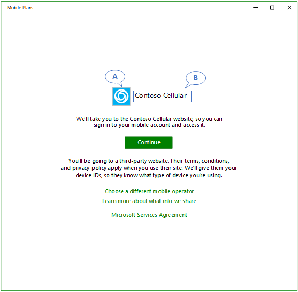

# Mobile Plans service configuration

This topic describes how to build a foundation on Windows connected devices that support Mobile Plans. It details how to configure your eSIM profiles to ensure the best consumer experience, as well as how to provide service configuration information that ensures that the Mobile Plans experience is properly rendered on Windows devices.

## eSIM profile configuration requirements

You must prepare eSIM profiles that meet the following requirements:

- The eSIM profile must not be PIN locked.
- The eSIM profile must not be deleted from your SM-DP+ server until you receive confirmation that the profile download has been completed successfully. The activation code can be reused to retry downloading the same profile when previous attempts to download have failed.
- The eSIM profile must not have the “Do not delete” or “Do not deactivate” policies set.
- The activation code must not include any prefixes such as “LPA:”.
- The activation code is available immediately after the MO Direct flow.
- The activation code must not require a "Confirmation Code".

### eSIM profile testing

It is expected that the mobile operator perform a validation to ensure that their eSIM profiles can be installed on different Windows devices. For this, it is recommended to source some eSIM-capable devices and use the Windows Settings app to download, install, and activate profiles.

## Service configuration

The Mobile Plans service must ingest some configuration information to support a mobile operator. To start the configuration process, please send an email to [Mobile Plans Implementation Support](mailto:mpimplementation@microsoft.com).

### Minimum configuration information

1. The brand name you would like to use for your products.
2. The branding logo. Required resolution is 300x300 pixels. Image should also be full bleed with no transparency.
3. The list of countries where your solution is supported. Please use [ISO 3166 code](https://en.wikipedia.org/wiki/ISO_3166-1_alpha-2) to create the list (comma separated).
4. Your MO Direct portal URI (localization is not supported). This should be an *https* address. Port numbers are not supported.
5. A notification URI. This is the host address from where the Javascript callbacks ([callback notifications](mobile-plans-callback-notifications.md)) are going to be run. This should be an *https* address. Port numbers are not supported.
6. The ICCID range or ranges that you want to want to associate with *Mobile Plans*.

The following image shows an example for the *standard gateway page* in the Mobile Plans app. The “A” annotation corresponds to the branding logo you submit, and the “B” annotation corresponds to the brand name.

