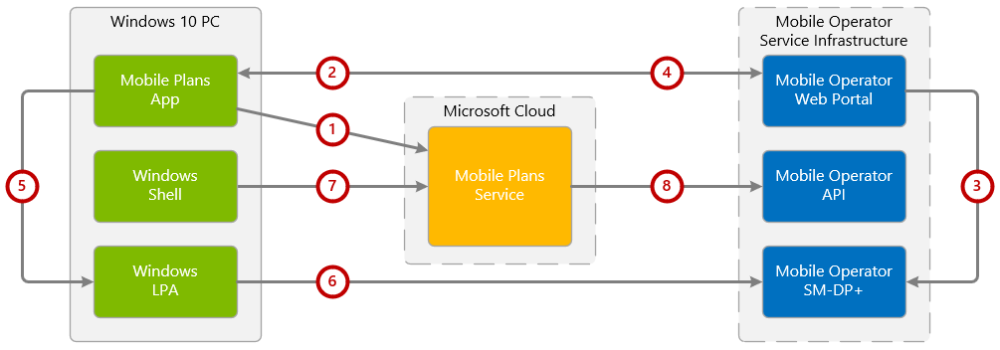

# Mobile Plans system architecture

This page provides an overview of the major components of the Mobile Plans system architecture. Together, these comprise the Mobile Plans program. Not every mobile operator deployment will require every component listed here.

The Mobile Plans system architecture made up of the following 5 major components:

### Mobile Plans App

This is the Universal Windows Platform (UWP) app that is preinstalled by Microsoft on all cellular-enabled Windows 10 devices. The Mobile Plans app is the primary client environment running on the user's device for hosting the end user experience. The Mobile Plans app can also run in the background to trigger certain events (e.g. showing a toast notification).

### Mobile Plans Service

The Mobile Plans service is the cloud-based service layer which provides data to the Mobile Plans app. It also provides an authenticated interface to the Mobile Operator API.

### Mobile Operator Web Portal

This is the web-based runtime environment hosted by the mobile operator. The mobile operator web portal is experienced by the user via web navigation, and is rendered in situ within the Mobile Plans app.

### Mobile Operator API

This is the programmatic interface hosted by the mobile operator for exposing user data to the Mobile Plans, which can be fetched at runtime to update content presented to the user. An example of user data fetched at runtime would be a user's prepaid balance.

### Mobile Operator SM-DP+

This is the service responsible for creation and delivery of a mobile operator's eSIM profile to the Windows 10 device.

## Functional overview

The following diagram shows a high-level overview of how the components described above are used in a typical flow to successfully activate a subscription and install an eSIM profile. Note that other flows are possible as well.

1. The Mobile Plans app is launched on the Windows 10 device, and retrieves basic functional data from the Mobile Plans service.
2. The Mobile Plans app invokes the mobile operator web portal, and passes relevant parameters which can be used by the portal to determine which user experience to present.
3. Upon completion of the activation flow within the mobile operator web portal, the mobile operator requests an eSIM profile from the SM-DP+ server. The corresponding eSIM activation code is returned to the mobile operator web portal.
4. The mobile operator web portal returns the eSIM profile activation code to the Mobile Plans app.
5. The Mobile Plans app passes the activation code to the Windows LPA, which contacts the SM-DP+ server to retrieve the eSIM profile.
6. The eSIM profile is downloaded and installed to the Windows 10 device eSIM, and is activated. Upon activation, the Windows 10 device registers on the mobile operator network.
7. The user opens the Windows network flyout, which invokes a request to the Mobile Plans service to fetch the available balance.
8. The Mobile Plans service makes a Get Balance request to the Mobile Operator API, which returns the available balance to be displayed to the user.
