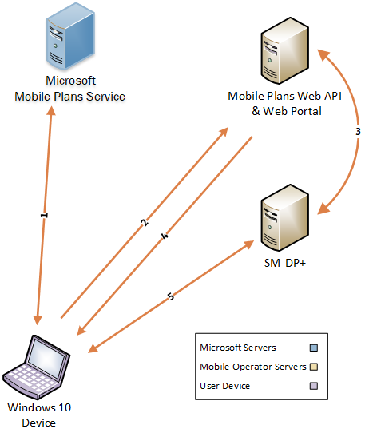

# Mobile Plans overview

## Introduction

Mobile Plans is the program in Windows 10, version 1803 and later that enables mobile operators (MOs) and other service providers to sell plans to end users.

Mobile Plans enables end users to perform the following:

- Install and activate an eSIM profile.
- Activate a device on a mobile operator subscription with either prepaid (PAYG) or postpaid plans.
- Top up subscriptions when out of data and the only connectivity available is mobile connectivity.

## Definition of terms

| Term | Description |
| --- | --- |
| Contoso Cellular | A fictional mobile operator used for explanatory purposes in these topics. |
| COSA database | Country and Operator Settings Asset. This is a database that contains mobile operator connectivity settings to be used in Windows devices. For more info about COSA, see [COSA Overview](cosa-overview.md). |
| Mobile Plans | The name of this project. |
| Mobile Plans app | The Microsoft app to enable Mobile Plans on Windows 10 devices. |
| Mobile Plans service | The cloud service that enables the Mobile Plans solution. |
| RPS | Requests Per Second. |

## Project overview

Mobile Plans project integration is composed of four stages, each of which has [high-level tasks](mobile-plans-appendix.md#high-level-integration-schedule). Some of these high-level tasks are for mobile operators, while others are joint tasks where Microsoft works in coordination with mobile operators.

| Stage | Description |
| --- | --- |
| **Feasiblity** | The mobile operator assesses the Mobile Plans solution, digests this documentation, and reaches out to their Microsoft representative with questions as needed. |
| **Implementation** | The mobile operator develops their solution according to their user cases and requests Mobile Plans configurations and Windows configurations as needed. |
| **Integration** | The mobile operator is enabled in Mobile Plans to run end-to-end validation. |
| **Launch** | The mobile operator is commercially launched to the market through Mobile Plans. |

## Functional overview

The following diagram shows a high-level view of how a Windows 10 device uses Mobile Plans to interact with different services and solutions to successfully activate a subscription and install an eSIM profile.

The following table describes each component of the diagram.

| Component | Description |
| --- | --- |
| Windows 10 device | An eSIM-capable “Always Connected PC” running the latest version of Windows 10. |
| Microsoft Mobile Plans Service | A service endpoint responsible for providing mobile operator information, such as an MO web portal URL and visual assets, to the Windows 10 device. |
| Mobile Plans Web API & Web Portal | The endpoint in the mobile operator network that is responsible for hosting the web service API and web portal that allow Windows 10 devices to access the Mobile Plans experience. |
| SM-DP+ server | Responsible for creating, generating, and managing eSIM profiles that belong to a mobile operator. |

A typical functional flow for the preceding diagram is as follows:

1. The Mobile Plans app is launched on the Windows 10 device and retrieves basic functionality information from the Mobile Plans Service.
   - The Mobile Plans app reaches out to the Mobile Plans service to retrieve MO-specific information.
2. The Mobile Plans app launches the MO Web portal and passes relevant parameters to the MO portal.
3. The mobile operator requests an eSIM profile from the SM-DP+ server. The eSIM activation code is returned to the Mobile Plans mobile operator web portal.
4. Once control is returned to the Mobile Plans app on the Windows 10 device, the eSIM activation code is provided to the Windows device.
5. The Windows 10 device uses the activation code and contacts the SM-DP+ server to retrieve the eSIM profile. The eSIM profile is now installed and activated on the Windows 10 device.
6. The Windows 10 device is connected to the mobile operator network.

Windows uses the Mobile Plans app as a client to consume the overall Mobile Plans experience. This application contacts the MO Web portal and handles all interactions with it. Additionally, once the activation code has been returned, the Mobile Plans app is responsible for downloading, installing, and activating the eSIM profile.

## Get started

To get started with the Mobile Plans experience, please reach your Microsoft representative to discuss the project implementation. Follow the steps below for a guide to understand the solution in technical detail.

1. [Mobile operator use cases](mobile-plans-use-cases.md)
2. [Integration](mobile-plans-integration.md)
3. [Launch](mobile-plans-launch.md)

See these topics for additional information about Mobile Plans:

- [Appendix](mobile-plans-appendix.md)