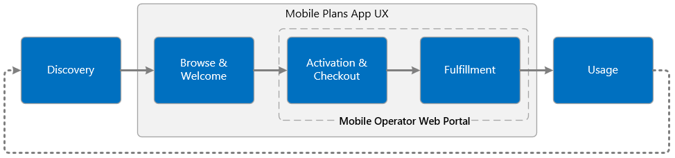
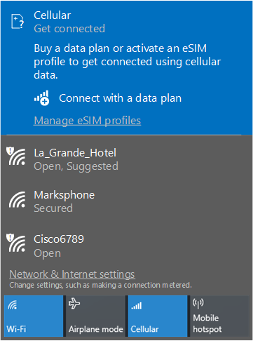
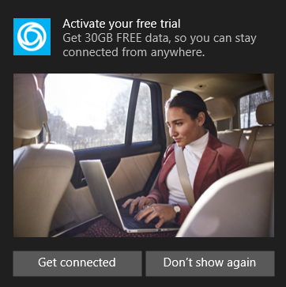
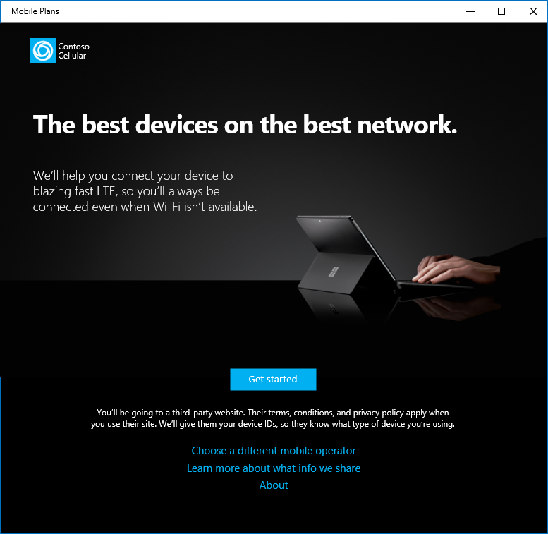
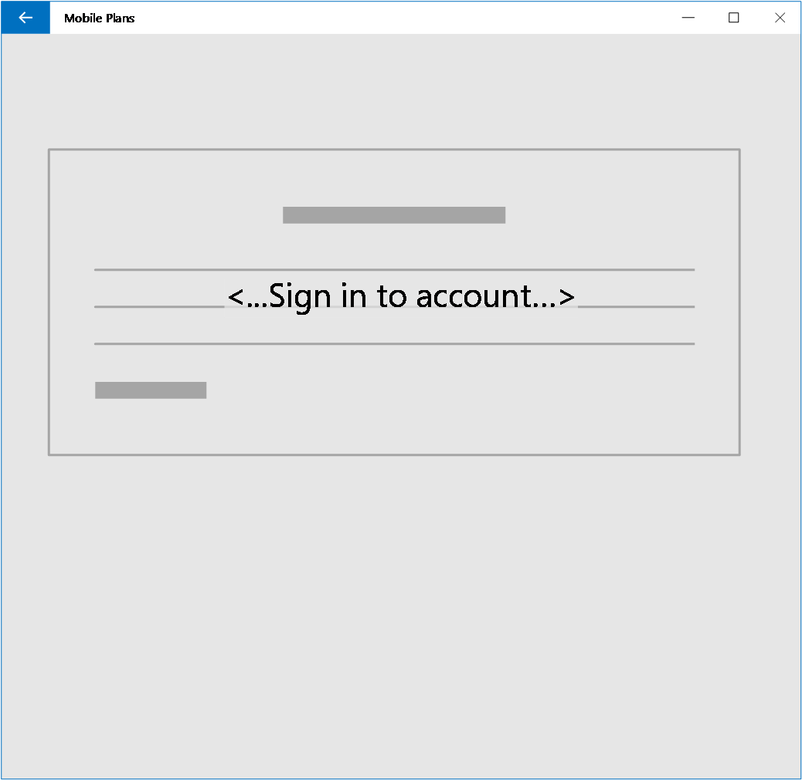
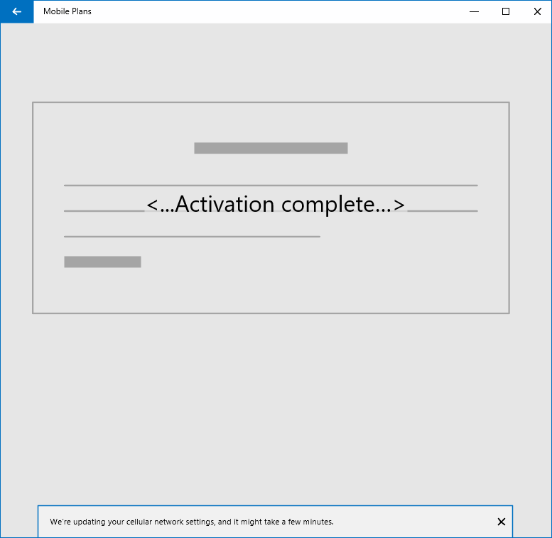

# Mobile Plans overview

## Purpose

Mobile Plans is an application in Windows 10 that helps end users to connect their Windows device to cellular networks through mobile operators. The purpose of Mobile Plans is to:

- Provide a consistent and simplified user experience for activation of cellular-enabled PCs.
- Enable a new channel for cellular activation through adoption of eSIM
- Increase adoption of cellular services on Windows PCs through a direct relationship between customers and mobile operators

Mobile Plans is supported in Windows 10, version 1803 and later.

## Customer journey

The typical Mobile Plans customer journey is composed of the following steps:

Step | Description
------|------------
Discovery | The user sees one of several entry points in the Windows UI and launches the Mobile Plans app. There are multiple entry points available in the Windows Shell that are tailored to various scenarios.
Browse & Welcome | After the Mobile Plans app launches, the user chooses their mobile operator and sees the operator Gateway page. The Gateway page invokes the mobile operator web portal which hosts the next step. Note that some entry points  take the user directly to the operator Gateway page.
Activation & Checkout | The mobile operator web portal walks the user through sign in, activation and checkout
Fulfillment | Upon completion of the activation step, the user will be provisioned for data. This step could include download and activation of an eSIM profile.
Usage | The user enjoys the benefits of an always connected PC, and is able to see available balance directly in the Windows UI. They can easily return to the mobile operator web portal to manage their account and purchase additional data as needed.

## User experience

The following sections illustrate the Mobile Plans user experience.

### Launching the app

The Mobile Plans app can be launched from a number of different entry points. The most common entry point is the network flyout, as this is where users typically manage their active network interfaces in Windows 10. The cellular interface can be expanded to show status of the cellular network. In the example below, the device has no SIM profile activated, so the user sees a call to action to “Connect with a data plan.” Selecting this link will launch the Mobile Plans app.

See the [Mobile Plans account management](mobile-plans-account-management.md) topic for more details on behavior of the network flyout.

The app can also be launched from a toast notification. Selecting the “Get connected” button will launch the Mobile Plans app.

See the [Mobile Plans toast notifications](mobile-plans-notifications.md) topic for more details on the behavior of toast notifications.

The Mobile Plans app can also be launched from the Settings app, or from the Start menu.

### Select provider page

Once the app has launched, the user has the option to choose their mobile operator. The app displays a list of available mobile operators based on the user’s current location.

See the [Mobile Plans operator catalog](mobile-plans-catalog.md) topic for more information on this page.

### Mobile operator gateway page

If the user has chosen a mobile operator, the app shows that operator’s gateway page. This page is hosted by the Mobile Plans app. The user can select the button to continue.

See the [Mobile Plans gateway page](mobile-plans-gateway.md) topic for more details on the behavior and customization of the Gateway page.

### Mobile operator web portal

Once the user has selected the button to continue, the app will load the mobile operator’s web portal. The web content is displayed in a browser control hosted by the app, and the user can use web navigation to browse the portal.

See the [mobile operator web portal](mobile-plans-web-portal.md) topic for an in-depth description of the mobile operator web portal.

### Fulfillment

After completing the signup flow on the web portal, the mobile operator can trigger fulfillment based upon the type of signup. This could include download and installation of a new eSIM profile, or it could be the addition of new balance to an active account. Once the fulfillment step is complete, the web portal can invoke a popup to let the user know the process is complete.

See the [Mobile Plans callback notifications](mobile-plans-callback-notifications.md) topic for more information on this step.

