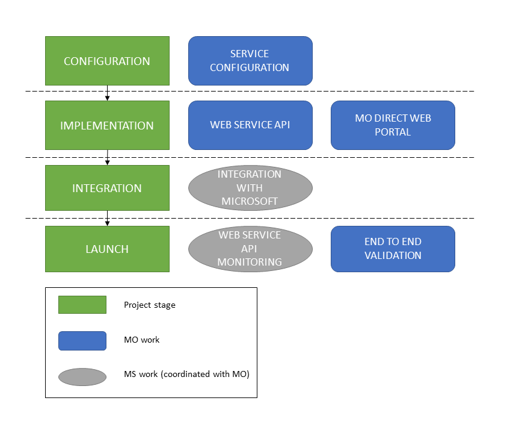
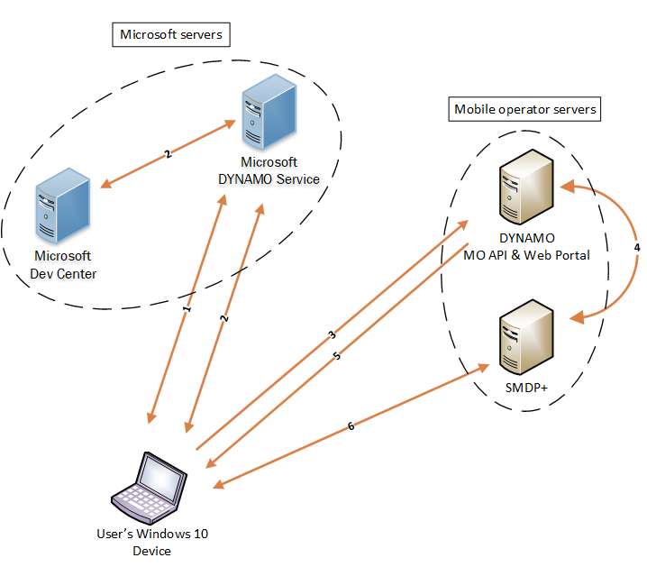

# Mobile Plans

[!include[Mobile Plans Beta Prerelease](../mobile-plans-beta-prerelease.md)]

## Introduction

Mobile Plans is the program in Windows 10, version 1803 and later that enables mobile operators (MOs) and other service providers to sell plans to end users. Mobile Plans is a new name for the previous Data Marketplace program and is not a separate or competing program.

Mobile Plans enables end users to perform the following:

- Install and activate an eSIM profile.
- Activate a device on a mobile operator subscription with either prepaid (PAYG) or postpaid plans.
- Top up prepaid subscriptions when out of data and the only connectivity available is mobile connectivity.

## Definition of terms

| Term | Description |
| --- | --- |
| Contoso Cellular | A fictional mobile operator used for explanatory purposes in these topics. |
| COSA database | Country and Operator Settings Asset. This is a database that contains mobile operator connectivity settings to be used in Windows devices. For more info about COSA, see [COSA Overview](cosa-overview.md). |
| Mobile Plans | The name of this project. |   
| Mobile Plans app | The Microsoft app to enable Mobile Plans, formerly known as the Paid Wi-Fi and Cellular (PWC) app. |
| PAYG | Pay As You Go |
| RPS | Requests Per Second |

## Project overview

Mobile Plans project integration is composed of four stages, each of which has high-level tasks. Some of these high-level tasks are for mobile operators, while others are joint tasks where Microsoft works in coordination with mobile operators. The following diagram illustrates the four stages of the Mobile Plans project.

## Functional overview

The following diagram shows a high-level view of how a Windows 10 device uses Mobile Plans to interact with different services and solutions to successfully activate a subscription and install an eSIM profile.

The following table describes each component of the diagram.

| Component | Description |
| --- | --- |
| Windows 10 device | An eSIM-capable “Always Connected PC” running the latest version of Windows 10. |
| Microsoft Mobile Plans Service | A service endpoint responsible for resolving phone number lookup and providing mobile operator information, such as an MO web portal URL and visual assets, to the Windows 10 device. |
| Mobile Plans Web API & Web Portal | The endpoint in the mobile operator network that is responsible for hosting the web service API and web portal that allow Windows 10 devices to access the Mobile Plans experience. |
| SMDP+ server | Responsible for creating, generating, and managing eSIM profiles that belong to a mobile operator. |

A typical functional flow for the preceding diagram is as follows:

1. The Mobile Plans app, running on the Windows 10 device, resolves phone number lookup in the Mobile Plans Service.
2. The Mobile Plans app reaches out to the Mobile Plans service to retrieve MO-specific information.
3. The Mobile Plans app launches the MO web portal and passes relevant parameters to the MO portal.
4. The mobile operator requests an eSIM profile from the SM-DP+ server. The eSIM activation code is returned to the Mobile Plans mobile operator server.
5. Once control is returned to the Mobile Plans app on the Windows 10 device, the eSIM activation code is provided to the Windows device.
6. The Windows 10 device uses the activation code and contacts the SM-DP+ server to retrieve the eSIM profile. The eSIM profile is now installed and activated on the Windows 10 device.
7. The Windows 10 device is connected to the mobile operator network.

Windows uses the Mobile Plans app as a client to consume the overall Mobile Plans experience. This application contacts the MO Web portal and handles all interactions with it. Additionally, once the activation code has been returned, the Mobile Plans app is responsible for downloading, installing, and activating the eSIM profile.

## Get started

To get started with the postpaid Mobile Plans experience, follow these steps:

1. [Configuration](mobile-plans-configuration.md)
2. [Implementation](mobile-plans-implementation.md)
3. [Integration](mobile-plans-integration.md)
4. [Launch](mobile-plans-launch.md)

See these topics for additional information about Mobile Plans:

- [Prepaid experience](mobile-plans-prepaid-experience.md)
- [Promotional content](mobile-plans-promotional-content.md)
- [Asynchronous fulfillment](mobile-plans-asynchronous-fulfillment.md)
- [Appendix](mobile-plans-appendix.md)