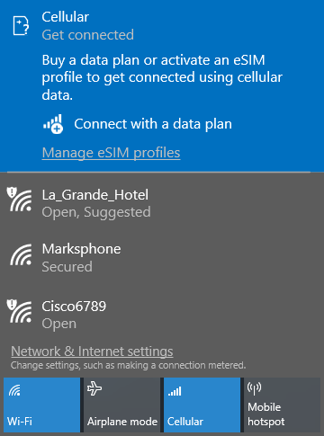
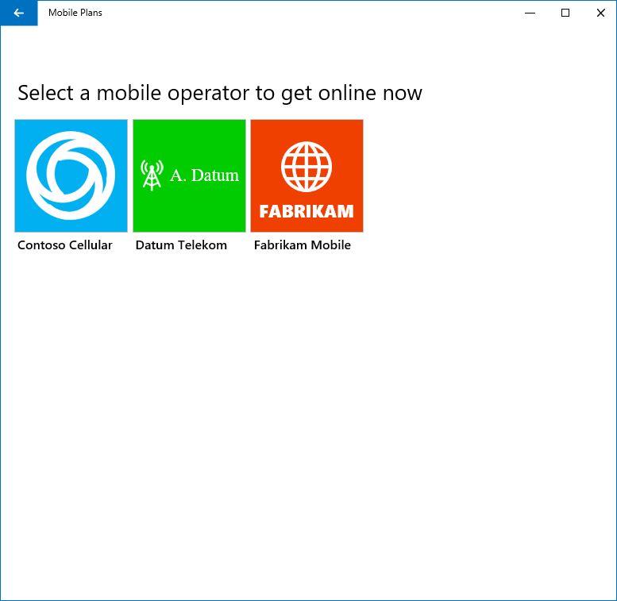
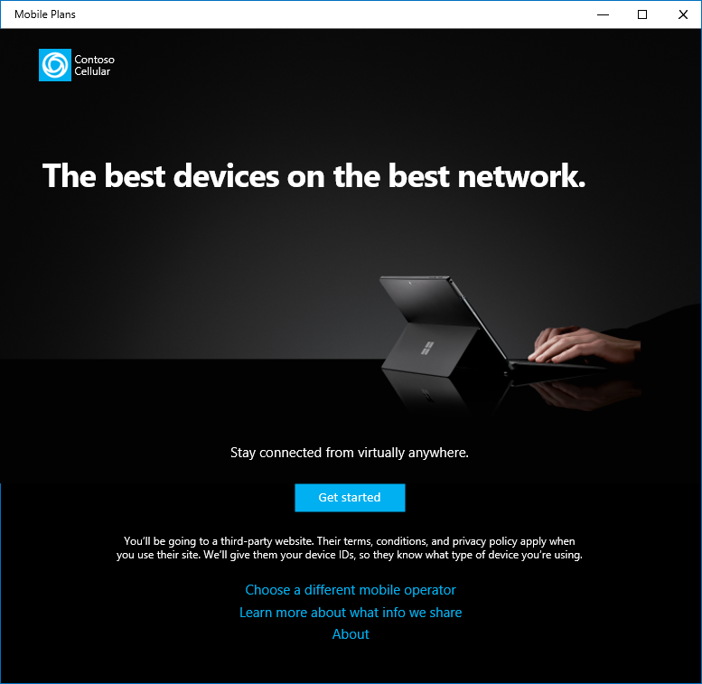

# Mobile Plans overview

## Purpose

Mobile Plans is an application in Windows 10 that helps end users to connect their Windows device to cellular networks through mobile operators. The purpose of Mobile Plans is to:

- Streamline the user experience for activation of cellular-enabled PCs sold in all channels.
- Simplify the provisioning process through the seamless installation of eSIM profiles.
- Enable a direct relationship between the customer and the mobile operator.

Mobile Plans is supported in Windows 10, version 1803 and later.

## User experience

The following sections illustrate a typical customer journey using the Mobile Plans app.

###Discovery and Launch

The Mobile Plans app can be launched from a number of different entry points. The most common entry point is the network flyout, as this is where users typically manage their active network interfaces in Windows 10. The cellular interface can be expanded to show status of the cellular network. In the example below, the device has no SIM profile activated, so the user can see a call to action to “Connect with a data plan.” Clicking this link will launch the Mobile Plans app.

See this section for more details on behavior of the network flyout.

The app can also be launched from a toast notification. Clicking the “Get connected” button will launch the Mobile Plans app.

See this section for more details on the behavior of toast notifications.

The Mobile Plans app can also be launched from the Settings app, or from the Start menu.

###Select provider page

Once the app has launched, the user has the option to choose their mobile operator. The app displays a list of available mobile operators based on the user’s current location.

###Mobile operator gateway page

If the user has chosen a mobile operator, the app shows that operator’s gateway page. This page is hosted by the app. The user can click the button to continue.

See this section for more details on the behavior and customization of the gateway page.

###Mobile operator web portal

Once the user has clicked the button to continue, the app will load the mobile operator’s web portal. The web content is displayed in a browser control hosted by the app, and the user can use web navigation to browse the portal.

See this section for a description of the mobile operator web portal.

###Activation

After completing the signup flow on the web portal, the mobile operator can trigger activation based upon the type of type of signup. This could include download and installation of a new eSIM profile, or it could be the addition of new balance to an active account. Once the activation is complete, the web portal can invoke a popup to let the user know the process is complete.

