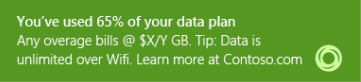

# Notifications

You can keep your users informed through service notifications such as plan activation status, approaching data cap, and currently roaming. Windows supports existing channels such as SMS, USSD, and Windows Notification Service to trigger notifications.

Your mobile broadband app should communicate time-critical events to the user through toast notifications whether the user is in another app, on the **Start** screen, or on the desktop.

Your app can receive background events to process SMS or USSD notifications. For info about background notifications that are associated with mobile broadband apps, see these API pages under the [Windows.ApplicationModel.Background](/uwp/api/windows.applicationmodel.background) namespace:

- [MobileBroadbandDeviceServiceNotificationTrigger](/uwp/api/windows.applicationmodel.background.mobilebroadbanddeviceservicenotificationtrigger)
- [MobileBroadbandPcoDataChangeTrigger](/uwp/api/windows.applicationmodel.background.mobilebroadbandpcodatachangetrigger)
- [NetworkOperatorNotificationTrigger](/uwp/api/windows.applicationmodel.background.networkoperatornotificationtrigger)
- [SmsMessageReceivedTrigger](/uwp/api/windows.applicationmodel.background.smsmessagereceivedtrigger)

## Related topics

[Mobile broadband app scenarios](./account-management.md)

 

