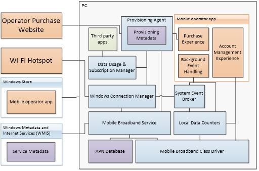

# Overview of mobile broadband

Windows 8, Windows 8.1, and Windows 10 simplify mobile broadband connectivity for users, while offering new opportunities for mobile network operators. Users enjoy a streamlined, consistent connection flow. Windows 8, Windows 8.1, and Windows 10 reduce your need to develop traditional connection management apps so development resources can be focused on customer interaction, including account management and value-added services.

Windows 8, Windows 8.1, and Windows 10 present an opportunity to reimagine and streamline the existing mobile broadband ecosystem.

-   Earlier versions of mobile broadband hardware required custom Windows drivers. With the current Mobile Broadband class driver, certified mobile broadband devices have a consistent experience without the need to install custom drivers. This streamlining presents an opportunity to provide customers with a “just works” experience while possibly reducing support overhead.

-   Customized connection management experiences duplicate Windows functionality and have different UX models than the rest of Windows. These connection managers have to be deployed and maintained by the operator and their ISV partners.

-   The need for a custom driver and for custom connection management software meant that USB-based mobile broadband devices need to also perform a USB storage function in order to deliver that custom software to the user’s PC. This dual-mode device concept often requires the user to switch between storage mode and modem mode, adding an extra task before the user can successfully connect to the network.

-   Highlight unique services and capabilities that make your customer experience unique. Windows 8, Windows 8.1, and Windows 10 provide the opportunity to focus on the customer connection and to highlight your unique value-add through a UWP mobile broadband app, previously known as a mobile operator app.

## Key scenarios

This section describes key scenarios that are part of the current mobile broadband experience that you can choose to enable. Consider each of these scenarios in the context of your business models when you plan which Windows components your app must interact with.

-   [Plan purchase](#plan-purchase)

-   [Connecting an active device](#connecting-an-active-device)

-   [Operator notifications and system events](#operator-notifications-and-system-events)

-   [Providing accurate usage and plan data](#providing-accurate-usage-and-plan-data)

-   [Internet sharing](#internet-sharing)

-   [Wi-Fi hotspot authentication](#wi-fi-hotspot-authentication)

-   [Displaying account information to the user](#displaying-account-information-to-the-user)

-   [Enabling other devices and app scenarios](#enabling-other-devices-and-app-scenarios)

### Plan Purchase

A seamless plan purchase experience makes it easier for users to buy connectivity and enables the operator to accept new customers without the need for support or retail-store intervention. There are two purchase plan options:

-   The mobile broadband app and service metadata is already installed on the PC. This could happen for PCs that have embedded mobile broadband hardware where the OEM has preloaded the mobile broadband app and service metadata on the Windows image or an alternate Internet connection is available.

-   The mobile broadband app and service metadata is not installed on the PC. This could happen when you plug in a hardware dongle and an alternate Internet connection is not available.

Regardless of the plan purchase option, there are various sub states based on the state of the SIM or CDMA mobile broadband device. Cold SIMs (no associated plan), warm SIMs (ready to accept a plan), and hot SIMs (already active with a plan) will likely present a different experience based on how you want to structure the purchase flow.

### Mobile broadband app is already installed or an alternate Internet connection is available

In this case, an embedded device, mobile broadband app, and service metadata is probably already installed on the PC with a SIM before the user attempts to activate service. Another possibility is that the user does not yet have the mobile broadband app but has an alternate Internet connection to download the app. The following steps occur automatically when the SIM is inserted:

1.  The mobile broadband service reads the International Mobile Subscriber Identity (IMSI), the Integrated Circuit Card ID (ICCID) for GSM networks, the provider ID (SID) for CDMA networks, or the provider name for CDMA networks and generates a set of Hardware IDs (HWIDs).

    **Note**  
    This step is only necessary if the OEM has not inserted the SIM and preloaded the mobile broadband app and service metadata.

     

2.  When the PC is connected to the Internet, the HWIDs are sent to Windows Metadata and Internet Services (WMIS). WMIS identifies the operator and returns the appropriate service metadata package.

    **Note**  
    This step is only necessary if the OEM has not inserted the SIM and preloaded the mobile broadband app and service metadata.

     

3.  Windows uses the service metadata to identify and retrieve the mobile broadband app from the Microsoft Store. The app is installed automatically. In Windows 8.1 and Windows 10, the app is not pinned to the Start screen.

    **Note**  
    This step is only necessary if the OEM has not inserted the SIM and preloaded the mobile broadband app and service metadata.

     

4.  Your operator logo and name appear in the Networks list in Windows Connection Manager. The user can connect to your network.

5.  Windows Connection Manager tries to connect by using the network profile configuration information in the service metadata. The next step depends on the result of the connection:

    -   If the initial connection is successful and Internet connectivity is available, nothing further happens. The user has previously purchased service and has an active account.

    -   If the initial connection is successful but Internet connectivity is not available, the mobile broadband app starts and the user is asked to for a purchase plan.

    -   If the initial connection fails and the error code indicates that network service has not yet been purchased, the mobile broadband app started. The app can determine the appropriate response. For example, if the error code is due to lack of connectivity, the app may need to direct the user to complete the purchase by telephone or by connecting to an alternate Internet connection.

    -   If the initial connection fails with another error code, Windows connection manager notifies the user about the error. The mobile broadband app is not started.

6.  When the mobile broadband app opens, you should ensure that the app is written to make a secure connection to the backend billing infrastructure so that the user can purchase a subscription. This process is proprietary for each operator and Microsoft is not involved in the purchase process. The app establishes this connection through a limited mobile broadband connection (that the operator network needs to enable) or over an alternate Internet connection, such as Wi-Fi.

7.  When plan purchase is complete, the mobile broadband app generates a metadata provisioning file that is passed to the provisioning agent. This configures Windows with information about the plan that the user has purchased.

**Important**  
The steps above also apply to an external device that is attached to the PC with an alternate Internet connection.

 

### Mobile broadband app is not installed and no alternate Internet connection is available

An external mobile broadband device, such as a hardware dongle, can be inserted into PCs that may not have an alternate Internet connection available and may not have a mobile broadband app installed. The following steps describe how a plan purchase experience can be built to work around limitations in this scenario:

1.  As soon as the mobile broadband hardware is detected, the Windows Mobile Broadband service reads the IMSI, the ICCID, the provider ID, or the provider name and generates a set of HWIDs that represent the each value read from the device. The Windows Mobile Broadband service listens for mobile broadband-related events.

2.  When the user clicks **Connect**, the HWID values are used to locate the connection settings in the Windows APN database as follows:

    -   If the initial connection is successful and Internet connectivity is available, nothing further happens. The user has previously purchased service and has an active account.

    -   If the initial connection is successful but Internet connectivity is not available, the user is taken to the URL specified in the APN database for this HWID range.

    -   If the initial connection fails, Windows Connection Manager notifies the user about the error. Your website should assist the user in purchasing a plan.

3.  After the user completes the plan purchase, the website generates a metadata provisioning file and passes it to the provisioning agent. This configures Windows with basic information about the plan that the user has purchased. Depending on the network structure, one of the following occurs:

    -   The user is granted Internet access on the current connection.

    -   The provisioning file includes instructions to disconnect and reconnect to the same network or a different network, which will provide Internet access.

    At this point, the user is online. Now that an Internet connection is available, Windows detects the mobile broadband hardware and downloads and installs the service metadata and the mobile broadband app.

4.  The HWIDs that are calculated from the SIM or mobile broadband device are sent to WMIS. WMIS identifies the operator and returns the appropriate service metadata package.

5.  Windows uses the service metadata to identify and retrieve the associated mobile broadband app from the Microsoft Store. The app is installed automatically and registered for background events. In Windows 8.1 and Windows 10, the app is not automatically pinned to the Start screen. Registering for background events allows the app to do things such as reacting to local data usage counters, receiving operator SMS messages, connecting to Wi-Fi hotspots, and handling entitlement checks. More details about background tasks can be found in [Introduction to Background Tasks](http://www.microsoft.com/download/details.aspx?id=27411).

6.  When a background event occurs, the app generates a more complete provisioning file, if needed, and passes it to the provisioning agent. This configures Windows with information about the plan that the user has purchased.

### Connecting an Active Device

When a device with an active mobile broadband plan is attached to a PC, the experience is similar to that for purchase, except that the attempted connection leads to the Internet. Windows will not start the mobile broadband app for mobile broadband or connect to the mobile operator’s website. Instead, the app is installed in the background.

1.  When the mobile broadband hardware is detected, the Mobile Broadband service reads the IMSI, the ICCID, the provider ID, or the provider name and generates HWIDs.

2.  When the user clicks **Connect**, the HWID values are used to locate appropriate connection settings within the Windows APN database. For an active device, the connection is successful and Internet connectivity is available.

3.  At this point, the user is online. Now that an Internet connection is available, Windows will detect the mobile broadband hardware and download and install the service metadata and the mobile broadband app.

Windows 8.1 and Windows 10 can connect to an operator network during Windows Setup if a mobile broadband device with an active plan is attached to the PC. The mobile broadband network appears in the Networks list during Windows Setup along with Wi-Fi networks. Similar to the process for connecting an active device, a HWID is generated based on the detected mobile broadband hardware and is used to locate appropriate connections settings within the Windows APN database.

### Operator Notifications and System Events

In order to keep users informed about their account status, the mobile broadband app needs to perform some activities even when the user is not interacting with it. These activities include responding to operator SMS or network-initiated USSD messages, notifying the user that they are approaching their data limit, notifying the user that their data plan has expired, and notifying the user of their roaming status. Incoming SMS messages are available to privileged apps that have been granted access to the SMS capabilities on the PC by the service metadata package.

Some SMS messages come directly from the mobile network operator and should be displayed to the user by using the mobile broadband app. The mobile broadband app can invoke a toast notification when it receives an operator SMS message.

For operator messages that are not intended to be seen by the end-user, the mobile broadband app can process these and act appropriately. The Windows Notification Service provides the most efficient direct-to-app notification channel, but Windows also supports the use of incoming SMS and Unstructured Supplementary Service Data (USSD) notifications from the mobile broadband network.

More information about handling SMS messages can be found in [Developing SMS apps](developing-sms-apps.md). More info about operator notifications can be found in [Enabling mobile operator notifications and system events](enabling-mobile-operator-notifications-and-system-events.md).

1.  The service metadata declares that the mobile broadband app wants to access operator notifications. A private background event is created and the app is registered for operator notification events at the time that it is installed.

2.  When the app applies provisioning metadata, it includes a description of all SMS and USSD messages that should be considered operator messages.

Upon receipt of an SMS or USSD message, the Mobile Broadband service compares the message to the description provided in the provisioning metadata. If parsing rules have been included, the Mobile Broadband service also interprets the message and updates the information about data usage.

If the message is a match, the System Event Broker is notified to invoke the private background event for that mobile broadband app. If not, the System Event Broker is notified to invoke the public SMS event.

Some examples of what the operator could include in the mobile broadband app for responses to incoming SMS messages include the following:

-   Immediately syncing current data usage

-   Displaying a notification to the user

-   Updating the app’s live tile

-   Retrieving and applying updated provisioning metadata

**Note**  
Windows 8, Windows 8.1, and Windows 10 do not include an SMS app with the operating system so a mobile broadband app or a third-party SMS app to which the operator gives privileged access is needed in order to display SMS messages to the user.

 

**Note**  
Building a mobile broadband app with SMS support is necessary to show notification UI to the end user when text messages are received, which may be required to conform to regulatory requirements or best practices in certain markets.

 

SMS functionality is available to mobile broadband apps, UWP apps that are given privileged access to mobile network operators, UWP apps that are given privileged access by the PC OEM (if the mobile broadband device is embedded in the PC), or the mobile broadband device IHV (if the mobile broadband device is removable). Mobile network operators and the PC OEM (or the mobile broadband device IHV) specify privileged apps through service metadata. For more information about service metadata, see [Using metadata to configure mobile broadband experiences](using-metadata-to-configure-mobile-broadband-experiences.md).

### Providing accurate usage and plan data

Windows provides Data Usage and Subscription Manager APIs that the mobile broadband app can use to describe the user’s data plan. The mobile broadband app can update this API with information about the data plan size, metered vs. non-metered plan, and an updated data usage value from the operator’s network.

Windows will check the data usage information that has been set for the user by using these APIs and change the behavior of core features. For example, Windows Update will only auto-download critical updates when the user is using a metered network. Usage information is also accessible to third-party apps via the Data Usage and Subscription Manager APIs; detailed usage guidelines are available at [Managing connections on metered networks](https://msdn.microsoft.com/library/windows/apps/hh750310).

The following is a walkthrough of the various features that the mobile broadband app can choose to utilize in order to keep the user informed of their data usage.

1.  Local data counters estimate that usage on the profile has changed by more than 5 percent of the user’s data limit since the last update from the operator. This 5 percent increment is hard-coded and the mobile broadband app can make use of background events to wake itself up and react to each 5 percent increment.

2.  Data Usage and Subscription Manager is a Windows component that does this 5 percent usage increment tracking. It notifies the System Event Broker to trigger a background event for each 5 percent increment in the local estimated usage.

3.  The System Event Broker invokes the mobile broadband app to handle the background event. (Other triggers, such as an incoming notification, might cause this to occur.) The mobile broadband app can choose what to do when it is invoked for this purpose.

4.  A best practice is for the app to handle this event by retrieving the most current usage information from the operator’s billing infrastructure to validate how much usage the user has actually gone through. This is likely an asynchronous operation over the network and the mobile broadband app needs to be able to react to delays in getting this information from the operator’s billing infrastructure. If there is a significant delay in the data usage tracking, the mobile broadband app can query the local data counters to fill the gap between the current time and the most recent data.

5.  When the web query to the operator’s billing infrastructure completes, the mobile broadband app can apply updated provisioning metadata that describes the most up-to-date usage information available back to Windows.

6.  The app publishes the updated information through the Data Usage and Subscription Manager APIs.

7.  Windows components and third-party apps on the PC can access this usage information by using the [**Windows.Networking.Connectivity.ConnectionProfile**](https://msdn.microsoft.com/library/windows/apps/br207249) class. Apps can adjust their behavior accordingly. For example, the app can use a lower quality video stream on metered networks.

### Internet sharing

Mobile broadband provides users with connectivity wherever they go. However, not every device has a mobile broadband device. Windows 8.1 and Windows 10 enable users to share their mobile broadband connectivity over Wi-Fi with friends and family using different devices.

Customers can turn on Internet Sharing in PC settings. They can also change the SSID, the password for the Wi-Fi network, and see how many people are sharing the connection.

For customers that want to use the Mobile Broadband connectivity on another one of their devices, Windows makes it even easier. Simply open Networks list on a WiFi-capable PC running Windows 8.1 or Windows 10, click the SSID of the sharing device, and then click **Connect**. Windows will handle all the device configuration and inter-device communication.

The following is a walkthrough of the various features that you can configure and manage how Internet Sharing works on Windows 8.1 and Windows 10.

1.  You can choose whether or not your customers are able to use Internet Sharing by uploading a service metadata package that is automatically downloaded and installed on the PC.

2.  Using service metadata, you can also select whether the mobile broadband app runs an entitlement check against the service to see if a specific customer has purchased a data plan that supports tethering.

3.  The mobile broadband app registers for a background event to run the entitlement check whenever the user enables Internet Sharing and instructs Windows on whether or not to allow it.

4.  As part of the provisioning metadata, you can specify which PDP context and APN to use for the shared data traffic, as well as the maximum number of devices that can share the connection at one time.

5.  Using the updated local data usage APIs, you can create an experience in your mobile broadband app to show customers how much data has been used by other devices that shared their mobile broadband connection.

For more information about Internet Sharing, see [Creating and configuring Internet Sharing experiences](creating-and-configuring-internet-sharing-experiences.md).

### Wi-Fi hotspot authentication

As part of the provisioning metadata, the mobile broadband app can describe the hotspots that a user can authenticate using their operator-supplied credentials. These may include WISPr 1.0 hotspots or encrypted hotspots using EAP-SIM, EAP-AKA, or other supported EAP methods.

Windows will then automatically offload data traffic onto these hotspots when in range. You may want to do this in order to offload network traffic from your cellular data networks to land-line-based Wi-Fi locations. In some cases, the Wi-Fi hotspot may have increased speeds or better coverage than the cellular data network for that location.

You can also make a hotspot less preferred than the mobile network, making it available for Windows to use when the mobile broadband connection is not available but not used for data offload.

### Setup

-   The mobile broadband app generates a provisioning file that contains the SSIDs and authentication mechanism for WiFi hotspots that user can authenticate. This avoids the user having to manually enter this information.

-   The provisioning agent parses the provisioning file and provides the necessary information to Windows Connection Manager. Windows automatically connects to these networks when they are available.

### Credential generation

If the mobile broadband app generates or retrieves WISPr credentials in a proprietary manner during the connection, the provisioning metadata includes a reference to the app, rather than providing specific credentials. If specific credentials are included, this phase is skipped.

1.  The captive portal website in the Wi-Fi hotspot includes a challenge from the Wireless Internet Service Provider roaming (WISPr) protocol.

2.  If static credentials were not provided, Windows Connection Manager notifies System Event Broker that hotspot authentication is occurring. Otherwise, Windows Connection Manager proceeds directly to authentication.

3.  For proprietary authentication schemes, the System Event Broker invokes the mobile broadband app to generate credentials.

4.  The app generates credentials using its proprietary mechanisms. These may or may not involve interaction with network resources, or with the mobile broadband interface. The app ultimately takes one of the following actions:

    -   **Provide Credentials** -- The app can generate credentials for this network, and then return them to Windows Connection Manager. Windows Connection Manager authenticates to the hotspot using WISPr.

    -   **Cancel Connection** -- The PC should not be connected to this network. Windows Connection Manager ends the connection.

    -   **Cancel Authentication** -- The app has been authenticated by using an alternate method. Windows Connection Manager will neither authenticate nor disconnect.

    -   **Interact with User** -- The app is brought to the foreground. This is selected when user confirmation is needed, such as a pay-per-connection hotspot. The app should ultimately take one of the previously listed actions after consulting the user.

### Authentication

When credentials are supplied by the mobile broadband app (dynamic WISPr credentials) or statically defined as part of provisioning (static WISPr credentials, EAP credentials), Windows delivers these credentials to the Wi-Fi hotspot.

The configuration information provided by the mobile broadband app to the connection profile in Windows Connection Manager determines how credentials are obtained and delivered. The delivery is outlined in the next steps:

1.  When the user is in range of the Wi-Fi hotspot, Windows Connection Manager replies with credentials that are statically defined by using provisioning metadata. This data can be generated by the mobile broadband app, or through a trusted website.

2.  The Wi-Fi hotspot verifies the credentials with the operator and then permits the PC to access the Internet.

### Displaying account information to the user

The best way for you to interact with your subscribers in Windows 8, Windows 8.1, and Windows 10 is by using a mobile broadband app. This app is developed by you to meet your key scenarios around subscriber interaction.

1.  Windows determines which MNO or MVNO the subscriber belongs to when a mobile broadband device is detected on the PC. The operator’s service metadata is matched and downloaded using by WMIS.

2.  The service metadata links the mobile broadband app to the corresponding network entry in Windows Connection Manager.

3.  Windows Connection Manager shows the operator’s logo, operator name, and a **View my account** link.

4.  When the user clicks the link, the mobile broadband app is opened. The app can be developed to retrieve the most up-to-date information available from your billing system.

5.  Optionally, the app can query the local data counters for an estimate of usage since the billing system was last updated. The app can use this data to display a near-real-time approximation of the user’s usage.

6.  More scenarios can be developed into the mobile broadband app. For detailed examples and user experience guidelines of key scenarios the mobile broadband app can enable, see [Designing the user experience of a mobile broadband app](designing-the-user-experience-of-a-mobile-broadband-app.md).

### Enabling other devices and app scenarios

Windows 8, Windows 8.1, and Windows 10 provide a rich set of development tools and a flexible development platform that you can advantage of by creating apps that highlight the value added services that make them unique.

### Privileged apps

Mobile Broadband APIs and interfaces, including Account Provisioning and SMS, are restricted to mobile broadband apps. A list of privileged apps that have access to these privileged APIs must be declared in the service metadata package that is submitted to the Windows Dev Center Dashboard.

### Multiple PDP contexts

Windows 8.1 and Windows 10 support multiple PDP contexts to be active at the same time. This allows mobile operators to provide differentiated scenarios to their customers. For more information about the scenarios that are enabled by using multiple PDP contexts, see [Developing apps using multiple PDP contexts](developing-apps-using-multiple-pdp-contexts.md).

### Wireline operators

You can use PnP-X to expose non-mobile broadband devices as a UWP device app.

Devices such as DVRs, gateway routers, mobile hotspots, and phones can (while connected to the same Wi-Fi or LAN network as the Windows 8, Windows 8.1, or Windows 10 PC) use PnP-X to make Windows 8, Windows 8.1, and Windows 10 aware of their presence. Device metadata is downloaded for those devices based on their device properties and a UWP device app developed by you is automatically downloaded. You can reference this app for these devices so that a single mobile broadband app can manage mobile broadband as well as these additional devices.

## How it works

The components that support the key scenarios for mobile broadband in Windows 8, Windows 8.1, and Windows 10 are discussed in this section. They are divided between those that are part of the Windows operating system and those that are part of the service metadata or mobile broadband app.

### Windows components

The following components are part of Windows 8, Windows 8.1, and Windows 10:

-   [Provisioning Agent](#provisioning-agent)

-   [Data Usage and Subscription Manager](#data-usage-and-subscription-manager)

-   [Windows Connection Manager](#windows-connection-manager)

-   [Local Data Counters](#local-data-counters)

-   [Mobile Broadband Service](#mobile-broadband-service)

-   [Mobile Broadband Class Driver](#mobile-broadband-class-driver)

-   [System Event Broker](#system-event-broker)

-   [Windows Metadata and Internet Services](#windows-metadata-and-internet-services)

-   [Microsoft Store](#microsoft-store)

### Provisioning Agent

The Provisioning Agent provides an interface for you to configure Windows with your network settings. The Provisioning Agent accepts an XML file that describes the desired configuration.

You can provide the XML file in one of the following ways:

-   A signed XML file provided by a website to the [**window.external.msProvisionNetworks**](https://msdn.microsoft.com/library/hh848316) function on a Windows 8, Windows 8.1, or Windows 10 computer running at least Internet Explorer 10 (or another supporting browser).

-   An XML file (either signed or unsigned) provided by an app to the [**Windows.Networking.NetworkOperators.ProvisioningAgent.ProvisionFromXmlDocumentAsync**](https://msdn.microsoft.com/library/windows/apps/br207400) function.

For more details about the format and content of the provisioning file, see [Using metadata to configure mobile broadband experiences](using-metadata-to-configure-mobile-broadband-experiences.md).

### Data Usage and Subscription Manager

The Data Usage and Subscription Manager tracks details about the user’s accounts. The stored cost information about the currently connected network is available to all UWP apps. You can update this information by using the Provisioning Agent.

If the carrier requests it, the Data Usage and Subscription Manager uses local data counters to trigger a background event when 5 percent of the data limit has been used. The System Event Broker delivers this background event and the mobile broadband app can use the event as a trigger to update billable usage.

### Windows Connection Manager

Windows Connection Manager monitors available networks across Wi-Fi, mobile broadband, and Ethernet. It makes automatic connect and disconnect decisions based on the available networks. The Provisioning Agent enables you to define the relative priority between networks that you own. However, the user can manually connect to any network. Windows Connection Manager uses the user’s manual actions to influence future automatic connection choices.

Windows Connection Manager also manages post-connect authentication with Wi-Fi hotspots that support WISPr 1.0. If static credentials have been stored for the Wi-Fi hotspot, Windows Connection Manager will authenticate automatically. If dynamic credentials are required, Windows Connection Manager triggers a background event by using System Event Broker. The mobile broadband app should then generate appropriate credentials and deliver them to Windows Connection Manager in order to complete the authentication process. For more details, see [Integrating Windows with wireless hotspots](integrating-windows-with-wireless-hotspots.md).

### Local Data Counters

Local data counters track the amount of data that is sent and received on a network interface over time. This information appears to the user in multiple locations:

-   The **App History** tab in Task Manager

-   (Optionally) Windows Connection Manager in the expanded view of the Wi-Fi or mobile broadband network. Users can decide whether to show or hide this estimate for a particular network. By default, it is shown for Mobile Broadband networks and hidden for Wi-Fi networks. However, if Windows detects that a mobile broadband device is installed, it will hide estimated data usage in Windows Connection Manager for the corresponding Mobile Broadband network. This is because there is an assumption that if you have created a mobile broadband app, you will want to control the data usage value that is displayed to the user. The best place to do that is inside the mobile broadband app. Users can choose to override this behavior and show estimated usage for the network at any time.

Local data counters are also available programmatically by using the following APIs:

-   The [**Windows.Networking.Connectivity.ConnectionProfile.GetNetworkUsageAsync**](https://msdn.microsoft.com/library/windows/apps/dn266073) function provides the data usage over a specified time period.

-   The [**Windows.Networking.Connectivity.ConnectionProfile.GetConnectivityIntervalsAsync**](https://msdn.microsoft.com/library/windows/apps/dn266071) function provides the connect timestamps and durations when a network interface is used.

Local data usage information serves as an estimate and a guide for the user. Windows cannot account for unbilled traffic or for usage on other devices that share the same data limits. For example, family plans using the same SIM on different devices. Mobile broadband apps should use local data counters only to approximate usage since the last sync with your billing system. For data usage that has already been processed, the billing system should be considered authoritative.

### Mobile Broadband Service

The Mobile Broadband service is a Windows service that manages communication between the Mobile Broadband APIs and a mobile broadband device. The service can interact with any mobile broadband device whose driver conforms to the Windows Mobile Broadband Driver Model.

The service also reads the SIM of a newly inserted device and initiates the process that retrieves the service metadata and the mobile broadband app that corresponds to the attached mobile broadband device.

### Mobile Broadband Class Driver

The Mobile Broadband class driver reduces the burden on device manufacturers to deliver a custom driver for their specific mobile broadband device. Any mobile broadband interface that manifests as a USB device and complies with the USB Implementers Forum (USB-IF) Network Control Model (NCM) 2.0 specification will be managed by the Mobile Broadband class driver and does not require additional drivers to be downloaded or installed.

The Mobile Broadband class driver conforms to the Windows Mobile Broadband Driver Model and provides full functionality to the Mobile Broadband service. It also supports custom extensions, which will be exposed directly to the mobile broadband app. For more information, see [Mobile operator hardware overview](mobile-operator-hardware-overview.md).

### System Event Broker

The System Event Broker manages background events. Apps, including the mobile broadband app, can register to receive background events in order to respond to changes in system state. Events that could be of interest to the mobile broadband app include:

-   **Network status change** – Network connected or disconnected or Internet connectivity changed on a network.

-   **Account status change** – End of billing cycle or 5 percent estimated data usage increments.

-   **Wi-Fi hot-spot authentication** – Attempting to connect to a public Wi-Fi hotspot and credentials are needed.

-   **Incoming operator notification** – SMS/USSD message that matches certain parsing rules that describe the SMS/USSD as coming from the operator.

-   **Incoming SMS** – SMS message received that does not match operator-defined parsing rules.

-   **Incoming USSD** – USSD message received that does not match operator-defined parsing rules.

Developers should be aware that a strict limit is placed on the amount of CPU time that an app may consume while it is not active. Although these limits are relaxed for some events, apps must always minimize the resources that they consume while the system is in a low-power state or while another app is running. For more information about background events in Windows 8 and Windows 10, see [Introduction to Background Tasks](http://go.microsoft.com/fwlink/?linkid=227329).

### Windows Metadata and Internet Services

Windows Metadata and Internet Services (WMIS) is a cloud-based Windows service that delivers customizations to Windows from third parties that participate in the Windows device ecosystem. For a mobile broadband device, WMIS delivers the service metadata package. This provides the basic information that Windows needs in order to retrieve the mobile broadband app from the Microsoft Store, allow connectivity to the network for the first time, and display appropriate branding elements in Windows Connection Manager.

### Microsoft Store

The Microsoft Store is the primary way that UWP apps are delivered to Windows 8, Windows 8.1, and Windows 10 PCs. For a mobile broadband app, the app package is retrieved from the Microsoft Store whenever Internet connectivity is available after the device is connected. The app package is automatically installed and available to the user at that point. In Windows 8.1 and Windows 10, the app is available in **All Apps** but is not automatically pinned to the Start screen.

For more information about UWP device apps, see [UWP device apps](https://msdn.microsoft.com/library/windows/hardware/dn265154).

**Note**  
Although enterprises can side load UWP apps under certain conditions, these will not be covered in this document.

 

### Operator metadata

Metadata about operators is provided in three different ways for Windows 8 and Windows 10 as described below. Each of the metadata options targets a different set of customers. Understanding how the three types of metadata are delivered and what information is used in each will help you better address your customers.

For more information about the operator metadata, see [Using metadata to configure mobile broadband experiences](using-metadata-to-configure-mobile-broadband-experiences.md).

### Windows APN database

The Windows APN database is present on all Windows 8, Windows 8.1, and Windows 10 PCs. The database is periodically updated by using Windows Update to help ensure accuracy of the connectivity information. Updates to the database are doing through servicing requests by you. The APN database provides information to Windows about how to connect to the network if it encounters a Mobile Broadband device, including the APNs to which it should attempt a connection and the URL to which the user should be directed if no Internet connectivity is available.

This information is intended to get customers online within seconds of connecting a mobile broadband device. It should enable them to purchase service immediately by using a Web browser or get online immediately if they have already purchased service.

For information on submitting updates to the Windows APN database, see [COSA/APN database submission](cosa-apn-database-submission.md).

### Service metadata

Service metadata is delivered to any user after he or she connects a mobile broadband device. Service metadata is always automatically downloaded as long as the user has any form of Internet connectivity, including metered mobile broadband or roaming networks.

This information enables customers to have a richer experience by allowing you to add branding elements for Windows Connection Manager, referencing a mobile broadband app that is automatically acquired from the Microsoft Store, and having the most current mobile broadband settings for getting online for purchase or Internet connectivity. Windows will periodically check that it has the latest service metadata package from WMIS.

The service metadata package is delivered to customers only when a mobile broadband device from the specified operator is detected on the PC. Information in this package overrides the content of the APN database, whenever it’s present. For more information on the service metadata package schema reference, see [Service metadata package schema reference](service-metadata-package-schema-reference.md).

For instructions on how to create a service metadata package, see [Developer guide for creating service metadata](developer-guide-for-creating-service-metadata.md).

### Provisioning metadata

Provisioning metadata is delivered to the PC by either the operator’s website or the mobile broadband app after the subscriber has purchased service. Provisioning metadata is packaged as an XML file and is processed by the Provisioning Agent to modify the network settings of the PC.

Provisioning metadata can be specified for each subscriber’s individual requirements. The provisioning metadata may also be updated with much higher frequency by using the mobile broadband app. Information in the provisioning metadata overrides the contents of the APN database and the service metadata. This is because it tends to be the most specific and tailored information about the subscriber.

 

 

