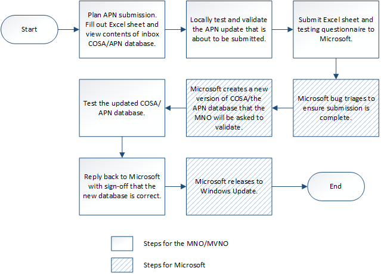

# Planning your COSA/APN database submission


Use the sections in this topic when you are planning to add a new APN to the baseline COSA/APN database that ships with WIndows, or update an existing one.

> [!IMPORTANT] 
> Starting in Windows 10 Version 1703, the APN database is replaced by a new format called COSA. Windows 8, Windows 8.1, and versions of Windows 10 before Version 1703 will continue to use the APN database while Windows 10 Version 1703 and later use COSA. For a list of frequently asked questions about COSA, see [COSA FAQ](cosa---faq.md).

## The APN update process


To connect to a mobile broadband network, the user is typically required to provide the following information:

-   On GSM networks, an Access Point Name (APN) such as "data.contoso.com" is required.

-   On CDMA networks, an access string that includes a special dial code such as "\#777" or a Network Access Identifier such as somebody@contoso.com is required.

-   A username and password for the network connection.

COSA and the APN connectivity database are updated by using Windows Update. The figure below shows the overall submission process.



## Complete the APN/COSA update spreadsheet


The APN update spreadsheet is used to gather the required information so Microsoft can update the COSA or the APN database appropriately. This spreadsheet is included in your submission request to Microsoft.

Use the following link to download the latest APN update spreadsheet: <http://go.microsoft.com/fwlink/p/?LinkId=257829>

The following table explains each entry in the spreadsheet. 

> [!NOTE] 
> In the Applicable Profile column of this table, "APN database only" means this entry will be used if targeting Windows 8, Windows 8.1, or versions of Windows 10 before 1703, and "COSA only" means this entry will be used if targeting Windows 10 Version 1703 or later. "APN database & COSA" means this entry is used in both situations. MOs should send all information to target all devices to Microsoft when submitting an APN update, if applicable.

<table>
<colgroup>
<col width="20%" />
<col width="20%" />
<col width="20%" />
<col width="20%" />
<col width="20%" />
</colgroup>
<thead>
<tr class="header">
<th>Applicable Profile</th>
<th>Column Name</th>
<th>Description</th>
<th>Optional or Required</th>
<th>Notes</th>
</tr>
</thead>
<tbody>
<tr class="odd">
<td><p>APN database & COSA</p></td>
<td><p>Update Type</p></td>
<td><p>Describes whether the APN Database entry is new or modified.</p>
<p>Possible values:</p>
<ul>
<li><p><strong>Add</strong> – A new entry</p></li>
<li><p><strong>Change</strong> – Update an existing entry</p></li>
<li><p><strong>Keep</strong> – Do not change the entry</p></li>
<li><p><strong>Delete</strong> – Delete the entry</p></li>
</ul></td>
<td><p>Required</p></td>
<td><p></p></td>
</tr>
<tr class="even">
<td><p>COSA only</p></td>
<td><p>Data Marketplace support</p></td>
<td><p>A true/false string describing whether the profile supported by the data marketplace.</p></td>
<td><p>Optional</p></td>
<td><p>Either &quot;True&quot; or &quot;False&quot;.</p></td>
</tr>
<tr class="odd">
<td><p>APN database & COSA </p></td>
<td><p>Country/Region</p></td>
<td><p>The country or region for the APN entry.</p></td>
<td><p>Required</p></td>
<td><p>Microsoft may change this to match how Windows refers to a particular country or region.</p></td>
</tr>
<tr class="even">
<td><p>APN database & COSA</p></td>
<td><p>Operator</p></td>
<td><p>The name of the operator. You do not need to include the country or region in this field.</p></td>
<td><p>Required</p></td>
<td><p>Ensure you use the same spelling and capitalization each time you submit an update for your APN entries.</p></td>
</tr>
<tr class="odd">
<td><p>APN database only</p></td>
<td><p>GSM Provider Name</p></td>
<td><p>A string of no more than 36 characters that should match the GSM provider name reported by your device. This column is case sensitive.</p></td>
<td><p>Optional</p></td>
<td></div>
<div> 
</div>
<p>This entry is only supported on Windows 8.1 and versions of Windows 10 before 1703.</p></td>
</tr>
<tr class="even">
<td><p>COSA only</p></td>
<td><p>SPN</p></td>
<td><p>An identifier string for the Service Provider Name (SPN)</p></td>
<td><p>Optional</p></td>
<td><p></p></td>
</tr>
<tr class="odd">
<td><p>COSA only</p></td>
<td><p>PNN</p></td>
<td><p>An identifier string for Public Land Mobile Network (PLMN) Network Name</p></td>
<td><p>Optional</p></td>
<td><p>Identifier string for MVNO</p></td>
</tr>
<tr class="even">
<td><p>COSA only</p></td>
<td><p>GID1</p></td>
<td><p>An identifier for Group Identifier Level 1 (GID1)</p></td>
<td><p>Optional</p></td>
<td><p>Identifier string for MVNO</p></td>
</tr>
<tr class="odd">
<td><p>APN database & COSA</p></td>
<td><p>MCC</p></td>
<td><p>A 3 digit MCC value used for GSM IMSI submissions.</p></td>
<td><p>Required for GSM providers</p></td>
<td><p></p></td>
</tr>
<tr class="even">
<td><p>APN database & COSA</p></td>
<td><p>MNC</p></td>
<td><p>A 2 or 3 digit MNC value used for GSM IMSI submissions.</p></td>
<td><p>Required for GSM providers</p></td>
<td><p></p></td>
</tr>
<tr class="odd">
<td><p>APN database & COSA</p></td>
<td><p>IMSI Range - Start</p></td>
<td><p>A 15-digit number that includes the MCC+MNC at the start of the number. The number should end in 00.</p></td>
<td><p>Optional</p></td>
<td><p>If this column and the <strong>IMSI Range - End</strong> column is left blank but the <strong>MCC</strong> and <strong>MNC</strong> columns are specified, the entire MCC+MNC range is covered.</p></td>
</tr>
<tr class="even">
<td><p>APN database & COSA</p></td>
<td><p>IMSI Range - End</p></td>
<td><p>A 15-digit number that includes the MCC+MNC at the start of the number. The number should end in 99.</p></td>
<td><p>Optional</p></td>
<td><p>If this column and the <strong>IMSI Range - Start</strong> column is left blank but the <strong>MCC</strong> and <strong>MNC</strong> columns are specified, the entire MCC+MNC range is covered.</p></td>
</tr>
<tr class="odd">
<td><p>APN database & COSA</p></td>
<td><p>ICCID Range - Start</p></td>
<td><p>A 19- or 20-digit number that starts with 89 (the ICCID issuer identifier number). The number should end in 00.</p></td>
<td><p>Optional</p></td>
<td><p></p></td>
</tr>
<tr class="even">
<td><p>APN database & COSA</p></td>
<td><p>ICCID Range - End</p></td>
<td><p>A 19- or 20-digit number that starts with 89 (the ICCID issuer identifier number). The number should end in 99.</p></td>
<td><p>Optional</p></td>
<td><p></p></td>
</tr>
<tr class="odd">
<td><p>APN databse only</p></td>
<td><p>CDMA Provider ID</p></td>
<td><p>A 5 digit number that should match the CDMA provider ID (also called SID) reported by your device.</p></td>
<td><p>Optional</p></td>
<td><div>

</div>
<div>
 
</div></td>
</tr>
<tr class="even">
<td><p>APN database only</p></td>
<td><p>CDMA Provider Name</p></td>
<td><p>A string of no more than 36 characters that should match the CDMA provider name reported by your device. This column is case sensitive.</p></td>
<td><p>Optional</p></td>
<td><div >
</div>
<div>
 
</div></td>
</tr>
<tr class="odd">
<td><p>APN database only</p></td>
<td><p>Cert Issuer Name</p></td>
<td><p>The Cert Issuer Name of your signing certificate used for operator XML provisioning.</p></td>
<td><p>Optional</p></td>
<td><div>
</div>
<div> 
</div>
<p>If specified, you must also specify the Cert Subject Name and Carrier GUID.</p></td>
</tr>

<tr class="even">
<td><p>APN database only</p></td>
<td><p>Cert Subject Name</p></td>
<td><p>The Cert Subject Name of your signing certificate used for operator XML provisioning.</p></td>
<td><p>Optional</p></td>
<td><div>
</div>
<div>
 
</div>
<p>If specified, you must also specify the Cert Issuer Name and Carrier GUID.</p></td>
</tr>
<tr class="odd">
<td><p>APN database only</p></td>
<td><p>Carrier GUID</p></td>
<td><p>The self-assigned GUID that is used in future operator XML provisioning packages.</p></td>
<td><p>Optional</p></td>
<td><div>
</div>
<div>
 
</div>
<p>If specified must also specify the Cert Subject Name and Cert Issuer Name.</p></td>
</tr>
<tr class="even">
<td><p>APN database & COSA</p></td>
<td><p>Account Experience URL</p></td>
<td><p>Used by Windows Connection Manager if the user does not have an active plan and tries to connect to your network.</p></td>
<td><p>Optional</p></td>
<td><p>Helps improve the plan acquisition experience.</p></td>
</tr>
<tr class="odd">
<td><p>APN database & COSA</p></td>
<td><p>Connection Information – Friendly Name</p></td>
<td><p>A name for this APN entry that is understandable and meaningful to subscribers.</p></td>
<td><p>Optional</p></td>
<td><p>Shows up in Windows Connection Manager in cases where Windows cannot automatically connect to the network.</p></td>
</tr>
<tr class="even">
<td><p>APN database & COSA</p></td>
<td><p>Connection Information – Access String</p></td>
<td><p>For GSM networks, this is an APN such as data.contoso.com.</p>
<p>For CDMA networks, this is an access string that includes a special dial code such as #777 or an Network Access Identifier such as example@contoso.com.</p></td>
<td><p>Required</p></td>
<td><p>The access string can be blank.</p></td>
</tr>
<tr class="odd">
<td><p>APN database & COSA</p></td>
<td><p>IP Type</p></td>
<td><p>A string specifying the network protocol of the connection. Available values are:</p>
<ul>
<li>IPv4</li>
<li>IPv6</li>
<li>IPv4v6</li>
<li>IPv4v6xlat</li>
</ul></td>
<td><p>Optional</p></td>
<td><p>If a value is not specified, the default value is &quot;IPv4&quot;.</p></td>
</tr>
<tr class="even">
<td><p>COSA only</p></td>
<td><p>AlwaysOn</p></td>
<td><p></p></td>
<td><p>Required</p></td>
<td><p></p></td>
</tr>

<tr class="odd">
<td><p>COSA only</p></td>
<td><p>Purpose groups</p></td>
<td><p>A string specifying the purposes of the connection by a comma-separated list of GUIDs representing purpose values. </p></td>
<td><p>Optional</p></td>
<td><p>The following purpose values are available:</p>
<ul>
  <li><b>Internet</b> - 3E5545D2-1137-4DC8-A198-33F1C657515F</li>
  <li><b>MMS</b> - 53E2C5D3-D13C-4068-AA38-9C48FF2E55A8</li>
  <li><b>IMS</b> - 474D66ED-0E4B-476B-A455-19BB1239ED13</li>
  <li><b>SUPL</b> - 6D42669F-52A9-408E-9493-1071DCC437BD</li>
  <li><b>Purchase</b> - TBD</li>
  <li><b>Administrative</b> - TBD</li>
  <li><b>Application</b> - TBD</li>
</ul>
</td>
</tr>

<tr class="odd">
<td><p>APN database & COSA</p></td>
<td><p>Connection Information – User Name</p></td>
<td><p>The user name used to connect to your APN. This column is case sensitive.</p></td>
<td><p>Optional</p></td>
<td><p></p></td>
</tr>
<tr class="even">
<td><p>APN database & COSA</p></td>
<td><p>Connection Information - Password</p></td>
<td><p>The password used to connect to your APN. This column is case sensitive.</p></td>
<td><p>Optional</p></td>
<td><p></p></td>
</tr>
<tr class="odd">
<td><p>APN database only</p></td>
<td><p>Connection Information – Purchase Flag</p></td>
<td><p>Possible values:</p>
<ul>
<li><p><strong>Y</strong> – if the APN is provisioning or purchase</p></li>
<li><p><strong>N</strong> – if the APN is not provisioning or purchase</p></li>
</ul></td>
<td><p>Required</p></td>
<td><p>If <strong>Purchase Flag</strong> column is <strong>Y</strong>, the <strong>Connect Flag</strong> column must be <strong>N</strong>.</p></td>
</tr>
<tr class="even">
<td><p>APN database only</p></td>
<td><p>Connection Information – Connect Flag</p></td>
<td><p>Possible values:</p>
<ul>
<li><p><strong>Y</strong> – if the APN is provisioning or purchase</p></li>
<li><p><strong>N</strong> – if the APN is not provisioning or purchase</p></li>
</ul></td>
<td><p>Required</p></td>
<td><div>
</div>
<div>
 
</div>
<p>If <strong>Connect Flag</strong> column is <strong>Y</strong>, the <strong>Purchase Flag</strong> column must be <strong>N</strong>.</p></td>
</tr>
<tr class="odd">
<td><p>APN database only</p></td>
<td><p>Connection Information – Auto-Connect Order</p></td>
<td><p>Windows tries connections to the APNs provided by the operator and marked as “auto-connect” in the APN database until it successfully connects to the mobile network. If all auto-connect attempts fail, Windows will show a prompt allowing the user to pick an APN or enter a custom APN.</p></td>
<td><p>Optional</p></td>
<td><div>
</div>
<div>
 
</div>
<p>If you have more than one access string for an operator, this column must start with 1. This is needed for Windows to try several APN entries that share either an IMSI range, ICCID range, CDMA provider ID, or CDMA provider name when the user tries to connect.</p></td>
</tr>
<tr class="even">
<td><p>APN database & COSA</p></td>
<td><p>Auth Protocol</p></td>
<td><p>Specifies the authentication protocol to be used for activating a Packet Data Protocol (PDP) context.</p>
<p>Possible values:</p>
<ul>
<li><p><strong>NONE</strong> – No authentication protocol is required</p></li>
<li><p><strong>PAP</strong> – PAP authentication is required.</p></li>
<li><p><strong>CHAP</strong> – CHAP authentication is required.</p></li>
<li><p><strong>MsCHAPV2</strong> –MSCHAPv2 is authentication is required.</p></li>
</ul></td>
<td><p>Optional</p></td>
<td><p>This entry is only supported on Windows 8.1 and Windows 10.</p></td>
</tr>
<tr class="odd">
<td><p>APN database & COSA</p></td>
<td><p>Compression</p></td>
<td><p>Specifies if compression will be used at the data link for header and data transfer.</p>
<p>Possible values:</p>
<ul>
<li><p><strong>ENABLE</strong> – Compression is enabled</p></li>
<li><p><strong>DISABLE</strong> – Compression is not enabled</p></li>
</ul></td>
<td><p>Optional</p></td>
<td><p>This entry is only supported on Windows 8.1 and Windows 10.</p></td>
</tr>
</tbody>
</table>

 

### Considerations when completing the spreadsheet

When submitting an APN update, please note the following:

-   Changes provided by the OEM will take precedence over the default COSA/APN database included in Windows.

-   The **Country/Region** and the **Operator** columns in the spreadsheet are used to determine whether this is an update to an existing APN or a request for a new APN. If the **Country/Region** and the **Operator** fields match content that already exists in the APN database, the entries will be deleted and replaced with the entries that you list in your spreadsheet.

    >[!NOTE]  
    >Because the previous entries will be deleted, it is important to list all APNs for the **Operator** and **Country/Region** combination, including the ones that are not changing.

    For example, when the following values are entered in a row in the spreadsheet:

      ```syntax
      Operator: Contoso
      Country/Region: Argentina
      ```

    All entries currently in the COSA or APN connectivity database that match the following format will be deleted and replaced with the row in your spreadsheet for that **Operator** and **Country/Region** combination:

    ```syntax
    <Operator name="Contoso (Argentina)">
    ```

-   If the **Operator** and **Country/Region** columns do not match content that already exists in COSA or the APN database, a new APN is created.

    For example, if the following values are entered in a row in the spreadsheet:

    ```syntax
    Operator: Contoso
    Country/Region: Argentina
    ```

    If it does not exist in the appropriate connectivity database, a new entry is added after your submission is accepted that looks like the following:

    ```syntax
    <Operator name="Contoso (Argentina)">
    ```     

> [!NOTE]
> Please note the following **only** when submitting an APN database update using apndatabase.xml when targeting Windows 8, Windows 8.1, or versions of Windows 10 before 1703.
- The operator identification data is stored in the APN database as encoded Hardware IDs.
  -   For GSM networks, you can have a separate database entry for each unique combination of MCC/MNC pair. If you are a Mobile Virtual Network Operator (MVNO) and do not have a unique MCC/MNC pair, you can specify one or more ranges of IMSIs or SIM ICC IDs currently leased from a Mobile Network Operator (MNO).
  -   For CDMA networks, you can have a new database entry for each Provider ID (also called a SID) or Provider Name.
  -   Certificate information for account provisioning metadata includes **Cert Issuer Name** and **Cert Subject Name** and is used to verify that account provisioning provided by a purchase website comes from the an authorized web service. If the certificate information stored here matches what the purchase website presents, Windows will allow that website to push network-specific configuration information to the PC.

-   On each row of the spreadsheet that is submitted, you must specify only one of the following:

    -   An MCC+MNC with a blank IMSI range

    -   An MCC+MNC with a specific IMSI range

    -   An MCC+MNC with a specific ICCID range

    -   An MCC+MNC with a specific GSM provider name

> [!NOTE]
> In addition to the above, when submitting an APN database update using apndatabase.xml, the following following values must be included:       
    - A CDMA Provider name
    - A CDMA Provider ID (SID)

-   If you have created a website for setting up Mobile Broadband service, it is important to provide the Account Experience URL and certificate data.

> [!NOTE]
> Please note the following **only** when submitting an APN database update using apndatabase.xml when targeting Windows 8, Windows 8.1, or versions of Windows 10 before 1703.
- Certificate information for account provisioning metadata includes **Cert Issuer Name** and **Cert Subject Name** and is used to verify that account provisioning provided by a purchase website comes from an authorized web service. If the certificate information stored here matches what the purchase website presents, Windows will allow that website to push network-specific configuration information to the PC. 

-   Access strings used for plan purchase (**Purchase Flag**=**Y**) can be one of the following:

    -   For GSM networks, an APN with a specified **User Name** and **Password** used for purchasing the subscription.

    -   For CDMA networks, a Network Access Identifier (NAI) is used for purchasing the subscription.

-   Access strings used for Internet connectivity (**Connect Flag**=**Y**) can be one of the following:

    -   For GSM networks, an APN with a specified **User Name** and **Password** used to connect to the Internet.

    -   For CDMA networks, a Network Access Identifier (NAI) is used to connect to the Internet.     

> [!NOTE]
> Please note the following **only** when submitting an APN database update using apndatabase.xml when targeting Windows 8, Windows 8.1, or versions of Windows 10 before 1703.
- The auto-connect order must be unique for the **Operator** and **Country/Region** combination with the same IMSI, ICCID range, CDMA provider name, or CDMA provider ID value.

  For example, if Contoso had four APNs for MCC+MNC value 100 101, it would list each APN entry in a new row in the spreadsheet and number the auto-connect order starting with 1 up to 4 for each of those four entries because they share the same IMSI range. If Contoso had another set of APNs for MCC+MNC value 100 102, it should start the auto-connect ordering at 1 for that set of APNs.

  If you don’t provide an auto-connect order, Windows will ask the user to choose an APN, which could introduce user error. We recommend that the auto-connect order be specified. In this case, the user sees the **Friendly Name** of the APN in Windows Connection Manager.

Once your spreadsheet is complete, you can test the APNs you’ve entered. 

[Send comments about this topic to Microsoft](mailto:wsddocfb@microsoft.com?subject=Documentation%20feedback%20%5Bp_mb\p_mb%5D:%20Planning%20your%20APN%20database%20submission%20%20RELEASE:%20%281/18/2017%29&body=%0A%0APRIVACY%20STATEMENT%0A%0AWe%20use%20your%20feedback%20to%20improve%20the%20documentation.%20We%20don't%20use%20your%20email%20address%20for%20any%20other%20purpose,%20and%20we'll%20remove%20your%20email%20address%20from%20our%20system%20after%20the%20issue%20that%20you're%20reporting%20is%20fixed.%20While%20we're%20working%20to%20fix%20this%20issue,%20we%20might%20send%20you%20an%20email%20message%20to%20ask%20for%20more%20info.%20Later,%20we%20might%20also%20send%20you%20an%20email%20message%20to%20let%20you%20know%20that%20we've%20addressed%20your%20feedback.%0A%0AFor%20more%20info%20about%20Microsoft's%20privacy%20policy,%20see%20http://privacy.microsoft.com/default.aspx. "Send comments about this topic to Microsoft")
