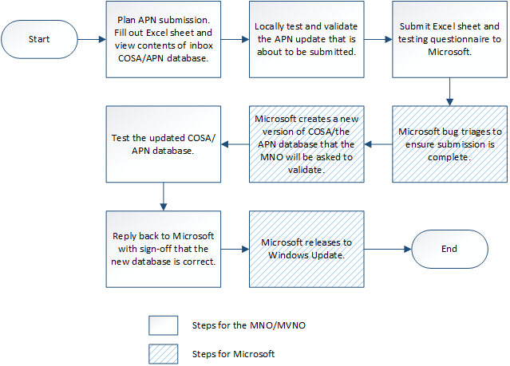

# Planning your desktop COSA/APN database submission

> [!IMPORTANT]
> Starting in Windows 10, version 1703, the APN database is replaced by a new format called COSA. Windows 8, Windows 8.1, and versions of Windows 10 before version 1703 will continue to use the APN database while Windows 10, version 1703 and later use COSA. For more information about COSA, see [COSA overview](cosa-overview.md).

Use the sections in this topic when you are planning to add a new APN to the baseline COSA/APN database that ships with Windows desktop devices, or update an existing one.

## The APN update process

To connect to a mobile broadband network, the user is typically required to provide the following information:

- On GSM networks, an Access Point Name (APN) such as "data.contoso.com" is required.

- On CDMA networks, an access string that includes a special dial code such as "\#777" or a Network Access Identifier such as somebody@contoso.com is required.

- A username and password for the network connection.

COSA and the APN connectivity database are updated by using Windows Update. The figure below shows the overall submission process.



## Complete the APN/COSA update spreadsheet

The APN update spreadsheet is used to gather the required information so Microsoft can update the COSA or the APN database appropriately. This spreadsheet is included in your submission request to Microsoft. MOs should send all information to target all devices to Microsoft when submitting an APN update, if applicable.

Use the following link to download the latest APN update spreadsheet: <https://go.microsoft.com/fwlink/p/?linkid=851213>

For more info about the settings in the APN update spreadsheet, see [Desktop COSA/APN database settings](desktop-cosa-apn-database-settings.md).

## Considerations when completing the spreadsheet

### APN database considerations

Note the following only when submitting an APN update using apndatabase.xml, for Windows 8, Windows 8.1, or versions of Windows 10 before Windows 10, version 1703.

- The operator identification data is stored in the APN database as encoded Hardware IDs.
  -   For GSM networks, you can have a separate database entry for each unique combination of MCC/MNC pair. If you are a Mobile Virtual Network Operator (MVNO) and do not have a unique MCC/MNC pair, you can specify one or more ranges of IMSIs or SIM ICC IDs currently leased from a Mobile Network Operator (MNO).
  -   For CDMA networks, you can have a new database entry for each Provider ID (also called a SID) or Provider Name.
  -   Certificate information for account provisioning metadata includes **Cert Issuer Name** and **Cert Subject Name** and is used to verify that account provisioning provided by a purchase website comes from the an authorized web service. If the certificate information stored here matches what the purchase website presents, Windows will allow that website to push network-specific configuration information to the PC.

- When submitting an APN database update using apndatabase.xml, the following values must be included:       
    - A CDMA Provider name
    - A CDMA Provider ID (SID)

- Certificate information for account provisioning metadata includes **Cert Issuer Name** and **Cert Subject Name** and is used to verify that account provisioning provided by a purchase website comes from an authorized web service. If the certificate information stored here matches what the purchase website presents, Windows will allow that website to push network-specific configuration information to the PC. 

- The auto-connect order must be unique for the **Operator** and **Country/Region** combination with the same IMSI, ICCID range, CDMA provider name, or CDMA provider ID value.

  For example, if Contoso had four APNs for MCC+MNC value 100 101, it would list each APN entry in a new row in the spreadsheet and number the auto-connect order starting with 1 up to 4 for each of those four entries because they share the same IMSI range. If Contoso had another set of APNs for MCC+MNC value 100 102, it should start the auto-connect ordering at 1 for that set of APNs.

  If you don’t provide an auto-connect order, Windows will ask the user to choose an APN, which could introduce user error. We recommend that the auto-connect order be specified. In this case, the user sees the **Friendly Name** of the APN in Windows Connection Manager.

### APN database and COSA considerations

Note the following for both COSA and APN database.

- Changes provided by the OEM will take precedence over the default COSA/APN database included in Windows.

- The **Country/Region** and the **Operator** entries in the spreadsheet are used to determine whether this is an update to an existing APN or a request for a new APN. If the **Country/Region** and the **Operator** fields match content that already exists in the APN database, the entries will be deleted and replaced with the entries that you list in your spreadsheet.

    >[!NOTE]
    >Because the previous entries will be deleted, it is important to list all APNs for the **Operator** and **Country/Region** combination, including the ones that are not changing.

    For example, when the following values are entered in a row in the spreadsheet:

    ```syntax
     Operator: Contoso
     Country/Region: Argentina
    ```

    All entries currently in the COSA or APN connectivity database that match the following format will be deleted and replaced with the row in your spreadsheet for that **Operator** and **Country/Region** combination:

    ```syntax
    <Operator name="Contoso (Argentina)">
    ```

-   If the **Operator** and **Country/Region** entries do not match content that already exists in COSA or the APN database, a new APN is created.

    For example, if the following values are entered in a row in the spreadsheet:

    ```syntax
    Operator: Contoso
    Country/Region: Argentina
    ```

    If it does not exist in the appropriate connectivity database, a new entry is added after your submission is accepted that looks like the following:

    ```syntax
    <Operator name="Contoso (Argentina)">
    ```

-   On each row of the spreadsheet that is submitted, you must specify only one of the following:

    -   An MCC+MNC with a blank IMSI range

    -   An MCC+MNC with a specific IMSI range

    -   An MCC+MNC with a specific ICCID range

    -   An MCC+MNC with a specific GSM provider name

-   If you have created a website for setting up Mobile Broadband service, it is important to provide the Account Experience URL and certificate data.

-   Access strings used for plan purchase (**Purchase Flag**=**Y**) can be one of the following:

    -   For GSM networks, an APN with a specified **User Name** and **Password** used for purchasing the subscription.

    -   For CDMA networks, a Network Access Identifier (NAI) is used for purchasing the subscription.

-   Access strings used for Internet connectivity (**Connect Flag**=**Y**) can be one of the following:

    -   For GSM networks, an APN with a specified **User Name** and **Password** used to connect to the Internet.

    -   For CDMA networks, a Network Access Identifier (NAI) is used to connect to the Internet. 

Once your spreadsheet is complete, you can test the APNs you’ve entered. For the next steps in testing your APN update, see [Testing your desktop COSA/APN database submission](testing-your-desktop-cosa-apn-database-submission.md).

