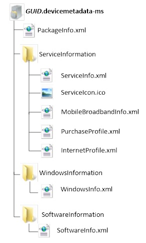
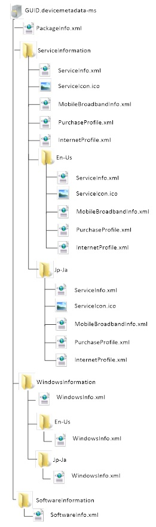

# Service metadata

[!include[MBAE deprecation warning](mbae-deprecation-warning.md)]

You can create and submit a service metadata package to create an experience that is deeply integrated with Windows. When Windows detects mobile broadband hardware that matches the operator’s service metadata package, it automatically downloads the service metadata and the specified mobile broadband app.

Service metadata contains the information that describes a service, including the following:

-   The service provider name

-   One or more service categories

-   Mobile broadband-specific information

-   Mobile broadband app

-   Mobile broadband profiles

-   Trusted certificates for provisioning XML

-   [DeviceNotificationHandler](devicenotificationhandler.md) element

-   [PrivilegedApplications](privilegedapplications.md) element

The information in the metadata is used to customize aspects of the Windows 8, Windows 8.1, and Windows 10 user experience and provide integration with a mobile broadband app, previously known as a mobile operator app.

A service metadata package consists of multiple XML documents stored within a .devicemetadata-ms file. Each document specifies various components of the service’s attributes. These XML documents provide Windows Connection Manager with customizations that appear to the user, as well as network configuration information.

For reference information about the XML documents in a service metadata package, see [Service metadata package schema reference](service-metadata-package-schema-reference.md).

## Service metadata contents

The following summary describes some of the most interesting fields that are contained and defined inside a service metadata package:

- **Hardware IDs**  
  For a GSM network, you can submit a metadata package that describes the IMSI or ICCID ranges against which you want your service metadata package to match. If you are an MVNO, you can specify one or more ranges of IMSIs or SIM ICC IDs that you have leased from an MNO. For a CDMA network, you can submit a package by using Provider ID (SID/NID) or Provider Name. The hardware IDs correspond to the [HardwareID](hardwareid.md) element in the service metadata package schema. For more information about how to plan your Hardware Identification (HWID) ranges for MNO and MVNO scenarios, see [Delivering experiences for MVNOs](delivering-experiences-for-mvnos.md)

- **Service number**  
  The unique ID for the mobile broadband service provider. This GUID is also used to identify the operator when using Account Provisioning Metadata. If you update the device metadata package, this GUID must remain the same. The service number corresponds to the [ServiceNumber](servicenumber.md) element in the service metadata package schema.

- **Operator logo**   
  A custom logo that appears in Windows Connection Manager next to your network entry. (The logo is hidden when the user is on a roaming network.) The operator logo corresponds to the [ServiceIconFile](serviceiconfile.md) element in the service metadata package schema. For more information about the logo requirements, see [Service Icon Requirements](https://msdn.microsoft.com/library/windows/hardware/dn236416).  
  > [!IMPORTANT]
  > In Windows 10, version 1709 and later, this field has been replaced by branding through COSA. Fields in COSA for branding are described on [Planning your desktop COSA/APN database submission](planning-your-desktop-cosa-apn-database-submission.md). If you are targeting versions of Windows before Windows 10, version 1709, you will still create a metadata package as described in this section. For more information about COSA, see [COSA overview](cosa-overview.md). 

- **Mobile broadband app**  
  A UWP device app that is automatically downloaded and applied to the computer. This app can provide key experiences such as plan purchase, data usage, and help and support, and can highlight value-added services.

- **MB Purchase Profile**  
  Purchase profile that is used for establishing limited connectivity for purchasing a subscription.

  If you are a GSM operator who has only one Purchase APN for all subscribers, you can use the service metadata to provision that to the computer. If you have multiple Purchase APNs, you should use account provisioning metadata to set the appropriate purchase APN. Or, you can do nothing and use the entries that are stored in the APN database to provide APN connectivity information.

- **MB Internet profile**  
  Every mobile broadband subscription can have one default profile that is used to connect to the home network operator. The Windows Connection Manager uses this profile for auto-connecting to the network.

  If you are a GSM operator who has only one Internet APN for all subscribers, you can use the service metadata to provision the computer. If you have multiple Internet APNs, you should use account provisioning metadata to set the appropriate internet APN. Or, you can do nothing and use the entries that are stored in the APN database to provide APN connectivity information.

- **Certificate data**  
  Certificate information used for provisioning. This includes Certificate Issuer Name and Subject Name. This information is used to ensure that account provisioning operations that are initiated by a website are issued by a trusted operator.

- **Custom operator name**  
  The mobile broadband device typically provides the operator name, which Windows shows in Windows Connection Manager. You can override this name by specifying a custom name in metadata. This name displays only if the user is on a home network and is not on a roaming network. A displayed roaming network name is based on information that is received from the device. This corresponds to the [ServiceProvider](serviceprovider.md) element in the service package metadata schema.  
  > [!IMPORTANT]
  > In Windows 10, Version 1709 and later, this field has been replaced by branding through COSA. Fields in COSA for branding are described on [Planning your desktop COSA/APN database submission](planning-your-desktop-cosa-apn-database-submission.md). If you are targeting versions of Windows before Windows 10, Version 1709, you will still create a metadata package as described in this section. For more information about COSA, see [COSA overview](cosa-overview.md). 

- **Device notification handler**  
  In general, an app must be run by the user at least one time before it can register work items with the System Event broker. However, mobile broadband apps might need to receive important events before the user can run the app. You can specify the [DeviceNotificationHandler](devicenotificationhandler.md) element in service metadata, which Windows will use to register some critical events. For more information about SMS notifications, see [Delivering experiences for MVNOs](delivering-experiences-for-mvnos.md).

- **List of privileged apps with access to mobile broadband restricted interfaces**  
  Mobile Broadband APIs and interfaces (including Account Provisioning and SMS) are restricted and available to mobile broadband apps only. A list of privileged apps that have access to these privileged APIs can be specified in the service metadata package in the [PrivilegedApplications](privilegedapplications.md) element. Privileged apps can be debugging or test apps; they are not required to be distributed through the Microsoft Store.

## Service Metadata Package Structure

The components of a service metadata package are stored in a compressed cabinet file and must have a file extension of **.devicemetadata-ms**. Service metadata packages use this file extension because they use the same underlying platform as device metadata packages. Before you create the **.devicemetadata-ms** file, you must first create a globally unique identifier (GUID) for the metadata package. Then, you must use the following naming convention when you create the .devicemetadata-ms file: **&lt;GUID&gt;.devicemetadata-ms**.

**Note**  
Although the usual file extension of a cabinet file is **.cab**, the file extension for a service metadata package file must be **.devicemetadata-ms**. This is intended to underscore the fact that end-users must not decompress or modify these packages.

 

There are two types of service metadata packages: a single locale service metadata package and a multiple locale service metadata package.

### Single Locale Service Metadata Package

The localizable resources in the service metadata package are the operator name that appears in Windows Connection Manager and the service icon that appears next to it. If you do not need to localize your name or change your icon based on locale information from the PC, create a single locale service metadata package. Regardless of what locale the user is using on their PC, they will get the operator name and service icon defined in the single locale service metadata package.

A single locale service metadata package must have the following file structure:

Some considerations for a single locale metadata package:

-   The icon file can have any file name. However, the individual XML documents must be named **PackageInfo.xml**, **ServiceInfo.xml**, **WindowsInfo.xml**, and **SoftwareInfo.xml**.

-   The name of the **MobileBroadbandInfo.xml** file is defined in the **ServiceInfo.xml**. You should use the names listed in this document for that file.

-   The **.devicemetadata-ms** file cannot include “{“ or “}” in the name. The GUID for each metadata package file name must be unique. When you create a new or revised service metadata package, you must create a new GUID, even if the changes are minor.

-   Windows recognizes service metadata packages with a file extension of **.devicemetadata-ms**.

### Multiple Locale Service Metadata Package Structure

A service metadata package supports multiple locale files in one package. If you support more than one locale for your service, you can put multiple locale files into one service metadata package.

You can use a multiple local service metadata package if you want to show a localized name for your service in Windows Connection Manager network list or to show a different logo in Windows Connection Manager for your network. Windows will display the localized network name and logo based on the system preferred language, which is usually configured during Windows Setup. Even if the current user’s language is different from the system preferred language, the icon and network name always will show up in the system preferred language. If the service metadata package does not include a locale, the language neutral description from the root of the service metadata package is displayed. For most users their language will match the system preferred language.

A multiple locale service metadata package must have the following file structure:

Some considerations for a multiple locale metadata package:

-   Create a locale name folder in each folder and put the XML file or relevant file in the locale name folder.

-   You still must have the top-level XML file and relevant files, such as the icon file, at the top level of each folder. This provides a fallback mechanism when the locale is not included in your service metadata package.

-   Ensure that all required files and the fields within those files are completely filled out inside each locale-specific folder that you create. This is in addition to the content in the top level of each folder. For example, the [ServiceNumber](servicenumber.md) element in ServiceInfo.xml must be filled out and duplicated in the top-level folder and in every locale-specific folder that you create. Failing to do this will cause errors.

-   The SoftwareInformation XML document does not support multiple locales because you cannot specify different SoftwareInfo.xml files per locale.

## Service metadata submission and maintenance

For more information about how to submit service metadata packages to the Windows Dev Center Dashboard – Hardware, see [Developer guide for creating service metadata](developer-guide-for-creating-service-metadata.md).

It is important to keep metadata packages up-to-date in terms of how they are described and which IMSI and ICCID or CDMA Provider Name or SID values they match. This can require an MNO or MVNO to implement a new workflow that is part of SIM or device acquisition to track new orders of SIMs and the MNO or MVNO to which those ICCIDs or IMSIs are being provided.

It is a best practice to avoid making frequent changes to your service metadata by reserving ICCID or IMSI ranges (or CDMA SIM/Provider name) for the MNO and MVNO in advance, so that when new SIMs (or CDMA devices) are procured, they are already accounted for in your service metadata package.

If you need to update your service identifiers that are registered on the Windows Dev Center hardware dashboard, see [Service identifier ownership updates](service-identifier-ownership-updates.md).

Metadata updates are silently applied based on internal Windows logic (typically every eight days) when Windows queries WMIS whether it has any updated metadata updates.

The app should be designed to deal with a previous version of the metadata to which it refers, until the latest metadata is applied to the system.

[Designing the user experience of a mobile broadband app](designing-the-user-experience-of-a-mobile-broadband-app.md) provides guidelines about how to design the user experience to address common error cases, such as when the device is missing or not recognized.

 

 

