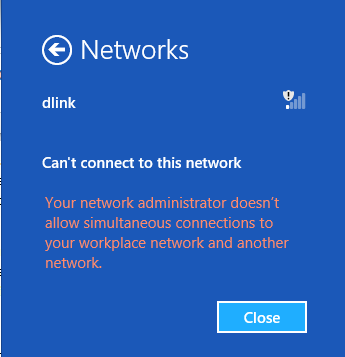

# Understanding and configuring Windows Connection Manager

Automatic connection management, introduced in Windows 8, makes connection decisions by looking at Ethernet, Wi-Fi, and mobile broadband interfaces. These decisions lead to automatic connect and disconnect actions on Wi-Fi and mobile broadband interfaces.

**Note**  
Windows responds to Ethernet connections but does not automatically manage Ethernet connections.

 

This topic describes how Windows automatically manages physical wireless connectivity, and does not consider these connections:

-   Dial-up connections, such as modems

-   Pure virtual interfaces, such as VPNs or tunneled IP connections

## Connection management policies

Windows 8, Windows 8.1, and Windows 10 include a number of policies to control connection management. These policies are not exposed in the Windows user interface but can be configured by using the [WcmSetProperty](https://msdn.microsoft.com/library/windows/desktop/hh437602.aspx) API or Group Policy.

### Minimize simultaneous connections

This policy is configured using the **fMinimizeConnections** Group Policy. It is on by default for Windows 8, Windows 8.1, and Windows 10. If this policy is disabled, the behavior is similar to that for Windows 7 in which each interface connects to the most preferred network in range, regardless of the connectivity state of other interfaces.

If this policy is enabled, Windows attempts to maintain the smallest number of concurrent connections that offer the best available level of connectivity. Windows maintains connectivity to the following networks:

-   Any Ethernet network

-   Any networks that were manually connected during the current user session

-   The most preferred connection to the Internet

-   The most preferred connection to the Active Directory domain, if the PC is joined to a domain

All remaining networks are soft-disconnected, as described in the next section. This is also used to evaluate available networks that are not connected. Windows will not connect to a new network from which it would immediately soft-disconnect.

### Soft disconnect

Soft disconnect works the following way:

1.  When Windows decides that a network should no longer be connected, it does not immediately disconnect. Abrupt disconnections degrade the user experience without providing an appreciable benefit, and are avoided when possible.

2.  As soon as Windows decides to soft-disconnect an interface, it informs the TCP stack that the network should no longer be used. The existing TCP sessions will continue uninterrupted but new TCP sessions will use this interface only if explicitly bound or if no other interface routes to the desired destination.

3.  This notification to the TCP stack generates a network status change. Networking applications should listen for these events and proactively move their connections to the new network, if possible.

4.  Windows then checks the traffic level on the interface every thirty seconds. If the traffic level is above a certain threshold, no further action is taken. This allows ongoing active use of the interface, such as from a file transfer or VoIP call, to avoid disruption.

5.  When the traffic drops below this threshold, the interface will be disconnected. Applications that keep long-lived idle connections, such as an e-mail client, may be interrupted and should re-establish their connections over a different interface.

### Initial connection

Windows automatically connects, and then immediately soft-disconnects in one circumstance. When the PC first starts or resumes from standby, all interfaces simultaneously attempt to connect in order to ensure that the user obtains network connectivity as quickly as possible. If multiple interfaces successfully connect, Windows begins soft-disconnecting interfaces immediately.

### Prohibit interconnect between domain and non-domain networks

This policy is off by default for Windows 8, Windows 8.1, and Windows 10. When this policy is enabled, Windows attempts to prevent a PC from being interconnected between a domain network and a non-domain network. Enterprise administrators may use this when they are concerned about potential security breaches using a multi-homed machine as an attack point.

When all connected networks route to the domain, or when no connected network routes to the domain, this policy does not affect system behavior.

### Multiple wireless networks

Many Windows 8, Windows 8.1, or Windows 10 mobile devices will have an external Internet connection available to them at all times, even when in range of their enterprise Wi-Fi networks. When this policy is enabled, users may freely connect to either their public mobile broadband network or to the enterprise’s private Wi-Fi network and switch between them at will. However, manually connecting one will automatically cause the other to disconnect immediately.

### Ethernet

Because Windows 8, Windows 8.1, or Windows 10 cannot automatically connect or disconnect Ethernet cables to the PC, it can only enforce the policy by allowing or prohibiting wireless connections. When a PC has an Ethernet connection to the domain network, wireless networks that do not connect to the domain cannot be connected, and vice versa. Attempts to do so will result in the following error:

For PCs that have multiple Ethernet ports, Windows cannot prevent an interconnection that is created by physically connecting the PC to two different Ethernet networks.

### Effect on soft disconnect

Because prohibiting interconnections is a security consideration, any disconnections that comply with this policy take effect immediately, even if there is ongoing activity. Users will experience a connectivity disruption when transitioning between public and corporate networks, even if the two networks overlap.

For example, a user engaged in a VoIP call over a mobile broadband network with a laptop docked to a corporate Ethernet connection will lose the call, although the app may be able to automatically recover over the new connection. If the policy was not enabled, Windows would instead soft-disconnect the mobile broadband connection by waiting for the call to complete. On the other hand, a VoIP call started over a corporate Wi-Fi network will not be disrupted when docked to the corporate network because both networks connect to the domain. The Wi-Fi network is disconnected after the call is completed.

### Prohibit roaming on mobile broadband networks

This policy prevents Windows from connecting to mobile broadband networks that are in a roaming state. By default, this policy is disabled, and the user may choose to manually connect to a mobile broadband network while roaming or to enable automatically connecting to such a network. When enabled, the user cannot choose a roaming mobile broadband network from Connection Manager.

## Network preferences

When considering which multiple connections to maintain, Windows uses a number of traits to determine the preferred networks. This is used only when determining whether to maintain a connection to a given interface, not for routing. If a connected interface is not in the process of being soft disconnected, routing is determined by the metric in the routing table. If the route metric is not specified manually, Windows will automatically assign a route metric based on the link speed of the adapter.

### Connection priorities

Windows prioritizes connections in the following order:

1.  Ethernet networks

2.  Networks manually connected during the current user session

3.  Networks that connect to both the Internet and the Active Directory domain to which the PC is joined

4.  Signal strength of the currently connected Wi-Fi network

5.  The PC’s preferred network list

Even though the link speed influences routing behavior among currently connected interfaces, Windows does not make connectivity decisions based on the link speed or throughput of a network. It is not possible to configure Windows to change its connection preference between a mobile broadband network and a Wi-Fi network based on the current speed of the mobile broadband network. If both are connected, the user or a desktop app can change route metrics to influence routing preferences.

### Signal strength

If Windows detects that the currently connected Wi-Fi network has very low signal strength, it may choose to connect a mobile broadband network (if permitted by policy) to avoid disrupting network connectivity. This helps to smooth the transition when a user is moving away from a wireless access point.

Windows does not disconnect a more preferred Wi-Fi network until the signal strength cannot maintain the connection. If signal strength improves, Windows may soft-disconnect the mobile broadband adapter.

### Preferred network list

In most situations, the preferred network list determines which wireless network profiles Windows will use to connect. Prior to Windows 8, this list applied to Wi-Fi networks only. In Windows 8, Windows 8.1, and Windows 10, it can also include mobile broadband networks.

### Automatic generation

Windows 8, Windows 8.1, and Windows 10 automatically update the preferred network list based on user actions. Any manual connection or disconnection updates the network list so that the same behavior will occur automatically in the future.

The following user actions modify the preferred network list:

-   **Initially connecting to a network** The new network is added to the network list. The user specifies whether the network will automatically connect in the future.

    -   Connecting to a new Wi-Fi network for the first time makes the network the most preferred network in the list.

    -   Connecting to a new mobile broadband network for the first time makes the network the least preferred network in the list.

-   **Manually connecting to a Wi-Fi network** Any other Wi-Fi network in range that is higher on the list is moved below the newly connected network in the list. The user specifies whether the network automatically connects in the future.

-   **Disconnecting from a network** Windows will not automatically connect to this network in the future. It remains on the network list in case the user modifies this setting in the future.

### Group Policy

Wi-Fi profiles created by Group Policy are at the top of the network list. The user may manually disconnect from these networks or manually connect to other networks, but these networks remain at the highest position on the network list until removed by Group Policy.

### Carrier-provisioning metadata

Mobile broadband and Wi-Fi hotspot operators provide Windows with a series of mobile broadband and Wi-Fi profiles by using the [**ProvisioningAgent**](https://msdn.microsoft.com/library/windows/apps/br207397) or [**msProvisionNetworks**](https://msdn.microsoft.com/library/hh848316) APIs.

When initially provisioned, the operator-created profiles are added to the top (Wi-Fi only) or bottom (if mobile broadband is included) of the existing network list. You cannot influence the position of the networks they provision in the network list. However, you can define the relative order of their networks in the network list.

The user’s actions may modify the network list between applications of provisioning metadata. When provisioning metadata is reapplied, your desired network order is restored. However, the reordered set of networks is moved to the lowest position to which the user had moved any of your networks.

The preference between networks in the provisioning metadata is determined by the following:

1.  The optional priority attribute on each network profile

2.  Media type (Wi-Fi is more preferred than mobile broadband)

3.  Order specified in the XML file

### Manual modification

Prior to Windows 8 the Wi-Fi preferred network list was accessible to the user through the Manage Wireless Networks control panel. Telemetry indicates that very few users ever accessed this functionality. Additionally, this user interface was tied to Wi-Fi only and could not incorporate preferences between Wi-Fi and mobile broadband.

Most users will not need to manually modify the network list. However, certain users or applications may find it necessary to do so.

### User interface

To remove a profile from the preferred network list while it is in range, right-click the network and choose **Forget this network**. A network that is not in range cannot be removed from the list through the user interface.

### Win32 APIs

An application may create new profiles in the network list using the appropriate media-specific API:

-   For Wi-Fi networks, use the [**WlanSetProfile**](https://msdn.microsoft.com/library/windows/desktop/ms706795) function.

-   For mobile broadband networks, use the [**IMbnConnectionProfileManager::CreateConnectionProfile**](https://msdn.microsoft.com/library/windows/desktop/dd430393) method.

To modify the order of the network list, use the [**WcmSetProfileList**](https://msdn.microsoft.com/library/windows/desktop/hh437598) function. We do not recommend using the [**WlanSetProfileList**](https://msdn.microsoft.com/library/windows/desktop/ms706805) function, as it may disturb the position of mobile broadband profiles in the network list in unintended ways.

To delete profiles from the network list, use the appropriate media-specific API:

-   For Wi-Fi networks, use the [**WlanDeleteProfile**](https://msdn.microsoft.com/library/windows/desktop/ms706617) function.

-   For mobile broadband networks, use the [**IMbnConnectionProfile::Delete**](https://msdn.microsoft.com/library/windows/desktop/dd430396) method.

### Command-line

A user or script may create new profiles in the network list by using the appropriate media-specific commands:

-   For Wi-Fi networks, use the **netsh wlan add profile** command.

-   For mobile broadband networks, use the **netsh mbn add profile** command.

The order of the Wi-Fi profiles in the network list may be modified using the **netsh wlan set profileorder** command. However, this is not recommended and can disturb the position of mobile broadband profiles in the list in unintended ways.

To delete profiles from the network list, use the appropriate media-specific commands:

-   For Wi-Fi networks, use the **netsh wlan delete profile** command.

-   For mobile broadband networks, use the **netsh mbn delete profile** command.

### Conflict resolution

When multiple profiles exist for the same network, Windows 8 and Windows 8.1 uses the following logic to determine which profile should be used:

1.  **Profile Type**

    1.  Group Policy profiles are preferred over user-created profiles.

    2.  All-user profiles are preferred over single-user profiles.

2.  **Interface Arrival** The profile on the most recently installed interface will be used.

 

 

