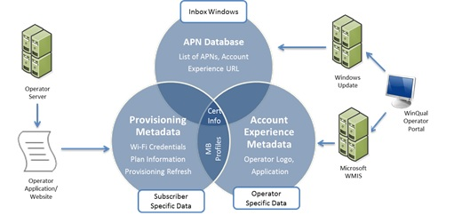

# Using metadata to configure mobile broadband experiences

You can provide metadata to customize various aspects of the Windows 8, Windows 8.1, and Windows 10 mobile broadband application experience. These include customizing Windows Connection Manager with operator branding, integrating the mobile broadband app with Windows Connection Manager, providing updated information for the Windows APN database, and providing data to provision the PC. Windows 8, Windows 8.1, and Windows 10 includes three sources of metadata you can use:

-   **COSA/Windows APN database** The Windows APN database contains pre-provisioned data that is required to connect to the operator's network for the first time. The database is part of Windows 8, Windows 8.1, and Windows 10 and is updated by using Windows Update. The Windows APN database is always available on the PC. For more info about the APN database, see [COSA/APN database](apn-database.md).
> [!IMPORTANT] 
> Starting in Windows 10 Version 1703, the APN database is replaced by a new format called COSA. Windows 8, Windows 8.1, and versions of Windows 10 before Version 1703 will continue to use the APN database while Windows 10 Version 1703 and later use COSA. For a list of frequently asked questions about COSA, see [COSA FAQ](cosa---faq.md).

-   **Service metadata** Information required for subscription purchase and operator branding. You provide this information as part of the service metadata package. It is stored on the Windows Metadata and Internet Services (WMIS) and downloaded after a mobile broadband device is detected using any available Internet connection. This metadata can also be preinstalled onto a PC by the OEM, but you must preinstall the package that was downloaded from the hardware developer section of the Windows Dev Center - Hardware. For more info about the service metadata, see [Service metadata](service-metadata.md).

-   **Account provisioning metadata** Information generated after a subscription purchase, including Wi-Fi credentials and plan information. This metadata is provided by you to Windows after payment validation, this metadata can be updated by using the provisioning-refresh mechanism. For more info about the account provisioning metadata, see [Account provisioning](account-provisioning.md).

The following diagram shows how the different metadata sources are related and how they are serviced. The service metadata takes priority over information in the Windows APN database.

Use the links in this section to learn more about the different types of mobile broadband metadata:

-   [Account provisioning](account-provisioning.md)

-   [COSA/APN database](apn-database.md)

-   [Service metadata](service-metadata.md)

 

 

[Send comments about this topic to Microsoft](mailto:wsddocfb@microsoft.com?subject=Documentation%20feedback%20%5Bp_mb\p_mb%5D:%20Using%20metadata%20to%20configure%20mobile%20broadband%20experiences%20%20RELEASE:%20%281/18/2017%29&body=%0A%0APRIVACY%20STATEMENT%0A%0AWe%20use%20your%20feedback%20to%20improve%20the%20documentation.%20We%20don't%20use%20your%20email%20address%20for%20any%20other%20purpose,%20and%20we'll%20remove%20your%20email%20address%20from%20our%20system%20after%20the%20issue%20that%20you're%20reporting%20is%20fixed.%20While%20we're%20working%20to%20fix%20this%20issue,%20we%20might%20send%20you%20an%20email%20message%20to%20ask%20for%20more%20info.%20Later,%20we%20might%20also%20send%20you%20an%20email%20message%20to%20let%20you%20know%20that%20we've%20addressed%20your%20feedback.%0A%0AFor%20more%20info%20about%20Microsoft's%20privacy%20policy,%20see%20http://privacy.microsoft.com/default.aspx. "Send comments about this topic to Microsoft")

